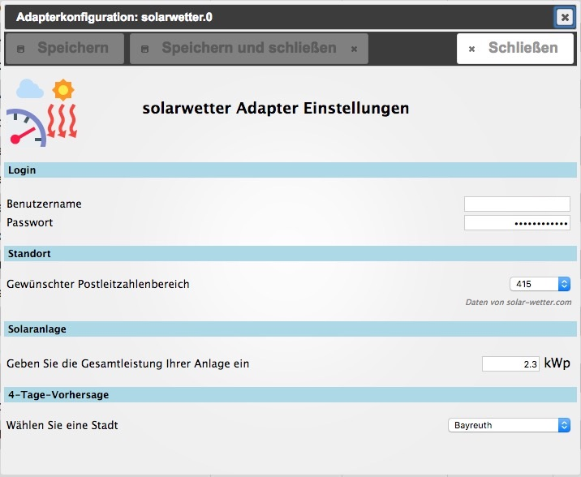

# IoBroker.solarwetter
## Beschreibung / 描述
:de: Dieser Adapter liefert den prognostizierten Solarstrom Tagesertrag für eine bestimmte Region。 Die Daten kommen von [http://www.auswahl-plz-bereich.solar-wetter.com](http://solar-wetter.com)。
Bei Eingabe der Leistung der eigenen Solaranlage errechnet der Adapter auch die zu erwartende Energieabgabe der Anlage。

:uk: 此适配器提供来自供应商[http://www.auswahl-plz-bereich.solar-wetter.com](http://solar-wetter.com)的特定地区每日太阳能量的预测。
翻译！！！！

## Einstellungen / 配置
### 用户/密码
Seit 2017 ist die Authentifizierung beim Anbieter nötig。 Dazu muss kostenpflichtig beim Anbieter ein Zugang erstanden werden。 Die Login-Datan können nun hier im Adapter hinterlegt werden。

自 2017 年以来，该提供商对其服务收费。可以在 solar-wetter.com 上获得个人登录信息。用户名和密码将存储在这里。

### 标准/位置
Örtlichkeit durch Auswahl des Postleitzahlenbereichs bestimmen Gesamtleistung der eigenen Solaranlage zur Berechnung der Energieerzeugung

从邮政编码列表中选择您所在的地区。
输入您的太阳能发电厂的功率以计算能量输出。

### Solaranlage / 太阳能电站
Hier kann die Gesamtleistung der eigenen Solaranlage zur Bechnung der vorraussichtlich erzeugten Energiemenge eingegeben werden (auch Dezimalzahlen möglich)。

输入太阳能发电厂的总功率来计算能源生产的每日预测（可以使用小数分隔符）

### 4-Tage-Prognose / 4-day-预测
Wählen Sie hier eine Stadt. Der Adapter erzeugt einen Link zu einem Chart mit der 4-Tage-Prognose (Datenpunkt solarwetter.0.forecast.chart.__url__ )。

选择一个城市，让适配器建立一个指向 4 天预测图表的链接（数据点 solarwetter.0.forecast.chart.__url__ ）。

## 活动/时间表
Der Adapter startet einmal täglich。

适配器每天启动一次。

## Datenpunkte / 数据点
solarwetter.0.forecast.__clearSky__（*值*）

solarwetter.0.forecast.__realSky_min__(*value*)

solarwetter.0.forecast.__realSky_max__ (*值*)

solarwetter.0.forecast.__Datum__（*字符串，无时间戳*）

solarwetter.0.forecast.__Region__ (*value*)

solarwetter.0.forecast.home.__clearSky__ (*value*)

solarwetter.0.forecast.home.__realSky_min__(*value*)

solarwetter.0.forecast.home.__realSky_max__ (*值*)

solarwetter.0.forecast.home.__Leistung__ (*value*)

solarwetter.0.forecast.chart.__city__ (*value*)

solarwetter.0.forecast.chart.__url__ (*value*)

＃＃ 去做
* 数据点的翻译
*设置窗口的俄语翻译

## Changelog
### 1.0.0 (2017-10-15)
* (pix) End of beta, Nodejs 4 or higher required

### 0.3.0 (2017-05-28)
* (pix) Login with website password & username  

### 0.2.0 (2017-01-05)
* (pix) Travis CI testing added

### 0.1.2 (2016-06-21)
* (pix) city selection fixed

### 0.1.1 (2016-06-20)
* (pix) 4-Day-Forecast Chart

### 0.1.0 (2016-06-12)
* (pix) publish on npm

### 0.0.6 (2016-06-09)
* (pix) Adapter.stop() fixed

### 0.0.5 (2016-05-14)
* (pix) Settings now show correct location if already defined

### 0.0.4 (2016-05-13)
* (pix) Appearance of settings window

### 0.0.3 (2016-05-13)
* (pix) Calculates power of own solar plant

### 0.0.2 (2016-05-13)
* (pix) Post code area selectable

### 0.0.1 (2016-05-12)
* (pix) first release

## License

The MIT License (MIT)

Copyright (c) 2020 pix

Permission is hereby granted, free of charge, to any person obtaining a copy
of this software and associated documentation files (the "Software"), to deal
in the Software without restriction, including without limitation the rights
to use, copy, modify, merge, publish, distribute, sublicense, and/or sell
copies of the Software, and to permit persons to whom the Software is
furnished to do so, subject to the following conditions:

The above copyright notice and this permission notice shall be included in all
copies or substantial portions of the Software.

THE SOFTWARE IS PROVIDED "AS IS", WITHOUT WARRANTY OF ANY KIND, EXPRESS OR
IMPLIED, INCLUDING BUT NOT LIMITED TO THE WARRANTIES OF MERCHANTABILITY,
FITNESS FOR A PARTICULAR PURPOSE AND NONINFRINGEMENT. IN NO EVENT SHALL THE
AUTHORS OR COPYRIGHT HOLDERS BE LIABLE FOR ANY CLAIM, DAMAGES OR OTHER
LIABILITY, WHETHER IN AN ACTION OF CONTRACT, TORT OR OTHERWISE, ARISING FROM,
OUT OF OR IN CONNECTION WITH THE SOFTWARE OR THE USE OR OTHER DEALINGS IN THE
SOFTWARE.

---
*Logo is partly crafted by CHALLENGER* :+1: