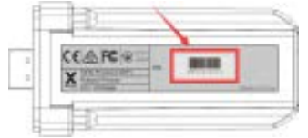

# IoBroker.solax

## IoBroker 的 solax 适配器
Solax逆变器API云连接

该适配器将来自制造商 Solax 的逆变器数据调用到 iobroker。

为此，您需要一个 Solax 帐户、您的令牌 ID 和 WiFi 模块的序列号。

### 你的 API 令牌

###您的序列号

**************************************************************************************************************

### 什么是 Sentry.io 以及向该公司的服务器报告什么？
Sentry.io 是一项服务，供开发人员了解其应用程序中的错误。而这正是在这个适配器中实现的。

当适配器崩溃或发生其他代码错误时，此错误消息也会出现在 ioBroker 日志中，并提交给 Sentry。当您允许 iobroker GmbH 收集诊断数据时，您的安装 ID（这只是一个唯一 ID **没有**关于您的任何其他信息、电子邮件、姓名等）也包括在内。这允许 Sentry 对错误进行分组并显示受此类错误影响的唯一用户数量。所有这些都帮助我提供了基本上从不崩溃的无错误适配器。

**************************************************************************************************************

**如果您喜欢，请考虑捐赠：**

**************************************************************************************************************

## Changelog
<!--
	Placeholder for the next version (at the beginning of the line):
	### __WORK IN PROGRESS__
-->

### 0.3.6 (2021-08-04)
* (simatec) deps fixed

### 0.3.5 (31.07.2021)
* (simatec) await/async functions fixed

### 0.3.4 (30.07.2021)
* (simatec) code cleanig
* (simatec) await functions fixed

### 0.3.3 (29.07.2021)
* (simatec) Formatted objects
* (simatec) await functions fixed
* (simatec) query interval changed
* (simatec) Dependencies updated

### 0.3.2 (28.07.2021)
* (simatec) fix for latest repo

### 0.3.1 (11.06.2021)
* (simatec) fix for latest repo
* (simatec) API-Token encrypted

### 0.3.0 (09.06.2021)
* (simatec) state settings changed
* (simatec) sentry plugin added
* (simatec) readme added
* (simatec) sunposition added
* (simatec) nightmode added

### 0.2.0 (07.06.2021)
* (simatec) powerdc 1-4 added
* (simatec) battPower added
* (simatec) many small bugfixes

### 0.1.1 (02.06.2021)
* (simatec) small Bugfixes

### 0.1.0 (02.06.2021)
* (simatec) first beta

## License
MIT License

Copyright (c) 2021 simatec

Permission is hereby granted, free of charge, to any person obtaining a copy
of this software and associated documentation files (the "Software"), to deal
in the Software without restriction, including without limitation the rights
to use, copy, modify, merge, publish, distribute, sublicense, and/or sell
copies of the Software, and to permit persons to whom the Software is
furnished to do so, subject to the following conditions:

The above copyright notice and this permission notice shall be included in all
copies or substantial portions of the Software.

THE SOFTWARE IS PROVIDED "AS IS", WITHOUT WARRANTY OF ANY KIND, EXPRESS OR
IMPLIED, INCLUDING BUT NOT LIMITED TO THE WARRANTIES OF MERCHANTABILITY,
FITNESS FOR A PARTICULAR PURPOSE AND NONINFRINGEMENT. IN NO EVENT SHALL THE
AUTHORS OR COPYRIGHT HOLDERS BE LIABLE FOR ANY CLAIM, DAMAGES OR OTHER
LIABILITY, WHETHER IN AN ACTION OF CONTRACT, TORT OR OTHERWISE, ARISING FROM,
OUT OF OR IN CONNECTION WITH THE SOFTWARE OR THE USE OR OTHER DEALINGS IN THE
SOFTWARE.