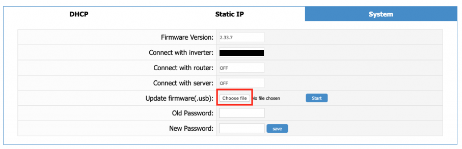

# IoBroker.solax

**************************************************************************************************************

**如果你喜欢它，请考虑捐赠：**

**************************************************************************************************************

### 用于 ioBroker 的 Solax 适配器
**************************************************************************************************************

### 德意志文献
#### Solax Cloud-Verbindung
Solax Wechselrichter API-Cloud-Verbindung

Dieser Adapter ruft die Daten deines Wechselrichters vom Hersteller Solax für iobroker ab.

是 dazu benötigt wird, ist ein Konto bei Solax, eine Token-ID und die Seriennummer des Pocket Wifi oder LAN Sticks。

#### API-令牌

#### 序列号

#### Experteneinstellungen
Die lokale Verbindung wird aktuell nur von dem Pocket Wifi Sticks unterstützt。 LAN-Sticks können nur im Cloud-Modus betrieben werden。

Achtung, wer in den Experteneinstellungen den lokalen Modus aktiviert sollte im Vorfeld zwingend die aktuelle Firmwareversion seines Pocket Wifi Sticks prüfen。
Eine 固件版本 größer 2.30.20 (Wifi-Pocket V1/V2) 和 kleiner als 3.001 (Wifi-Pocket V3) darf der Stick nicht installiert haben, da Solax in höheren Versionen den lokalen Zugriff blockiert und es zu einem Absturz des Wifi Sticks führt .

Wie man die Firmware Version prüfen kann und ein Downgrade auf die korrekte Version hinbekommt, wird hier erklärt。

Um die Firmware auf dem Stick zu prüfen，müsst ihr euch mit dem Hotspot des Sticks verbinden。
Der Name des Hotspots sollte bei euch wie folgt aussehen：`Solax_SWXXXXXXXX` 或 `Wifi_SWXXXXXXXX`。 XXXXXXXX wird durch eure Seriennummer ersetzt。

Wenn ihr mit dem Hotspot verbunden seit, dann geht ihr mit folgender IP-Adresse in euren Browser auf das Webinterface des Wifi-Sticks: `5.8.8.8`  Solltet ihr euer Passwort bei der Ersteinrichtung nicht geändert haben, sind die Standard Login-Daten admin:admin

Im Webinterface geht ihr auf den Tab &quot;System&quot; und findet dort die aktuell installierte Firmware-Version。  Sollte die Version größer 2.033.20 (Wifi-Pocket V1/V2) und kleiner 3.001 (Wifi-Pocket V3) sein, könnt ihr im gleichen Tab über den Menüpunkt &quot;Update Firmware (.usb)&quot; die korrekte Version flashen。

Die Version 2.033.20 könnt ihr euch unter folgenden Link herunterladen:

[下载袖珍 Wifi 固件](https://github.com/simatec/ioBroker.solax/raw/master/docs/files/618.00122.00_Pocket_WIFI_V2.033.20_20190313.usb.zip)

Die Zip-Datei muss entpackt werden und es muss die Datei mit der Endung &quot;.usb&quot; ausgewählt werden。  Nun könnt Ihr den Downgrade starten und werdet nach ca。 20-30 Sekunden eine Meldung bekommen, dass das Update erfolgreich war und der Stick neu gestartet wird。

Nach erfolgreichen Neustart könnt ihr nun über den Hotspot mit der IP-Adresse `5.8.8.8` oder auch über eure lokale IP in eurem Netzwerk auf den Wifi-Stick zugreifen。

Prüft bitte vor einer Verbindung zu dem Adapter noch einmal, ob der Downgrade erfolgreich war und die korrekte Firmware installiert ist。
Der Stick aktualisiert die Firmware nicht automatisch und ist mit der Version 2.033.20 voll funktionsfähig。

Im Adapter müssen die lokale IP-Adresse (nicht die Hotspot IP) und das Passwort des Webinterfaces eingetragen werden, und ihr habt nun eine sekundengenaue lokale Analyze eures Wechselrichters

**************************************************************************************************************

### 英文文档
#### Solax 云连接
Solax 逆变器 API 云连接

该适配器将来自制造商 Solax 的逆变器数据调用到 iobroker。

为此，您需要一个具有 Solax 的帐户、您的令牌 ID 和您的 WiFi 模块的序列号。

#### API-令牌

＃＃＃＃ 序列号

#### 专家设置
目前只有 Pocket Wifi Sticks 支持本地连接。网卡只能在云模式下操作。

注意，如果您在专家设置中激活本地模式，您应该提前检查您的袖珍无线棒的当前固件版本。 安装棒的固件版本不得高于 2.30.20 (Wifi-Pocket V1/V2) 且小于 3.001 (Wifi-Pocket V3)，因为 Solax 会阻止更高版本的本地访问并导致 Wifi 棒崩溃。

此处说明了如何检查固件版本以及如何降级到正确的版本。

要检查摇杆上的固件，您必须连接到摇杆的热点。
您的热点名称应如下所示：`Solax_SWXXXXXXXX` 或 `Wifi_SWXXXXXXXX`。 XXXXXXXXX 将替换为您的序列号。

如果您已连接到热点，请在浏览器中使用以下 IP 地址访问 Wifi 棒的 Web 界面：`5.8.8.8` 如果您在初始设置期间未更改密码，则默认登录数据为 admin:admin

在 Web 界面中，您转到“系统”选项卡，您将在那里找到当前安装的固件版本。 如果版本大于 2.033.20 (Wifi-Pocket V1/V2) 且小于 3.001 (Wifi-Pocket V3)，您可以通过“更新固件 (.usb)”菜单项在同一选项卡中刷新正确的版本.

您可以从以下链接下载 2.033.20 版本：

[下载袖珍 Wifi 固件](https://github.com/simatec/ioBroker.solax/raw/master/docs/files/618.00122.00_Pocket_WIFI_V2.033.20_20190313.usb.zip)

zip 文件必须解压并且必须选择带有“.usb”扩展名的文件。 现在您可以开始降级，大约 20-30 秒后，您将收到更新成功的消息，并且将重新启动记忆棒。

成功重启后，您现在可以通过 IP 地址为 `5.8.8.8` 的热点或您网络中的本地 IP 访问 WiFi 棒。

在连接适配器之前，请再次检查是否降级成功并且安装了正确的固件。
幸运的是，该棒不执行自动固件升级，并且在 2.033.20 版本中功能齐全。

必须在适配器中输入本地IP地址（不是热点IP）和Web界面密码，您现在可以对您的逆变器进行本地分析，精确到秒

**************************************************************************************************************

### Sentry.io 是什么以及向该公司的服务器报告什么？
Sentry.io 是一项服务，供开发人员从他们的应用程序中获取有关错误的概述。而这正是在这个适配器中实现的。

当适配器崩溃或发生其他代码错误时，也会出现在 ioBroker 日志中的此错误消息将提交给 Sentry。当您允许 iobroker GmbH 收集诊断数据时，还包括您的安装 ID（这只是一个唯一 ID **没有**关于您的任何其他信息、电子邮件、姓名等）。这允许 Sentry 对错误进行分组并显示有多少唯一用户受到此类错误的影响。所有这些都帮助我提供了基本上不会崩溃的无错误适配器。

**************************************************************************************************************

## Changelog
<!-- ### __WORK IN PROGRESS__ -->
### 0.5.7 (2022-11-01)
* (simatec) Dependencies updated

### 0.5.6 (2022-09-21)
* (simatec) local mode for X1 boost added

### 0.5.5 (2022-09-21)
* (simatec) small Bugfixes

### 0.5.4 (2022-09-20)
* (simatec) small Bugfixes

### 0.5.3 (2022-09-20)
* (simatec) Hybrid-G4 added
* (simatec) small Bugfixes
* (simatec) appveyor test removed
* (simatec) travis test removed

### 0.5.1 (2022-09-13)
* (simatec) feedin added

### 0.5.0 (2022-09-12)
* (simatec) Dependencies updated
* (simatec) small Bugfixes
* (clausmuus) Add support for firmware version 3.001

### 0.4.6 (2022-04-11)
* (simatec) Fix states

### 0.4.5 (2022-04-04)
* (simatec) Dependencies updated
* (simatec) small Bugfixes

### 0.4.4 (2022-03-14)
* (simatec) Dependencies updated
* (simatec) battery data for local request added
* (simatec) night mode turn on/off added

### 0.4.3 (2022-02-03)
* (simatec) refactoring Sourcecode
* (simatec) Dependencies updated
* (simatec) Fix API Request

### 0.4.2 (2022-01-27)
* (simatec) Fix json state

### 0.4.1 (2022-01-26)
* (simatec) Fix react Translatation

### 0.4.0 (2022-01-25)
* (simatec) local request for Wifi Pocket Stick added
* (simatec) Dependencies updated
* (simatec) test and release updated
* (simatec) Number of days of history data added
* (simatec) Expert-Mode added
* (simatec) Docu updated
* (simatec) Bugfixes

### 0.3.7 (2021-11-17)
* (simatec) Dependencies updated
* (simatec) test and release updated

### 0.3.6 (2021-08-04)
* (simatec) deps fixed

### 0.3.5 (31.07.2021)
* (simatec) await/async functions fixed

### 0.3.4 (30.07.2021)
* (simatec) code cleanig
* (simatec) await functions fixed

### 0.3.3 (29.07.2021)
* (simatec) Formatted objects
* (simatec) await functions fixed
* (simatec) query interval changed
* (simatec) Dependencies updated

### 0.3.2 (28.07.2021)
* (simatec) fix for latest repo

### 0.3.1 (11.06.2021)
* (simatec) fix for latest repo
* (simatec) API-Token encrypted

### 0.3.0 (09.06.2021)
* (simatec) state settings changed
* (simatec) sentry plugin added
* (simatec) readme added
* (simatec) sunposition added
* (simatec) nightmode added

### 0.2.0 (07.06.2021)
* (simatec) powerdc 1-4 added
* (simatec) battPower added
* (simatec) many small bugfixes

### 0.1.1 (02.06.2021)
* (simatec) small Bugfixes

### 0.1.0 (02.06.2021)
* (simatec) first beta

## License
MIT License

Copyright (c) 2021 - 2022 simatec

Permission is hereby granted, free of charge, to any person obtaining a copy
of this software and associated documentation files (the "Software"), to deal
in the Software without restriction, including without limitation the rights
to use, copy, modify, merge, publish, distribute, sublicense, and/or sell
copies of the Software, and to permit persons to whom the Software is
furnished to do so, subject to the following conditions:

The above copyright notice and this permission notice shall be included in all
copies or substantial portions of the Software.

THE SOFTWARE IS PROVIDED "AS IS", WITHOUT WARRANTY OF ANY KIND, EXPRESS OR
IMPLIED, INCLUDING BUT NOT LIMITED TO THE WARRANTIES OF MERCHANTABILITY,
FITNESS FOR A PARTICULAR PURPOSE AND NONINFRINGEMENT. IN NO EVENT SHALL THE
AUTHORS OR COPYRIGHT HOLDERS BE LIABLE FOR ANY CLAIM, DAMAGES OR OTHER
LIABILITY, WHETHER IN AN ACTION OF CONTRACT, TORT OR OTHERWISE, ARISING FROM,
OUT OF OR IN CONNECTION WITH THE SOFTWARE OR THE USE OR OTHER DEALINGS IN THE
SOFTWARE.