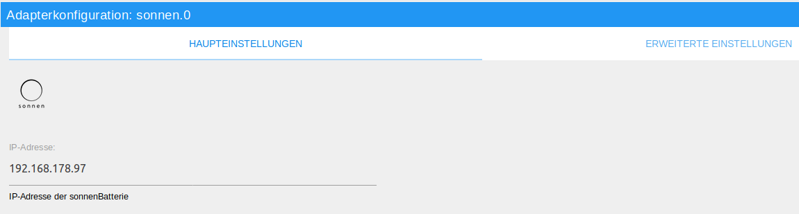
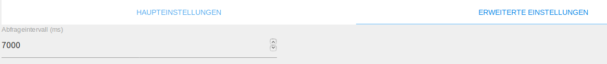
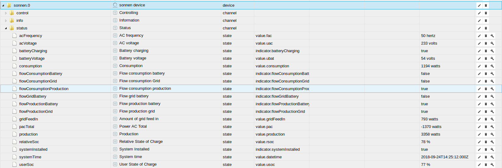

#sonnen 适配器
Sonnen 适配器允许在ioBroker 中集成sonnenBatterie。

＃＃ 概述
###sonnen电池
有了sonnenBatterie，来自太阳系的自生能量可以储存起来供个人使用，并在需要时准确使用。这使得独立于匿名能源公司并成为自给自足的电力生产商成为可能。得益于集成能源管理器，智能高科技蓄电系统确保以最佳方式为家庭提供自有电力。
这不仅便宜而且环保！ SonnenBatterie 有多种灵活的存储模型可供选择。

###sonnen 适配器
子网适配器可以监视和控制网络中的子电池。在发现适配器（TODO：链接）的帮助下，可以在网络中自动找到sonnenBatterien。<br/>适配器以对象的形式创建用于监视和控制sonnenBatterie 的状态。大多数状态仅用于监控电池，同时也可以通过描述一些状态来控制电池。

##安装前的要求
使用 ioBroker 操作 sonnenBatterie 的先决条件是电工成功安装电池。电池还必须与 ioBroker 位于同一网络中。

＃＃＃ 安装
适配器的一个实例是通过 ioBroker 管理界面安装的。可以在此处找到必要安装步骤的详细说明（TODO：链接）。<br/><br/>完成适配器实例的安装后，会自动打开一个配置窗口。

＃＃ 配置
###“主要设置”窗口


|领域 |说明 |
|:-------------|:-------------|
| IP 地址 | 应在此处输入所需的 SonnenBatterie 的 IP 地址。 |

|领域 |说明 |
|:-------------|:-------------|
| Auth-Token | 此处应输入Auth-Token，可在sonnen Web 界面的“软件集成”下找到。如果没有输入Auth-Token，则使用非官方API，可以随时关闭。 |

###“高级设置”窗口


|领域 |说明 |
|:-------------|:-------------|
| 查询间隔 | 可以在此处设置以毫秒为单位的替代值。在此时间间隔中，sonnenBatterie 的状态被更新。 |

|领域 |说明 |
|:-------------|:-------------|
| 查询在线状态 | 如果您想避免从电池向 Sonnen 服务器查询，您可以停用在线状态查询（仅与 8080 API 相关 - 例如 eco8 和更新版本） |

完成配置后，配置对话框以 `SPEICHERN UND SCHLIEßEN` 退出。
这会导致适配器重新启动。

## 实例
适配器的安装已在 `Objekte` 部分中创建了 Sonnen 适配器的活动实例。<br/><br/>  <span style="color:grey">*初审*</span>

可以在 ioBroker 服务器上创建多个 Sonnen Adapter 实例。相反，一个sonnenBatterie 也可以与多个ioBroker 服务器一起运行。如果多个设备要由一个 ioBroker 服务器控制，则应为每个电池创建一个实例。<br/><br/>适配器是否激活或连接到电池由实例的状态字段的颜色指示。如果鼠标指针指向该符号，则会显示更多详细信息。

## 适配器的对象
在 `Objekte` 节中，集线器中适配器识别的所有设备和活动都以树状结构列出。此外，还提供有关与集线器的通信是否顺利运行的信息。

 <span style="color:grey">* Sonnen 适配器的对象 *</span>

下面将对象分为状态和按钮。由于根据电池有两种不同的 API，因此只会创建相应电池支持的那些状态。
每个数据点都列出了其关联的数据类型及其授权。
可以读取 (R) 和写入 (W) 权限。每个数据点至少可以读取（R），而其他数据点也可以写入。要搜索特定数据点，我们建议使用组合键“CTRL + F”进行搜索。

＃＃＃ 状态
注意：旧 API（端口 3480）和旧 API（端口 7979）的状态目前没有或仅部分记录

#### 频道：信息
* info.connection

    | 数据类型 | 授权 |
    |:---:|:---:|
    | 布尔值 | R |

   *只有可读的布尔值，如果 ioBroker 和电池之间建立连接，则为真。*

* info.lastSync

    | 数据类型 | 授权 |
    |:---:|:---:|
    | 时间戳 | R |

   *只读时间戳，每次数据更新时都会更新*

* info.configuration

    | 数据类型 | 授权 |
    |:---:|:---:|
    | 字符串 | R |

   * 只有可读的JSON字符串，带有sonnenBatterie的配置信息。*

* info.powerMeter

    | 数据类型 | 授权 |
    |:---:|:---:|
    | 字符串 | R |

   * 只有可读的 JSON 字符串，带有 sonnenBatterie 的当前测量信息。*

* info.inverter

    | 数据类型 | 授权 |
    |:---:|:---:|
    | 字符串 | R |

   * 只有可读的 JSON 字符串，带有来自 SonnenBatterie 的逆变器信息。*

#### 频道：状态
* status.consumption

    | 数据类型 | 授权 |
    |:---:|:---:|
    | 数量 | R |

   * 仅可读数值，其中包含房屋的当前消耗（以瓦为单位）。*

* 状态.生产

    | 数据类型 | 授权 |
    |:---:|:---:|
    | 数量 | R |

   * 可读数值，表示光伏系统当前产生的瓦数。*

* status.pacTotal

    | 数据类型 | 授权 |
    |:---:|:---:|
    | 数量 | R |

* 可读数值，表示逆变器交流功率。
如果该值大于 0，则为电池放电，如果该值小于 0，则为充电。*

* status.relativeSoc

    | 数据类型 | 授权 |
    |:---:|:---:|
    | 数量 | R |

   * 仅可读数值，代表当前电池电量。*

* status.userSoc

    | 数据类型 | 授权 |
    |:---:|:---:|
    | 数量 | R |

   * 仅可读数值，代表当前电池电量。*

* status.acFrequency

    | 数据类型 | 授权 |
    |:---:|:---:|
    | 数量 | R |

   * 仅可读数值，表示以赫兹为单位的交流频率。*

* status.acVoltage

    | 数据类型 | 授权 |
    |:---:|:---:|
    | 数量 | R |

   * 仅可读数值，代表逆变器当前的AC（交流）电压。*

* status.batteryVoltage

    | 数据类型 | 授权 |
    |:---:|:---:|
    | 数量 | R |

   * 仅可读数值，代表电池当前的 DC（直流）电压。*

* status.systemTime

    | 数据类型 | 授权 |
    |:---:|:---:|
    | 日期 | R |

   * 只读 ISO 日期，代表电池的系统时间。*

* status.systemInstalled

    | 数据类型 | 授权 |
    |:---:|:---:|
    | 布尔值 | R |

   * 只有可读的布尔值，如果系统安装正确，则为真。*

* status.batteryCharging

    | 数据类型 | 授权 |
    |:---:|:---:|
    | 布尔值 | R |

   * 仅可读布尔值。如果sonnenBatterie 当前正在充电，则为真。*

* status.flowConsumptionBattery

    | 数据类型 | 授权 |
    |:---:|:---:|
    | 布尔值 | R |

   * 仅可读布尔值。如果电池当前正在放电，则为真。*

* status.flowConsumptionGrid

    | 数据类型 | 授权 |
    |:---:|:---:|
    | 布尔值 | R |

   * 只有可读的布尔值，如果当前正在从电网中汲取电力，则为真。*

* status.flowConsumptionProduction

    | 数据类型 | 授权 |
    |:---:|:---:|
    | 布尔值 | R |

   * 仅可读布尔值。如果当前光伏系统直接消耗电力，则情况确实如此。*

* status.flowGridBattery

    | 数据类型 | 授权 |
    |:---:|:---:|
    | 布尔值 | R |

   * 只读布尔指示器，如果电池当前正在由电源充电，则为真。*

* status.flowProductionBattery

    | 数据类型 | 授权 |
    |:---:|:---:|
    | 布尔值 | R |

   * 只有可读的布尔值，如果电池当前正由光伏系统直接充电，则为真。*

* status.flowProductionGrid

    | 数据类型 | 授权 |
    |:---:|:---:|
    | 布尔值 | R |

   * 只有可读的布尔值，如果所产生的电力当前正在馈入电网，则为真。*

* status.gridFeedIn

    | 数据类型 | 授权 |
    |:---:|:---:|
    | 数量 | R |

* 只读数值，表示当前馈入或从电网中提取的电量（以瓦为单位）。
如果值为正，则当前正在向电网馈电；如果值为负，则表示正在从电网中提取电量。*

* status.onlineStatus

    | 数据类型 | 授权 |
    |:---:|:---:|
    | 布尔值 | R |

   * 只有可读的布尔值，为真，sonnenBatterie 在线。*

#### 通道：控制
* 控制.充电

    | 数据类型 | 授权 |
    |:---:|:---:|
    | 数量 | 读/写 |

   * 允许以瓦特为单位指定电池最大放电的数值。*

* 注意：如果设置了无效值，无论如何都会确认。该值的确认（acknowledge）仅表示该命令已传输至电池。*

* 设置点的相应值将保留，直到电池收到新的充电或放电值。
如果 VPP 处于活动状态，请求将被拒绝。*

   *例子：*

```javascript
setState('sonnen.0.control.charge', 1250); // Die Batterie wird mit maximal 1250 Watt geladen
```

* 控制.放电

    | 数据类型 | 授权 |
    |:---:|:---:|
    | 数量 | 读/写 |

   * 数值，允许以瓦特为单位指定电池的最大电量。*

* 注意：如果设置了无效值，无论如何都会确认。该值的确认（acknowledge）仅表示该命令已传输至电池。*

* 设置点的相应值将保留，直到电池收到新的充电或放电值。
如果 VPP 处于活动状态，请求将被拒绝。*

   *例子：*

```javascript
setState('sonnen.0.control.discharge', 1250); // Die Batterie wird maximal mit 1250 Watt entladen
```

#### 通道：功率计
该通道有两个子通道，例如 `4_1` 和 `4_2`，其中一个代表消费，另一个代表生产。

两个通道具有相同的状态。所有状态都是写保护的并且类型为 `number`。

### 通道：逆变器
该通道由类型为 `number` 的写保护状态组成，提供有关太阳能电池逆变器的信息。

## Changelog
<!--
	Placeholder for the next version (at the beginning of the line):
	### __WORK IN PROGRESS__
-->

### 1.9.8 (2021-09-27)
* (foxriver76) make requesting online status optional for 8080 api (closes #76)

### 1.9.6 (2021-08-03)
* (foxriver76) fix for horizontal flow animations in Safari (broken with 1.9.4)

### 1.9.4 (2021-07-17)
* (foxriver76) widget: make the svg smaller by using a flexbox to center the svg correctly inside the div

### 1.9.3 (2021-07-16)
* (foxriver76) also poll the configuration instead of updating it only once at start (closes #70)

### 1.9.2 (2021-07-16)
* (foxriver76) fix for legacy API

### 1.9.1 (2021-07-16)
* (foxriver76) use legacy API if old API is not completely implemented

### 1.9.0 (2021-07-16)
* (foxriver76) we now also support the legacy API (port 3480)
* (foxriver76) switch from intervals to timeouts to avoid overlapping poll runs

### 1.8.6 (2021-07-04)
* (foxriver76) widget: we removed debug logging and unnecessary template functions
* (foxriver76) widget: we now cache the jquery selectors to improve the performance

### 1.8.5 (2021-07-02)
* (foxriver76) widget: stroke width can now be configured

### 1.8.4 (2021-07-01)
* (foxriver76) widget: we made ID names more adapter specific to avoid getting wrong translations

### 1.8.3 (2021-07-01)
* (foxriver76) widget: we now allow defining the used adapter instance

### 1.8.2 (2021-06-30)
* (foxriver76) widget: css classes now have adapter specific names to avoid conflicts

### 1.8.1 (2021-06-30)
* (foxriver76) widget now has flow directions

### 1.8.0 (2021-06-30)
* (foxriver76) added widget

### 1.7.3 (2021-05-01)
* (foxriver76) we now update objects if attributes are updated, but preserve common.name attribute

### 1.7.2 (2021-04-30)
* (foxriver76) we fixed some type issues (fixes #58)

### 1.7.1 (2021-03-19)
* (foxriver76) do not log warnings on inverter endpoint if battery does not support it (closes #55)

### 1.7.0 (2020-11-12)
* (foxriver76) new channels for powermeter and inverter

### 1.6.1 (2020-11-11)
* (foxriver76) fixed charge and discharge not working with api v2

### 1.6.0 (2020-08-09)
* (foxriver76) added support for official api, automatically used when auth token is given by user

### 1.5.3 (2020-05-18)
* (foxriver76) poll online status always again if not confirmed that there are differences in api (old solution could lead to false negative)
* (foxriver76) more specific error handling 

### 1.5.2 (2020-05-16)
* (foxriver76) check if onlineStatus is supported at adapter start - else do not poll it

### 1.5.0 (2020-05-04)
* (foxriver76) added online status indicator

### 1.4.2 (2020-04-16)
* (foxriver76) added more translations
* (foxriver76) optimizations for compact mode

### 1.4.0
* (foxriver76) introducing new states with power metering and inverter information (supported on :8080 API)
* (foxriver76) only minimum support until we know what users need as states

### 1.3.0
* (foxriver76) introducing new state with configuration information (supported on :8080 API)

### 1.2.0
* (foxriver76) support of another sonnen api

### 1.1.2
* (foxriver76) bugfix for control states

### 1.1.1
* (foxriver76) add compact mode compatibility

### 1.0.2
* (foxriver76) use adapter-core module

### 1.0.1
* (foxriver76) take timezone offset into account on time states

### 1.0.0
* (foxriver76) formal version increment

### 0.0.8
* (foxriver76) Enhanced debug logging
* (foxriver76) Prevent crashing when a return code is received

### 0.0.7
* (foxriver76) Only set info.connection on change

### 0.0.6
* (foxriver76) Only set states if request was successfull --> prevents adapter crash

### 0.0.5
* (foxriver76) translations on index_m.html
* (foxriver76) use 7000 as interval if poll interval is undefined

### 0.0.3
* (foxriver76) fixed links to bugs, repo etc

### 0.0.2
* (foxriver76) bugfixes on control states
* (foxriver76) big readme update
* (foxriver76) addded more states
* (foxriver76) added advanced settings

### 0.0.1
* (foxriver76) initial release

## License
The MIT License (MIT)

Copyright (c) 2018-2021 Moritz Heusinger <moritz.heusinger@gmail.com>

Permission is hereby granted, free of charge, to any person obtaining a copy
of this software and associated documentation files (the "Software"), to deal
in the Software without restriction, including without limitation the rights
to use, copy, modify, merge, publish, distribute, sublicense, and/or sell
copies of the Software, and to permit persons to whom the Software is
furnished to do so, subject to the following conditions:

The above copyright notice and this permission notice shall be included in
all copies or substantial portions of the Software.

THE SOFTWARE IS PROVIDED "AS IS", WITHOUT WARRANTY OF ANY KIND, EXPRESS OR
IMPLIED, INCLUDING BUT NOT LIMITED TO THE WARRANTIES OF MERCHANTABILITY,
FITNESS FOR A PARTICULAR PURPOSE AND NONINFRINGEMENT. IN NO EVENT SHALL THE
AUTHORS OR COPYRIGHT HOLDERS BE LIABLE FOR ANY CLAIM, DAMAGES OR OTHER
LIABILITY, WHETHER IN AN ACTION OF CONTRACT, TORT OR OTHERWISE, ARISING FROM,
OUT OF OR IN CONNECTION WITH THE SOFTWARE OR THE USE OR OTHER DEALINGS IN
THE SOFTWARE.