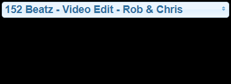

# IoBroker.spotify-premium

**版本：**

**测试：**

 

**此适配器使用 Sentry 库自动向开发者报告异常和代码错误。** 更多详情以及如何禁用错误报告的信息，请参阅 [Sentry插件文档](https://github.com/ioBroker/plugin-sentry#plugin-sentry)！Sentry 报告功能从 js-controller 3.0 开始使用。

用于访问 Spotify 播放控制的适配器。由于使用了 Spotify API，因此需要高级帐户。

连接到 [Spotify Premium API](https://www.spotify.com/)。

## 文档
另请参阅 [Spotify 开发者 API 文档](https://developer.spotify.com/)。

### 设置/授权
1. 登录 https://developer.spotify.com/dashboard/
2. 创建一个应用程序，您将获得一个客户端 ID 和一个客户端密钥（参见[说明](docs/create_app.png)）。
3. 在您创建的 Spotify 应用的设置中，将重定向 URI 设置为 `https://oauth2.iobroker.in/spotify`
4. 请在下方字段中输入客户端 ID 和客户端密钥。
5. 启动实例
6. 切换到对象选项卡，然后点击 `spotify-premium.0.authorization` 处的 getAuthorization 按钮
7. 将 `spotify-premium.0.authorization.authorizationUrl` 中显示的 URL 复制到您的浏览器中并命名为
8. 您可能需要登录 Spotify 并授予访问权限
9. 浏览器将被重定向到无效的 URL。如果出现“无效重定向 URI”错误，请验证步骤 3。
10. 复制该 URL 并将其放入 `spotify-premium.0.authorization.authorizationReturnUri` 中
11. 如果一切顺利，`spotify-premium.0.authorization.authorized` 的值将变为 true。

我们必须提供 HTTPS 重定向 URI，因为从 2025 年 12 月起，Spotify 将不再允许使用不安全的 URI。

#### [视频教程](https://www.youtube.com/watch?v=n0m9201qABU)

### 各州
所有状态均在 admin 中描述。

### VIS 使用示例
点击查看组件源代码。

开始播放特定列表 
<pre><code>[{&quot;tpl&quot;:&quot;tplJquiButtonState&quot;,&quot;data&quot;:{&quot;oid&quot;:&quot;spotify-premium.0.playlists.YourPlaylistName.playThisList&quot;,&quot;g_fixed&quot;:false,&quot;g_visibility&quot;:false,&quot;g_css_font_text&quot;:false,&quot;g_css_background&quot;:false,&quot;g_css_shadow_padding&quot;:false,&quot;g_css_border&quot;:false,&quot;g_gestures&quot;:false,&quot;g_signals&quot;:false,&quot;g_last_change&quot;:false,&quot;visibility-cond&quot;:&quot;==&quot;,&quot;visibility-val&quot;:1,&quot;visibility-groups-action&quot;:&quot;hide&quot;,&quot;buttontext&quot;:&quot;Choose Playlist&quot;,&quot;signals-cond-0&quot;:&quot;==&quot;,&quot;signals-val-0&quot;:true,&quot;signals-icon-0&quot;:&quot;/vis/signals/lowbattery.png&quot;,&quot;signals-icon-size-0&quot;:0,&quot;signals-blink-0&quot;:false,&quot;signals-horz-0&quot;:0,&quot;signals-vert-0&quot;:0,&quot;signals-hide-edit-0&quot;:false,&quot;signals-cond-1&quot;:&quot;==&quot;,&quot;signals-val-1&quot;:true,&quot;signals-icon-1&quot;:&quot;/vis/signals/lowbattery.png&quot;,&quot;signals-icon-size-1&quot;:0,&quot;signals-blink-1&quot;:false,&quot;signals-horz-1&quot;:0,&quot;signals-vert-1&quot;:0,&quot;signals-hide-edit-1&quot;:false,&quot;signals-cond-2&quot;:&quot;==&quot;,&quot;signals-val-2&quot;:true,&quot;signals-icon-2&quot;:&quot;/vis/signals/lowbattery.png&quot;,&quot;signals-icon-size-2&quot;:0,&quot;signals-blink-2&quot;:false,&quot;signals-horz-2&quot;:0,&quot;signals-vert-2&quot;:0,&quot;signals-hide-edit-2&quot;:false,&quot;lc-type&quot;:&quot;last-change&quot;,&quot;lc-is-interval&quot;:true,&quot;lc-is-moment&quot;:false,&quot;lc-format&quot;:&quot;&quot;,&quot;lc-position-vert&quot;:&quot;top&quot;,&quot;lc-position-horz&quot;:&quot;right&quot;,&quot;lc-offset-vert&quot;:0,&quot;lc-offset-horz&quot;:0,&quot;lc-font-size&quot;:&quot;12px&quot;,&quot;lc-font-family&quot;:&quot;&quot;,&quot;lc-font-style&quot;:&quot;&quot;,&quot;lc-bkg-color&quot;:&quot;&quot;,&quot;lc-color&quot;:&quot;&quot;,&quot;lc-border-width&quot;:&quot;0&quot;,&quot;lc-border-style&quot;:&quot;&quot;,&quot;lc-border-color&quot;:&quot;&quot;,&quot;lc-border-radius&quot;:10,&quot;lc-zindex&quot;:0,&quot;value&quot;:&quot;true&quot;,&quot;no_style&quot;:false},&quot;style&quot;:{&quot;left&quot;:&quot;549px&quot;,&quot;top&quot;:&quot;364px&quot;},&quot;widgetSet&quot;:&quot;jqui&quot;}]</code></pre>

启动一台特定的设备 
<pre><code>[{&quot;tpl&quot;:&quot;tplJquiButtonState&quot;,&quot;data&quot;:{&quot;oid&quot;:&quot;spotify-premium.0.devices.YourDeviceName.useForPlayback&quot;,&quot;g_fixed&quot;:false,&quot;g_visibility&quot;:false,&quot;g_css_font_text&quot;:false,&quot;g_css_background&quot;:false,&quot;g_css_shadow_padding&quot;:false,&quot;g_css_border&quot;:false,&quot;g_gestures&quot;:false,&quot;g_signals&quot;:false,&quot;g_last_change&quot;:false,&quot;visibility-cond&quot;:&quot;==&quot;,&quot;visibility-val&quot;:1,&quot;visibility-groups-action&quot;:&quot;hide&quot;,&quot;buttontext&quot;:&quot;Choose Device&quot;,&quot;signals-cond-0&quot;:&quot;==&quot;,&quot;signals-val-0&quot;:true,&quot;signals-icon-0&quot;:&quot;/vis/signals/lowbattery.png&quot;,&quot;signals-icon-size-0&quot;:0,&quot;signals-blink-0&quot;:false,&quot;signals-horz-0&quot;:0,&quot;signals-vert-0&quot;:0,&quot;signals-hide-edit-0&quot;:false,&quot;signals-cond-1&quot;:&quot;==&quot;,&quot;signals-val-1&quot;:true,&quot;signals-icon-1&quot;:&quot;/vis/signals/lowbattery.png&quot;,&quot;signals-icon-size-1&quot;:0,&quot;signals-blink-1&quot;:false,&quot;signals-horz-1&quot;:0,&quot;signals-vert-1&quot;:0,&quot;signals-hide-edit-1&quot;:false,&quot;signals-cond-2&quot;:&quot;==&quot;,&quot;signals-val-2&quot;:true,&quot;signals-icon-2&quot;:&quot;/vis/signals/lowbattery.png&quot;,&quot;signals-icon-size-2&quot;:0,&quot;signals-blink-2&quot;:false,&quot;signals-horz-2&quot;:0,&quot;signals-vert-2&quot;:0,&quot;signals-hide-edit-2&quot;:false,&quot;lc-type&quot;:&quot;last-change&quot;,&quot;lc-is-interval&quot;:true,&quot;lc-is-moment&quot;:false,&quot;lc-format&quot;:&quot;&quot;,&quot;lc-position-vert&quot;:&quot;top&quot;,&quot;lc-position-horz&quot;:&quot;right&quot;,&quot;lc-offset-vert&quot;:0,&quot;lc-offset-horz&quot;:0,&quot;lc-font-size&quot;:&quot;12px&quot;,&quot;lc-font-family&quot;:&quot;&quot;,&quot;lc-font-style&quot;:&quot;&quot;,&quot;lc-bkg-color&quot;:&quot;&quot;,&quot;lc-color&quot;:&quot;&quot;,&quot;lc-border-width&quot;:&quot;0&quot;,&quot;lc-border-style&quot;:&quot;&quot;,&quot;lc-border-color&quot;:&quot;&quot;,&quot;lc-border-radius&quot;:10,&quot;lc-zindex&quot;:0,&quot;value&quot;:&quot;true&quot;,&quot;no_style&quot;:false},&quot;style&quot;:{&quot;left&quot;:&quot;549px&quot;,&quot;top&quot;:&quot;364px&quot;},&quot;widgetSet&quot;:&quot;jqui&quot;}]</code></pre>

开始游戏 
<pre><code>[{&quot;tpl&quot;:&quot;tplSpotifyPlayButton&quot;,&quot;data&quot;:{&quot;g_fixed&quot;:false,&quot;g_visibility&quot;:false,&quot;g_css_font_text&quot;:false,&quot;g_css_background&quot;:false,&quot;g_css_shadow_padding&quot;:false,&quot;g_css_border&quot;:false,&quot;g_gestures&quot;:false,&quot;g_signals&quot;:false,&quot;g_last_change&quot;:false,&quot;visibility-cond&quot;:&quot;==&quot;,&quot;visibility-val&quot;:1,&quot;visibility-groups-action&quot;:&quot;hide&quot;,&quot;oidplay&quot;:&quot;spotify-premium.0.player.play&quot;,&quot;oidpause&quot;:&quot;spotify-premium.0.player.pause&quot;,&quot;oidstate&quot;:&quot;spotify-premium.0.player.isPlaying&quot;,&quot;colorplay&quot;:&quot;green&quot;,&quot;colorpause&quot;:&quot;green&quot;,&quot;signals-cond-0&quot;:&quot;==&quot;,&quot;signals-val-0&quot;:true,&quot;signals-icon-0&quot;:&quot;/vis/signals/lowbattery.png&quot;,&quot;signals-icon-size-0&quot;:0,&quot;signals-blink-0&quot;:false,&quot;signals-horz-0&quot;:0,&quot;signals-vert-0&quot;:0,&quot;signals-hide-edit-0&quot;:false,&quot;signals-cond-1&quot;:&quot;==&quot;,&quot;signals-val-1&quot;:true,&quot;signals-icon-1&quot;:&quot;/vis/signals/lowbattery.png&quot;,&quot;signals-icon-size-1&quot;:0,&quot;signals-blink-1&quot;:false,&quot;signals-horz-1&quot;:0,&quot;signals-vert-1&quot;:0,&quot;signals-hide-edit-1&quot;:false,&quot;signals-cond-2&quot;:&quot;==&quot;,&quot;signals-val-2&quot;:true,&quot;signals-icon-2&quot;:&quot;/vis/signals/lowbattery.png&quot;,&quot;signals-icon-size-2&quot;:0,&quot;signals-blink-2&quot;:false,&quot;signals-horz-2&quot;:0,&quot;signals-vert-2&quot;:0,&quot;signals-hide-edit-2&quot;:false,&quot;lc-type&quot;:&quot;last-change&quot;,&quot;lc-is-interval&quot;:true,&quot;lc-is-moment&quot;:false,&quot;lc-format&quot;:&quot;&quot;,&quot;lc-position-vert&quot;:&quot;top&quot;,&quot;lc-position-horz&quot;:&quot;right&quot;,&quot;lc-offset-vert&quot;:0,&quot;lc-offset-horz&quot;:0,&quot;lc-font-size&quot;:&quot;12px&quot;,&quot;lc-font-family&quot;:&quot;&quot;,&quot;lc-font-style&quot;:&quot;&quot;,&quot;lc-bkg-color&quot;:&quot;&quot;,&quot;lc-color&quot;:&quot;&quot;,&quot;lc-border-width&quot;:&quot;0&quot;,&quot;lc-border-style&quot;:&quot;&quot;,&quot;lc-border-color&quot;:&quot;&quot;,&quot;lc-border-radius&quot;:10,&quot;lc-zindex&quot;:0},&quot;style&quot;:{&quot;left&quot;:&quot;487px&quot;,&quot;top&quot;:&quot;604px&quot;},&quot;widgetSet&quot;:&quot;spotify-premium&quot;}]</code></pre>

播放上一首曲目 
<pre><code>[{&quot;tpl&quot;:&quot;tplSpotifyPreviousButton&quot;,&quot;data&quot;:{&quot;g_fixed&quot;:false,&quot;g_visibility&quot;:false,&quot;g_css_font_text&quot;:false,&quot;g_css_background&quot;:false,&quot;g_css_shadow_padding&quot;:false,&quot;g_css_border&quot;:false,&quot;g_gestures&quot;:false,&quot;g_signals&quot;:false,&quot;g_last_change&quot;:false,&quot;visibility-cond&quot;:&quot;==&quot;,&quot;visibility-val&quot;:1,&quot;visibility-groups-action&quot;:&quot;hide&quot;,&quot;oid&quot;:&quot;spotify-premium.0.player.skipMinus&quot;,&quot;colorbox&quot;:&quot;green&quot;,&quot;signals-cond-0&quot;:&quot;==&quot;,&quot;signals-val-0&quot;:true,&quot;signals-icon-0&quot;:&quot;/vis/signals/lowbattery.png&quot;,&quot;signals-icon-size-0&quot;:0,&quot;signals-blink-0&quot;:false,&quot;signals-horz-0&quot;:0,&quot;signals-vert-0&quot;:0,&quot;signals-hide-edit-0&quot;:false,&quot;signals-cond-1&quot;:&quot;==&quot;,&quot;signals-val-1&quot;:true,&quot;signals-icon-1&quot;:&quot;/vis/signals/lowbattery.png&quot;,&quot;signals-icon-size-1&quot;:0,&quot;signals-blink-1&quot;:false,&quot;signals-horz-1&quot;:0,&quot;signals-vert-1&quot;:0,&quot;signals-hide-edit-1&quot;:false,&quot;signals-cond-2&quot;:&quot;==&quot;,&quot;signals-val-2&quot;:true,&quot;signals-icon-2&quot;:&quot;/vis/signals/lowbattery.png&quot;,&quot;signals-icon-size-2&quot;:0,&quot;signals-blink-2&quot;:false,&quot;signals-horz-2&quot;:0,&quot;signals-vert-2&quot;:0,&quot;signals-hide-edit-2&quot;:false,&quot;lc-type&quot;:&quot;last-change&quot;,&quot;lc-is-interval&quot;:true,&quot;lc-is-moment&quot;:false,&quot;lc-format&quot;:&quot;&quot;,&quot;lc-position-vert&quot;:&quot;top&quot;,&quot;lc-position-horz&quot;:&quot;right&quot;,&quot;lc-offset-vert&quot;:0,&quot;lc-offset-horz&quot;:0,&quot;lc-font-size&quot;:&quot;12px&quot;,&quot;lc-font-family&quot;:&quot;&quot;,&quot;lc-font-style&quot;:&quot;&quot;,&quot;lc-bkg-color&quot;:&quot;&quot;,&quot;lc-color&quot;:&quot;&quot;,&quot;lc-border-width&quot;:&quot;0&quot;,&quot;lc-border-style&quot;:&quot;&quot;,&quot;lc-border-color&quot;:&quot;&quot;,&quot;lc-border-radius&quot;:10,&quot;lc-zindex&quot;:0},&quot;style&quot;:{&quot;left&quot;:&quot;386px&quot;,&quot;top&quot;:&quot;604px&quot;},&quot;widgetSet&quot;:&quot;spotify-premium&quot;}]</code></pre>

播放下一首曲目 
<pre><code>[{&quot;tpl&quot;:&quot;tplSpotifyNextButton&quot;,&quot;data&quot;:{&quot;g_fixed&quot;:false,&quot;g_visibility&quot;:false,&quot;g_css_font_text&quot;:false,&quot;g_css_background&quot;:false,&quot;g_css_shadow_padding&quot;:false,&quot;g_css_border&quot;:false,&quot;g_gestures&quot;:false,&quot;g_signals&quot;:false,&quot;g_last_change&quot;:false,&quot;visibility-cond&quot;:&quot;==&quot;,&quot;visibility-val&quot;:1,&quot;visibility-groups-action&quot;:&quot;hide&quot;,&quot;oid&quot;:&quot;spotify-premium.0.player.skipPlus&quot;,&quot;colorbox&quot;:&quot;green&quot;,&quot;signals-cond-0&quot;:&quot;==&quot;,&quot;signals-val-0&quot;:true,&quot;signals-icon-0&quot;:&quot;/vis/signals/lowbattery.png&quot;,&quot;signals-icon-size-0&quot;:0,&quot;signals-blink-0&quot;:false,&quot;signals-horz-0&quot;:0,&quot;signals-vert-0&quot;:0,&quot;signals-hide-edit-0&quot;:false,&quot;signals-cond-1&quot;:&quot;==&quot;,&quot;signals-val-1&quot;:true,&quot;signals-icon-1&quot;:&quot;/vis/signals/lowbattery.png&quot;,&quot;signals-icon-size-1&quot;:0,&quot;signals-blink-1&quot;:false,&quot;signals-horz-1&quot;:0,&quot;signals-vert-1&quot;:0,&quot;signals-hide-edit-1&quot;:false,&quot;signals-cond-2&quot;:&quot;==&quot;,&quot;signals-val-2&quot;:true,&quot;signals-icon-2&quot;:&quot;/vis/signals/lowbattery.png&quot;,&quot;signals-icon-size-2&quot;:0,&quot;signals-blink-2&quot;:false,&quot;signals-horz-2&quot;:0,&quot;signals-vert-2&quot;:0,&quot;signals-hide-edit-2&quot;:false,&quot;lc-type&quot;:&quot;last-change&quot;,&quot;lc-is-interval&quot;:true,&quot;lc-is-moment&quot;:false,&quot;lc-format&quot;:&quot;&quot;,&quot;lc-position-vert&quot;:&quot;top&quot;,&quot;lc-position-horz&quot;:&quot;right&quot;,&quot;lc-offset-vert&quot;:0,&quot;lc-offset-horz&quot;:0,&quot;lc-font-size&quot;:&quot;12px&quot;,&quot;lc-font-family&quot;:&quot;&quot;,&quot;lc-font-style&quot;:&quot;&quot;,&quot;lc-bkg-color&quot;:&quot;&quot;,&quot;lc-color&quot;:&quot;&quot;,&quot;lc-border-width&quot;:&quot;0&quot;,&quot;lc-border-style&quot;:&quot;&quot;,&quot;lc-border-color&quot;:&quot;&quot;,&quot;lc-border-radius&quot;:10,&quot;lc-zindex&quot;:0},&quot;style&quot;:{&quot;left&quot;:&quot;588px&quot;,&quot;top&quot;:&quot;604px&quot;},&quot;widgetSet&quot;:&quot;spotify-premium&quot;}]</code></pre>

控制重复 
<pre><code>[{&quot;tpl&quot;:&quot;tplSpotifyRepeatButton&quot;,&quot;data&quot;:{&quot;g_fixed&quot;:false,&quot;g_visibility&quot;:false,&quot;g_css_font_text&quot;:false,&quot;g_css_background&quot;:false,&quot;g_css_shadow_padding&quot;:false,&quot;g_css_border&quot;:false,&quot;g_gestures&quot;:false,&quot;g_signals&quot;:false,&quot;g_last_change&quot;:false,&quot;visibility-cond&quot;:&quot;==&quot;,&quot;visibility-val&quot;:1,&quot;visibility-groups-action&quot;:&quot;hide&quot;,&quot;oidall&quot;:&quot;spotify-premium.0.player.repeatContext&quot;,&quot;oidoff&quot;:&quot;spotify-premium.0.player.repeatOff&quot;,&quot;oidone&quot;:&quot;spotify-premium.0.player.repeatTrack&quot;,&quot;oidstate&quot;:&quot;spotify-premium.0.player.repeat&quot;,&quot;coloroff&quot;:&quot;white&quot;,&quot;colorall&quot;:&quot;green&quot;,&quot;colorone&quot;:&quot;green&quot;,&quot;signals-cond-0&quot;:&quot;==&quot;,&quot;signals-val-0&quot;:true,&quot;signals-icon-0&quot;:&quot;/vis/signals/lowbattery.png&quot;,&quot;signals-icon-size-0&quot;:0,&quot;signals-blink-0&quot;:false,&quot;signals-horz-0&quot;:0,&quot;signals-vert-0&quot;:0,&quot;signals-hide-edit-0&quot;:false,&quot;signals-cond-1&quot;:&quot;==&quot;,&quot;signals-val-1&quot;:true,&quot;signals-icon-1&quot;:&quot;/vis/signals/lowbattery.png&quot;,&quot;signals-icon-size-1&quot;:0,&quot;signals-blink-1&quot;:false,&quot;signals-horz-1&quot;:0,&quot;signals-vert-1&quot;:0,&quot;signals-hide-edit-1&quot;:false,&quot;signals-cond-2&quot;:&quot;==&quot;,&quot;signals-val-2&quot;:true,&quot;signals-icon-2&quot;:&quot;/vis/signals/lowbattery.png&quot;,&quot;signals-icon-size-2&quot;:0,&quot;signals-blink-2&quot;:false,&quot;signals-horz-2&quot;:0,&quot;signals-vert-2&quot;:0,&quot;signals-hide-edit-2&quot;:false,&quot;lc-type&quot;:&quot;last-change&quot;,&quot;lc-is-interval&quot;:true,&quot;lc-is-moment&quot;:false,&quot;lc-format&quot;:&quot;&quot;,&quot;lc-position-vert&quot;:&quot;top&quot;,&quot;lc-position-horz&quot;:&quot;right&quot;,&quot;lc-offset-vert&quot;:0,&quot;lc-offset-horz&quot;:0,&quot;lc-font-size&quot;:&quot;12px&quot;,&quot;lc-font-family&quot;:&quot;&quot;,&quot;lc-font-style&quot;:&quot;&quot;,&quot;lc-bkg-color&quot;:&quot;&quot;,&quot;lc-color&quot;:&quot;&quot;,&quot;lc-border-width&quot;:&quot;0&quot;,&quot;lc-border-style&quot;:&quot;&quot;,&quot;lc-border-color&quot;:&quot;&quot;,&quot;lc-border-radius&quot;:10,&quot;lc-zindex&quot;:0},&quot;style&quot;:{&quot;left&quot;:&quot;689px&quot;,&quot;top&quot;:&quot;614px&quot;,&quot;width&quot;:&quot;48px&quot;,&quot;height&quot;:&quot;56px&quot;},&quot;widgetSet&quot;:&quot;spotify-premium&quot;}]</code></pre>

控制洗牌 
<pre><code>[{&quot;tpl&quot;:&quot;tplSpotifyShuffleButton&quot;,&quot;data&quot;:{&quot;g_fixed&quot;:false,&quot;g_visibility&quot;:false,&quot;g_css_font_text&quot;:false,&quot;g_css_background&quot;:false,&quot;g_css_shadow_padding&quot;:false,&quot;g_css_border&quot;:false,&quot;g_gestures&quot;:false,&quot;g_signals&quot;:false,&quot;g_last_change&quot;:false,&quot;visibility-cond&quot;:&quot;==&quot;,&quot;visibility-val&quot;:1,&quot;visibility-groups-action&quot;:&quot;hide&quot;,&quot;oidon&quot;:&quot;spotify-premium.0.player.shuffleOn&quot;,&quot;oidoff&quot;:&quot;spotify-premium.0.player.shuffleOff&quot;,&quot;oidstate&quot;:&quot;spotify-premium.0.player.shuffle&quot;,&quot;coloroff&quot;:&quot;white&quot;,&quot;coloron&quot;:&quot;green&quot;,&quot;signals-cond-0&quot;:&quot;==&quot;,&quot;signals-val-0&quot;:true,&quot;signals-icon-0&quot;:&quot;/vis/signals/lowbattery.png&quot;,&quot;signals-icon-size-0&quot;:0,&quot;signals-blink-0&quot;:false,&quot;signals-horz-0&quot;:0,&quot;signals-vert-0&quot;:0,&quot;signals-hide-edit-0&quot;:false,&quot;signals-cond-1&quot;:&quot;==&quot;,&quot;signals-val-1&quot;:true,&quot;signals-icon-1&quot;:&quot;/vis/signals/lowbattery.png&quot;,&quot;signals-icon-size-1&quot;:0,&quot;signals-blink-1&quot;:false,&quot;signals-horz-1&quot;:0,&quot;signals-vert-1&quot;:0,&quot;signals-hide-edit-1&quot;:false,&quot;signals-cond-2&quot;:&quot;==&quot;,&quot;signals-val-2&quot;:true,&quot;signals-icon-2&quot;:&quot;/vis/signals/lowbattery.png&quot;,&quot;signals-icon-size-2&quot;:0,&quot;signals-blink-2&quot;:false,&quot;signals-horz-2&quot;:0,&quot;signals-vert-2&quot;:0,&quot;signals-hide-edit-2&quot;:false,&quot;lc-type&quot;:&quot;last-change&quot;,&quot;lc-is-interval&quot;:true,&quot;lc-is-moment&quot;:false,&quot;lc-format&quot;:&quot;&quot;,&quot;lc-position-vert&quot;:&quot;top&quot;,&quot;lc-position-horz&quot;:&quot;right&quot;,&quot;lc-offset-vert&quot;:0,&quot;lc-offset-horz&quot;:0,&quot;lc-font-size&quot;:&quot;12px&quot;,&quot;lc-font-family&quot;:&quot;&quot;,&quot;lc-font-style&quot;:&quot;&quot;,&quot;lc-bkg-color&quot;:&quot;&quot;,&quot;lc-color&quot;:&quot;&quot;,&quot;lc-border-width&quot;:&quot;0&quot;,&quot;lc-border-style&quot;:&quot;&quot;,&quot;lc-border-color&quot;:&quot;&quot;,&quot;lc-border-radius&quot;:10,&quot;lc-zindex&quot;:0},&quot;style&quot;:{&quot;left&quot;:&quot;319px&quot;,&quot;top&quot;:&quot;622px&quot;,&quot;width&quot;:&quot;38px&quot;,&quot;height&quot;:&quot;40px&quot;},&quot;widgetSet&quot;:&quot;spotify-premium&quot;}]</code></pre>

上下文图像 
<pre><code>[{&quot;tpl&quot;:&quot;tplValueStringImg&quot;,&quot;data&quot;:{&quot;oid&quot;:&quot;spotify-premium.0.player.contextImageUrl&quot;,&quot;g_fixed&quot;:false,&quot;g_visibility&quot;:false,&quot;g_css_font_text&quot;:false,&quot;g_css_background&quot;:false,&quot;g_css_shadow_padding&quot;:false,&quot;g_css_border&quot;:false,&quot;g_gestures&quot;:false,&quot;g_signals&quot;:false,&quot;g_last_change&quot;:false,&quot;visibility-cond&quot;:&quot;==&quot;,&quot;visibility-val&quot;:1,&quot;visibility-groups-action&quot;:&quot;hide&quot;,&quot;refreshInterval&quot;:&quot;0&quot;,&quot;signals-cond-0&quot;:&quot;==&quot;,&quot;signals-val-0&quot;:true,&quot;signals-icon-0&quot;:&quot;/vis/signals/lowbattery.png&quot;,&quot;signals-icon-size-0&quot;:0,&quot;signals-blink-0&quot;:false,&quot;signals-horz-0&quot;:0,&quot;signals-vert-0&quot;:0,&quot;signals-hide-edit-0&quot;:false,&quot;signals-cond-1&quot;:&quot;==&quot;,&quot;signals-val-1&quot;:true,&quot;signals-icon-1&quot;:&quot;/vis/signals/lowbattery.png&quot;,&quot;signals-icon-size-1&quot;:0,&quot;signals-blink-1&quot;:false,&quot;signals-horz-1&quot;:0,&quot;signals-vert-1&quot;:0,&quot;signals-hide-edit-1&quot;:false,&quot;signals-cond-2&quot;:&quot;==&quot;,&quot;signals-val-2&quot;:true,&quot;signals-icon-2&quot;:&quot;/vis/signals/lowbattery.png&quot;,&quot;signals-icon-size-2&quot;:0,&quot;signals-blink-2&quot;:false,&quot;signals-horz-2&quot;:0,&quot;signals-vert-2&quot;:0,&quot;signals-hide-edit-2&quot;:false,&quot;lc-type&quot;:&quot;last-change&quot;,&quot;lc-is-interval&quot;:true,&quot;lc-is-moment&quot;:false,&quot;lc-format&quot;:&quot;&quot;,&quot;lc-position-vert&quot;:&quot;top&quot;,&quot;lc-position-horz&quot;:&quot;right&quot;,&quot;lc-offset-vert&quot;:0,&quot;lc-offset-horz&quot;:0,&quot;lc-font-size&quot;:&quot;12px&quot;,&quot;lc-font-family&quot;:&quot;&quot;,&quot;lc-font-style&quot;:&quot;&quot;,&quot;lc-bkg-color&quot;:&quot;&quot;,&quot;lc-color&quot;:&quot;&quot;,&quot;lc-border-width&quot;:&quot;0&quot;,&quot;lc-border-style&quot;:&quot;&quot;,&quot;lc-border-color&quot;:&quot;&quot;,&quot;lc-border-radius&quot;:10,&quot;lc-zindex&quot;:0},&quot;style&quot;:{&quot;left&quot;:&quot;338px&quot;,&quot;top&quot;:&quot;131px&quot;,&quot;width&quot;:&quot;122px&quot;,&quot;height&quot;:&quot;122px&quot;},&quot;widgetSet&quot;:&quot;basic&quot;}]</code></pre>

选择当前播放列表中的曲目 
<pre><code>[{&quot;tpl&quot;:&quot;tplJquiSelectList&quot;,&quot;data&quot;:{&quot;oid&quot;:&quot;spotify-premium.0.player.playlist.trackList&quot;,&quot;g_fixed&quot;:false,&quot;g_visibility&quot;:false,&quot;g_css_font_text&quot;:false,&quot;g_css_background&quot;:false,&quot;g_css_shadow_padding&quot;:false,&quot;g_css_border&quot;:false,&quot;g_gestures&quot;:false,&quot;g_signals&quot;:false,&quot;g_last_change&quot;:false,&quot;visibility-cond&quot;:&quot;==&quot;,&quot;visibility-val&quot;:1,&quot;visibility-groups-action&quot;:&quot;hide&quot;,&quot;values&quot;:&quot;{spotify-premium.0.player.playlist.trackListNumber}&quot;,&quot;texts&quot;:&quot;{spotify-premium.0.player.playlist.trackListString}&quot;,&quot;height&quot;:&quot;100&quot;,&quot;signals-cond-0&quot;:&quot;==&quot;,&quot;signals-val-0&quot;:true,&quot;signals-icon-0&quot;:&quot;/vis/signals/lowbattery.png&quot;,&quot;signals-icon-size-0&quot;:0,&quot;signals-blink-0&quot;:false,&quot;signals-horz-0&quot;:0,&quot;signals-vert-0&quot;:0,&quot;signals-hide-edit-0&quot;:false,&quot;signals-cond-1&quot;:&quot;==&quot;,&quot;signals-val-1&quot;:true,&quot;signals-icon-1&quot;:&quot;/vis/signals/lowbattery.png&quot;,&quot;signals-icon-size-1&quot;:0,&quot;signals-blink-1&quot;:false,&quot;signals-horz-1&quot;:0,&quot;signals-vert-1&quot;:0,&quot;signals-hide-edit-1&quot;:false,&quot;signals-cond-2&quot;:&quot;==&quot;,&quot;signals-val-2&quot;:true,&quot;signals-icon-2&quot;:&quot;/vis/signals/lowbattery.png&quot;,&quot;signals-icon-size-2&quot;:0,&quot;signals-blink-2&quot;:false,&quot;signals-horz-2&quot;:0,&quot;signals-vert-2&quot;:0,&quot;signals-hide-edit-2&quot;:false,&quot;lc-type&quot;:&quot;last-change&quot;,&quot;lc-is-interval&quot;:true,&quot;lc-is-moment&quot;:false,&quot;lc-format&quot;:&quot;&quot;,&quot;lc-position-vert&quot;:&quot;top&quot;,&quot;lc-position-horz&quot;:&quot;right&quot;,&quot;lc-offset-vert&quot;:0,&quot;lc-offset-horz&quot;:0,&quot;lc-font-size&quot;:&quot;12px&quot;,&quot;lc-font-family&quot;:&quot;&quot;,&quot;lc-font-style&quot;:&quot;&quot;,&quot;lc-bkg-color&quot;:&quot;&quot;,&quot;lc-color&quot;:&quot;&quot;,&quot;lc-border-width&quot;:&quot;0&quot;,&quot;lc-border-style&quot;:&quot;&quot;,&quot;lc-border-color&quot;:&quot;&quot;,&quot;lc-border-radius&quot;:10,&quot;lc-zindex&quot;:0},&quot;style&quot;:{&quot;left&quot;:&quot;505px&quot;,&quot;top&quot;:&quot;369px&quot;},&quot;widgetSet&quot;:&quot;jqui&quot;}]</code></pre>

切换设备 
<pre><code>[{&quot;tpl&quot;:&quot;tplJquiSelectList&quot;,&quot;data&quot;:{&quot;oid&quot;:&quot;spotify-premium.0.devices.deviceList&quot;,&quot;g_fixed&quot;:false,&quot;g_visibility&quot;:false,&quot;g_css_font_text&quot;:false,&quot;g_css_background&quot;:false,&quot;g_css_shadow_padding&quot;:false,&quot;g_css_border&quot;:false,&quot;g_gestures&quot;:false,&quot;g_signals&quot;:false,&quot;g_last_change&quot;:false,&quot;visibility-cond&quot;:&quot;==&quot;,&quot;visibility-val&quot;:1,&quot;visibility-groups-action&quot;:&quot;hide&quot;,&quot;values&quot;:&quot;{spotify-premium.0.devices.availableDeviceListIds}&quot;,&quot;texts&quot;:&quot;{spotify-premium.0.devices.availableDeviceListString}&quot;,&quot;height&quot;:&quot;100&quot;,&quot;signals-cond-0&quot;:&quot;==&quot;,&quot;signals-val-0&quot;:true,&quot;signals-icon-0&quot;:&quot;/vis/signals/lowbattery.png&quot;,&quot;signals-icon-size-0&quot;:0,&quot;signals-blink-0&quot;:false,&quot;signals-horz-0&quot;:0,&quot;signals-vert-0&quot;:0,&quot;signals-hide-edit-0&quot;:false,&quot;signals-cond-1&quot;:&quot;==&quot;,&quot;signals-val-1&quot;:true,&quot;signals-icon-1&quot;:&quot;/vis/signals/lowbattery.png&quot;,&quot;signals-icon-size-1&quot;:0,&quot;signals-blink-1&quot;:false,&quot;signals-horz-1&quot;:0,&quot;signals-vert-1&quot;:0,&quot;signals-hide-edit-1&quot;:false,&quot;signals-cond-2&quot;:&quot;==&quot;,&quot;signals-val-2&quot;:true,&quot;signals-icon-2&quot;:&quot;/vis/signals/lowbattery.png&quot;,&quot;signals-icon-size-2&quot;:0,&quot;signals-blink-2&quot;:false,&quot;signals-horz-2&quot;:0,&quot;signals-vert-2&quot;:0,&quot;signals-hide-edit-2&quot;:false,&quot;lc-type&quot;:&quot;last-change&quot;,&quot;lc-is-interval&quot;:true,&quot;lc-is-moment&quot;:false,&quot;lc-format&quot;:&quot;&quot;,&quot;lc-position-vert&quot;:&quot;top&quot;,&quot;lc-position-horz&quot;:&quot;right&quot;,&quot;lc-offset-vert&quot;:0,&quot;lc-offset-horz&quot;:0,&quot;lc-font-size&quot;:&quot;12px&quot;,&quot;lc-font-family&quot;:&quot;&quot;,&quot;lc-font-style&quot;:&quot;&quot;,&quot;lc-bkg-color&quot;:&quot;&quot;,&quot;lc-color&quot;:&quot;&quot;,&quot;lc-border-width&quot;:&quot;0&quot;,&quot;lc-border-style&quot;:&quot;&quot;,&quot;lc-border-color&quot;:&quot;&quot;,&quot;lc-border-radius&quot;:10,&quot;lc-zindex&quot;:0},&quot;style&quot;:{&quot;left&quot;:&quot;578px&quot;,&quot;top&quot;:&quot;378px&quot;},&quot;widgetSet&quot;:&quot;jqui&quot;}]</code></pre>

切换播放列表 
<pre><code>[{&quot;tpl&quot;:&quot;tplJquiSelectList&quot;,&quot;data&quot;:{&quot;oid&quot;:&quot;spotify-premium.0.playlists.playlistList&quot;,&quot;g_fixed&quot;:false,&quot;g_visibility&quot;:false,&quot;g_css_font_text&quot;:false,&quot;g_css_background&quot;:false,&quot;g_css_shadow_padding&quot;:false,&quot;g_css_border&quot;:false,&quot;g_gestures&quot;:false,&quot;g_signals&quot;:false,&quot;g_last_change&quot;:false,&quot;visibility-cond&quot;:&quot;==&quot;,&quot;visibility-val&quot;:1,&quot;visibility-groups-action&quot;:&quot;hide&quot;,&quot;values&quot;:&quot;{spotify-premium.0.playlists.playlistListIds}&quot;,&quot;texts&quot;:&quot;{spotify-premium.0.playlists.playlistListString}&quot;,&quot;height&quot;:&quot;100&quot;,&quot;signals-cond-0&quot;:&quot;==&quot;,&quot;signals-val-0&quot;:true,&quot;signals-icon-0&quot;:&quot;/vis/signals/lowbattery.png&quot;,&quot;signals-icon-size-0&quot;:0,&quot;signals-blink-0&quot;:false,&quot;signals-horz-0&quot;:0,&quot;signals-vert-0&quot;:0,&quot;signals-hide-edit-0&quot;:false,&quot;signals-cond-1&quot;:&quot;==&quot;,&quot;signals-val-1&quot;:true,&quot;signals-icon-1&quot;:&quot;/vis/signals/lowbattery.png&quot;,&quot;signals-icon-size-1&quot;:0,&quot;signals-blink-1&quot;:false,&quot;signals-horz-1&quot;:0,&quot;signals-vert-1&quot;:0,&quot;signals-hide-edit-1&quot;:false,&quot;signals-cond-2&quot;:&quot;==&quot;,&quot;signals-val-2&quot;:true,&quot;signals-icon-2&quot;:&quot;/vis/signals/lowbattery.png&quot;,&quot;signals-icon-size-2&quot;:0,&quot;signals-blink-2&quot;:false,&quot;signals-horz-2&quot;:0,&quot;signals-vert-2&quot;:0,&quot;signals-hide-edit-2&quot;:false,&quot;lc-type&quot;:&quot;last-change&quot;,&quot;lc-is-interval&quot;:true,&quot;lc-is-moment&quot;:false,&quot;lc-format&quot;:&quot;&quot;,&quot;lc-position-vert&quot;:&quot;top&quot;,&quot;lc-position-horz&quot;:&quot;right&quot;,&quot;lc-offset-vert&quot;:0,&quot;lc-offset-horz&quot;:0,&quot;lc-font-size&quot;:&quot;12px&quot;,&quot;lc-font-family&quot;:&quot;&quot;,&quot;lc-font-style&quot;:&quot;&quot;,&quot;lc-bkg-color&quot;:&quot;&quot;,&quot;lc-color&quot;:&quot;&quot;,&quot;lc-border-width&quot;:&quot;0&quot;,&quot;lc-border-style&quot;:&quot;&quot;,&quot;lc-border-color&quot;:&quot;&quot;,&quot;lc-border-radius&quot;:10,&quot;lc-zindex&quot;:0},&quot;style&quot;:{&quot;left&quot;:&quot;571px&quot;,&quot;top&quot;:&quot;509px&quot;},&quot;widgetSet&quot;:&quot;jqui&quot;}]</code></pre>

## Changelog
<!--
    Placeholder for the next version (at the beginning of the line):
    ### **WORK IN PROGRESS**
-->
### 2.0.3 (2026-04-06)
- (mcm1957) Adapter requires admin >= 7.8.9 now
- (mcm1957) adapter requires js-controller >= 6.0.11 now
- (mcm1957) Dependencies have been updated

### 2.0.1 (2026-03-31)
- (@GermanBluefox) Rewrite adapter to TypeScript
- (@GermanBluefox) An Authorization process was changed and user must authenticate anew

### 1.6.0 (2026-02-28)
- (mcm1957) Issues reported by repository checker have been fixed
- (mightymurphy) stabilized token refresh and improved widget behavior
- (copilot) Adapter requires admin >= 7.7.22 now
- (aruttkamp) Merge pull request 522 from mightymurphy and 521 from michiproep
- (copilot) Improved error handling and logging for token refresh
- (copilot) Device polling now continues during temporary authentication issues (401) instead of stopping.
- (copilot) Next Track button widget name corrected
- (copilot) Widget image paths fixed to use `/vis/widgets/` instead of a relative path for proper display in VIS
- (mcm1957) Dependencies have been updated

### 1.5.6 (2025-12-08)
- (aruttkamp) dev dependencies aktualisiert
- (mcm1957) adapter requires node.js 20 now
- (aruttkamp) dev dependencies aktualisiert
- (aruttkamp) correct issues detected by repository checker [#421]
- (aruttkamp) changes redirect URI and docu

### 1.5.3 (2025-04-15)
- (aruttkamp) redirect URI changed [#429]

## License
The MIT License (MIT)

Copyright (c) 2024-2026 iobroker-community-adapters <iobroker-community-adapters@gmx.de>  
Copyright (c) 2019-2023 twonky4 <twonky4@gmx.de>

Permission is hereby granted, free of charge, to any person obtaining a copy
of this software and associated documentation files (the "Software"), to deal
in the Software without restriction, including without limitation the rights
to use, copy, modify, merge, publish, distribute, sublicense, and/or sell
copies of the Software, and to permit persons to whom the Software is
furnished to do so, subject to the following conditions:

The above copyright notice and this permission notice shall be included in
all copies or substantial portions of the Software.

THE SOFTWARE IS PROVIDED "AS IS", WITHOUT WARRANTY OF ANY KIND, EXPRESS OR
IMPLIED, INCLUDING BUT NOT LIMITED TO THE WARRANTIES OF MERCHANTABILITY,
FITNESS FOR A PARTICULAR PURPOSE AND NONINFRINGEMENT. IN NO EVENT SHALL THE
AUTHORS OR COPYRIGHT HOLDERS BE LIABLE FOR ANY CLAIM, DAMAGES OR OTHER
LIABILITY, WHETHER IN AN ACTION OF CONTRACT, TORT OR OTHERWISE, ARISING FROM,
OUT OF OR IN CONNECTION WITH THE SOFTWARE OR THE USE OR OTHER DEALINGS IN
THE SOFTWARE.