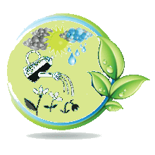
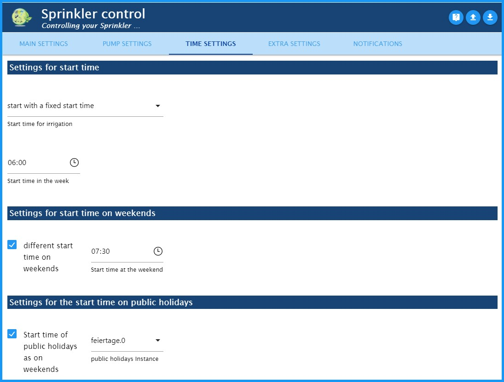
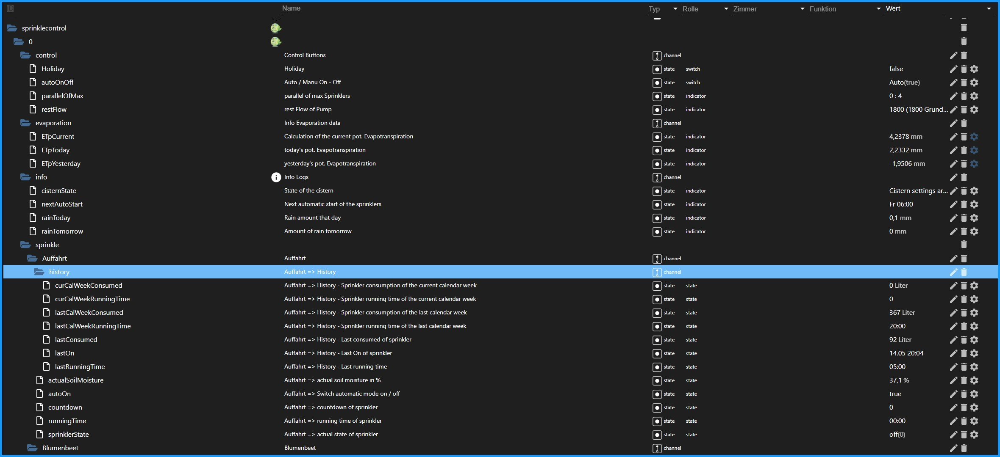

# 洒水控制
### *用于依赖天气的自动花园灌溉适配器。*（通过天气传感器 HmIP-SWO-PL – plus）
不幸的是，我的英语知识太少，无法进行适配器描述。
对于翻译的任何帮助，我将不胜感激。

---
---

## 作用方式
- - -

环境数据（温度、湿度、亮度、风速、雨量）在 Sprinkle Control 中进行评估。
以这种方式确定的蒸发量用于确定各个灌溉区的理论土壤水分。
在“时间设置”下指定的时间点，低于特定百分比的浇水回路被激活。
然后以不超过最大泵输出 (l / h) 和最大灌溉回路数量的方式控制这些不同的灌溉回路。
两者都是可定制的。

**一天中的切换行为示例（所有阀门的开始时间：6:00）**

我的灌溉与 Homematic IP 天气传感器 plus (HmIP-SWO-PL) 配合使用，并且**仅用这个进行了测试**。
然而，在 ioBroker 论坛中，也有一些通过 Sainlogic 适配器在气象站上进行的测试。

---
---

＃＃ 安装
- - -

Sprinkle Control Adapter 实例通过 ioBroker Admin 界面通过单击加号 (+) 进行安装。
根据管理适配器中指定的活动存储库，将安装稳定版（默认）或测试版（最新）。

---
---

## 适配器配置 - 主要设置
- - -

* 1：转到 GitHub 上的 Sprinkle Control 页面
* 2：从文件加载适配器配置
* 3：从文件中保存适配器配置
* 4：添加新的浇水圈
* 5：复选框启用/禁用灌溉电路
* 6：选择ID时，自动从对象中读取灌溉圈的名称，然后可以根据需要进行更改。
* 7：对象中要控制的数据点的唯一ID
* 8：更改选择的灌溉执行器
* 9：打开各个灌溉回路的单独配置
* 10：移动行位置
* 11：删除所有配置数据的浇水电路！

- - -

### 灌溉回路的单独配置
- - -

打开各个灌溉回路的单独配置

**灌溉设置**

- *以分钟为单位的浇水时间：*以分钟为单位设置浇水时间。这会延长触发点低于“土壤水分的最低百分比”。
- *最大灌溉延长百分比：* 灌溉持续时间限制百分比（100% = 灌溉持续时间未延长）。
- *以分钟为单位的浇水间隔：*浇水时间分为一个间隔。 （例如，开 5 分钟、至少关 5 分钟、开 5 分钟等）
    - **提示：** 我在入口处有一个草坪格栅。这里的水只有在灌溉时才会流下斜坡。我能够通过不时倾倒来抵消这种情况。

**浇水的开关点**

- *灌溉阀的开启点（土壤湿度），以 % 为单位：* 开启阈值：如果未达到此值，则从开始时间开始浇水。
- *灌溉后土壤湿度 = 100%：* 激活后，浇水后土壤湿度设置为 100%。否则，由于灌溉过程中的蒸发，它将停留在其下方。

**最大土壤湿度**

- *灌溉后的最大土壤水分（mm）：*灌溉后土壤中的最大理论含水量。该值越高，浇水间隔越长。
  - **提示：** 草坪网格：5；花坛：10个；草坪面积：14
- *雨后的最大土壤水分（mm）：*大雨后土壤中的最大理论水分含量。这个值一定要大于灌水后！
  - **提示：**草坪网格：6；花坛：15；草坪面积：19

- - -

#### 灌溉回路的单独配置 - 主要设置
- - -

**洒水器消耗**

- *流量以 l/h 为单位：* 当前灌溉站的具体流量
    - **提示：**经常在使用说明书或互联网上找到
- *助推器：*从网络中删除所有活动的灌溉电路 30 秒，然后再次打开它们
    - **提示：** 我的泵提供最大 1800 l/h 的流量，而我的草坪洒水器需要 1400 l/h 但全压才能启动它们。借助助推器功能，我还可以用只需要 300 l / h 的滴水管给我的针叶树浇水。

    > - **危险：** 此功能应非常谨慎地使用，因为一次只有一个灌溉回路可以使用主动增压器进行浇水。

---
---

#### 灌溉回路的单独配置 - 泵设置
- - -

**阀门设置**

- *阀门的控制电压：* 单击 (+) 符号打开 Select-ID State 窗口。您可以在此处选择阀门控制电压的状态。只要其中一个阀门激活，该输出就会激活。

  如果您不需要此状态，请将此字段留空！

- *阀门的最大并行操作：* 活动阀门的数量可以在这里限制。例如，如果控制变压器的输出不足以并行切换多个阀门。
- *以毫秒为单位的阀门之间的切换距离：* 以毫秒为单位输入时间。这是下一个阀门切换之前的等待时间，例如，这意味着 6 个输出一个接一个地切换，而不是同时切换。

**泵的设置**

- *主泵：* 单击 (+) 符号打开选择 ID 窗口。负责供水的泵的 CONDITION 保存在此处。
- *主泵的最大泵输出量，单位为 l/h：* 最大泵输出量保存在此处。然后，这会限制灌溉回路，以便仍然向阀门施加足够的压力。
  - **危险：** 必须在此处指定实际的泵输出。不是铭牌上的那个。例如，我有一个“Gardena 5000/5 LCD”，由于生产线的长度，它只能产生 1800 l/h 的输出，而不是 4500 l/h，如铭牌上所述。

**添加水箱泵**

- *添加水箱泵作为优先泵*
    - *水箱泵：* 水箱泵在此处输入。如果水箱中的水位太低，此功能将被停用。在这种情况下，主泵继续供水。
    - *水箱的最大泵容量，以 l/h 为单位：* 以 l / h 为单位的最大泵输出在此处保存。请参阅调整主泵。
    - *水箱中的液位传感器：* 液位传感器的状态以确定 0 ... 100% 的液位。
      - *内置：* HomeMatic 的 Hm-Sen-Wa-Od 电容式电平表。
    - *以 % 为单位的孢囊最低填充水平：* 如果未达到此值，则切换点切换到主泵，并根据浇水运行时的消耗量调整阀门。

---
---

## 适配器配置 - 时间设置
- - -

可以在此选项卡上设置洒水控制的开始时间。

###开始时间设置
- *灌溉开始时间：*
  - *以固定的开始时间开始：* **一周的开始时间**可以在此处设置。
  - *日出开始时间：*这里是日出开始时间。它可以通过 **Time shift in min** 从 -120 分钟转移到 + 120 分钟。
  - *黄金时段结束时的开始时间：*

###周末开始时间设置
- *周末不同的开始时间：*如果您想在周末的不同时间开始浇水，以免惹恼您的邻居，例如，您可以在此处激活它。
- *周末开始时间：*

###公共假期开始时间设置
- *公共假期的开始时间为周末：* 如果公共假期应被视为周末，可在此处激活。
- *公共假期实例* 然后必须在此处选择外部公共假期实例（例如适配器“Deutsche Feiertage”）。

---
---

## 适配器配置 - 额外设置
- - -

###天文设置
SprinkleControl 从 ioBroker 系统设置中获取纬度和经度。
SprinkleControl 使用这些值来计算太阳的位置和用于蒸发的外星辐射。

### 调试设置
激活后，日志中会显示其他信息。这允许更快地分析错误。

### 附加通知设置
激活通知选项卡。然后在新的通知选项卡上进行通信设置。

### 传感器“（Homematic HmIP-SWO-PL）”用于计算蒸发量
> - **危险：** 该程序适用于计算蒸发量的“HomeMatic 气象站 HmIP-SWO-PL”！如果没有这些数据，就不会触发灌溉回路。

- 但我从论坛上听说该程序还可以通过“Sainlogic 适配器”处理天气数据。
- 传感器根据 Penman ETp 计算潜在蒸散的最大可能蒸发量，从而控制灌溉系统。

  每次温度变化时都会发生这种情况。

＃＃＃ 天气预报
- 如果您激活“使用天气预报”框，将出现一个选择框。此处必须选择适配器“Das Wetter”的实例。

必须在“Das Wetter”适配器中填写“路径2：带有5天天气预报和每3小时详细信息的XML文件”，以便SprinkleControl可以访问对象**“daswetter.0.NextDaysDetailed.Location_1.Day_1 .rain_value"**。然后，该值用于在应该下雨时推迟浇水。

---
---

## 适配器配置 - 通知
- - -

- 激活通知选项卡后，您可以选择通知方式并在此处输入您的详细信息。
- 支持以下通知方式：
  - 电子邮件
  - 俯卧撑
  - 电报
  - WhatsApp

---
---

## Admin => Objekte => splashcontrol.0。
- - -

＃＃＃ 控制
- **Holiday:** 如果“Holiday”设置为true，如果启用周末设置，浇水将像周末一样开始。在这里也可以连接日历。
- **autoOnOff:** 当设置为“关闭”时，灌溉系统的自动模式被禁用。
- **parallelOfMax:** 例如 (3:4)。四个可能的灌溉圈中的三个在这里活跃。 （这只是一个广告！）
- **restFlow:** 显示泵的可能剩余流量。 （这只是一个广告！）

###蒸发
- **ETpCurrent：** 这是当前蒸发量，以毫米/天为单位的每日值。
- **ETpToday:** 此处显示当前每日蒸发值。这将在 00:05 移至 ETpYesterday，然后重置为 0。
- **ETpYesterday：** 此处显示昨天的蒸发量。

###信息
- **cisternState** 如有必要，此处会显示水箱的状态及其状态。
- **nextAutoStart** 指示灌溉系统的下一次启动。
- **rainToday** 此处显示今天的降水预报。为此需要适配器“天气”。
- **rainTomorrow** 来自适配器“天气”的明天降水预报。

###洒。*。
- **历史**
  - **curCalWeekConsumed:** 灌溉回路的当前每周消耗量（以升为单位）
  - **curCalWeekRunningTime:** 当前灌溉回路的每周总运行时间
  - **lastCalWeekConsumed:** 上次每周消耗的灌溉回路升数
  - **lastCalWeekRunningTime:** 浇水周期的最后一周总运行时间
  - **lastConsumed:** 最后一次浇水时的耗水量（以升为单位）
  - **lastOn:** 浇水周期的最后开始 (05.07 14:14)
  - **lastRunningTime:** 上次浇水持续时间
- **actualSoilMoisture** 这是当前虚拟土壤湿度，以 % => 触发标准（灌溉后最大 100%，大雨后超过 100%）。注意：此值可能与实际土壤湿度有很大差异。
- **autoOn** 自动开启（您可以在此处关闭此电路的自动浇水，例如在维修期间，随时可以手动浇水。）
- **倒计时**剩余浇水时间
- **runningTime** 浇水持续时间
  - 如果在此处输入大于 0 的数字，则浇水周期开始指定时间（以分钟为单位）。
  - 如果输入 0，则浇水圈的浇水将结束。
- **sprinklerState** 灌溉回路状态的显示。
  - off(0) → 灌溉回路关闭。
  - wait(1) → 灌溉回路正在等待泵容量可用。
  - on(2) → 灌溉圈开启。
  - break(3) → 浇水周期被中断（配置，浇水间隔）
  - 升压(4) → 当前灌溉回路的升压功能激活（配置，升压器开启）。
  - off(Boost)(5) → 灌溉电路中断 30 秒，因为增强功能处于活动状态。

## Changelog
<!--
	Placeholder for the next version (at the beginning of the line):
	### **WORK IN PROGRESS**
-->

### 0.2.7 (16.10.2021)
* (Dirk-Peter-md) zusätzliche Testnachrichten gelöscht, Readme aktualisiert

### 0.2.6 (03.10.2021)
* (Dirk-Peter-md) inGreenhouse in Bewässerungsverfahren "Calculation" hinzugefügt

### 0.2.5 (18.08.2021)
* (Dirk-Peter-md) Mehrfachverwendung von Bodenfeuchte-Sensoren
* (Dirk-Peter-md) Objekte mit \"def\": ... überarbeitet

### 0.2.4 (16.08.2021)
* (Dirk-Peter-md) Triggerpunktanzeige hinzufügen
* (Dirk-Peter-md) Fehler in der Bodenfeuchteanalyse behoben

### 0.2.3 (15.08.2021)
* (Dirk-Peter-md) index_m-Fehler behoben
* (Dirk-Peter-md) timeExtension (FixDay, bistabil) Fehler behoben

### 0.2.2 (27.07.2021)
* (Dirk-Peter-md) Fehler FixDay behoben
* (Dirk-Peter-md) Anzeige actualSoilMoisture überarbeitet
* (Dirk-Peter-md) Infomeldungen überarbeitet

### 0.2.1 (13.07.2021)
* (Dirk-Peter-md) Start an festen Wochentagen (ohne Sensoren) hinzugefügt
* (Dirk-Peter-md) Fehler behoben

### 0.2.0 (03.07.2021)
* (Dirk-Peter-md) Bodenfeuchte-Sensor hinzugefügt
* (Dirk-Peter-md) Schwellwert für Wettervorhersage hinzugefügt

### 0.1.7 (22.05.2021)
* (Dirk-Peter-md) Beschreibung in englischer Sprache hinzugefügt
* (Dirk-Peter-md) bereit für stable

### 0.1.6 (18.05.2021)
* (Dirk-Peter-md) AutoOn-Schalter pro Bewässerungskreis hinzugefügt
* (Dirk-Peter-md) weitere Fehler beseitigt (js-Controller)
* (Dirk-Peter-md) Niederschlagszähler von der Verdunstung gelöst

### 0.1.5 (05.05.2021)
* (Dirk-Peter-md) Zurücksetzen der Regenmenge im 24-Stunden-Modus hinzugefügt

### 0.1.4 (21.04.2021)
* (Dirk-Peter-md) Fehler bei deaktivierter Wettervorhersage behoben

### 0.1.3 (18.04.2021)
* (Dirk-Peter-md) Schaltabstand zwischen den Ventilen eingebaut, main.js aufgeteilt

### 0.1.2 (30.12.2020)
* (Dirk-Peter-md) Beschreibung von SprinkleControl überarbeitet

### 0.1.1 (08.11.2020)
* (Dirk-Peter-md) Integration von Nachrichten per Telegramm, E-Mail, Pushover und WhatsApp

### 0.0.12 (10.10.2020)
* (Dirk-Peter-md) Bewässerung über eine 2. Pumpe (Zisterne mit Vorrangschaltung) in abhängigkeit vom Füllstand hinzugefügt.

### 0.0.11 (30.08.2020)
* (Dirk-Peter-md) Bug in der Verarbeitung der Regenvorhersage vom Adapter "Das Wetter"
* (Dirk-Peter-md) Bug auf Travis CI

*************************************************************************************************************************************

## License
MIT License

Copyright (c) 2021 Dirk Peter <dirk.peter@freenet.de>

Permission is hereby granted, free of charge, to any person obtaining a copy
of this software and associated documentation files (the "Software"), to deal
in the Software without restriction, including without limitation the rights
to use, copy, modify, merge, publish, distribute, sublicense, and/or sell
copies of the Software, and to permit persons to whom the Software is
furnished to do so, subject to the following conditions:

The above copyright notice and this permission notice shall be included in all
copies or substantial portions of the Software.

THE SOFTWARE IS PROVIDED "AS IS", WITHOUT WARRANTY OF ANY KIND, EXPRESS OR
IMPLIED, INCLUDING BUT NOT LIMITED TO THE WARRANTIES OF MERCHANTABILITY,
FITNESS FOR A PARTICULAR PURPOSE AND NON INFRINGEMENT. IN NO EVENT SHALL THE
AUTHORS OR COPYRIGHT HOLDERS BE LIABLE FOR ANY CLAIM, DAMAGES OR OTHER
LIABILITY, WHETHER IN AN ACTION OF CONTRACT, TORT OR OTHERWISE, ARISING FROM,
OUT OF OR IN CONNECTION WITH THE SOFTWARE OR THE USE OR OTHER DEALINGS IN THE
SOFTWARE.