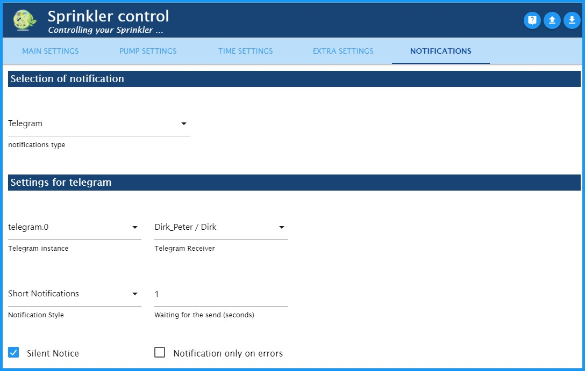

＃SprinkleControl
### *用于天气相关的自动花园灌溉的适配器。*（通过天气传感器HmIP-SWO-PL –加）
不幸的是，对于适配器的描述，我的英语知识太少了。
对于翻译的任何帮助，我将不胜感激。

---
---

##作用方式
- - -

在Sprinkle Control中评估环境数据（温度，湿度，亮度，风速，雨量）。
以这种方式确定的蒸发量可用于确定各个灌溉区域的理论土壤湿度。
在“时间设置”（Time settings）下指定的时间点，激活低于特定百分比的浇水回路。
然后，以不超过最大泵输出（l / h）和最大灌溉回路数的方式控制这些不同的灌溉回路。
两者都是可定制的。

**一天中的开关行为示例（所有阀门的开始时间：6：00）**

我的灌溉与Homematic IP天气传感器plus（HmIP-SWO-PL）一起使用，并且**仅对此进行了测试**。
但是，在ioBroker论坛中，还通过Sainlogic适配器对气象站进行了一些测试。

---
---

＃＃ 安装
- - -

通过单击加号（+），通过ioBroker Admin界面安装Sprinkle Control Adapter的实例。
根据管理适配器中指定的活动存储库，将安装稳定版（默认）或Beta版（最新版）。

---
---

##适配器配置-主要设置
- - -

* 1：转到GitHub上的Sprinkle Control页面
* 2：从文件加载适配器配置
* 3：从文件保存适配器配置
* 4：添加新的浇水圈
* 5：复选框启用/禁用灌溉回路
* 6：选择ID后，会自动从对象中读取灌溉圈的名称，然后可以根据需要进行更改。
* 7：对象中要控制的数据点的唯一ID
* 8：更改所选的灌溉执行器
* 9：打开相应灌溉回路的单独配置
* 10：移动行位置
* 11：删除所有配置数据的浇水回路！

- - -

###灌溉回路的单独配置
- - -

打开相应灌溉回路的单独配置

**灌溉设置**

-*以分钟为单位的浇水时间：*以分钟为单位设置浇水时间。触发点下降到“土壤水分的最低百分比”以下时，距离会进一步延长。
-*最大灌溉扩展百分比：*灌溉持续时间的百分比限制（100％=未延长灌溉持续时间）。
-*浇水间隔以分钟为单位：*浇水时间分为一个间隔。 （例如，打开5分钟，关闭至少5分钟，打开5分钟等）
    -提示：**和我一起，我在入口处有一块草坪花格。这里的水只有在灌溉时才沿着斜坡流下。我能够通过不时浇水来抵消这种情况。

**浇水的接通点**

-*灌溉阀的接通点（土壤湿度），以％为单位：*接通阈值：如果未达到该值，则从开始时间开始浇水。
-*灌溉后土壤水分= 100％：*激活后，浇水后土壤水分设为100％。否则，由于灌溉过程中的蒸发，它将停留在其正下方。

**最大土壤湿度**

-*灌溉后的最大土壤水分，单位为（mm）：*灌溉后的最大理论含水量。该值越高，浇水间隔越长。
  -提示：**草坪网格：5；花坛：10个；草坪面积：14
-*雨后最大土壤水分，单位为（mm）：*大雨后土壤中的最大理论含水量。该值必须大于灌溉后的值！
  -提示：**草地格：6；花坛：15；草坪面积：19

- - -

####灌溉回路的个别配置-主要设置
- - -

**洒水器消耗量**

-*流量，单位为l / h：*当前灌溉站的特定流量
    -提示：**通常在说明手册中或在Internet上找到
-*助推器：*从网络中删除所有活动的冲洗电路30秒钟，然后再次打开它们
    -提示：**我的泵最大输出功率为1800 l / h，而我的草坪洒水器需要1400 l / h，但要充满压力才能启动它们。借助增强功能，我还可以用仅需300 l / h的滴水线为我的针叶树浇水。

    >-**危险：**应当非常谨慎地使用此功能，因为一次只有一个灌溉回路可以使用有源助力器浇水。

- - -

####灌溉回路的个别配置-泵设置
- - -

**阀门设置**

-*阀的控制电压：*单击（+）符号将打开“选择ID状态”窗口。在这里，您可以为阀的控制电压选择状态。一旦其中一个阀处于活动状态，此输出即变为活动状态。

  如果不需要此状态，请将该字段留空！

-*阀的最大并联操作：*此处可以限制活动阀的数量。例如，如果控制变压器的输出不足以并联切换多个阀。
-*阀之间的切换距离以ms为单位：*输入时间（以毫秒为单位）。这是切换下一个阀之前的等待时间，例如，这意味着6个输出一个接一个地切换，而不是同时切换。

**泵的设置**

-*主泵：*单击（+）符号将打开“选择ID”窗口。负责供水的泵的状态保存在此处。
-*主泵的最大泵输出，以升/小时为单位：*最大泵输出保存在此处。然后，这限制了冲洗回路，从而仍然向阀施加了足够的压力。
  -**危险：**必须在此处指定实际的泵输出。不是铭牌上的那个。例如，我有一台“ Gardena 5000/5 LCD”，由于生产线的长度，它只能产生1800 l / h的输出，而不会产生4500 l / h的输出，如铭牌上所述。

**添加水箱泵**

-*将水箱泵添加为优先泵*
    -*水箱泵：*在此输入水箱泵。如果水箱中的水位太低，则将其禁用。在这种情况下，主泵继续注水。
    -*水箱的最大泵容量（以l / h为单位）：*最大水泵输出（以l / h为单位）被保存在此处。请参阅调整主泵。
    -*水箱中的液位传感器：*液位传感器的状态，用于确定0 ... 100％中的液位。
      -*内置：* HomeMatic的Hm-Sen-Wa-Od电容式液位计。
    -*囊肿的最小填充水平，以％为单位：*如果未达到，则切换点切换至主泵，并根据浇水运行时的消耗量调节阀门。

---
---

##适配器配置-时间设置
- - -

洒水控制的开始时间可以在此选项卡上设置。

###开始时间设置
-*灌溉开始时间：*
  -*以固定的开始时间开始：* **每周的开始时间**可以在此处设置。
  -*日出开始时间：*这是日出开始时间。可以通过“时间转换（分钟）”将它从-120分钟更改为+ 120分钟。
  -*黄金时间结束时的开始时间：*

###周末开始时间的设置
-*周末的开始时间不同：*如果您想在周末的其他时间开始浇水，以免打扰您的邻居，例如，您可以在这里激活它。
-*周末开始时间：*

###公众假期开始时间的设置
-*公共假期的开始时间与周末一样：*如果将公共假期视为周末，则可以在此处激活。
-*公共假日实例*然后必须在此处选择外部公共假日实例（例如，适配器“ Deutsche Feiertage”）。

---
---

##适配器配置-额外设置
- - -

### Astro设定
SprinkleControl从ioBroker系统设置中获取纬度和经度。
SprinkleControl使用这些值来计算太阳和外星辐射的位置以进行蒸发。

###调试设置
激活后，其他信息将显示在日志中。这样可以更快地分析错误。

###其他通知设置
激活通知标签。然后，在新的“通知”选项卡上进行通信设置。

###用于计算蒸发量的传感器“（Homematic HmIP-SWO-PL）”
>-**危险：**该程序适用于“ HomeMatic气象站HmIP-SWO-PL”，用于计算蒸发量！没有此数据，将不会触发冲洗电路。

-但是我从论坛上听说该程序还可以通过“ Sainlogic Adapter”使用气象数据。
-传感器根据Penman ETp计算潜在蒸散量的最大可能蒸发量，从而控制灌溉系统。

  每当温度变化时都会发生这种情况。

＃＃＃ 天气预报
-如果您激活“使用天气预报”框，则会出现一个选择框。在此必须选择适配器“ Das Wetter”的实例。

必须在“ Das Wetter”适配器中填写“路径2：具有5天天气预报和每3小时详细信息的XML文件”，以便SprinkleControl可以访问对象**“ daswetter.0.NextDaysDetailed.Location_1.Day_1 .rain_value“ **。然后，该值将在下雨时推迟浇水。

---
---

##适配器配置-通知
- - -

-激活“通知”标签后，您可以选择通知方式，然后在此处输入详细信息。

---
---

##管理员=>对象=> sprinklecontrol.0。
- - -

＃＃＃ 控制
-**假日：**如果将“假日”设置为true，则启用周末设置后，浇水将像周末一样开始。在这里也可以与日历建立连接。
-** autoOnOff：**设置为“关”时，灌溉系统的自动模式被禁用。
-** parallelOfMax：**例如（3：4）。这里有四个可能的灌溉圈中的三个处于活动状态。 （这只是广告！）
-** restFlow：**显示泵的可能剩余流量。 （这只是广告！）

###蒸发
-** ETpCurrent：**这是以毫米/天为单位的日蒸发量。
-** ETpToday：**此处显示当前的每日蒸发量。它将在00:05移至ETpYesterday，然后重置为0。
-** ETpYesterday：**此处显示了昨天的蒸发量。

###信息
-** cisternState **如有必要，将在此处显示水箱的状态及其状态。
-** nextAutoStart **指示灌溉系统的下一次启动。
-** rainToday **这里显示了今天的降雨量预报。为此需要适配器“天气”。
-** rainTomorrow **来自适配器“天气”的明天的天气预报。

###洒。*。
- **历史**
  -** curCalWeekConsumed：**灌溉回路当前的每周消耗量（以升为单位）
  -** curCalWeekRunningTime：**灌溉回路的当前每周总运行时间
  -** lastCalWeekConsumed：**灌溉水道的上周消耗量（以升为单位）
  -** lastCalWeekRunningTime：**浇水周期的最后一周的总运行时间
  -** lastConsumed：**最后一次浇水期间的耗水量（以升为单位）
  -** lastOn：**浇水周期的最后开始（05.07 14:14）
  -** lastRunningTime：**上一次浇水持续时间
-** actualSoilMoisture **这是当前虚拟土壤湿度，以％=>触发标准（灌溉后最大100％，大雨后最大100％）表示。注意：该值可能与实际土壤湿度有很大差异。
-** autoOn **自动开启（您可以在此处关闭此电路的自动浇水，例如在维修过程中，随时可以进行手动浇水。）
-**倒计时**剩余浇水时间
-** runningTime **浇水时间
  -如果在此处输入大于0的数字，则浇水周期以分钟为单位的指定时间开始。
  -如果输入0，则浇水圈的浇水将结束。
-** sprinklerState **显示灌溉回路的状态。
  -关闭（0）→灌溉电路关闭。
  -wait（1）→冲洗回路正在等待泵容量可用。
  -开（2）→灌溉圈开。
  -break（3）→浇水周期被中断（配置，浇水间隔）
  -Boost（4）→当前冲洗电路的boost功能处于活动状态（配置，booster开启）。
  -off（升压）（5）→由于升压功能已激活，灌溉电路中断了30 s。

## Changelog

<!--
	Placeholder for the next version (at the beginning of the line):
	### **WORK IN PROGRESS**
-->

### 0.1.7 (22.05.2021)
* (Dirk-Peter-md) Beschreibung in englischer Sprache hinzugefügt
* (Dirk-Peter-md) bereit für stable

### 0.1.6 (18.05.2021)
* (Dirk-Peter-md) AutoOn-Schalter pro Bewässerungskreis hinzugefügt
* (Dirk-Peter-md) weitere Fehler beseitigt (js-Controller)
* (Dirk-Peter-md) Niederschlagszähler von der Verdunstung gelöst

### 0.1.5 (05.05.2021)
* (Dirk-Peter-md) Zurücksetzen der Regenmenge im 24-Stunden-Modus hinzugefügt

### 0.1.4 (21.04.2021)
* (Dirk-Peter-md) Fehler bei deaktivierter Wettervorhersage behoben

### 0.1.3 (18.04.2021)
* (Dirk-Peter-md) Schaltabstand zwischen den Ventilen eingebaut, main.js aufgeteilt

### 0.1.2 (30.12.2020)
* (Dirk-Peter-md) Beschreibung von SprinkleControl überarbeitet

### 0.1.1 (08.11.2020)
* (Dirk-Peter-md) Integration von Nachrichten per Telegramm, E-Mail, Pushover und WhatsApp

### 0.0.12 (10.10.2020)
* (Dirk-Peter-md) Bewässerung über eine 2. Pumpe (Zisterne mit Vorrangschaltung) in abhängigkeit vom Füllstand hinzugefügt.

### 0.0.11 (30.08.2020)
* (Dirk-Peter-md) Bug in der Verarbeitung der Regenvorhersage vom Adapter "Das Wetter"
* (Dirk-Peter-md) Bug auf Travis CI

*************************************************************************************************************************************

## License
MIT License

Copyright (c) 2021 Dirk Peter <dirk.peter@freenet.de>

Permission is hereby granted, free of charge, to any person obtaining a copy
of this software and associated documentation files (the "Software"), to deal
in the Software without restriction, including without limitation the rights
to use, copy, modify, merge, publish, distribute, sublicense, and/or sell
copies of the Software, and to permit persons to whom the Software is
furnished to do so, subject to the following conditions:

The above copyright notice and this permission notice shall be included in all
copies or substantial portions of the Software.

THE SOFTWARE IS PROVIDED "AS IS", WITHOUT WARRANTY OF ANY KIND, EXPRESS OR
IMPLIED, INCLUDING BUT NOT LIMITED TO THE WARRANTIES OF MERCHANTABILITY,
FITNESS FOR A PARTICULAR PURPOSE AND NON INFRINGEMENT. IN NO EVENT SHALL THE
AUTHORS OR COPYRIGHT HOLDERS BE LIABLE FOR ANY CLAIM, DAMAGES OR OTHER
LIABILITY, WHETHER IN AN ACTION OF CONTRACT, TORT OR OTHERWISE, ARISING FROM,
OUT OF OR IN CONNECTION WITH THE SOFTWARE OR THE USE OR OTHER DEALINGS IN THE
SOFTWARE.