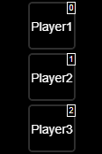
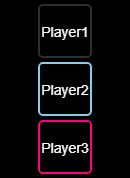

# IoBroker Logitech Squeezebox 适配器通过 JSON/RPC 协议
**测试：**

这是一个替代适配器，它使用`JSON/RPC`协议获取数据并向 Logitech 媒体服务器 ([语言管理系统](https://de.wikipedia.org/wiki/Logitech_Media_Server)) 发送命令，以控制连接的设备，例如

- 原生[squeezebox](https://de.wikipedia.org/wiki/Squeezebox),
- 带有附加音频模块和基于小型 Linux 固件的树莓派

像[picoreplayer](https://picoreplayer.org/) 或 [max2play](https://www.max2play.com)。

- 带有插件 chromecast、airplay 或 `UPnP/DLNA` 设备

`LMS` 服务器可以管理/提供硬盘或`NAS` 上的非常大的音乐收藏，并连接到不同的流媒体提供商，如`Spotify`、`Deezer`、`Soundcloud`、`shoutcast`、`tunein`、`napster`、`pandora`、`tidal` 等

为什么需要另一个`Squeezebox`适配器？

现有适配器使用`telnet` 访问`LMS`。telnet 有一些缺点。
`LMS` 的实际主 Web 界面也使用 rpc/json 协议来获取所有需要的信息或向服务器/播放器发送命令。

＃＃ 特征
- `LMS` 服务提供的大部分 [数据](#server) 均可在适配器中使用
- 有关播放器状态、歌曲标题、艺术家的详细信息，

专辑、艺术作品、播放列表

- [许多控制功能](#provided-states) 播放、暂停、停止、前进、\

倒带、重复、随机播放、播放收藏夹、跳至时间\（绝对和相对）、跳至播放列表索引（绝对和相对）、\ 电源开/关和预设按钮

- 来自服务器的所有 [收藏夹](#favorites) 和所有子级别
- iobroker-vis 组件的许多 [widget](#widgets) 都包含在\

创建自己的控制用户界面（选择播放器、选择收藏夹、管理同步组、播放/暂停按钮、前进、后退、重复模式和随机播放模式选择）

＃＃ 安装
- 安装软件包
- 创建一个实例
- 使用罗技媒体服务器的 IP 配置实例

和端口（通常为 9000）

- 启动/重新启动实例

＃＃ 更新
- 安装或更新后，有时可能需要\

如果 vis-1 中出现问题，请执行以下命令

`iobroker upload squeezeboxrpc`

## 提供状态
＃＃＃ 服务器
| 状态 | 描述 |
| ------------------ | ----------------------------- |
| `LastScan` | 上次音乐扫描的时间戳 |
| `PlayerCountOther` | 已知的其他玩家数量 |
| `PlayerCountSN` | 已知 SN 玩家数量 |
| `TotalAlbums` | 所有已知专辑的数量 |
| `TotalArtists` | 所有已知艺术家的数量 |
| `TotalDuration` | 所有歌曲的播放时间总和 |
| `TotalGenres` | 所有已知流派的数量 |
| `TotalSongs` | 所有已知歌曲的数量 |
| `SyncGroups` | 现有同步组 |
| `Version` | `LMS` 的版本 |
| `mac` | 服务器的 MAC-ID |
| `uuid` | `LMS` 实例的 uuid |
| `uuid` | `LMS` 实例的 uuid |

额外定义一个按钮来刷新收藏夹

| 按钮 | 描述 |
| -------------- | --------------------------------- |
| `getFavorites` | 从服务器请求所有收藏夹 |

### 收藏
对于每个收藏夹的所有属性都是只读的

| 状态 | 描述 |
| ---------- | ------------------------------------------ |
| `Name` | 收藏夹的名称 |
| `id` | 收藏夹的 id |
| `image` | 如果有的话，请添加图片/图标作为收藏 |
| `isaudio` |音频 |
| `type` | 示例类型：链接、文本、音频、播放列表 |
| `url` | 曲目网址 |
| `url` | 轨道的 url |

收藏夹的所有子级别（子目录）均可用。

### 玩家
对于每个玩家模式显示你是否可以改变值。所采取的行动在属性中描述

| 状态 | 模式 | 描述 |
| ---------------------- | ---- | -------------------------------------------------------------------------------------------------------------------- |
| `Alarms` | R/- | 该玩家所有已注册的警报（JSON 格式）|
| `Artist` | R/- | 艺术家姓名 |
| `ArtworkUrl` | R/- | 艺术品网址 |
| `Bitrate` | R/- | 曲目比特率 |
| `Connected` | R/- | 玩家的连接状态 (0/1) |
| `Duration` | R/- | 曲目时长 |
| `Genre` | R/- | 曲目类型 |
| `IP` | R/- | 玩家的 IP |
| `Mode` | R/- | 播放/暂停/停止 |
| `Playername` | R/- | 玩家姓名 |
| `PlayerID` | R/- | 玩家ID |
| `Playlist` | R/- | 实际播放列表为 JSON |
| `PlaylistCurrentIndex` | R/W | 通过指定轨道索引转到绝对位置，或者在开头使用 + 或 - 转到相对位置。示例 10,-3,+2 |
| `PlaylistRepeat` | R/W | 重复歌曲(1)/播放列表(2)/不重复(0) |
| `PlaylistShuffle` | R/W | 随机播放列表(1)/随机播放专辑(2)/不随机播放(0) |
| `Power` | R/W | 获取/设置播放器的电源状态关闭（0）/开启（1）|
| `RadioName` | R/- | 广播电台名称 |
| `Rate` | R/- | 歌曲评分 |
| `Remote` | R/- | 如果是远程流（1）|
| `SyncMaster` | R/- | Syncmaster 的 ID/MAC |
| `SyncSlaves` | R/- | 同步组中玩家的 ID/Mac |
| `Time` | R/- | 歌曲已播放时间 |
| `Title` | R/- | 歌曲名称 |
| `Type` | R/- | 媒体类型（例如 MP3 收音机）|
| `Url` | R/- | 曲目/流的网址 |
| `Volume` | R/W | 获取/设置播放器音量（0-100）|
| `state` | R/W | 获取/设置播放状态：暂停（0）、播放（1）、停止（2）|
| `state` | R/W | 获取/设置播放状态：暂停（0），播放（1），停止（2）|

如果在`LMS`中可用，播放列表将提供以下属性。
一些属性取决于歌曲的类型（流/文件/...）所有属性都是只读的

| 属性 | 描述 |
| ------------ | --------------------------------- |
| `Album` | 当前专辑名称 |
| `ArtworkUrl` | 艺术品网址 |
| `Bitrate` | 曲目的比特率 |
| `Duration` | 曲目时长 |
| `RadioName` | 电台名称 |
| `Rate` | 歌曲评分 |
| `title` | 歌曲名称 |
| `Type` | 媒体类型（例如 MP3 收音机）|
| `url` | 曲目/流的 URL |
| `index` | 播放列表中歌曲的索引 |
| `id` | 歌曲的 ID |
| `id` | 歌曲的 id |

额外定义的按钮：

| 按钮 | 描述 |
| ----------------- | ----------------------------------------------------------------------------------------------------------------------------------------------------------------- |
| `btnForward` | 下一首歌曲 |
| `btnPreset\_\*` | 1-6 个按钮可在播放器或服务器中定义 |
| `cmdGeneral` | 一个通用命令字段，用于向玩家发送命令。每个字段必须用引号括起来。参数必须用逗号分隔。示例：“play”，“1”|
| `cmdPlayFavorite` | 播放收藏夹设置收藏夹的 ID |
| `cmdPlayUrl` | 播放 url 示例“<http://50.7.77.114:8101/>；”|
| `cmdGoTime` | 通过指定秒数跳转到绝对位置，或者在秒数开头使用 + 或 - 跳转到相对位置。示例 100,-50,+50 |
| `cmdGoTime` | 通过指定秒数跳转到绝对位置，或者在秒数开头使用 + 或 - 跳转到相对位置。例如 100,-50,+50 |

#### 关于 LMS 中 TPE2 设置的数据点的备注
根据设置，不同的 MP3 标签会被传送到数据点。
大写名称是 mp3 标签的名称

| 在 LMS 中设置 TPE2 | 艺术家 | 专辑制作者 | Trackartist | 乐队 |
| ------------------------------ | ----------- | ----------- | ----------- | ----------- |
| 作为乐队 | 艺术家 | 空 | 曲目艺术家 | 专辑艺术家 |
| 作为专辑的表演者 | ALBUMARTIST | ALBUMARTIST | 空 | 空 |

还应注意，在 LMS 发生变化后，必须重新搜索和索引整个库，并且必须停止并重新启动歌曲，然后 LMS 才能传递其他数据。

### 进一步的 API 文档
有关更多信息，请访问 CLI 文档：

<https://github.com/oweitman/LMS-CLI-Documentation/blob/master/LMS-CLI.md>

## 小部件
### 播放器按钮栏


使用此小部件可以选择所有集成到 Logitech Media Server 的播放器。选择 `squeezerpc.?` 实例后，小部件中将显示可用的播放器。

＃＃＃＃ 属性
| 组 | 属性 | 描述 |
| ----------------------- | --------------- | ---------------------------------------------------------------------------------------------------------------------------------------------------------------------------------------------------------------------------------------------------------------------------------- |
| SqueezeboxRPC 实例 | 常规组 | 选择 squeezeboxrpc 适配器的一个实例。只有这些实例才被识别为有效。|
| 小部件格式 | 常规组 | 可以在此处选择小部件类型。“formatbutton”类型具有全部功能，并且还适用于 SyncGroup 小部件。“formatselect”类型是一个简单的选择框。使用玩家名称或单个文本作为名称。|
| 显示索引 | 常规组 | 通过删除按钮的索引，可以隐藏或以不同的顺序显示单个按钮。要隐藏它们，只需删除相应的索引位置（包括逗号）。如果启用了编辑模式帮助，索引号将在编辑模式下显示在相应的按钮上。|
| CamelCase 中的换行符 | 常规组 | 如果玩家名称以 CamelCase 书写，则可以在此处激活换行符，以便玩家名称在按钮上显示得更大。|
| 编辑模式帮助 | 常规组 | 如果激活此帮助，则索引号将显示在相应的按钮上，并且按钮设置中的“透明度”设置不起作用。|
| 图片宽度 | 按钮设置 | 按钮的图片宽度 |
| 图片高度 | 按钮设置 | 按钮的图片高度 |
| 透明度 | 按钮设置 | 如果按钮未激活，它将隐藏在背景中。0 = 不可见，1 = 完全可见 |
| 边框宽度 | 按钮设置 | 按钮周围边框的宽度（以像素为单位）|
| 边框显示 | 按钮设置 | 边框显示类型，如实线、虚线。|
| 正常边框颜色 | 按钮设置 | 如果按钮未激活，则以此颜色显示。|
| 边框颜色活动 | 按钮设置 | 如果按钮被激活，则以此颜色显示。|
| 边框半径 | 按钮设置 | 可以在此处输入弯曲边框角的半径（以像素为单位）。|
| 背景颜色 | 按钮设置 | 文本背景颜色 |
| 图片 | 按钮[x] | 可以在此单独定义图片。图片优先于文本。|
| 文本 | button[x] | 可以在此单独定义文本。图像优先于文本。|

### 收藏按钮栏


您可以使用此小部件选择 Logitech Media Server 中创建的所有收藏夹。
选择播放器小部件后，可用的收藏夹将显示在小部件中。

| 组 | 属性 | 描述 |
| ------------------- | --------------- | ----------------------------------------------------------------------------------------------------- |
| 播放器小部件 | 常规组 | 选择播放器小部件。|
| 显示索引 | 常规组 | 可以使用索引隐藏或以不同顺序显示各个按钮。|
| 编辑模式帮助 | 常规组 | 如果激活此帮助，则每个相应的按钮上都会显示索引号。|
| 图片宽度 | 按钮设置 | 按钮的图片宽度 |
| 图片高度 | 按钮设置 | 按钮的图片高度 |
| 透明度 | 按钮设置 | 如果按钮未激活，它将隐藏在背景中。0 = 不可见，1 = 完全可见 |
| 边框宽度 | 按钮设置 | 按钮周围边框的宽度（以像素为单位）|
| 边框显示 | 按钮设置 | 边框显示类型，如实线、虚线。|
| 正常边框颜色 | 按钮设置 | 若按钮未激活，则以此颜色显示。|
| 边框颜色活动 | 按钮设置 | 如果按钮被激活，则以此颜色显示。|
| 边框半径 | 按钮设置 | 可以在此处输入弯曲边框角的半径（以像素为单位）。|
| 背景颜色 | 按钮设置 | 文本背景颜色 |
| 图片 | button[x] | 可以在此单独定义图片。图片优先于文本。|
| 文本 | button[x] | 可以在此处单独定义文本。图像优先于文本。|

### 播放按钮


播放按钮可启动或停止所选播放器上的音乐。\ 准备时，您必须将按钮连接到播放器小部件。\ 该按钮有自己的图形（SVG），\ 或者您也可以选择自己的图形。

#### 播放按钮的属性
| 组 | 属性 | 描述 |
| ------------- | ------------------ | ------------------------------- |
| 播放器小部件 | 常规组 | 播放器小部件的选择。|
| 暂停图片 | 普通组 | 暂停图片 |
| 游戏图像 | 普通组 | 游戏图像 |
| 停止图像 | 常规组 | 停止图像 |
| 填充颜色 | SVG 设置组 | 按钮的填充颜色 |
| strokecolor | SVG 设置组 | 边框颜色 |
| strokewidth | SVG 设置组 | 边框宽度（以像素为单位）|

＃＃＃ 向前


前进小部件允许您在当前曲目中向前跳过。\ 如果播放器支持此功能，则可以将按钮配置为向前跳过特定量\ 的时间。

#### 前进按钮的属性
| 组 | 属性 | 描述 |
| ------------- | ------------- | ---------------------------------------------------------------- |
| 播放器小部件 | 常规组 | 播放器小部件的选择。|
| 步长 | 常规组 | 指定向前跳过的时间量（以秒为单位）。|
| 按钮标签 | 常规组 | 按钮的可自定义标签。|
| 按钮图标 | 常规组 | 选择按钮的图标，例如，用于向前跳过。|

### 倒回


倒带小部件允许您跳回到当前曲目。\与前进小部件类似，可以设置时间段。

#### 倒带按钮的属性
| 组 | 属性 | 描述 |
| ------------- | ------------- | ------------------------------------------------------------- |
| 播放器小部件 | 常规组 | 播放器小部件的选择。|
| 步长 | 常规组 | 指定跳回的时间段（以秒为单位）。|
| 按钮标签 | 常规组 | 按钮的可自定义标签。|
| 按钮符号 | 常规组 | 选择按钮的符号，例如，用于跳回。|

＃＃＃ 重复


如果播放器支持此功能，则重复小部件允许您激活或停用当前曲目或播放列表的重复功能。

#### 重复按钮的属性
| 组 | 属性 | 描述 |
| ------------- | ------------- | ------------------------------------------------------------------------------------------- |
| 播放器小部件 | 常规组 | 播放器小部件的选择。|
| 按钮标签 | 常规组 | 按钮的可自定义标签。|
| 按钮符号 | 常规组 | 选择按钮的符号，例如，重复。|
| 重复模式 | 常规组 | 可在此处选择模式，例如单个重复（曲目）或列表重复（播放列表）。|

### 随机播放


如果播放器支持此功能，则“随机播放”窗口小部件可启用或禁用当前播放列表的随机播放。

#### 随机播放按钮的属性
| 组 | 属性 | 描述 |
| ------------- | ------------- | ------------------------------------------------------- |
| 播放器小部件 | 常规组 | 播放器小部件的选择。|
| 按钮标签 | 常规组 | 按钮的可自定义标签。|
| 按钮图标 | 常规组 | 选择按钮的图标，例如用于随机播放。|
| 启用状态 | 常规组 | 启用随机播放时按钮的颜色或样式。|

＃＃＃ 体积


音量小部件显示播放器的当前音量级别并允许您调整音量。

#### 音量按钮的属性
| 组 | 属性 | 描述 |
| --------------------------- | ------------- | ----------------------------------------------------------------- |
| 播放器小部件 | 常规组 | 播放器小部件的选择。|
| 音量步长 | 常规组 | 指定增加或减少音量的步长。|
| 最大音量 | 常规组 | 设置音量的最大值，例如 100。|
| 音量条主颜色 | 常规组 | 代表当前音量的条形区域的颜色。|
| 成交量条背景颜色 | 常规组 | 成交量未被覆盖的条形区域的颜色。|
| 按钮图标 | 常规组 | 选择音量控制的图标。|

### SyncGroup 按钮栏


此小部件可与播放器小部件结合使用，以控制播放器之间的同步。
按钮、标签或图像数量的大多数设置都由播放器小部件接管。
为做好准备，您必须将按钮连接到播放器小部件。
在播放器小部件中选择播放器后，当前同步在 SyncGroup 小部件中可见。
同步状态使用各种可调颜色显示。
在播放器小部件中选择的播放器无法在 SyncGroup 小部件中选择。
如果在 SyncGroup 小部件中选择的播放器已在另一个组中，则会自动将其从该组中删除。

#### SyncGroup 按钮的属性
| 组 | 属性 | 描述 |
| ----------------------------- | --------------- | ---------------------------------------------------------------------------------------------- |
| 播放器小部件 | 常规组 | 播放器小部件的选择。|
| 边框宽度 | 按钮设置 | 边框宽度/按钮周围的边框宽度（以像素为单位）。|
| 边框显示 | 按钮设置 | 边框显示类型，如实线、虚线。|
| 边框颜色 - 不在组中 | 按钮设置 | 如果玩家不在组中，则按钮会获得此颜色的边框。|
| 边框颜色 - 在组内 | 按钮设置 | 如果玩家与选定的玩家同在一个组，则按钮会获得此颜色的边框。|
| 边框颜色 - 在其他组 | 按钮设置 | 如果玩家在另一个组中，按钮将获得此颜色的边框。|
| 边框半径 | 按钮设置 | 可以在此处输入弯曲边框角的半径（以像素为单位）。|
| 背景颜色 | 按钮设置 | 文本的背景颜色。|

### 游戏时间栏


播放时间条直观地显示当前正在播放的歌曲的进度，前提是服务器提供了总播放时间（持续时间）。在线流媒体通常不是这种情况。条的宽度对应于歌曲播放时间的 100%。通过单击条上的某个点，您可以跳转到歌曲中的所需点。要做好准备，您必须将按钮连接到播放器小部件。

#### 游戏时间栏的属性
| 组 | 属性 | 描述 |
| -------------- | ------------- | --------------------------------------------------------------- |
| 播放器小部件 | 常规组 | 播放器小部件的选择。|
| 栏主色 | 常规组 | 尚未播放时间的栏背景颜色。|
| 游戏时间颜色 | 常规组 | 游戏时间条的颜色。|
| 框架宽度 | 常规组 | 按钮周围的框架宽度/边框宽度（以像素为单位）。|
| 边框显示 | 常规组 | 边框显示类型，如实线、虚线。|
| 边框颜色 | 常规组 | 栏周围边框的颜色。|
| 边框半径 | 常规组 | 可以在此输入弯曲边缘角的半径（以像素为单位）。|

### 字符串/字符串


显示播放器特定的字符串。要做好准备，您必须将按钮连接到播放器小部件。

字符串的属性
| 组 | 属性 | 描述 |
| ---------------- | ------------- | ----------------------------------------------------------------- |
| 播放器小部件 | 常规组 | 播放器小部件的选择。|
| 球员属性 | 常规组 | 球员所有可用属性的选择列表。|
| 测试文本 | 常规组 | 为测试目的应在编辑器中显示的文本。|

＃＃＃ 数字


使用附加格式选项显示数字。要准备，您必须将按钮连接到播放器小部件。

#### 数字属性
| 组 | 属性 | 描述 |
| --------------------- | ----------------- | ----------------------------------------------------------------- |
| 播放器小部件 | 常规组 | 播放器小部件的选择。|
| 球员属性 | 常规组 | 球员所有可用属性的选择列表。|
| 前置 HTML | 常规组 | 放置在数字前面的文本或 HTML 代码。|
| 附加 HTML | 常规组 | 附加到数字的文本或 HTML 代码。|
| 测试文本 | 常规组 | 为测试目的应在编辑器中显示的文本。|
| 逗号后的字符 | 高级设置 | 小数位数。|
| 逗号作为分隔符 | 高级设置 | 逗号用于分隔小数位。|
| 千位分隔符 | 高级设置 | 对于大数字，每 3 位插入一个分隔符。|

### 播放列表


显示来自服务器的播放列表。如果您单击某个条目，播放列表就会加载，播放器就会启动。
窗口小部件不会自动刷新，您必须按刷新按钮。

#### 播放列表的属性
| 组 | 属性 | 描述 |
| --------------------- | ----------------- | ----------------------------------------------------------------- |
| 播放器小部件 | 常规组 | 播放器小部件的选择。|

小部件本身的格式很少。
对于自我格式化，有一些预定义的 css 类：

| CSS 类 | 描述 |
| ---------- | ----------------------------------------- |
| plcontainer| 分配给 ul 标签的类名 |
| plentry | 分配给 li-tag 的类名 |
| plrefresh | 分配给 refresh-li 标签的类名 |
| pltext | 分配给播放列表名称的类名 |

vis-css 选项卡的以下 CSS 可以作为示例：

暗黑模式

```css
.plentry {
    border: 1px #505050 groove;
    margin:1px 0px;
    padding:5px;
    background-color:#202020;
}
.plrefresh {
    padding:5px;
}
.plentry:hover {
    background-color:#404040;
}
.plrefresh svg {
    color:#cccccc;
}
.plrefresh svg:hover {
    color:#ffffff;
    filter: drop-shadow(0px 0px 1px #87ceeb);
}
```

灯光模式

```css
.plentry {
    border: 1px #b0b0b0 groove;
    margin:1px 0px;
    padding:5px;
    background-color:#c0c0c0;
}
.plrefresh {
    padding:5px;
}
.plentry:hover {
    background-color:#e0e0e0;
}
.plrefresh svg {
    color:#444444;
}
.plrefresh svg:hover {
    color:#000000;
    filter: drop-shadow(0px 0px 1px #87ceeb);
}
```

## SendTo 条件
### 命令常规
该命令可用于向 LMS 服务器发送任何命令以接收响应。

例子：

**所有播放列表：**

```js
async function main() {
  let data = await sendToAsync("squeezeboxrpc.0", "cmdGeneral", {
    playerid: "",
    cmdArray: ["playlists", "0", "999", "tags:us"],
  });
  console.log(JSON.stringify(data));
}
main();
```

**全部收藏：**

该命令由适配器内部使用，用于加载收藏夹。

```js
async function main() {
  let data = await sendToAsync("squeezeboxrpc.0", "cmdGeneral", {
    playerid: "",
    cmdArray: ["favorites", "items", "0", "999", "want_url:1", "item_id:"],
  });
  console.log(JSON.stringify(data));
}
main();
```

以下 CLI 文档包含更多选项和参数的详细描述：

[CLI 文档](#further-api-documentation)

待办事项
- 更多测试/修复
- 减少对其他包的依赖（squeezenode）
- 更多配置可选择打开/关闭功能以提高内存和性能
- 添加播放列表小部件
- 添加浏览小部件以在`LMS`菜单中浏览
- 添加玩家控制的圆形旋钮小部件
- 如果再次按下收藏按钮则停止播放。
- 服务器的 cmdGeneral。
- ~~添加 telnet 通信以从服务器获取推送事件\

优化投票~~

- ~~实现命令状态来放置用户个人命令（通过 json）\

对于服务器和玩家来说~~

- ~~实现更多控制功能（选择播放列表 pos 播放、ffwd、frew、\

跳转到歌曲中的时间位置、重复歌曲、随机歌曲)~~

- ~~将播放列表作为 json 数组添加到 playerdata~~
- ~~为收藏夹添加艺术品（电台标志/播放列表封面）~~
- ~~实现更多级别（子目录）的收藏夹~~
- ~~自动发现罗技媒体服务器~~

## Changelog

<!--
  Placeholder for the next version (at the beginning of the line):
   ### **WORK IN PROGRESS**

-->
### **WORK IN PROGRESS**

- fix spelling of iobroker upload squeezeboxrpc in readme

### 1.5.1 (2024-11-29)

- improve documentation
- remove margin from plcontainer
- improve textoverflow with ellipsis
- adjust initial widgetsize of playlist widget
- repair attributes for playlist widget
- add light mode css for playlist widget

### 1.5.0 (2024-11-28)

- Switch to iobroker/eslint
- New widget playlist

### 1.4.0 (2024-11-27)

- fix some missing objects errors
- sanitize more playernames in syncgroups
- add sendTo Command "cmdGeneral"
- sanitize more the playername
- improve translation
- if trackartist is avail then write to artist if empty
- improve handling for artwork_url
- move widget documentation from html to markdown
- adjust responsive tab style
- improve attribute widgets
- change TPE2 handling once more
- jsonConfig add sizing options for differenz screen sizes
- test implementation of TPE2 handling. switch in settings
- add datapoints album_artist, track_artist, artistOriginal

### 1.3.17 (2024-10-23)

- add edit button to the vie index field of favorites widget

### 1.3.16 (2024-10-23)

- fixed icons of the favorites widget

### 1.3.15 (2024-08-09)

- due to a adapter checker issue i have to remove the release 1.3.13 from npm.
  but changes from 1.3.13 are included in 1.3.14

### 1.3.14 (2024-08-05)

- fix formatting

### 1.3.13 (2024-08-05)

- revert the fix for artist handling due to negative effect of spotify

### 1.3.12 (2024-08-05)

- improve cmdGoto handling by kairauer, close PR #74
- fix issues from adapter checker
- integrate squeezenode lib

### 1.3.11 (2024-08-05)

- update adapter structure and switch to jsonconfig

### 1.3.10

- getalbumartist as artist if setting of TPE2/TPE3 in `LMS` are changed"

### 1.3.9

- fix error with deleting favorites
- fix wrong type for datapoint

### 1.3.8

- fix forward button widget

### 1.3.7

- fix object creation of states in player modul

### 1.3.6

- fix object creation of states

### 1.3.5

- fix object creation for favorites

### 1.3.4

- fix object creation for favorites / \* center widgets in sidebar

### 1.3.3

- repair imageproxy for image datapoints of favorites

### 1.3.2

- fix for Alarm contains only enabled Alarms

### 1.3.1

- fix problem with git dependency url

### 1.3.0

- fix problem wit setting own icon in player widget / \* add infos about\
   alarms to a player datapoint

### 1.2.1

- fix small issue in last version

### 1.2.0

- improve handling of imageproxy artwork

### 1.1.0

- make request of favorites configurable

### 1.0.1

- change setstate/createobject logic
- fix role and type for Mode-state
- update tests
- update dependency versions
- improve io-package.json

### 1.0.0

- prepare for stable repository

### 0.8.32

- the adapter function iobroker.deleteChannel didnt works as expected.\
   It didnt delete the whole subtree of states. now i implement my own delete function

### 0.8.31

- change behaviour of deleting favorites

### 0.8.30

- change from the issue of the adapter checker

### 0.8.29

- optimize handling of player state power and connected

### 0.8.28

- add advanced signaling function with telnet and fix some more authorization\
   issues with `LMS`

### 0.8.27

- initialization for the new calctype property if empty in volumebar

### 0.8.26

- more improvement and fixing at volumebar / remove playlist widget from\
   master. not ready yet

### 0.8.25

- fixing css-settings on volumebar

### 0.8.24

- volumebar didnt get events between the segments, change clickevent and calculation

### 0.8.23

- adjust dependencies to remove vulnerabilities in dependend packages.\
   also remove travis due of unresolvable build-failures for win+node10/12

### 0.8.22

- due to iobroker.controller 2.0 a command in the api changed (socket to vis.conn.\_socket)

### 0.8.21

- add command für playing urls

### 0.8.20

- remove node v6 test setting

### 0.8.19

- shorten news history

### 0.8.18 (2019-06-27)

- last minute changes.

### 0.8.17 (2019-06-26)

- add more widges: playtime bar, string, number, datetime, image.\
   add button margin to player and favorite widget, improve editing of viewindex.\
   do some refactoring.

### 0.8.16 (2019-06-24)

- resolve a cross browser issue for firefox. the style.\
   font attribute is empty and you have to construct the font string by yourself

### 0.8.15 (2019-06-19)

- minor issue with not ready states

### 0.8.14 (2019-06-19)

- add syncgroups as new server-datapoint,add syncgroup widget,/
  change some jquery event logic

### 0.8.13 (2019-06-16)

- rename widgetset from squeezeboxrpcwidgets to squeezeboxrpc

### 0.8.12 (2019-06-16)

- sync version with npm

### 0.8.11 (2019-06-15)

- try to integrate the widgets into the main adapter

### 0.8.10 (2019-05-15)

- another try to fix the EADDRINUSE error of the server discovery

### 0.8.9 (2019-05-15)

- try to fix the EADDRINUSE error of the server discovery

### 0.8.8 (2019-05-14)

- make discover configurable

### 0.8.7 (2019-05-11)

- more control features (select playlist pos to play,ffwd,frew,jump to/
  a time position in song,repeat song,random song)

### 0.8.6 (2019-05-10)

- move some configuration options into seperate tabs

### 0.8.5 (2019-05-08)

- change serverdiscovery interval method, remove some double cmd lines,/
  additional minor changes advised from eslint

### 0.8.4

- move some files to lib directory

### 0.8.3

- close port for discovery on unload

### 0.8.2

- sync version with npm

### 0.8.1

- set compact mode flag

### 0.8.0

- implementation of compact mode, change version to represent a realistic/
  feature completness

### 0.0.9

- debug options are now configurable

### 0.0.8

- More playlist attributes + remove trailing and leading spaces from source

### 0.0.7

- Add the playlist to each player as json

### 0.0.6

- More config options

### 0.0.5

- All levels/subdirectories of favorites are now available in iobroker

### 0.0.4

- added the cmdPlayFavorite for each player

### 0.0.3

- repair the no-data symbols for buttons in vis

### 0.0.2

- added autodiscovery

### 0.0.1

- initial release

## License

MIT License

Permission is hereby granted, free of charge, to any person obtaining a copy
of this software and associated documentation files (the "Software"), to deal
in the Software without restriction, including without limitation the rights
to use, copy, modify, merge, publish, distribute, sublicense, and/or sell
copies of the Software, and to permit persons to whom the Software is
furnished to do so, subject to the following conditions:

The above copyright notice and this permission notice shall be included in all
copies or substantial portions of the Software.

THE SOFTWARE IS PROVIDED "AS IS", WITHOUT WARRANTY OF ANY KIND, EXPRESS OR
IMPLIED, INCLUDING BUT NOT LIMITED TO THE WARRANTIES OF MERCHANTABILITY,
FITNESS FOR A PARTICULAR PURPOSE AND NONINFRINGEMENT. IN NO EVENT SHALL THE
AUTHORS OR COPYRIGHT HOLDERS BE LIABLE FOR ANY CLAIM, DAMAGES OR OTHER
LIABILITY, WHETHER IN AN ACTION OF CONTRACT, TORT OR OTHERWISE, ARISING FROM,
OUT OF OR IN CONNECTION WITH THE SOFTWARE OR THE USE OR OTHER DEALINGS IN THE
SOFTWARE.

Copyright (c) 2019-2024 oweitman