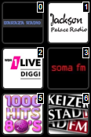

# 基于 JSON/RPC 协议的 ioBroker Logitech/Lyrion Squeezebox 适配器
**测试：** 

这是一个替代适配器，它使用 `JSON/RPC` 协议获取数据并向 Logitech Media Server/Lyrion Media Server ([学习管理系统](https://de.wikipedia.org/wiki/Lyrion_Music_Server)) 发送命令，以控制连接的设备，例如

- 原生[squeezebox](https://de.wikipedia.org/wiki/Squeezebox),
- 树莓派，配备额外的音频模块和基于Linux的小型固件

类似[picoreplayer](https://picoreplayer.org/) 或 [max2play](https://picoreplayer.org/)](https://www.max2play.com)。

- WiiM 多房间音频（[可以与 LMS/Lyrion 服务器通信](https://faq.wiimhome.com/en/support/solutions/articles/72000610226-how-to-stream-music-from-lms-to-your-wiim-device-with-squeezelite)）
- 带有插件的 Chromecast、AirPlay 或 `UPnP/DLNA` 设备

服务器 `LMS` 可以管理/提供硬盘上的海量音乐收藏，或者 `NAS` 可以连接到不同的流媒体服务提供商，例如 `Spotify`、`Deezer`、`Soundcloud`、`shoutcast`、`tunein`、`napster`、`pandora`、`tidal` 等等。

＃＃ 特征
LMS 服务提供的大部分 [数据](#server) 都可通过适配器获取。
- 关于玩家状态、歌曲名称、艺术家等详细信息（#players）：

专辑、封面、播放列表

- [多种控制功能](#provided-states)，用于播放、暂停、停止、快进等

倒带、重复播放、随机播放、播放收藏夹、跳转到指定时间（绝对和相对）、跳转到播放列表索引（绝对和相对）、电源开/关和预设按钮

- 服务器中的所有收藏夹（#favorites）及其所有子级别
- iobroker-vis 组件包含许多 [widgets](#widgets)\

创建自定义控制用户界面（选择播放器、选择收藏夹、管理同步组、播放/暂停、快进、快退、重复模式和随机播放模式选择按钮）

＃＃ 安装
安装软件包
- 创建实例
- 使用罗技/Lyrion媒体服务器的IP地址配置实例

以及端口（通常为 9000）

- 启动/重启实例

＃＃ 更新
安装或更新后，有时可能需要

如果 vis-1 出现问题，请执行以下命令

`iobroker upload squeezeboxrpc`

## 故障排除
### SLIMP3 播放器
据报道，较旧的 SLIMP3 播放器在适配器搜索新服务器时可能无法连接到服务器。禁用“实例配置 -> 性能设置 -> 搜索其他 LMS 服务器”下的搜索功能应该可以解决此问题。

## 提供的状态
＃＃＃ 服务器
| 状态 | 描述 |
| ------------------ | ----------------------------- |
| `LastScan` | 上次音乐扫描的时间戳 |
| `PlayerCountOther` | 已知其他玩家数量 |
| `PlayerCountSN` | 已知 SN 玩家数量 |
| `TotalAlbums` | 所有已知专辑的数量 |
| `TotalArtists` | 所有已知艺术家的数量 |
| `TotalDuration` | 所有歌曲播放时长总和 |
| `TotalGenres` | 所有已知流派的数量 |
| `TotalSongs` | 所有已知歌曲的数量 |
| `SyncGroups` | 现有同步组 |
| `Version` | `LMS` 的版本 |
| `mac` | 服务器的 MAC 地址 |
| `uuid` | `LMS`实例的uuid |
| `uuid` | `LMS` 实例的 uuid |

此外，还添加了一个用于刷新收藏夹的按钮。

| 按钮 | 描述 |
| -------------- | --------------------------------- |
| `getFavorites` | 从服务器请求所有收藏夹 |

### 收藏夹
每个收藏夹的所有属性均为只读

| 状态 | 描述 |
| ---------- | ------------------------------------------ |
| `Name` | 最喜欢的名字 |
| `id` | 收藏夹的 ID |
| `image` | 如有，请添加收藏夹图片/图标 |
| `isaudio` |音频 |
| `type` | 示例类型：链接、文本、音频、播放列表 |
| `url` | 曲目网址 |
| `url` | 曲目网址 |

收藏夹的所有子级别（子目录）均可访问。

### 玩家
对于每个玩家，该模式会显示您是否可以更改该值。所采取的操作在属性中进行了描述。

| 状态 | 模式 | 描述 |
| ---------------------- | ---- | -------------------------------------------------------------------------------------------------------------------- |
| `Alarms` | R/- | 此玩家所有已注册的警报（JSON 格式） |
| `Artist` | R/- | 艺术家姓名 |
| `ArtworkUrl` | R/- | 作品网址 |
| `Bitrate` | R/- | 音轨比特率 |
| `Connected` | R/- | 玩家连接状态 (0/1) |
| `Duration` | R/- | 曲目时长 |
| `Genre` | R/- | 曲目类型 |
| `IP` | R/- | 玩家的 IP 地址 |
| `Mode` | R/- | 播放/暂停/停止 |
| `Playername` | R/- | 玩家姓名 |
| `PlayerID` | R/- | 玩家 ID |
| `Playlist` | R/- | 实际播放列表（JSON 格式） |
| `PlaylistCurrentIndex` | R/W | 通过指定轨道索引跳转到绝对位置，或使用开头的 + 或 - 跳转到相对位置。例如 10,-3,+2 |
| `PlaylistRepeat` | 读/写 | 重复播放歌曲(1)/播放列表(2)/不重复播放(0) |
| `PlaylistShuffle` | 读/写 | 随机播放列表(1)/随机播放专辑(2)/不随机播放(0) |
| `Power` | 读/写 | 获取/设置玩家电源状态 关闭(0)/开启(1) |
| `RadioName` | R/- | 电台名称 |
| `Rate` | R/- | 歌曲评级 |
| `Remote` | R/- | 如果是远程流 (1) |
| `SyncMaster` | R/- | 同步主控器的 ID/MAC |
| `SyncSlaves` | R/- | 同步组中玩家的 ID/Mac |
| `Time` | R/- | 歌曲播放时间 |
| `Title` | R/- | 歌曲标题 |
| `Type` | R/- | 媒体类型（例如 MP3 收音机） |
| `Url` | R/- | 曲目/流媒体网址 |
| `Volume` | 读/写 | 获取/设置播放器音量（0-100） |
| `state` | 读/写 | 获取/设置播放状态：暂停(0)、播放(1)、停止(2) |
| `状态` | 读/写 | 获取/设置播放状态：暂停(0)、播放(1)、停止(2) |

播放列表会提供以下属性（如果 `LMS` 中存在）。

部分属性取决于歌曲类型（流媒体/文件/...）。所有属性均为只读。

| 属性 | 描述 |
| ------------ | --------------------------------- |
| `Album` | 当前专辑名称 |
| `ArtworkUrl` | 作品网址 |
| `Bitrate` | 音轨比特率 |
| `Duration` | 曲目时长 |
| `RadioName` | 电台名称 |
| `Rate` | 歌曲评分 |
| `title` | 歌曲名称 |
| `Type` | 媒体类型（例如 MP3 收音机） |
| `url` | 曲目/流媒体的 URL |
| `index` | 歌曲在播放列表中的索引 |
| `id` | 歌曲 ID |
| `id` | 歌曲的 ID |

其他自定义按钮：

| 按钮 | 说明 |
| ----------------- | ----------------------------------------------------------------------------------------------------------------------------------------------------------------- |
| `btnForward` | 下一首歌 |
| `btnPreset\_\*` | 1-6 个按钮，可在玩家或服务器中定义 |
| `cmdGeneral` | 用于向玩家发送命令的通用命令字段。每个字段必须用引号括起来。参数之间必须用逗号分隔。例如：“play”,"1" |
| `cmdPlayFavorite` | 要播放收藏曲目，请设置收藏曲目的 ID |
| `cmdPlayUrl` | 播放 URL 示例“<http://50.7.77.114:8101/>;” |
| `cmdGoTime` | 通过指定秒数跳转到绝对位置，或通过在秒数开头添加 + 或 - 来跳转到相对位置。例如 100,-50,+50 |
| `cmdGoTime` | 通过指定秒数跳转到绝对位置，或通过在秒数开头添加 + 或 - 来跳转到相对位置。例如 100,-50,+50 |

#### 关于 LMS 中 TPE2 设置下的数据点说明
根据设置的不同，不同的 MP3 标签会被发送到数据点。

大写字母部分是 MP3 标签的名称。

| 在 LMS 中设置 TPE2 | 艺术家 | 专辑艺术家 | 单曲艺术家 | 乐队 |
| ------------------------------ | ----------- | ----------- | ----------- | ----------- |
| 作为乐队 | 艺术家 | 空白 | 单曲艺术家 | 专辑艺术家 |
| 作为专辑的表演者 | 专辑艺术家 | 专辑艺术家 | 空白 | 空白 |

还应该注意的是，在 LMS 发生更改后，必须重新搜索和索引整个库，并且必须停止并重新播放歌曲，然后 LMS 才能提供其他数据。

### 更多 API 文档
更多信息请访问 CLI 文档：

<https://github.com/oweitman/LMS-CLI-Documentation/blob/master/LMS-CLI.md>

## 小部件
### 播放器按钮栏


您可以使用此小部件选择所有已集成到 Logitech/Lyrion 媒体服务器中的播放器。选择实例后，可用播放器将显示在小部件中。

＃＃＃＃ 属性
| 组 | 属性 | 描述 |
| ----------------------- | --------------- | ---------------------------------------------------------------------------------------------------------------------------------------------------------------------------------------------------------------------------------------------------------------------------------- |
| SqueezeboxRPC 实例 | 常规组 | 选择一个 squeezeboxrpc 适配器实例。此处仅认可这些实例。 |
| 小部件格式 | 常规组 | 您可以在此处选择小部件类型。“formatbutton”类型具有所有功能，并且还可以与 SyncGroup 小部件配合使用。“formatselect”类型是一个简单的选择框。名称可以使用玩家名称或单个文本。 |
| 显示索引 | 常规组 | 可以通过删除按钮的索引来隐藏或更改单个按钮的显示顺序。要隐藏按钮，只需删除相应的索引位置（包括逗号）。如果启用了编辑模式帮助，则在编辑模式下，索引号会显示在相应的按钮上。 |
| 驼峰式命名法换行 | 常规组 | 如果玩家名称采用驼峰式命名法，可以在此处启用换行，使玩家名称在按钮上显示更大。 |
| 编辑模式帮助 | 常规组 | 如果启用此帮助，则相应的按钮上会显示索引号，并且按钮设置中的“透明度”设置无效。 |
| 图片宽度 | 按钮设置 | 按钮的图片宽度 |
| 图片高度 | 按钮设置 | 按钮的图片高度 |
| 透明度 | 按钮设置 | 如果按钮未被激活，则会隐藏在背景中。0 = 完全不可见，1 = 完全可见 |
| 边框宽度 | 按钮设置 | 按钮周围的边框宽度（像素） |
| 边框显示 | 按钮设置 | 边框显示类型，例如：实线、虚线。 |
| 普通边框颜色 | 按钮设置 | 如果按钮未被激活，则显示此颜色。 |
| 按钮边框颜色已激活 | 按钮设置 | 如果按钮已激活，则以这种颜色显示。 |
| 圆角半径 | 按钮设置 | 您可以在此处输入以像素为单位的圆角半径，以设置圆角半径。 |
| 背景颜色 | 按钮设置 | 文本背景颜色 |
| 图片 | 按钮[x] | 您可以在此处单独定义图片。图片优先于文本。 |
| 文字 | 按钮[x] | 此处可单独定义文字。图片优先于文字。 |

### 收藏夹按钮栏


您可以使用此小部件选择您在 Logitech/Lyrion 媒体服务器中创建的所有收藏夹。

选择“播放器”小部件后，可用的收藏夹将显示在该小部件中。

| 组 | 属性 | 描述 |
| ------------------- | --------------- | ----------------------------------------------------------------------------------------------------- |
| 播放器组件 | 常规组 | 选择播放器组件。 |
| 显示索引 | 常规组 | 可以使用索引隐藏单个按钮或按不同顺序显示。 |
| 编辑模式帮助 | 常规组 | 如果启用此帮助，则每个按钮上都会显示索引号。 |
| 图片宽度 | 按钮设置 | 按钮的图片宽度 |
| 图片高度 | 按钮设置 | 按钮的图片高度 |
| 透明度 | 按钮设置 | 如果按钮未被激活，则会隐藏在背景中。0 = 完全不可见，1 = 完全可见 |
| 边框宽度 | 按钮设置 | 按钮周围的边框宽度（像素） |
| 边框显示 | 按钮设置 | 边框显示类型，例如：实线、虚线。 |
| 普通边框颜色 | 按钮设置 | 如果按钮未被激活，则显示此颜色。 |
| 按钮边框颜色已激活 | 按钮设置 | 如果按钮已激活，则以该颜色显示。 |
| 圆角半径 | 按钮设置 | 在此处输入以像素为单位的圆角半径，用于设置圆角。 |
| 背景颜色 | 按钮设置 | 文本背景颜色 |
| 图片 | 按钮[x] | 您可以在此处单独定义图片。图片优先于文本。 |
| 文字 | 按钮[x] | 此处可单独定义文字。图片优先于文字。 |

### 播放按钮


播放按钮用于启动或停止所选播放器上的音乐。要使用此按钮，您必须将其连接到播放器小部件。该按钮自带图形（SVG），您也可以选择自己的图形。

#### 播放按钮的属性
| 组 | 属性 | 描述 |
| ------------- | ------------------ | ------------------------------- |
| 播放器组件 | 常规组 | 选择播放器组件。 |
| 暂停画面 | 常规组 | 暂停画面 |
| 播放图像 | 通用组 | 用于播放的图像 |
| 停止图像 | 通用组 | 停止图像 |
| 填充颜色 | SVG 设置组 | 按钮的填充颜色 |
| 描边颜色 | SVG 设置组 | 边框颜色 |
| 描边宽度 | SVG 设置组 | 边框宽度（像素） |

＃＃＃ 向前


“前进”小部件允许您在当前曲目中快进。如果播放器支持此功能，则可以将该按钮配置为快进特定的时间量。

#### 前进按钮的属性
| 组 | 属性 | 描述 |
| ------------- | ------------- | ---------------------------------------------------------------- |
| 播放器组件 | 常规组 | 选择播放器组件。 |
| 步长 | 常规组 | 指定向前跳过的时间量（以秒为单位）。 |
| 按钮标签 | 常规组 | 可自定义的按钮标签。 |
| 按钮图标 | 常规组 | 选择按钮图标，例如，用于快进的图标。 |

### 倒带


“倒带”组件允许您在当前曲目中快速返回上一曲。与“快进”组件类似，您可以设置一个时间段。

#### 倒带按钮的属性
| 组 | 属性 | 描述 |
| ------------- | ------------- | ------------------------------------------------------------- |
| 播放器组件 | 常规组 | 选择播放器组件。 |
| 步长 | 常规组 | 指定回退的时间间隔（以秒为单位）。 |
| 按钮标签 | 常规组 | 可自定义的按钮标签。 |
| 按钮符号 | 常规组 | 选择按钮符号，例如，返回按钮。 |

＃＃＃ 重复


如果播放器支持此功能，重复播放小部件允许您激活或停用当前曲目或播放列表的重复播放功能。

#### 重复按钮的属性
| 组 | 属性 | 描述 |
| ------------- | ------------- | ------------------------------------------------------------------------------------------- |
| 播放器组件 | 常规组 | 选择播放器组件。 |
| 按钮标签 | 常规组 | 可自定义的按钮标签。 |
| 按钮符号 | 常规组 | 选择按钮符号，例如，重复按钮的符号。 |
| 重复模式 | 常规组 | 您可以在此处选择重复模式，例如单曲重复（曲目）或列表重复（播放列表）。 |

### 随机播放


如果播放器支持此功能，随机播放小部件可以启用或禁用当前播放列表的随机播放功能。

#### 随机播放按钮的属性
| 组 | 属性 | 描述 |
| ------------- | ------------- | ------------------------------------------------------- |
| 播放器组件 | 常规组 | 选择播放器组件。 |
| 按钮标签 | 常规组 | 可自定义的按钮标签。 |
| 按钮图标 | 常规组 | 选择按钮图标，例如，随机播放按钮的图标。 |
| 启用状态 | 常规分组 | 启用随机播放时按钮的颜色或样式。 |

＃＃＃ 体积


音量控件显示播放器的当前音量级别，并允许您调节音量。

#### 音量按钮的属性
| 组 | 属性 | 描述 |
| --------------------------- | ------------- | ----------------------------------------------------------------- |
| 播放器组件 | 常规组 | 选择播放器组件。 |
| 音量步长 | 常规组 | 指定增加或减少音量的步长。 |
| 最大音量 | 常规组 | 设置音量的最大值，例如 100。 |
| 成交量柱主色 | 常规组 | 柱状图中代表当前成交量区域的颜色。 |
| 成交量柱背景色 | 常规组 | 成交量柱上未被成交量覆盖区域的颜色。 |
| 按钮图标 | 常规组 | 选择音量控制图标。 |

### 同步组按钮栏


此组件可与播放器组件配合使用，以控制播放器之间的同步。

按钮、标签或图像的数量等大部分设置都由播放器组件接管。

准备工作：您必须将按钮连接到播放器组件。

在播放器组件中选择播放器后，当前同步状态将显示在同步组组件中。

同步状态以各种可调节的颜色显示。

在播放器组件中选择的播放器不能在同步组组件中选择。

如果在同步组组件中选择的播放器已存在于其他组中，则该播放器将自动从当前组中移除。

#### SyncGroup 按钮的属性
| 组 | 属性 | 描述 |
| ----------------------------- | --------------- | ---------------------------------------------------------------------------------------------- |
| 播放器组件 | 常规组 | 选择播放器组件。 |
| 边框宽度 | 按钮设置 | 按钮周围的边框宽度（像素）。 |
| 边框显示 | 按钮设置 | 边框显示类型，例如实线、虚线。 |
| 边框颜色 - 不在群组中 | 按钮设置 | 如果玩家不在群组中，按钮将显示此颜色的边框。 |
| 边框颜色 - 组内 | 按钮设置 | 如果玩家与所选玩家同组，则按钮会显示此颜色的边框。 |
| 边框颜色 - 在其他组中 | 按钮设置 | 如果玩家属于其他组，按钮将显示此颜色的边框。 |
| 圆角半径 | 按钮设置 | 在此处输入以像素为单位的圆角半径，用于设置圆角。 |
| 背景颜色 | 按钮设置 | 文本背景颜色。 |

### 游戏时间栏


播放进度条以可视化的方式显示当前播放歌曲的进度，前提是服务器提供总播放时长（时长）。在线流媒体通常不提供总播放时长。进度条的宽度对应于歌曲播放时长的 100%。点击进度条上的某个点，即可跳转到歌曲的相应位置。为此，您必须将按钮连接到播放器组件。

#### 游戏时间栏的属性
| 组 | 属性 | 描述 |
| -------------- | ------------- | --------------------------------------------------------------- |
| 播放器组件 | 常规组 | 选择播放器组件。 |
| 条形图主色 | 通用组 | 尚未播放时间的条形图背景色。 |
| 游戏时间颜色 | 总体分组 | 表示游戏时间的条形图颜色。 |
| 边框宽度 | 常规组 | 按钮周围的边框宽度（以像素为单位）。 |
| 边框显示 | 常规组 | 边框显示类型，例如：实线、虚线。 |
| 边框颜色 | 常规组 | 条形图边框的颜色。 |
| 边框半径 | 常规组 | 可在此处输入以像素为单位的圆角半径。 |

### 字符串/字符字符串


显示玩家专属的字符串。准备工作：您必须将按钮连接到玩家控件。

#### 字符串的属性
| 组 | 属性 | 描述 |
| ---------------- | ------------- | ----------------------------------------------------------------- |
| 播放器组件 | 常规组 | 选择播放器组件。 |
| 球员属性 | 常规组 | 球员所有可用属性的选择列表。 |
| 测试文本 | 常规组 | 用于测试目的，应在编辑器中显示的文本。 |

＃＃＃ 数字


显示数字并提供其他格式选项。为此，您必须将按钮连接到播放器控件。

#### 数字的属性
| 组 | 属性 | 描述 |
| --------------------- | ----------------- | ----------------------------------------------------------------- |
| 播放器组件 | 常规组 | 选择播放器组件。 |
| 球员属性 | 常规组 | 球员所有可用属性的选择列表。 |
| 添加 HTML 前缀 | 常规组 | 放置在数字前面的文本或 HTML 代码。 |
| 附加 HTML | 常规组 | 附加到号码的文本或 HTML 代码。 |
| 测试文本 | 常规组 | 用于测试目的，应在编辑器中显示的文本。 |
| 逗号后的字符数 | 高级设置 | 小数位数 |
| 以逗号分隔 | 高级设置 | 使用逗号分隔小数位。 |
| 千位分隔符 | 高级设置 | 对于较大的数字，每隔 3 位插入一个分隔符。 |

### 播放列表


显示服务器上的播放列表。点击其中一项即可加载播放列表并启动播放器。

窗口不会自动刷新，您需要点击刷新按钮。

#### 播放列表属性
| 组 | 属性 | 描述 |
| ------------- | ------------- | ------------------------------- |
| 播放器组件 | 常规组 | 选择播放器组件。 |

该组件本身几乎没有任何格式设置。

对于自定义格式，有一些预定义的 CSS 类：

| CSS类 | 描述 |
| ----------- | ----------------------------------------- |
| plcontainer | 分配给 ul 标签的类名 |
| 大量 | 分配给 li 标签的类名 |
| plrefresh | 分配给 refresh-li 标签的类名 |
| pltext | 分配给播放列表名称的类名 |

以下 vis-css 选项卡的 CSS 代码可作为示例：

深色模式

```css
.plentry {
    border: 1px #505050 groove;
    margin: 1px 0px;
    padding: 5px;
    background-color: #202020;
}
.plrefresh {
    padding: 5px;
}
.plentry:hover {
    background-color: #404040;
}
.plrefresh svg {
    color: #cccccc;
}
.plrefresh svg:hover {
    color: #ffffff;
    filter: drop-shadow(0px 0px 1px #87ceeb);
}
```

浅色模式

```css
.plentry {
    border: 1px #b0b0b0 groove;
    margin: 1px 0px;
    padding: 5px;
    background-color: #c0c0c0;
}
.plrefresh {
    padding: 5px;
}
.plentry:hover {
    background-color: #e0e0e0;
}
.plrefresh svg {
    color: #444444;
}
.plrefresh svg:hover {
    color: #000000;
    filter: drop-shadow(0px 0px 1px #87ceeb);
}
```

### 浏览器


显示服务器上的音乐、专辑、艺术家、电台、应用等内容。

点击某个项目即可深入浏览层级结构。可用命令会以附加按钮的形式显示。

点击顶部显示的路径即可返回上一级。

#### 浏览器属性
| 组 | 属性 | 描述 |
| --------------------- | ------------- | ------------------------------------------------------------------- |
| 播放器组件 | 常规组 | 选择播放器组件。 |
| 调试 | 常规组 | 启用浏览器控制台中的额外调试（函数引用）。 |
| debugwithfetchresults | 常规组 | 启用浏览器控制台中的额外调试（对象引用）。 |

该组件本身有一些格式设置。

对于自定义格式，有一些预定义的 CSS 类：

| CSS类 | 描述 |
| ------------------------------------------ | ------------------------------------- |
| sqbrowser-list-container | 小部件的容器 |
| sqbrowser-parent-directory | 用于显示父目录的元素 |
| sqbrowser-btn-svg | 所有 SVG 按钮的类 |
| sqbrowser-btn-svg-menu | SVG 菜单类 |
| sqbrowser-scrollable-area | 滚动容器类 |
| sqbrowser-list-item | 单个项目类 |
| sqbrowser-list-item-content | 项目标题类 |
| sqbrowser-button-group | 列表项中按钮组的类 |
| sqbrowser-btn-svg sqbrowser-btn-svg-action | 操作按钮类 |

**关于此组件的 alpha 通道状态的说明：**

- 将 LMS/Lyrion 集成到浏览系统中简直是噩梦。
此小部件的技术模型是“Material”主题插件。

在 LMS/Lyrion 服务器上。

- 并非所有功能都已实现。
- 并非所有输入字段类型都可用。
- 并非所有物品类型都已实现。
- 添加了可选的、全面的调试输出以供分析（另请参阅属性）。
- 函数引用输出：所有函数名称均输出。

在浏览器控制台中输入命令。

- 数据参考输出：所有请求和返回的数据

服务器输出的结果。

如果测试人员遇到错误/问题或缺少实现，请提供尽可能详细的描述：

LMS/Lyrion中的数据来自哪里？

（已内置服务/额外安装的插件）

- 导致此问题的具体步骤/点击操作是什么
- 什么是函数引用和数据引用？

## 发送至命令
### CmdGeneral
可以使用此命令向 LMS 服务器发送任何命令以接收响应。

例子：

**所有播放列表：**

```js
async function main() {
    let data = await sendToAsync('squeezeboxrpc.0', 'cmdGeneral', {
        playerid: '',
        cmdArray: ['playlists', '0', '999', 'tags:us'],
    });
    console.log(JSON.stringify(data));
}
main();
```

**所有收藏：**

适配器内部使用此命令来加载收藏夹。

```js
async function main() {
    let data = await sendToAsync('squeezeboxrpc.0', 'cmdGeneral', {
        playerid: '',
        cmdArray: ['favorites', 'items', '0', '999', 'want_url:1', 'item_id:'],
    });
    console.log(JSON.stringify(data));
}
main();
```

更多选项和参数详细说明请参见以下 CLI 文档：

[CLI 文档](#further-api-documentation)

## 待办事项
- 更多测试/修复
- 减少对其他软件包（squeezenode）的依赖
- 更多配置选项，可选择开启/关闭某些功能，以提高内存和性能
- 添加播放列表小部件
- 添加浏览小部件，以便在 `LMS` 菜单中浏览
- 添加玩家可控圆形旋钮控件
- 如果再次按下收藏按钮，则停止播放。
- 服务器通用命令。
- ~~添加 telnet 通信以从服务器获取推送事件\

优化轮询~~

- ~~实现命令状态，用于放置用户自定义命令（通过 JSON）\

服务器和玩家专用~~

- ~~实现更多控制功能（选择播放列表播放位置、快进、快退等）

跳转到歌曲的某个时间点、重复播放歌曲、随机播放歌曲）~~

将播放列表以 JSON 数组的形式添加到播放器数据中
- ~~为收藏添加图片（电台标志/播放列表封面）~~
- ~~实现更多层级（子目录）的收藏夹~~
- ~~自动发现罗技媒体服务器~~

## Changelog

<!--
  Placeholder for the next version (at the beginning of the line):
   ### **WORK IN PROGRESS**

-->

### **WORK IN PROGRESS**

- test remove node 18,extend to node 24

### 1.6.2 (2025-05-05)

- fix node version in github workflow

### 1.6.1 (2025-05-05)

- Fix eslint

### 1.6.0 (2025-05-05)

- upgrade dependency js-controller
- new widget, but only alpha version for testing and improvement
- fix issues of adapter checker

### 1.5.2 (2024-12-16)

- fix spelling of iobroker upload squeezeboxrpc in readme
- fix playtime bar

### 1.5.1 (2024-11-29)

- improve documentation
- remove margin from plcontainer
- improve textoverflow with ellipsis
- adjust initial widgetsize of playlist widget
- repair attributes for playlist widget
- add light mode css for playlist widget

### 1.5.0 (2024-11-28)

- Switch to iobroker/eslint
- New widget playlist

### 1.4.0 (2024-11-27)

- fix some missing objects errors
- sanitize more playernames in syncgroups
- add sendTo Command "cmdGeneral"
- sanitize more the playername
- improve translation
- if trackartist is avail then write to artist if empty
- improve handling for artwork_url
- move widget documentation from html to markdown
- adjust responsive tab style
- improve attribute widgets
- change TPE2 handling once more
- jsonConfig add sizing options for differenz screen sizes
- test implementation of TPE2 handling. switch in settings
- add datapoints album_artist, track_artist, artistOriginal

### 1.3.17 (2024-10-23)

- add edit button to the vie index field of favorites widget

### 1.3.16 (2024-10-23)

- fixed icons of the favorites widget

### 1.3.15 (2024-08-09)

- due to a adapter checker issue i have to remove the release 1.3.13 from npm.
  but changes from 1.3.13 are included in 1.3.14

### 1.3.14 (2024-08-05)

- fix formatting

### 1.3.13 (2024-08-05)

- revert the fix for artist handling due to negative effect of spotify

### 1.3.12 (2024-08-05)

- improve cmdGoto handling by kairauer, close PR #74
- fix issues from adapter checker
- integrate squeezenode lib

### 1.3.11 (2024-08-05)

- update adapter structure and switch to jsonconfig

### 1.3.10

- getalbumartist as artist if setting of TPE2/TPE3 in `LMS` are changed"

### 1.3.9

- fix error with deleting favorites
- fix wrong type for datapoint

### 1.3.8

- fix forward button widget

### 1.3.7

- fix object creation of states in player modul

### 1.3.6

- fix object creation of states

### 1.3.5

- fix object creation for favorites

### 1.3.4

- fix object creation for favorites / \* center widgets in sidebar

### 1.3.3

- repair imageproxy for image datapoints of favorites

### 1.3.2

- fix for Alarm contains only enabled Alarms

### 1.3.1

- fix problem with git dependency url

### 1.3.0

- fix problem wit setting own icon in player widget / \* add infos about\
   alarms to a player datapoint

### 1.2.1

- fix small issue in last version

### 1.2.0

- improve handling of imageproxy artwork

### 1.1.0

- make request of favorites configurable

### 1.0.1

- change setstate/createobject logic
- fix role and type for Mode-state
- update tests
- update dependency versions
- improve io-package.json

### 1.0.0

- prepare for stable repository

### 0.8.32

- the adapter function iobroker.deleteChannel didnt works as expected.\
   It didnt delete the whole subtree of states. now i implement my own delete function

### 0.8.31

- change behaviour of deleting favorites

### 0.8.30

- change from the issue of the adapter checker

### 0.8.29

- optimize handling of player state power and connected

### 0.8.28

- add advanced signaling function with telnet and fix some more authorization\
   issues with `LMS`

### 0.8.27

- initialization for the new calctype property if empty in volumebar

### 0.8.26

- more improvement and fixing at volumebar / remove playlist widget from\
   master. not ready yet

### 0.8.25

- fixing css-settings on volumebar

### 0.8.24

- volumebar didnt get events between the segments, change clickevent and calculation

### 0.8.23

- adjust dependencies to remove vulnerabilities in dependend packages.\
   also remove travis due of unresolvable build-failures for win+node10/12

### 0.8.22

- due to iobroker.controller 2.0 a command in the api changed (socket to vis.conn.\_socket)

### 0.8.21

- add command für playing urls

### 0.8.20

- remove node v6 test setting

### 0.8.19

- shorten news history

### 0.8.18 (2019-06-27)

- last minute changes.

### 0.8.17 (2019-06-26)

- add more widges: playtime bar, string, number, datetime, image.\
   add button margin to player and favorite widget, improve editing of viewindex.\
   do some refactoring.

### 0.8.16 (2019-06-24)

- resolve a cross browser issue for firefox. the style.\
   font attribute is empty and you have to construct the font string by yourself

### 0.8.15 (2019-06-19)

- minor issue with not ready states

### 0.8.14 (2019-06-19)

- add syncgroups as new server-datapoint,add syncgroup widget,/
  change some jquery event logic

### 0.8.13 (2019-06-16)

- rename widgetset from squeezeboxrpcwidgets to squeezeboxrpc

### 0.8.12 (2019-06-16)

- sync version with npm

### 0.8.11 (2019-06-15)

- try to integrate the widgets into the main adapter

### 0.8.10 (2019-05-15)

- another try to fix the EADDRINUSE error of the server discovery

### 0.8.9 (2019-05-15)

- try to fix the EADDRINUSE error of the server discovery

### 0.8.8 (2019-05-14)

- make discover configurable

### 0.8.7 (2019-05-11)

- more control features (select playlist pos to play,ffwd,frew,jump to/
  a time position in song,repeat song,random song)

### 0.8.6 (2019-05-10)

- move some configuration options into seperate tabs

### 0.8.5 (2019-05-08)

- change serverdiscovery interval method, remove some double cmd lines,/
  additional minor changes advised from eslint

### 0.8.4

- move some files to lib directory

### 0.8.3

- close port for discovery on unload

### 0.8.2

- sync version with npm

### 0.8.1

- set compact mode flag

### 0.8.0

- implementation of compact mode, change version to represent a realistic/
  feature completness

### 0.0.9

- debug options are now configurable

### 0.0.8

- More playlist attributes + remove trailing and leading spaces from source

### 0.0.7

- Add the playlist to each player as json

### 0.0.6

- More config options

### 0.0.5

- All levels/subdirectories of favorites are now available in iobroker

### 0.0.4

- added the cmdPlayFavorite for each player

### 0.0.3

- repair the no-data symbols for buttons in vis

### 0.0.2

- added autodiscovery

### 0.0.1

- initial release

## License

MIT License

Permission is hereby granted, free of charge, to any person obtaining a copy
of this software and associated documentation files (the "Software"), to deal
in the Software without restriction, including without limitation the rights
to use, copy, modify, merge, publish, distribute, sublicense, and/or sell
copies of the Software, and to permit persons to whom the Software is
furnished to do so, subject to the following conditions:

The above copyright notice and this permission notice shall be included in all
copies or substantial portions of the Software.

THE SOFTWARE IS PROVIDED "AS IS", WITHOUT WARRANTY OF ANY KIND, EXPRESS OR
IMPLIED, INCLUDING BUT NOT LIMITED TO THE WARRANTIES OF MERCHANTABILITY,
FITNESS FOR A PARTICULAR PURPOSE AND NONINFRINGEMENT. IN NO EVENT SHALL THE
AUTHORS OR COPYRIGHT HOLDERS BE LIABLE FOR ANY CLAIM, DAMAGES OR OTHER
LIABILITY, WHETHER IN AN ACTION OF CONTRACT, TORT OR OTHERWISE, ARISING FROM,
OUT OF OR IN CONNECTION WITH THE SOFTWARE OR THE USE OR OTHER DEALINGS IN THE
SOFTWARE.

Copyright (c) 2019-2025 oweitman