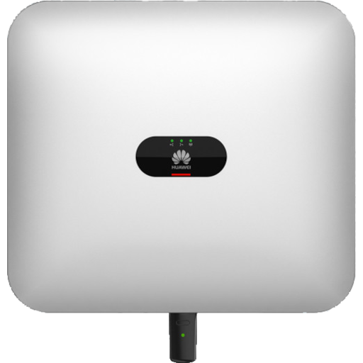

# IoBroker.sun2000-modbus
 

**此适配器使用 Sentry 库自动向开发人员报告异常和代码错误。**\ 有关更多详细信息以及如何禁用错误报告的信息，请参阅[Sentry 插件文档](https://github.com/ioBroker/plugin-sentry#plugin-sentry)!\ Sentry 报告从 js-controller 开始使用3.0。

## IoBroker 华为 SUN2000 逆变器适配器
使用Modbus TCP读取华为SUN2000逆变器和LUNA2000存储的数据。

华为产品页面：[华为太阳能网](https://solar.huawei.com/at/professionals/all-products)

## 文档
请参阅[文档页](./docs/README.md)

## Changelog

### **WORK IN PROGRESS**

* ...

### 0.1.2 (2024-03-11)

* Add update interval to state description
* Update of  fixed 
* Fixed battery temperature gain (Reg: 37022, 'storage.batteryTemperature')

### 0.1.1 (2024-03-11)

* Fixed setting connected flag

### 0.1.0 (2024-03-10)

* [#34](https://github.com/daolis/ioBroker.sun2000-modbus/issues/34) Added Battery registers: totalCharge, totalDischarge, batteryTemperature
* [#32](https://github.com/daolis/ioBroker.sun2000-modbus/issues/32) Fixed: No data for ChargePower and CurrentDayChargeCapacity
* [#20](https://github.com/daolis/ioBroker.sun2000-modbus/issues/20) Read alarm registers from inverter (alarms = bits, alarmsJSON = json array with alarms (name, id, level))
* [#29](https://github.com/daolis/ioBroker.sun2000-modbus/issues/29) Added PVn Voltage and Current for available PV Strings 
* Added initial documentation - WIP
* [#26](https://github.com/daolis/ioBroker.sun2000-modbus/issues/26) Renamed stateOfCapacity to stateOfCharge\
  Migration of historical data: see [Migration of historical data (on state name change)](docs/migration.md)
* Blocked reading of registers - faster when fetching data from inverter

### 0.0.2 (2024-01-08)

* Added storage CurrentDayChargeCapacity and CurrentDayDischargeCapacity
* Changes from [Add sun2000-modbus to latest](https://github.com/ioBroker/ioBroker.repositories/pull/3038)

### 0.0.1 (2023-11-26)

* (daolis) initial release

## License
MIT License

Copyright (c) 2024 daolis <stephan.bechter@gmail.com>