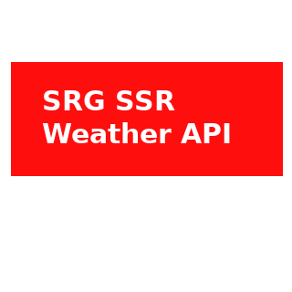
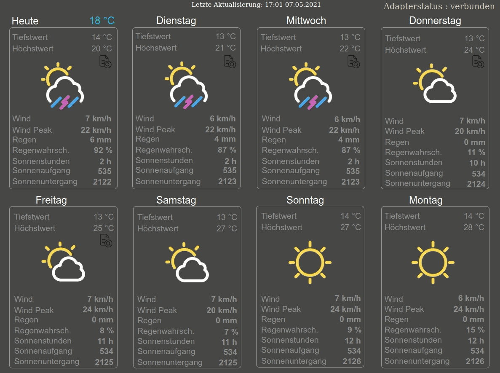

# IoBroker.swiss-weather-api
**将程序版本 1.0.1 更新为 1.0.x**

- 只需在 ioBroker 中更新。无需特殊的额外步骤

**将程序版本 1.0.0 更新为 1.0.1**

- 使用 1.0.1 版我正在修复问题 https://github.com/baerengraben/ioBroker.swiss-weather-api/issues/57
- 基于 [this](https://forum.iobroker.net/topic/46975/vis-widgethintergrund-farbe-durch-objektdatenpunkt-steuern) 的讨论，ID 中不允许使用冒号。因此，我删除了用于小时的冒号，没有替换，也省略了秒。例如旧 01:00:00 => 新 0100)

此更改使得必须重新生成 ID。因此，要安装 1.0.1 版，必须完全删除当前运行的适配器实例并替换为新实例。

- 因为 ID 随版本 1.0.1 发生变化，所以视觉视图也必须进行调整。您可以在 [此处](https://github.com/baerengraben/ioBroker.swiss-weather-api/tree/master/views) 获取更新的视图并将它们导入 ioBroker-Visu。

**更新程序版本 0.3.2 至 0.9.x** SRG 已完全重建其 API。不再支持旧 API（<= 适配器版本 0.3.2）。从适配器版本 0.9.x 开始，使用 SRG 的新 API。这就是为什么必须创建一个新的 SRG APP（例如产品“免费增值”）（https://developer.srgssr.ch/apis/srf-weather）。另请参阅自述文件，“入门”一章（下文）。另请注意，新 API 还将创建全新的对象。
好消息是新的 API 还提供了更多数据。 ;)**

所以我对从 0.3.2 更新到 0.9.x 的建议是：

- 在安装 0.9.x 版之前移除旧适配器。
   - 请注意，数据对象也将相应地被删除。
- 在 srg 开发者门户 (https://developer.srgssr.ch/apis/srf-weather) 上创建一个新的免费增值应用
- 安装新版本 0.9.x 并使用新的 consumerkey 和 consumersecret 设置配置
  - 在启动时，新的适配器将创建新的、不同的数据对象。

## IoBroker 的 swiss-weather-api 适配器
连接到很棒的 SRF 天气 API (https://developer.srgssr.ch/apis/srf-weather)。
SRF Weather REST API 允许您从瑞士各地的 25.000 多个地点获取天气预报和报告。 “免费增值”订阅允许您每天获得 50 个请求。

##**图标**
从 0.1.8 版开始，SRG-SSR 提供了自己的图标。因此，每个数据点都提供了一个指向相应天气情况的 URL（颜色、深色和浅色图标）。

##**请注意，此适配器仅支持瑞士境内的位置。**
＃＃＃ 入门
1. 在 https://developer.srgssr.ch/ 获得免费账户
1. 前往“我的应用程序”并创建一个新应用程序。在这里您可以选择一个产品。 “免费增值”是他们的免费产品。如果您只想每天（每 30 分钟）执行 50 个请求或/并且不想为每天更多的请求付费，那么您要选择“免费增值”。现在，这将创建一个特定的 ConsumerKey 和 ConsumerSecret
1. 找出需要预测的所选位置的经度/纬度（十进制度数）。如果您在 ioBroker 设置（主要设置）（通过地图）中设置了您的位置，则此信息是可选的。在这种情况下，您可以将纬度和经度字段留空。然后适配器接管 ioBroker 的设置。在适配器配置中输入的纬度和经度会覆盖 ioBroker 设置。
1. 在 ioBroker 上安装此适配器 => 这可能需要几分钟（在 Raspberry Pi 3 上大约需要 7 分钟）
1.在Adapter Configuration填写
   1. 应用名称
   1. App的ConsumerKey
   1. 应用消费者秘密
   1. 需要预测的所选瑞士位置的经度/纬度。 => 请使用十进制度数（例如苏黎世：47.36667 / 8.5）
   1. 以分钟为单位的轮询间隔（默认为 30 分钟 - 50 个请求/天）

第一个查询是在适配器启动后 10 秒进行的。第一次启动后，会根据配置参数（Poll Interval in Minutes）定时执行查询。
predict.current_hour 中的对象将在第一次启动后 30 秒创建，并通过复制 forecast.60minutes 中的相应值每小时更新一次。

### 可视化示例
###### 先决条件：
* Adapter [Material Design Widgets](https://github.com/Scrounger/ioBroker.vis-materialdesign) >= 0.5.7
* 适配器 [Vis](https://github.com/iobroker/iobroker.vis/blob/master/README.md)
* [导入视图到 Vis](https://github.com/baerengraben/ioBroker.swiss-weather-api/tree/master/views)

＃＃＃＃＃＃ 例子

## Changelog

### 1.0.2
* (baerengraben) Fixing https://github.com/baerengraben/ioBroker.swiss-weather-api/issues/51
* (baerengraben) Fixing https://github.com/baerengraben/ioBroker.swiss-weather-api/issues/53

### 1.0.1
* (baerengraben) Fixing https://github.com/baerengraben/ioBroker.swiss-weather-api/issues/57
This change makes it necessary to regenerate IDs. So, to install version 1.0.1, the currently running adapter instance must be completely removed and replaced with a new instance.

### 1.0.0
* (baerengraben) Bugfix https://github.com/baerengraben/ioBroker.swiss-weather-api/issues/64  

### 0.9.9
* (baerengraben) Workaround for SRG Certificate Problem: https://github.com/baerengraben/ioBroker.swiss-weather-api/issues/63  

### 0.9.8
* (jobe451)  Bugfix: JsonChart is missing 15h and 16h as x-labels

### 0.9.7
* (baerengraben)  Bugfix - RC2 for stable release.

### 0.9.6
* (baerengraben)  Bugfix - RC for stable release.

### 0.9.5
* (baerengraben)  Some small improvements

### 0.9.4
* (baerengraben)  Bugfix: https://github.com/baerengraben/ioBroker.swiss-weather-api/issues/47 

### 0.9.3
* (baerengraben)  Function Update: Added day_name to identify weekday from "forecast.day.day0.day_name" to "forecast.day.day7.day_name". 
* (baerengraben)  Added last_run as Object on swiss-weather-api.0.info.lastrun.
* (baerengraben)  Added JsonChart Object on swiss-weather-api.0.forecast.60minutes.day(0-4).JsonChart.
* (baerengraben)  Added some Examples how to do visualisation (folder views) based on https://forum.iobroker.net/topic/32232/material-design-widgets-wetter-view 

### 0.9.2
* (baerengraben)  Function Update: The current weather information is provided as a forecast.current_hour object. Every hour this information is updated. This is done every hour by copying the corresponding values from forecast.60minutes.day0.<current_time>. So no new http request will be executed. The values are only copied from the forecast objects. This makes it easier to display the current weather in the visualization.

### 0.9.1
* (baerengraben)  Fix to reduce amount of Rest-Calls: https://github.com/baerengraben/ioBroker.swiss-weather-api/issues/41
* (baerengraben)  Fix for https://github.com/baerengraben/ioBroker.swiss-weather-api/issues/32 (Crashes when no Internet Connection is available)
* (baerengraben)  Partly Fix for https://github.com/baerengraben/ioBroker.swiss-weather-api/issues/24: Handling Adapter State Info.

### 0.9.0
* (baerengraben)  Removed NodeJs 10 support and added NodeJs 16 support 
* (baerengraben)  Update to new SRF Weater API (https://developer.srgssr.ch/apis/srf-weather). Attention: Old Weather-API (Adapter Version 0.3.2 and earlier) will be decommissioned on Sept. 2021)
* (baerengraben)  Removed Icon-Support from https://erikflowers.github.io/weather-icons/ since SRF is providing their own icons.

### 0.3.2
* (baerengraben)  Fix for https://github.com/baerengraben/iobroker.swiss-weather-api/issues/13.

### 0.3.1
* (baerengraben)  Adapter-Config attributes longitude & latitude is optional now. If no longitude/latitude is set, the adpater is getting the longitude/latitude from ioBroker System-Attributes (https://github.com/baerengraben/iobroker.swiss-weather-api/issues/6).

### 0.3.0
* (baerengraben)  Change from Scheduled Adapter to Deamon Adapter(https://github.com/baerengraben/iobroker.swiss-weather-api/issues/11). The query interval is now configurable by parameter. The first query is made 10s after the adapter was started. Attention: For installing this version, please delete the older adapter version completely and install it again.

### 0.2.3
* (baerengraben) Update Dependencies

### 0.2.2
* (baerengraben) Some bug fixing
* (baerengraben) Enhancement https://github.com/baerengraben/iobroker.swiss-weather-api/issues/10

### 0.2.0
* (baerengraben) Updates in order to commit to iobroker stable

### 0.1.9
* (baerengraben) Dependency- and Vulnerabilites-Updates

### 0.1.8
* (baerengraben) Added Icons provided by SRGSSR => Thank you!! :)
* (baerengraben) Added new Object icon-url-srgssr => Contains the url-link to the srgssr Icon

### 0.1.7
**Attention**: If you have already installed a previous Version of swiss-weather-api (<= 0.1.6) please remove the adapter and install it completely new. This makes shure you get the new Unit-Names for "fff" and "ffx3" which where corrected by SRG. 
* (baerengraben) Added Icon-Codes -17 to -30 => These are not yet confirmed by srf - but I beleave these are correct.  
* (baerengraben) SRG is now providing the correct unit-names for "fff" and "ffx3". Adaptet this in the swiss-weather-adapter. **Attention**: You have to reinstall the swiss-weather-api (remove and install new Version) to make shure the Object-Name gets this Update.

### 0.1.6
* (baerengraben) Some fixes based on Feedback of forum.iobroker.net

### 0.1.5
* (baerengraben) Some fixes based on Feedback of forum.iobroker.net

### 0.1.4
* (baerengraben) Added Travis CI testing

### 0.1.3
* (baerengraben) Role-Definitions updated and added attribute 'icon-name'.

### 0.1.2
* (baerengraben) Some fixes.

### 0.1.0
* (baerengraben) Running version. Reads the complete weather forecast from https://api.srgssr.ch

### 0.0.2
* (baerengraben) first running version. Reads Current Forecast (https://api.srgssr.ch/forecasts/v1.0/weather/current)

### 0.0.1
* (baerengraben) initial release

## License
MIT License

Copyright (c) 2021 baerengraben <baerengraben@intelli.ch>

Permission is hereby granted, free of charge, to any person obtaining a copy
of this software and associated documentation files (the "Software"), to deal
in the Software without restriction, including without limitation the rights
to use, copy, modify, merge, publish, distribute, sublicense, and/or sell
copies of the Software, and to permit persons to whom the Software is
furnished to do so, subject to the following conditions:

The above copyright notice and this permission notice shall be included in all
copies or substantial portions of the Software.

THE SOFTWARE IS PROVIDED "AS IS", WITHOUT WARRANTY OF ANY KIND, EXPRESS OR
IMPLIED, INCLUDING BUT NOT LIMITED TO THE WARRANTIES OF MERCHANTABILITY,
FITNESS FOR A PARTICULAR PURPOSE AND NONINFRINGEMENT. IN NO EVENT SHALL THE
AUTHORS OR COPYRIGHT HOLDERS BE LIABLE FOR ANY CLAIM, DAMAGES OR OTHER
LIABILITY, WHETHER IN AN ACTION OF CONTRACT, TORT OR OTHERWISE, ARISING FROM,
OUT OF OR IN CONNECTION WITH THE SOFTWARE OR THE USE OR OTHER DEALINGS IN THE
SOFTWARE.