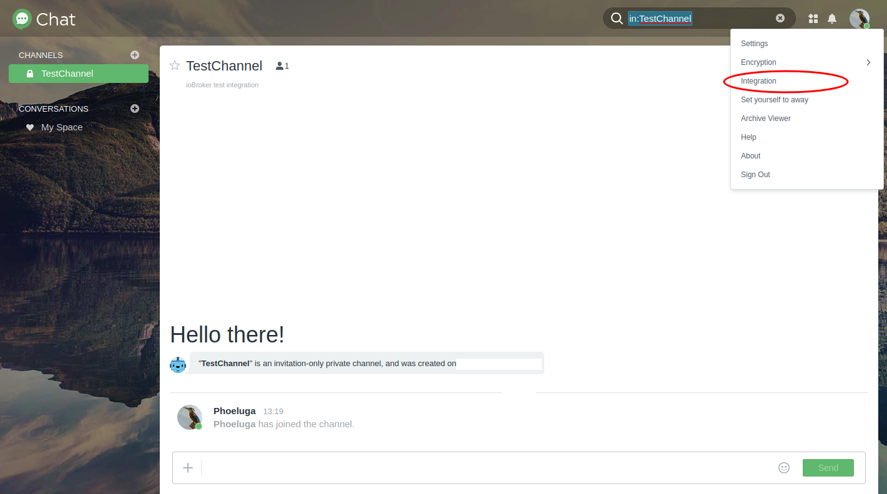
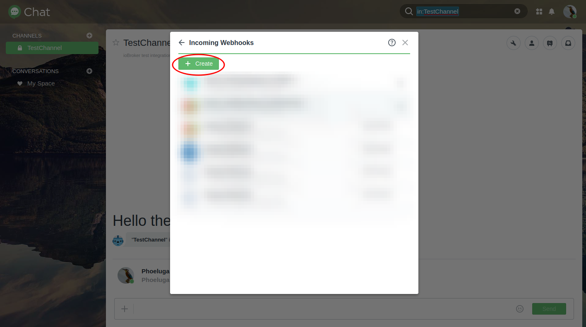
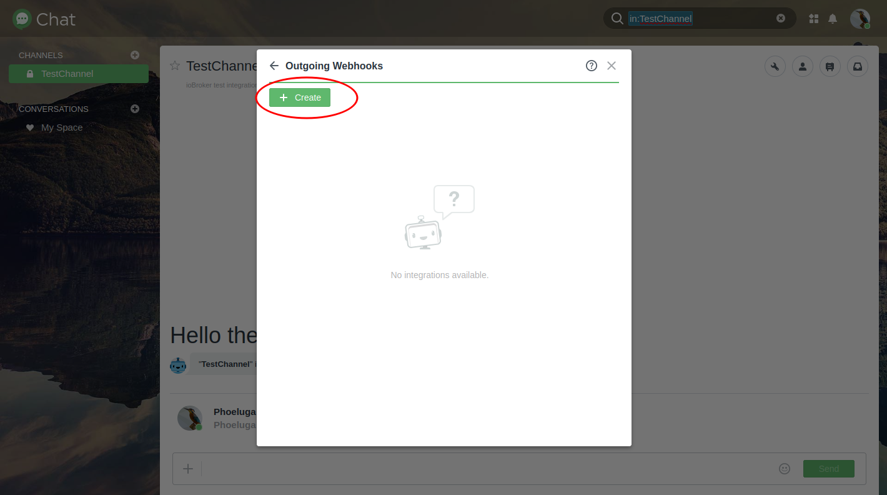

#适用于 ioBroker 的 Synology-Chat 适配器


[![捐赠][捐赠徽章2]][捐赠链接]

＃＃ 它是什么？
此适配器提供 Synology Chat 和 ioBroker 之间的接口。为此，使用 Synology Chat 提供的标准集成功能和相应的 REST API 端点。
传入和传出集成可用于将消息发送到 Synology 聊天服务器或更新 ioBroker 实例中的消息对象以接收消息。

---

＃ 手动的
## 1.安装
该适配器可以从 ioBroker 安装中的适配器部分实例化。
更多信息可以在官方[ioBroker 文档](https://www.iobroker.net/#de/documentation/admin/adapter.md)中找到。

## 2. 配置
<div id="synology-chat-configuration"></div>

### 2.1。 Synology 聊天配置
- Synology Chat 提供了处理传入和传出消息的可能性。下面将更详细地研究这两个选项。

- 要通过 Synology Chat 界面创建消息，必须在 Synology Chat 中创建集成：



  #### 2.1.1。传入集成
为了将传入消息集成到 Synology 聊天中，需要一个令牌，该令牌可以从创建期间生成的 URL 中获取。


<div id="synologyChatConfigurationOutgoingIntegration"></div>

  #### 2.1.1。传出整合
为了将传出消息集成到 Synology 聊天中，需要提供 Web hook URL。实例化 `synochat` 适配器后，您将从实例对象获取此 Web 挂钩 URL。更多详情请参见[3. 使用 > 3.1 概述](#webHookLocation)  

***注：*** *通道类型（传入；传出）是从 Synology 聊天的角度指定的。例如，“传入”表示消息将发送到 Synology 聊天服务器。*

有关如何在 Synology chat 中处理集成的更多详细信息，请参阅 Synology 官方文档[这里](https://kb.synology.com/DSM/help/Chat/chat_integration)

### 2.2。 ioBroker 适配器实例配置
- 该适配器的配置可以在实例设置中完成。

    #### 2.2.1.主要设置：
	

* **Synology URL/IP**

通过此属性，将提供 Synology-Chat 应用程序的 URL。请注意，请使用包含`http://`或`https://`的绝对网址，并且不要提供诸如`/`之类的后缀。
可以像平常一样使用`:` 在 URL 后面提供特定端口。

***有效值示例：***

- https://mychat.mydomain.tld
- https://192.168.1.1:8080

    * **验证 SSL 证书**

当然，始终建议对数据传输进行加密。
通常，自签名证书用于家庭环境中的加密连接。在这种情况下，可能需要禁用 HTTP 连接的 SSL 证书验证。
禁用此属性可关闭证书验证。

* **ioBroker 实例的主机名/IP 地址**

        此属性允许您指定可通过 URL 访问 ioBroker 实例的主机名或 IP 地址。在初始适配器实例化后，该值将自动设置为 ioBroker 安装的主机操作系统的当前 IP 地址。

如果使用 ioBroker 作为 Docker 实例，可能需要更改此值，例如如果使用反向代理或类似代理来访问您的 ioBroker 实例。

该值用于为从 Synology 聊天服务器接收消息的通道生成 Web hook URL。

<div id="configurationAdapterWebInstance"></div>

* **用于从 Synology 聊天发送到 ioBroker 适配器实例的消息的 Web 实例**

        `synochat`适配器正在使用`web`适配器来使Web挂钩可用。您需要选择 `web` 适配器的特定实例，为 Synology 聊天集成提供专用 Web 挂钩。

<div id="channel-configuration"></div>

    #### 2.2.2.频道管理/配置：
	

* **通道已启用**

此选项可用于禁用传入或传出消息的处理。

这可能很有用，例如用户只想暂时禁用通道的使用，并希望保留访问令牌等设置，以防止再次收集它们。

    * **频道名称**

此设置指定消息发送来源/目的地的通道名称。该名称可以自由选择，仅供参考。

此处要配置的频道名称应与 Synology 聊天的频道名称相同。

* **频道令牌**

此设置提供 Synology 聊天频道的访问令牌。根据通道类型的不同，其创建也会有所不同。
更多详细信息请参阅第 [Synology 聊天配置](#synology-chat-configuration) 章。

***注：***\ *根据集成的不同，创建 Synology 聊天集成时，您将获得类似于以下示例的链接：*

https://mychat.mydomain.tld/webapi/entry.cgi?api=SYNO.Chat.External&method=incoming&version=2&token=%22QF5DWyG7M47Ls3cv%22

*在此示例中，令牌包含在 URL 中。编码控制字符 - `%22` - 在设置的开头和结尾处指定。\ **必须删除这些字符！**\ 在此示例中，要输入的标记为 `QF5DWyG7M47Ls3cv`。 *

* **通道类型**

***注：***\ *必须从 Synology 聊天的角度指定频道类型。例如，在配置中选择“传入”意味着消息将发送到 Synology 聊天。*

此设置指定将根据 Synology 聊天中选择的集成使用的 Synology 聊天频道类型。

* **将数据发送到 Synology 聊天服务器 - 传入集成**\

此选项使通道能够在对象值发生更改时立即发送 ioBroker 消息对象 ([参见使用章节](#usage)) 的新值。

        * **从 Synology 聊天服务器获取数据 - 传出集成**\

此选项使通道能够从 Synology 聊天服务器接收消息并更新 ioBroker 消息对象的新值 ([参见使用章节](#usage))。

请注意，使用此通道类型时，ioBroker 适配器实例配置的通道名称必须与 Synology 聊天通道的通道名称相同才能接收消息。

> 注意：请确保不要为传出通道选择“*react on*”选项

如果一个通道需要同时配置发送和接收消息，只需添加第二个同名通道并选择其他通道类型即可。

    * **对象值模板**

如果频道消息对象的值包含 JSON 值，您可以选择一个模板，将该对象值解析为人类可读的值，然后再将其发送到 Synology 聊天频道。

相关消息模板可以在[消息模板](#message-templates)部分配置。

    * **对通知管理器做出反应**

        `synochat`能够接收来自[ioBroker 通知管理器](https://github.com/foxriver76/ioBroker.notification-manager)的消息。此选项允许您选择相应的频道是否应对来自通知管理器的消息做出反应并将其相应地转发到 Synology Chat。

相关消息模板可以在[消息模板](#messageTemplates)部分配置。

    * **对所有 ioBroker 消息作出反应**

除了来自 [ioBroker 通知管理器](https://github.com/foxriver76/ioBroker.notification-manager) `synochat` 的消息之外，还能够接收来自其他适配器的其他消息。此选项允许您选择相应的频道是否应对来自所有其他发件人的消息做出反应并将其相应地转发到 Synology Chat。

适配器实例可以接收消息。这些消息由一个具有多个属性的对象组成，这些属性可以作为参数包含在消息模板中。在发送消息之前，这些参数会被相应地替换。

相关消息模板可以在[消息模板](#message-templates)部分配置。

* **验证 SSL 证书 - 对于非短信**

如果对于传入通道类型要发送文本以外的内容（例如图像），则这是通过 URL 从 HTTP 源指定的。如果此内容附带自签名证书，则可以使用此设置启用或禁用证书检查。
有关发送非文本内容的详细信息，请参阅第 [Synology 聊天配置](#synology-chat-configuration). 章。

<div id="message-templates"></div>

#### 2.2.3。消息模板：
    可以定义在将消息发送到 Synology Chat Server 之前处理的消息模板。这些模板可以包含在发送过程中替换的模式。

	

模式必须始终以 `${` 开头并以 `}` 结尾。例如`${foo}`。处理消息时，模式 `${foo}` 将替换为属性 `foo` 的相应 JSON 值。

**样本：**

如果配置为向 Synology Chat 发送数据的通道收到对其消息对象的对象更改，则它可能包含如下 JSON 值：

	```json
    {
        "sensor": {
            "id": "temp0815",
            "name": "Temperature - Living room",
            "type": "temperature",
            "location": "living room",
            "value": "23.4"
        }
    }
	```

您可以通过在类似 `${sensor.value}` 的路径中提供该值的内部属性来访问它们。

如果您想发送类似 > 客厅温度更改为 23.4°C 的文本

您的消息模板将如下所示：

`The ${type} in the ${location} changed to ${value}°C`

**注意和限制：**

    1. 如果您尝试使用包含点 (`.`) 的键访问属性，则必须使用字符 `/-` 对其进行转义！

    例如如果您的消息对象值如下所示：

```JSON
{
       "category": {
           "instances": {
               "system.adapter.notification-manager.0": {
                   "notification": "Test notification",
               }
           }
       }
   }
```

    并且您想要访问属性`notification`，您的模式将为`${category.instances.system/-adapter/-notification-manager/-0.notification}`

2. 无法访问数组中的特定项。

例如如果您的消息对象值如下所示：

```JSON
{
       "messages": [
           {
           "text": "Lorem"
           },
           {
           "text": "Ipsum"
           }
       ]
   }
```

您无法访问 `message` 对象中的 `text` 属性。在这种情况下，您需要先在此适配器外部准备对象值，然后再将其传递到`synochat`通道消息对象。

* **用于发送通过 ioBroker 通知管理器收到的消息的模板**

        该模板将定义从通知管理器接收到的消息的消息。作为模板中的参数，您可以使用`iobroker.Message`对象和嵌入的Notification-Manager消息对象的属性名称。

内部接收的对象的类型为`iobroker.Message`：

		```javascript
		/** A message being passed between adapter instances */
        interface Message {
            /** The command to be executed */
            command: string;
            /** The message payload */
            message: MessagePayload;
            /** The source of this message */
            from: string;
            /** ID of this message */
            _id: number;
            /** Callback information. This is set when the source expects a response */
            callback: MessageCallbackInfo;
        }
		```

根据描述，通知管理器将提供嵌入在`message`属性中的自己的消息对象，作为`iobroker.Message`的一部分。

您可以使用模式`${message.NOTIFICATION_MANAGER_ATTRIBUTES}`通过`message`属性访问这些数据。

**可用模式：**

* `${command}` - 与 `iobroker.Message` 对象相关的模式
* `${message}` - 与 `iobroker.Message` 对象相关的模式
* `${from}` - 与 `iobroker.Message` 对象相关的模式
* `${_id}` - 与 `iobroker.Message` 对象相关的模式
* `${instances}` - 模式将替换为与通知管理器收到的通知相关的实例列表

        有关 [通知管理器](https://github.com/foxriver76/ioBroker.notification-manager)消息对象可以在[README]中找到](https://github.com/foxriver76/ioBroker.notification-manager) 结构的更多信息。

> 注意：请确保不要为传出通道选择“*react on*”选项

    * **用于发送所有其他收到消息的消息的模板**

        与上述相同的`iobroker.Message`对象用于将各种消息发送到适配器实例。

		```javascript
		/** A message being passed between adapter instances */
        interface Message {
            /** The command to be executed */
            command: string;
            /** The message payload */
            message: MessagePayload;
            /** The source of this message */
            from: string;
            /** ID of this message */
            _id: number;
            /** Callback information. This is set when the source expects a response */
            callback: MessageCallbackInfo;
        }
		```

从该对象本身可以使用以下模式来访问相关属性的值。

**可用模式：**

* `${command}` - 与 `iobroker.Message` 对象相关的模式
* `${message}` - 与 `iobroker.Message` 对象相关的模式
* `${from}` - 与 `iobroker.Message` 对象相关的模式
* `${_id}` - 与 `iobroker.Message` 对象相关的模式

        `${message}` 模式始终包含来自相应发送者的信息。如果消息仅包含`String`，您只需提供模式`${message}`。如果它提供 JSON 值，您还可以通过提供值的路径（如`${message.foo.bar}`）来访问内部属性。

> 注意：请确保不要为传出通道选择“*react on*”选项

    * **模板 1-10 - 应用于特定渠道的模板**

        您还可以向特定通道的消息对象提供 JSON 值。在这种情况下，您最多可以定义十个用户特定模板，可以在将消息发送到 Synology Chat 服务器之前应用这些模板。

可以通过以类似 `${foo.bar}` 的模式提供值的路径来访问 JSON 属性。

模板可以与 [通道配置](#channel-configuration) 中的通道关联。

**可用模式：**

可用模式与将提供给通道消息对象的客户 JSON 值相关。

#### 2.2.4。帮助：
   * 此选项卡通常会重定向到该项目的官方 GitHub 页面，其中给出了详细的帮助和使用说明。
* 如果有任何悬而未决的问题、更改建议、不良行为或错误，请创建 [GitHub 问题](https://github.com/phoeluga/ioBroker.synochat/issues/new/choose) 以确保质量这个项目。

<div id="configurationWebInstance"></div>

### 2.3。 `web`实例的配置
要从 Synology 聊天服务器接收消息，需要配置传出集成 - 请参阅[传出整合](#synologyChatConfigurationOutgoingIntegration)。

这需要在 [配置的“synochat”适配器实例](#configurationAdapterWebInstance) 中运行并配置 `web` 适配器的实例。

如果使用的 `web` 实例配置为通过 HTTPS 使用安全连接，**请确保您提供有效的证书或将您自己的证书导入到 Synology 中的受信任证书**。\ 否则，不会发送任何消息从 Synology 聊天服务器到 ioBroker 适配器实例。
将不会建立通信，遗憾的是，两个站点上都不会直接向用户表明消息因证书无效而被拒绝。

<div id="usage"></div>

## 3. 用法
### 3.1 概述
* 配置适配器实例后，会在相应适配器实例的对象中为每个配置的通道创建一个具有通道名称的文件夹。

	

* 在此文件夹中可以找到相应通道的消息对象，它代表发送或接收的消息。

***注意：***\ *发送消息或用户更改消息对象时，请确保未设置 Ack 标志。 Synology 聊天服务器确认成功收到消息后，适配器将设置 Ack 标志。*\ **如果用户在 ioBroker 对象视图中更改消息值时设置了 Ack 标志，则该消息将不予处理！***

	

* 当消息对象更改且通道类型设置为“将数据发送到 Synology 聊天服务器”时，此消息 - 根据通道类型 - 将传递到 Synology 聊天。

	

<div id="webHookLocation"></div>

* Web 挂钩 URL/地址将作为适配器实例的信息文件夹中的对象值提供，并且对于一个适配器实例的所有通道都有效。

	

### 3.2 消息内容类型
除了发送纯文本消息之外，还可以将其他内容类型（例如图像）发送到传入通道。\为了实现这一点，内容必须作为 Web 资源提供。要发送图像，只需将 URL 设置为第 [3. 使用 > 3.1 概述](#usage) 中提到的 Syno-Chat 适配器实例的消息对象的值即可。

**监控摄像头的用例示例：**\ 许多监控摄像头提供流或接口来检索按指定时间间隔或检测到运动时更新的图像。\ 此 URL 提供需要设置为消息对象的值。

### 3.3 出现问题时的调试
要在出现问题时获取有关适配器行为的更详细信息，您可以将 `synochat` 适配器实例的日志级别提高到 `debug`。

由于此适配器使用 `web` 适配器实例向 Synology 聊天服务器提供 Web 挂钩，因此配置的 `web` 实例正在执行一些功能。为了在接收消息问题时获得更详细的信息，您需要将配置的`web`实例的日志级别也提高到`debug`。与`synochat`适配器相关的日志消息可以通过日志消息前缀`synochat.<INSTANCE_NUMBER>`来标识。

---

## 其他披露
#### 资源归属
- [由 Pixel Perfect - Flaticon 创建的聊天图标](https://www.flaticon.com/free-icons/chat)

[donate-badge]:https://img.shields.io/static/v1?label=Treat%20a%20coffee&message=donate%20a%20tip&color=2a9cde&logo=data:image/svg+xml;base64,PHN2ZyB2aWV3Qm94PSIwIDAgMjQgMjQiIHhtbG5zPSJodHRwOi8vd3d3LnczLm9yZy8yMDAwL3N2ZyI+PHBhdGggZD0iTTcgMjJoMTBhMSAxIDAgMCAwIC45OS0uODU4TDE5Ljg2NyA4SDIxVjZoLTEuMzgybC0xLjcyNC0zLjQ0N0EuOTk4Ljk5OCAwIDAgMCAxNyAySDdjLS4zNzkgMC0uNzI1LjIxNC0uODk1LjU1M0w0LjM4MiA2SDN2MmgxLjEzM0w2LjAxIDIxLjE0MkExIDEgMCAwIDAgNyAyMnptMTAuNDE4LTExSDYuNTgybC0uNDI5LTNoMTEuNjkzbC0uNDI4IDN6bS05LjU1MSA5LS40MjktM2g5LjEyM2wtLjQyOSAzSDcuODY3ek03LjYxOCA0aDguNzY0bDEgMkg2LjYxOGwxLTJ6IiBmaWxsPSIjZWRmMmZhIiBjbGFzcz0iZmlsbC0wMDAwMDAiPjwvcGF0aD48L3N2Zz4=

[donate-badge2]:https://img.shields.io/static/v1?label=Treat%20a%20coffee&message=donate%20a%20tip&color=2a9cde&logo=data:image/svg+xml;base64,PHN2ZyBkYXRhLW5hbWU9IkxheWVyIDEiIHZpZXdCb3g9IjAgMCAzMiAzMiIgeG1sbnM9Imh0dHA6Ly93d3cudzMub3JnLzIwMDAvc3ZnIj48cGF0aCBkPSJNMjYuNSAxNUgyNnYtMWEyIDIgMCAwIDAtMi0ySDJhMiAyIDAgMCAwLTIgMnY2YTEwLjY0IDEwLjY0IDAgMCAwIDExIDExaDRhMTAuNzkgMTAuNzkgMCAwIDAgOS4zMS01aDIuMTlhNS41IDUuNSAwIDAgMCAwLTExWk0xNSAyN2gtNGE2LjcgNi43IDAgMCAxLTctN3YtNGgxOHY0YTYuNzcgNi43NyAwIDAgMS03IDdabTExLjQ0LTQuNzdoLS43OGExMy43NSAxMy43NSAwIDAgMCAuMi0yLjMxdi0xLjE1aC41OGExLjczIDEuNzMgMCAwIDEgMCAzLjQ2Wk0xMyAxMGEyIDIgMCAwIDAgMi0yVjJhMiAyIDAgMSAwLTQgMHY2YTIgMiAwIDAgMCAyIDJaTTIwIDEwYTIgMiAwIDAgMCAyLTJWN2EyIDIgMCAwIDAtNCAwdjFhMiAyIDAgMCAwIDIgMlpNNiAxMGEyIDIgMCAwIDAgMi0yVjZhMiAyIDAgMCAwLTQgMHYyYTIgMiAwIDAgMCAyIDJaIiBmaWxsPSIjZjBmNWZhIiBjbGFzcz0iZmlsbC1iYTYzYzYiPjwvcGF0aD48L3N2Zz4=

[donate-link]: https://www.paypal.com/donate/?hosted_button_id=9MLB29CKX5674

## Changelog
<!--
    Placeholder for the next version (at the beginning of the line):
    ### **WORK IN PROGRESS**
-->
### 1.3.0 (2023-07-23)
- *[@phoeluga]* Added feature to react on messages from Notification-Manager - #9
- *[@phoeluga]* Added feature to react on general received messages sent to the `synochat` adapter instance.
- *[@phoeluga]* Added message templates for received messages from other adapters.
- *[@phoeluga]* Added message templates for object values related to an associated channel.

### 1.2.1 (2022-05-18)
- *[@phoeluga]* The IP family check to determine the local IP address of the ioBroker instance has been adjusted.

### 1.2.0 (2022-05-17)

- *[@phoeluga]* Added enhancement #6 - Delayed sending of messages has been added to work around the limitations of messages sent to the Synology Chat Server in a certain time interval.
- *[@phoeluga]* Regarding #6, a message queue has been added to ensure that the order of messages to be sent is respected when the sending of messages is delayed.
- *[@phoeluga]* Implementation of the [requirements](https://github.com/ioBroker/ioBroker.repositories/pull/1759#issuecomment-1127520995) for adding the adapter in the ioBroker repository - Adding MIT license hint to the Readme.
- *[@phoeluga]* Implementation of the [requirements](https://github.com/ioBroker/ioBroker.repositories/pull/1759#issuecomment-1127520995) for adding the adapter in the ioBroker repository - Moved adapter instance object subscription after initial connectivity check.
- *[@phoeluga]* Implementation of the [requirements](https://github.com/ioBroker/ioBroker.repositories/pull/1759#issuecomment-1127520995) for adding the adapter in the ioBroker repository - Added exception handling to cover https://github.com/nodejs/node/issues/43014 in Nodejs 18
- *[@phoeluga]* Implementation of the [requirements](https://github.com/ioBroker/ioBroker.repositories/pull/1759#issuecomment-1127527703) for adding the adapter in the ioBroker repository - Added axios as dependency in package.json

### 1.1.1 (2022-04-16)

- *[@phoeluga]* Fixed issue #4 - Issue while migrating data from version < 1.1.0
- *[@phoeluga]* Added collecting and loading of default values when loading the initial configuration of the adapter instance
- *[@phoeluga]* The channel search behavior has been adjusted to react accordingly to deactivated channels and to query the remaining channels.

### 1.1.0 (2022-04-14)

- *[@phoeluga]* Added the ability to manage multiple channels in one adapter instance per Synology chat server.
- *[@phoeluga]* A possibility of ioBroker hostname / IP address configuration has been introduced.\
(May be helpful when using an ioBroker Docker instance).
- *[@phoeluga]* A functionality to receive incoming messages from the Synology chat server using WebHooks has been added.\
(An instance of the web adapter is required to use this feature)
- *[@phoeluga]* The translation of the UI properties was added.
- *[@phoeluga]* Added function to migrate channel data from an older version to a new channel object in the list approach.
- *[@phoeluga]* Added possibility for a user to disable dedicated channels from being processed.

### 1.0.1 (2022-04-06)

- *[@phoeluga]* Resolved #1 - Unable to send messages with special characters
- *[@phoeluga]* Resolved #2 - Send images


### 1.0.0 (2022-04-05)

- *[@phoeluga]* Initial release


### 0.0.1 (2022-04-03) - ALPHA

- *[@phoeluga]* Start of development

## License

This code is licensed under 'The MIT License (MIT)' license specified in the [LICENSE](./LICENSE) file.

Copyright (c) 2023 phoeluga <phoeluga@gmail.com>