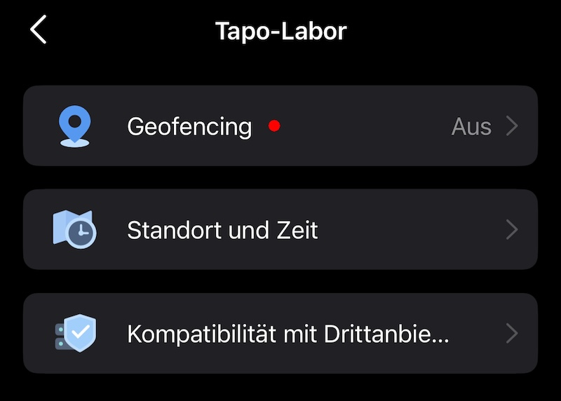
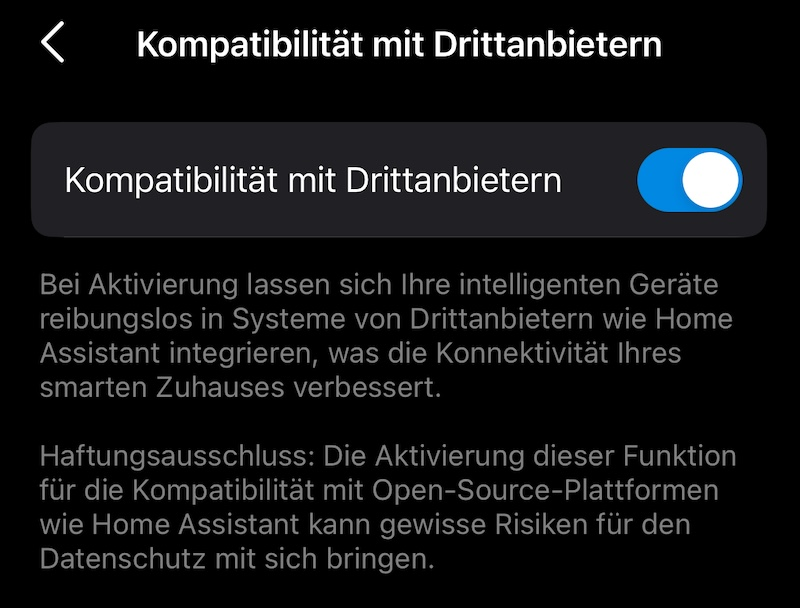

# IoBroker.tapo
**测试：**

## Tapo 适配器用于 ioBroker
TP-Link Tapo 适配器

基于 https://github.com/apatsufas/homebridge-tapo-p100

## 登录
Die Tapo Mail 和 Passwort eingeben。 Es werden die Geräte via Cloud abgerufen, aber lokal gesteuert。
Wenn die IP nicht gefunden wird muss sie manuell unter tapo.0.id.ip gesetzt werden。

## 施托伊恩
tapo.0.id.remote auf true/false setzen steuert den jeweiligen Befehl。 Der Befehl wird lokal and das Gerät gesendet。

## 房屋出租活动

## 讨论和提问
<https://forum.iobroker.net/topic/57336/test-adapter-tp-link-tapo/>

## Changelog
### 0.4.5 (2024-12-16)

- fix camera remotes

### 0.4.4 (2024-12-12)

- improve handshake if e-mail is not entered in lowercase

### 0.4.3 (2024-12-09)

- fix handshake for device with HW v1.20

### 0.4.1 (2024-11-29)

- fixed Get Device Info failed error

### 0.3.4 (2024-11-10)

- update Tapo local lib

### 0.3.3 (2024-06-17)

- ignore ssl legacy error
-

### 0.3.2 (2024-05-27)

update onvif lib to fix issues with newer cameras

### 0.2.9 (2024-01-30)

- fix tapo Plugs and setLensMask

### 0.0.2

- (TA2k) initial release

## License

MIT License

Copyright (c) 2024 TA2k <tombox2020@gmail.com>

Permission is hereby granted, free of charge, to any person obtaining a copy
of this software and associated documentation files (the "Software"), to deal
in the Software without restriction, including without limitation the rights
to use, copy, modify, merge, publish, distribute, sublicense, and/or sell
copies of the Software, and to permit persons to whom the Software is
furnished to do so, subject to the following conditions:

The above copyright notice and this permission notice shall be included in all
copies or substantial portions of the Software.

THE SOFTWARE IS PROVIDED "AS IS", WITHOUT WARRANTY OF ANY KIND, EXPRESS OR
IMPLIED, INCLUDING BUT NOT LIMITED TO THE WARRANTIES OF MERCHANTABILITY,
FITNESS FOR A PARTICULAR PURPOSE AND NONINFRINGEMENT. IN NO EVENT SHALL THE
AUTHORS OR COPYRIGHT HOLDERS BE LIABLE FOR ANY CLAIM, DAMAGES OR OTHER
LIABILITY, WHETHER IN AN ACTION OF CONTRACT, TORT OR OTHERWISE, ARISING FROM,
OUT OF OR IN CONNECTION WITH THE SOFTWARE OR THE USE OR OTHER DEALINGS IN THE
SOFTWARE.