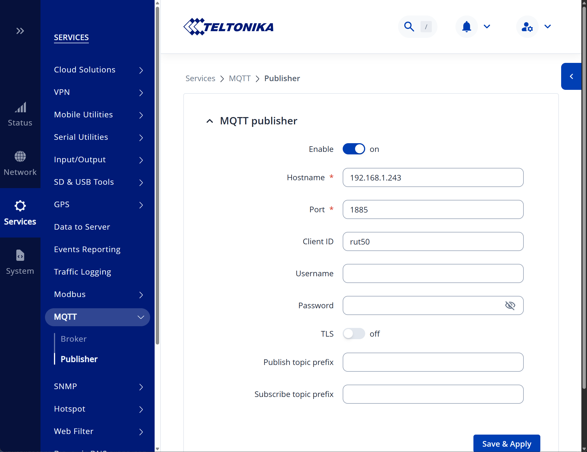

# IoBroker Teltonika
 

**此适配器使用 Sentry 库自动向开发者报告异常和代码错误。** 更多详情以及如何禁用错误报告，请参阅 [Sentry插件文档](https://github.com/ioBroker/plugin-sentry#plugin-sentry)！Sentry 报告功能从 js-controller 3.0 开始使用。

该适配器通过 MQTT 从 Teltonika 路由器读取数据，并通过 SNMP 从 Teltonika 设备读取数据。

路由器通过 MQTT 协议与适配器连接。对于没有 MQTT 发布器的设备（例如 TSW 管理型交换机），则改用 SNMP 协议进行轮询；您可以在 SNMP 选项卡下输入这些设备的信息，或者让网络扫描程序自动查找它们。如果路由器同时支持这两种协议，则只会通过 SNMP 协议读取一次。

它可以通过MQTT读取以下信息：

- 温度（'RUT2'、'RUT9'、'RUTX'、'RUT3'、'RUT1'、'TRB2'、'TRB5'、'OTD'、'RUTM'、'RUTC'）
信号强度
移动运营商
网络状态
- 连接类型（2G/3G/4G/5G）
- 广域网 IP 地址
- 正常运行时间
- 姓名
- 数字输入 1 ('RUT9')
- 数字输入 2 ('RUT9')
- 模拟输入（'RUT9'、'TRB2'、'TRB141'）
- 引脚 2 状态 ('TRB2')
- 引脚 3 状态（'RUT1'、'RUT2'、'RUT9'、'RUTX'、'RUT3'、'TRB1'、'TRB2'、'TRB5'、'RUTM'）
- 引脚 4 状态（'RUT1'、'RUT2'、'RUT9'、'RUTX'、'RUT3'、'TRB1'、'TRB2'、'TRB5'、'RUTM'）

＃＃ 用法
步骤：

- 首先启动实例
- 前往您的路由器并打开 MQTT 设置

  

- 启用 MQTT 发布者
- 将 MQTT 代理地址设置为您的 ioBroker 实例的地址。
- 设置MQTT代理端口。重要提示：此适配器的默认端口为1885，以免与其他MQTT适配器冲突。
保存设置
- 部分路由器需要重启才能使设置生效。
一段时间后，数据点将在适配器实例中创建。

**注意**：仅使用 `RUTC` 和 `TSW202` 设备进行了测试。

### SNMP
不提供 MQTT 发布器的设备通过 SNMP 读取数据：

- 在设备上启用 SNMP 代理，路径为“服务 → SNMP → SNMP 设置”，并设置只读团体名称。
- 在适配器中，打开“SNMP”选项卡，输入地址范围并按“扫描”按钮，或者手动添加设备。
目前支持的型号为“RUTC”和“TSW2”系列。其他型号则回退到Teltonika默认的数值。

设备共享信息（序列号、名称、运行时间、CPU）；要完整读取这些信息，请从设备的“SNMP 系统摘要”下下载 MIB，将其放入 `MIBs/` 并运行 `npm run generate-oids`

除了上面列出的值之外，SNMP 还提供有关交换机（链路、速度、双工、传输的字节数和速率）以及路由器的命名数字输入和输出的每个端口的统计信息。

还有三个分支可用，但默认情况下处于**关闭**状态，因为它们会暴露设备位置和可识别的客户端，而且每次轮询都会发生变化：

- *GPS定位* — 纬度、经度、精度、卫星和定位时间
- *Wi-Fi 无线电和网络* — 无线电状态和信道，以及每个 SSID 的加密方式、模式和客户端数量
- *热点会话* — 每个会话的 IP 地址、用户和授权状态

即使启用了 Wi-Fi 分支，也不会读取每个客户端的 MAC 表：每个 SSID 的客户端计数包含了有用的部分，而无需在对象树中维护每个人的硬件地址的滚动列表。

### 交换端口
为设备填写写入社区，其端口即可通过 `<device>.ports.<name>.enabled` 实现切换。

如果留空，则适配器仅读取数据，并且创建状态时不包含写入标志。

该交换机基于标准 IF-MIB 的 `ifAdminStatus`，因为 Teltonika MIB 完全没有公开任何可写内容。**PoE 无法控制**：这些设备在 POWER-ETHERNET-MIB 下没有任何对象响应。

只有当端口名称与某个接口名称完全匹配时，该端口才变为可切换端口。在 TSW202 上，由于两个表都显示 `port1`…`port8`，因此每个端口都可切换。RUTC 报告了四个名为 `LAN` 的端口，对应的接口为 `lan1`…`lan4`，这些接口无法确定是否匹配，因此只有其 `WAN` 端口可切换。

### 设备管理器的小部件
*devices* 适配器注册了两个组件：

- **Teltonika 设备** — 实例中的每个路由器和交换机都以图块形式显示：可达性，一个显示条形图

每个端口的链路状态，以及路由器的操作员、连接类型和信号强度。点击即可打开包含前面板、数字输入输出和广域网地址的完整详细信息。

- **Teltonika 端口** — 单个设备位于其独立模块上的前面板，包含链路、速度、双工和

每个端口传输的字节数。端口的绘制方式与硬件上的印刷方式一致：奇数端口位于上排，偶数端口位于下排，光纤通道单独成组。设备从适配器自动填充的下拉列表中选择，点击该图块即可打开该设备的详细信息对话框。

路由器还会显示其**WAN接口**，mwan3会跟踪这些接口：名称、故障转移状态（`online`、`standby`、`notracking`）、接口是否启用以及已运行时间。请注意，WebUI中的地址列在此处没有对应项——mwan3通过SNMP报告它ping通的主机名来判断链路是否连接，而不是接口的地址。

如果配置了写入社区，则可以通过控制面板切换端口。此处特意没有 PoE 指示灯——如上所述，这些设备根本不暴露任何 PoE 对象，因此螺栓图标表示不存在的数据。

小部件会从对象树而不是适配器配置中发现设备，因为 MQTT 路由器会宣布自己，而 SNMP 设备会在第一次轮询时出现。

### 陷阱
该适配器可以监听 SNMP 陷阱。请在“SNMP”选项卡下启用此功能，并在“服务 → SNMP → 陷阱设置”下将设备指向此主机。请注意，Linux 系统上 162 端口是特权端口，因此可能需要使用更高的端口号。

每条通知都以 `<device>.traps.<name>` 的形式出现，其中包含通知上次到达的时间，而 `<device>.traps.last` 则代表最新一条通知。大多数 Teltonika 通知不声明有效载荷——在 RUTC 定义的七个有效载荷中，只有 `signalChangeNotification` 包含有效载荷——因此，系统会记录一个陷阱，然后立即触发对该设备的轮询，实际值就来源于此。TSW202 则完全不定义任何陷阱。

<!-- 下一版本的占位符（位于行首）：

### **正在进行中** -->

## Changelog
### 1.0.0 (2026-08-10)
* (bluefox) Added SNMP support for devices without an MQTT publisher, such as the TSW switches
* (bluefox) Added a network scan that finds Teltonika devices and fills the device table
* (bluefox) Split the configuration into an MQTT and an SNMP tab
* (bluefox) Added optional SNMP branches for GPS, Wi-Fi and hotspot sessions, switched off by default
* (bluefox) Removed the router type setting, which was never evaluated
* (bluefox) Split the modem address: `wan` keeps the IPv4 address, `wanIPv6` is added where the device has one
* (bluefox) Added an SNMP trap receiver that records notifications and polls the device that sent one
* (bluefox) Community strings and SNMPv3 keys are now stored encrypted
* (bluefox) Ports can be switched through `ports.<name>.enabled` when a write community is configured
* (bluefox) Added two device manager widgets: an overview of all devices and a front panel view of the ports
* (bluefox) `info.connection` now also lists the devices polled over SNMP, so an instance without MQTT clients
  no longer appears disconnected
* (bluefox) Added the WAN interfaces of a router under `interfaces.<name>`: status, enabled and uptime
* (bluefox) A port state created before a write community was configured now becomes writable instead of
  staying read-only forever

### 0.1.0 (2025-12-07)
* (bluefox) Changed roles of the states

### 0.0.2 (2025-12-03)
* (bluefox) initial commit

## License

The MIT License (MIT)

Copyright (c) 2025-2026, bluefox <dogafox@gmail.com>

Permission is hereby granted, free of charge, to any person obtaining a copy
of this software and associated documentation files (the "Software"), to deal
in the Software without restriction, including without limitation the rights
to use, copy, modify, merge, publish, distribute, sublicense, and/or sell
copies of the Software, and to permit persons to whom the Software is
furnished to do so, subject to the following conditions:

The above copyright notice and this permission notice shall be included in
all copies or substantial portions of the Software.

THE SOFTWARE IS PROVIDED "AS IS", WITHOUT WARRANTY OF ANY KIND, EXPRESS OR
IMPLIED, INCLUDING BUT NOT LIMITED TO THE WARRANTIES OF MERCHANTABILITY,
FITNESS FOR A PARTICULAR PURPOSE AND NONINFRINGEMENT. IN NO EVENT SHALL THE
AUTHORS OR COPYRIGHT HOLDERS BE LIABLE FOR ANY CLAIM, DAMAGES OR OTHER
LIABILITY, WHETHER IN AN ACTION OF CONTRACT, TORT OR OTHERWISE, ARISING FROM,
OUT OF OR IN CONNECTION WITH THE SOFTWARE OR THE USE OR OTHER DEALINGS IN
THE SOFTWARE.