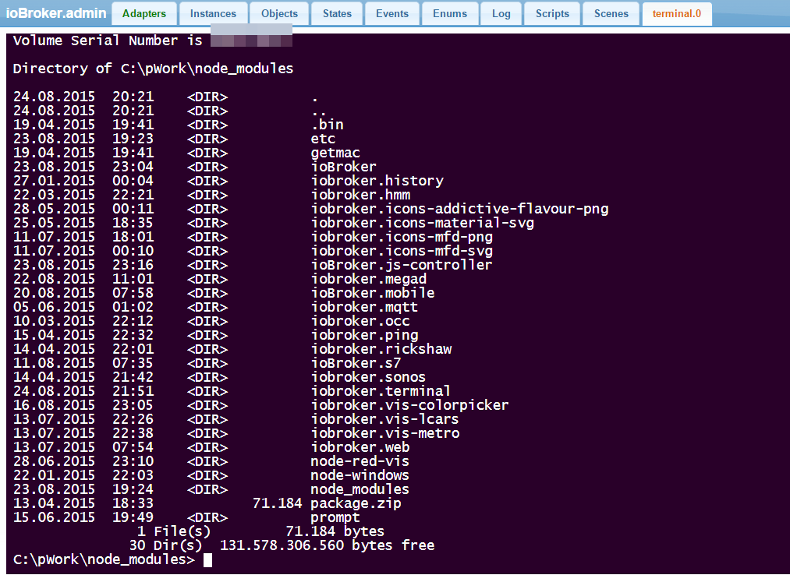

# IoBroker.terminal

**此适配器使用 Sentry 库自动向开发人员报告异常和代码错误。**有关更多详细信息以及如何禁用错误报告的信息，请参阅[Sentry 插件文档](https://github.com/ioBroker/plugin-sentry#plugin-sentry)！从 js-controller 3.0 开始使用哨兵报告。

基于 rabchev 的[网络终端](https://github.com/rabchev/web-terminal)。

终端服务器打开命令行界面。
请仅将其用于管理目的。

## Changelog
### 0.2.0 (2022-03-12)
* (Apollon77) add info-connection state
* (Apollon77) General update and optimizations

### 0.1.2
* (bluefox) show connection state

### 0.1.1
* (bluefox) add command ll

### 0.1.0
* (bluefox) add css style selector

### 0.0.1
* (bluefox) initial commit

## License
The MIT License (MIT)

Copyright (c) 2014-2022 bluefox

Permission is hereby granted, free of charge, to any person obtaining a copy
of this software and associated documentation files (the "Software"), to deal
in the Software without restriction, including without limitation the rights
to use, copy, modify, merge, publish, distribute, sublicense, and/or sell
copies of the Software, and to permit persons to whom the Software is
furnished to do so, subject to the following conditions:

The above copyright notice and this permission notice shall be included in
all copies or substantial portions of the Software.

THE SOFTWARE IS PROVIDED "AS IS", WITHOUT WARRANTY OF ANY KIND, EXPRESS OR
IMPLIED, INCLUDING BUT NOT LIMITED TO THE WARRANTIES OF MERCHANTABILITY,
FITNESS FOR A PARTICULAR PURPOSE AND NONINFRINGEMENT. IN NO EVENT SHALL THE
AUTHORS OR COPYRIGHT HOLDERS BE LIABLE FOR ANY CLAIM, DAMAGES OR OTHER
LIABILITY, WHETHER IN AN ACTION OF CONTRACT, TORT OR OTHERWISE, ARISING FROM,
OUT OF OR IN CONNECTION WITH THE SOFTWARE OR THE USE OR OTHER DEALINGS IN
THE SOFTWARE.