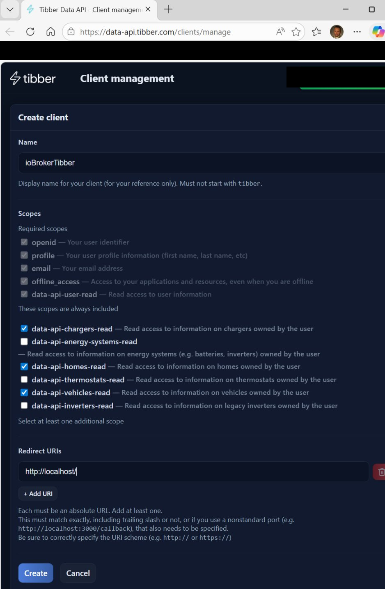
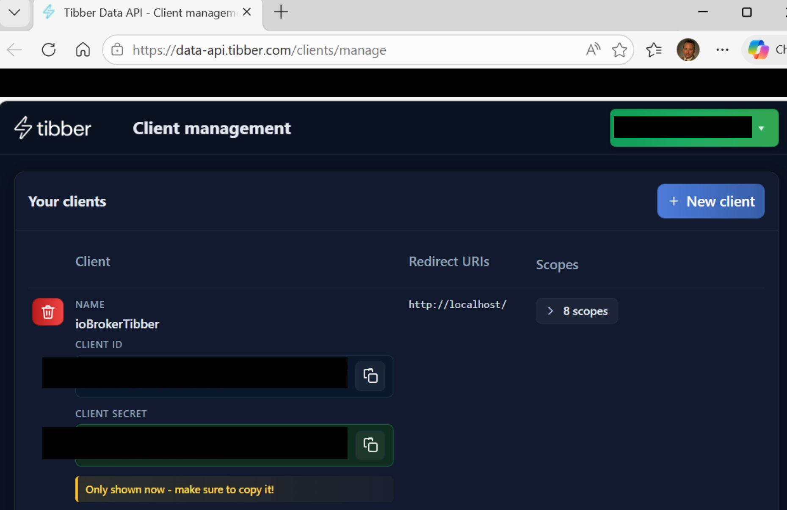
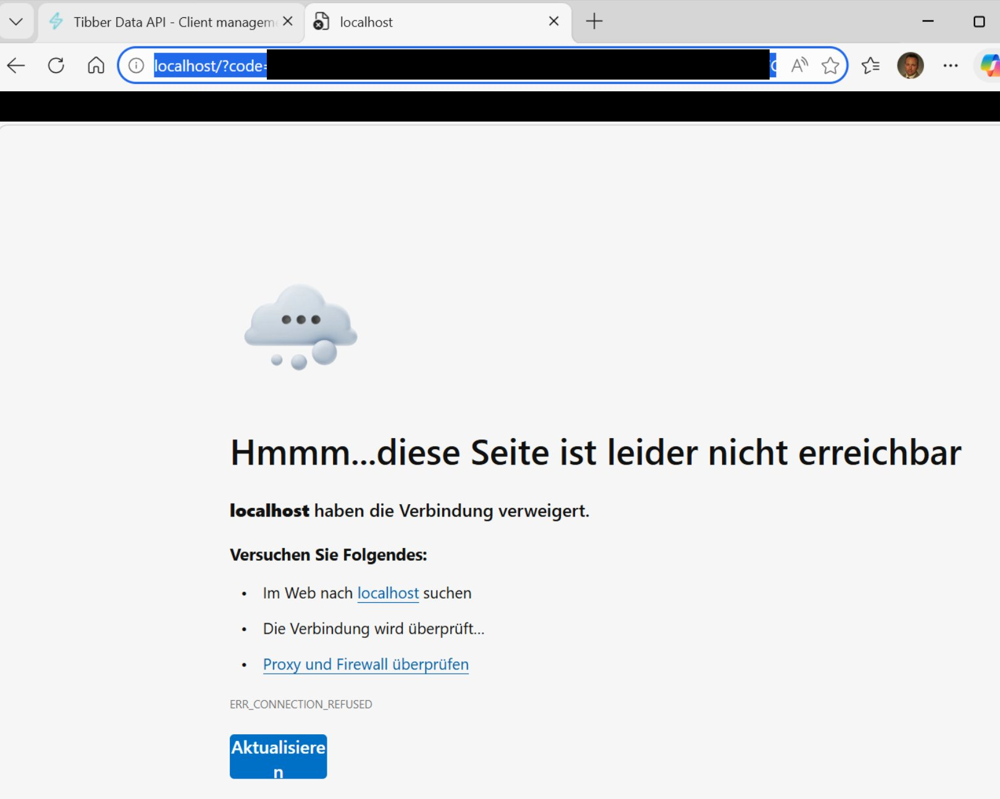

# IoBroker.tibberlink
[](https://github.com/hombach/ioBroker.tibberlink/actions/workflows/codeql-analysis.yml)

## 版本
## 哨兵
**此适配器使用 Sentry 库自动向开发人员报告异常和代码错误。** 有关更多详细信息以及如何禁用错误报告的信息，请参阅<a href="https://github.com/ioBroker/plugin-sentry#plugin-sentry">Sentry 插件文档</a>！

## 用于在 ioBroker 中使用 Tibber Energy 数据的适配器
这款适配器可将您 Tibber 账户的 API 数据连接到 ioBroker，无论是单个住宅还是多个住宅。

它还支持通过家庭网络直接读取 Tibber Pulse 传感器的本地数据，从而实现实时监控和数据采集，而无需完全依赖云端 API。

如果您目前还不是 Tibber 用户，如果您能使用我的推荐链接，我将不胜感激：[Tibber推荐链接](https://invite.tibber.com/mu8c82n5)。

## 标准配置
首先创建适配器的新实例。
- 您还需要 Tibber 的 API 令牌，您可以从这里获取：[Tibber Developer API](https://developer.tibber.com)。
- 在标准设置中输入您的 Tibber API 令牌，并至少配置一行实时信息流设置（选择“无可用”）。
- 保存设置并退出配置以重新启动适配器；此步骤允许 Tibber 服务器首次查询您的家庭。
- 返回配置界面，选择您希望使用 Tibber Pulse 获取实时数据的住宅。您也可以选择住宅并禁用数据馈送（注意：此功能仅在硬件已安装且 Tibber 服务器已验证与 Pulse 的连接后才有效）。
注意：如果您的 Tibber 帐户中有多个房屋，则必须全部添加，以避免因不需要的房屋而导致错误消息。请添加所有房屋，然后禁用不需要的房屋。
例如，如果您只打算使用 Pulse 实时数据，您可以选择停用今天和明天的价格数据检索功能。
- 您可以选择启用历史消费数据检索功能。请指定小时、天、周、月和年的数据集数量。您可以根据个人喜好，使用“0”禁用一个或多个时间段的数据。
注意：务必注意数据集的大小，因为过大的请求可能会导致 Tibber 服务器无响应。我们建议您尝试不同的数据集大小，以确保最佳功能。调整时间间隔和数据集数量有助于在获取有价值的数据和保持服务器响应速度之间找到合适的平衡点。例如，建议的小时数设置为 48。
- 保存设置。

## 消费数据文档
启用每日历史消费数据后，适配器会提供当月的汇总状态：

- `Homes.<HOME-ID>.Consumption.currentMonthConsumption`

此状态表示当前日历月（`kWh`）的总消耗量，由 Tibber 返回的每日消耗量数据计算得出。如果配置的天数过少，则该值仅反映配置的天数，而非完整的月份。

## 计算器配置
- 现在 Tibber 连接已经建立并运行，您还可以利用计算器将其他自动化功能集成到 TibberLink 适配器中。
- 该计算器使用通道进行操作，每个通道与选定的家庭相关联。
- 这些状态旨在作为 TibberLink 的外部动态输入，例如，允许您从外部来源调整边际成本（“触发价格”）或启用计算器通道（“活动”）。
- 这些通道需要根据相应的状态激活或停用。
计算器通道的状态显示在主页状态旁边，并根据通道编号命名。管理界面中输入的通道名称会显示在此处，以便您识别配置。

  

- 每个通道的行为由其类型决定：“最佳成本（LTF）”、“最佳单小时（LTF）”、“最佳小时块（LTF）”或“智能电池缓冲”。
每个通道都会填充一个或两个外部状态作为输出，需要在设置选项卡中选择。例如，该状态可以是“0_userdata.0.example_state”或任何其他可写的外部状态。
- 如果没有选择外部输出状态，则会在通道的范围内创建一个内部状态。
- 可以定义要写入输出状态的值，用“值 YES”和“值 NO”表示，例如，“true”表示布尔状态，或者要写入的数字或文本。
- 输出：
- “最佳成本”：以“触发价格”状态作为输入，当当前 Tibber 能源成本低于触发价格时，每小时输出“是”。
- “最佳单小时数”：在成本最低的小时数内生成“YES”输出，该数字在“AmountHours”状态中定义。
- “最佳工时块”：在“AmountHours”状态中指定的工时数范围内，以最具成本效益的工时块输出“YES”。

此外，计算结果会将确定区块的平均总成本写入该通道输入状态附近的“AverageTotalCost”状态。同时，区块的起始时间和结束时间也会分别写入“BlockStartFullHour”和“BlockEndFullHour”状态。

- “最佳百分比”：在价格最低的时段以及价格落在“百分比”设置状态中指定的百分比范围内的任何其他时段，输出“是”。
- “最佳成本 LTF”：在有限时间范围内 (LTF) 的“最佳成本”。
- “LTF 最佳单小时”：在有限时间范围内 (LTF) 的“最佳单小时”。
- “LTF 最佳时段”：在有限时间范围内 (LTF) 的“最佳时段”。
- “最佳百分比 LTF”：在有限时间范围内 (LTF) 的“最佳百分比”。
- “智能电池缓冲器”：
“效率损失”参数定义了电池系统的效率损失。其取值范围为 0 到 1，其中 0 表示无效率损失，1 表示完全能量损失。例如，值为 0.25 表示每次充放电循环的效率损失为 25%。
“AmountHours”参数指定系统可用于电池充电的最大小时数，精确到刻度点。重要提示：这是上限值，并非保证的充电小时数。实际的充电时段数会根据能源价格和效率损失动态确定。系统只会选择那些在经济上划算的时段（即，考虑到效率损失，价格远低于最贵时段的价格）。
- 该计算器的工作原理如下：
- 低价时段：电池充电功能已启用（值为“是”），但向家庭能源系统供电的功能已禁用（值为“否”）。这些时段价格最低，且符合能效筛选条件，最高时长为 AmountHours。
- 高价时段：电池充电功能已禁用（值为“否”），但已启用并入家庭能源系统（值为“是”）。这些时段的价格最高，高于根据最低时段价格和效率损失动态计算的阈值。
- 正常时间段：在充电不经济的情况下，两个输出均被禁用。
这种方法确保电池只在经济上有利可图时才使用，而不是严格遵守固定的使用小时数。
- LTF 通道：这些通道的运行方式与标准通道类似，但仅在由“StartTime”和“StopTime”状态对象定义的时间范围内处于活动状态。“StopTime”过后，通道将自动停用。“StartTime”和“StopTime”可以跨越两个日历日，因为 Tibber 不提供超过 48 小时窗口的数据。这两个状态都需要一个 ISO-8601 格式的日期时间字符串，并带有时区偏移量，例如“2024-12-24T18:00:00.000+01:00”。此外，LTF 通道还具有一个名为“RepeatDays”的新状态参数，其默认值为 0。当“RepeatDays”设置为正整数时，通道将在“StopTime”过后，将“StartTime”和“StopTime”都递增指定的天数，从而重复其循环。例如，将“RepeatDays”设置为 1，即可每天重复。

## 图形输出配置
该适配器有助于可视化价格趋势和计算器结果。它提供三种复杂度级别——从简单的基于 JSON 的方法到完全定制的 JavaScript 解决方案。

### 1. （开发中）使用“E-Charts”适配器进行可视化
此方法需要单独安装“电子海图”适配器。

- 可以使用在计算器状态部分（“输出电子图表”）生成的 JSON 数据。
- 由于电子海图适配器的限制，其功能受到限制。

### 2. **使用带有 JSON 的“FlexCharts”（或“功能齐全的 eCharts”）适配器**
此方法需要单独安装“FlexCharts”适配器。

- TibberLink 适配器创建一个名为 `jsonFlexCharts` 的状态。

                      

- FlexCharts适配器通过以下URL呈现此状态：

```
http://[YOUR IP of FLEXCHARTS]:8082/flexcharts/echarts.html?source=state&id=tibberlink.0.Homes.[TIBBER-HOME-ID].PricesTotal.jsonFlexCharts
```

从 V0.7.0 版本开始，FlexCharts 支持通过 SSE（服务器发送事件）自动更新图表。要使用此功能，请在 URL 中添加 `&sse`：

```
http://[YOUR IP of FLEXCHARTS]:8082/flexcharts/echarts.html?source=state&id=tibberlink.0.Homes.[TIBBER-HOME-ID].PricesTotal.jsonFlexCharts&sse=30
```

- 有关更多详细信息，请参阅 [FlexCharts 适配器文档](https://github.com/MyHomeMyData/ioBroker.flexcharts)。

#### **JSON模板用法**
- `jsonFlexCharts` 状态是根据通过适配器设置中的 JSON 编辑器配置的模板生成的。
- 内置的 JSON 编辑器使用 JSON5 模式，因此允许添加注释和尾随逗号。
- 可以从以下位置下载示例模板：[TemplateFlexChart01.md](docu/TemplateFlexChart01.md)。
- 将模板复制并粘贴到 JSON 编辑器中。
- 该模板包含占位符：
- `%%seriesData%%`（运行时填充时间序列价格数据）。
- `%%CalcChannelsData%%`（填充选定的计算器通道数据）。
- 模板的其余部分遵循 Apache ECharts 配置。有关参考，请参阅[Apache ECharts 示例](https://echarts.apache.org/examples/en/index.html)。
- **建议：** 使用默认字符串，在不使用实际模板的情况下测试 TibberLink 适配器：

```
%%seriesData%%\n\n%%CalcChannelsData%%
```

这有助于理解它的功能。

- 可以使用“Output-E-Charts”状态数据在 Apache ECharts 示例页面上测试模板调整。
- 好的模板将在 TibberLink 适配器社区内共享。

### 3. **使用带有自定义 JavaScript 代码的“FlexCharts”**
为了实现最大的灵活性和可定制性，FlexCharts 适配器可以与自定义 JavaScript 一起使用。

- “FlexCharts”和“JavaScript”适配器都需要分别安装。
- 这种方法可以创建多个自定义图表。
- 更多详情请参阅[FlexCharts适配器讨论](https://github.com/MyHomeMyData/ioBroker.flexcharts/discussions/67)。

提示
### 反向用法
例如，要获取高峰时段而不是最佳时段，只需反转使用情况和参数即可：


通过交换 true <-> false，您将在第一行以低成本获得 true，在第二行以高成本获得 true（通道名称只是示例，可以自由选择）。

注意：对于高峰时段（例如示例中的时段），您还需要调整小时数。原始值：5 -> 倒数 (24-5) = 19 -> 您将在 5 个高峰时段内获得“真实”输出。

### LTF通道
此计算基于“多日”数据。由于我们仅掌握“今天”和“明天”（大约在13:00之后可用）的信息，因此时间范围最长可达48小时，但通常在13:00价格更新后的35小时内有效。然而，务必注意此情况，因为计算结果可能会在13:00左右发生变化，届时明天价格的新数据将可用。

为了观察标准频道时间范围内的这种动态变化，您可以选择跨越数年的有限时间框架 (LTF)。这对于“最佳单小时 LTF”场景尤其有用。

## 直接本地轮询 Pulse 数据
要实现这一点，您需要修改 Bridge 的 Web 界面，使其始终保持启用状态。

marq24 在这里提供了关于如何为他的 Home Assistant 集成进行此操作的详细说明：

https://github.com/marq24/ha-tibber-pulse-local

如果一切正常，计量数据将每 2 秒写入 ioBroker 状态。

## 车辆和充电器配置
Tibber 运行两个用途不同的独立 API：

- **开发者 GraphQL API** (`api.tibber.com`) — 提供能源价格、消费历史记录和 Pulse 实时数据。这是标准 Tibber API 令牌（来自 [developer.tibber.com](https://developer.tibber.com)）所授予的访问权限。
- **Tibber 数据 API** (`data-api.tibber.com`) — 提供已配对车辆、充电器、热泵和逆变器的物联网设备数据。这是一个较新的独立 REST API，需要单独注册 OAuth2 客户端。

这两个 API 互不替代，而是相辅相成。此处描述的车辆和充电器功能使用数据 API，因此除了主 API 令牌之外，还需要其自身的凭证。

### 先决条件
1. 打开 [https://data-api.tibber.com/clients/manage](https://data-api.tibber.com/clients/manage) 并点击 **+ 新客户端**。

 

2. 给客户端命名（例如 `ioBrokerTibber`），将**重定向 URI** 设置为 `http://localhost/`（带尾部斜杠），并启用至少以下作用域：
- `data-api-homes-read`
- `data-api-vehicles-read`
- `data-api-chargers-read`

    

3. 点击**创建**。立即复制**客户端 ID**和**客户端密钥**——密钥只会显示一次。

 

4. 打开适配器配置中的“车辆和充电器”选项卡，输入这两个值，然后保存。
5. 重启适配器。它会记录一条**警告**，其中包含已填充您的客户端 ID 的可直接使用的授权 URL：

```
[tibberDataAPI]: no auth code configured — please authorize. URL: https://thewall.tibber.com/connect/authorize?client_id=<your-id>&...
```

6. 在浏览器中打开该网址，并使用您的 Tibber 帐户登录以授予访问权限。
7. 浏览器将重定向到 `http://localhost/` 并显示连接错误——这是**预期且正确的**。从地址栏复制完整的 URL（其中包含 `?code=...`）。

 

8. 将完整的 URL 粘贴到适配器配置中的 **授权码** 字段中并保存。
9. 适配器将代码交换为令牌并开始轮询。授权码字段会自动清除。

适配器会在内部存储刷新令牌并自动更新访问令牌，因此无需重复此一次性授权步骤。

### 可用状态
车辆数据写入`Vehicles.<VIN>.*`：

| 状态 | 描述 |
| --------------------- | --------------------------------- |
| `ChargingStatus` | 当前充电状态 |
| `LastUpdated` | 上次数据更新的时间戳 |
| `PlugStatus` | 插头连接状态 |
| `Range` | 剩余距离（公里） |
| `StateOfCharge` | 电池电量百分比 |
| `TargetStateOfCharge` | 目标荷电状态（%） |
| `TargetStateOfCharge` | 目标电量百分比 |

### 轮询间隔
轮询间隔可在“车辆和充电器”选项卡中进行配置（1-60 分钟，默认值：5 分钟）。

捐赠
<a href="https://www.paypal.com/donate/?hosted_button_id=F7NM9R2E2DUYS"></a>如果你喜欢这个项目——或者只是想慷慨解囊，不妨请我喝杯啤酒。干杯！🍻

## Changelog

<!--
  Placeholder for the next version (at the beginning of the line):
  ### **WORK IN PROGRESS**
-->
### **WORK IN PROGRESS**

- (HombachC) removed redundant test devDependencies (chai, chai-as-promised, sinon-chai, proxyquire) and switched unit tests to Node's built-in assert

### 7.1.4 (2026-07-09)

- (HombachC) fixed regression where smart battery buffer ignored the EfficiencyLoss parameter (#918)

### 7.1.3 (2026-06-27)

- (HombachC) updated axios
- (HombachC) fixed local SML parsing for EMH meters reporting meter_mode 4 but sending binary SML data (#912)
- (HombachC) fixed false warn log for SBB when no price slot matches current quarter (#912)

### 7.1.2 (2026-06-19)

- (HombachC) fixed adapter crash on null liveMeasurement from Tibber feed (#910)
- (HombachC) improved vehicles & chargers OAuth2 setup documentation
- (HombachC) fixed setInterval/clearInterval to use adapter-managed variants
- (HombachC) removed yarn dependency, replaced with npm in release script
- (HombachC) updated adapter-core
- (HombachC) fixed adapter checker warnings
- (HombachC) updated dependencies

### 7.1.1 (2026-06-07)

- (HombachC) optimized vehicle states
- (HombachC) fixed adapter checker warnings

### 7.1.0 (2026-06-07)

- (claude) added integration for vehicles(#67)
- (HombachC) optimized documentation
- (claude) added code documentation
- (claude) performance optimization of event listeners
- (HombachC) added current month consumption docu
- (HombachC) updated release-script
- (HombachC) fixed adapter checker warnings

### Old Changes see [CHANGELOG OLD](CHANGELOG_OLD.md)

## License

GNU General Public License v3.0 only

Copyright (c) 2023-2026 C.Hombach <TibberLink@homba.ch>