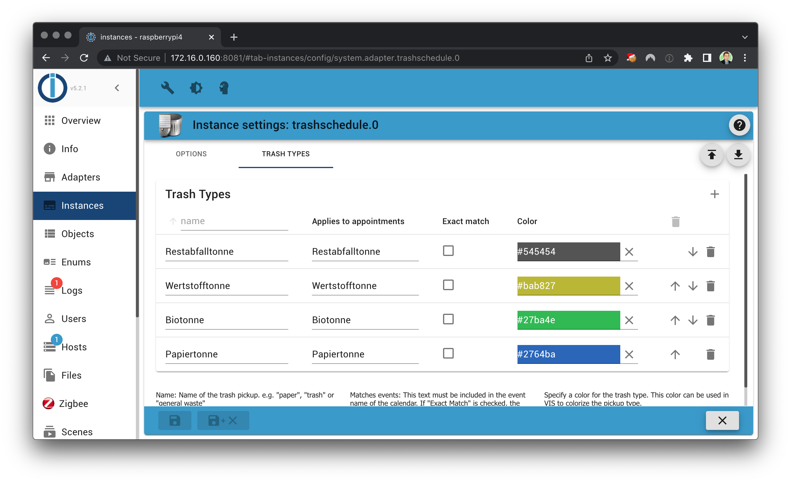
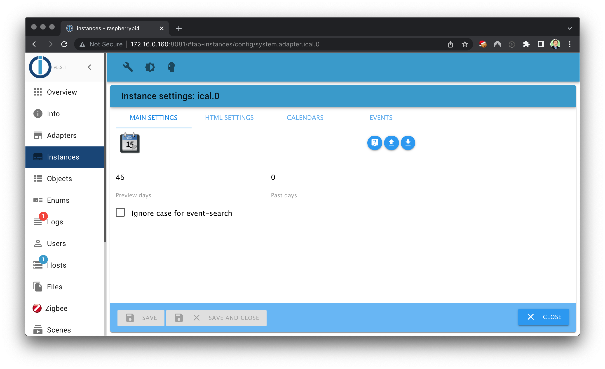

# IoBroker.trashschedule
＃＃ 目录
- [提供商]（providers.md）
- [Blockly](blockly.md)
- [JavaScript]（javascript.md）
- [常见问题](faq.md)

＃＃ 要求
1.nodejs 18.0（或更高版本）
2. js-controller 5.0.0 (或更高版本)
3. Admin Adapter 6.0.0（或更高版本）
4. iCal Adapter 1.12.1（或更高版本）- *可选*

＃＃ 配置
1. 创建一个 ```trashschedule``` 实例，并选择 ical 实例作为源。或者，可以直接选择提供商，这些提供商通过各种在线服务进行集成。
2. 转到垃圾类型选项卡，并添加尽可能多的垃圾类型
3. 为每种新的垃圾类型定义名称并配置匹配的事件
4.启动实例

**有问题？** 查看[常问问题](./faq.md)




## ICal 的先决条件
1. 创建 [ical 适配器](https://github.com/iobroker-community-adapters/ioBroker.ical) 的新实例
2. 配置你的日历的 URL（例如谷歌日历）
3. 将“预览天数”设置为至少包含每种垃圾类型两次的范围（例如 45 天）
4. 如果您使用“事件”选项卡，请确保启用每个事件类型的“显示”复选框，该复选框也应在您的垃圾计划中使用（否则该事件将被 ical 实例隐藏）



## VIS 小部件（VIS 版本 1.x）


**此小部件不支持 VIS 2.x！**

## Changelog

<!--
  Placeholder for the next version (at the beginning of the line):
  ### **WORK IN PROGRESS**
-->
### 3.3.0 (2024-04-28)

NodeJS >= 18.x and js-controller >= 5 is required

* (klein0r) Improved error reporting / log messages
* (klein0r) Fixed translations
* (klein0r) Added Abfall+ as Webservice

### 3.2.0 (2024-01-22)

* (klein0r) Added more providers

### 3.1.3 (2023-12-24)

* (klein0r) fixed configuration validation
* (klein0r) enhanced error logging
* (klein0r) some cities have no streets (API)

### 3.1.2 (2023-12-22)

* (klein0r) Fixed exception when cache dir doesn't exist

### 3.1.1 (2023-12-22)

* (klein0r) Fixed config validation / integration test

## License

MIT License

Copyright (c) 2024 Matthias Kleine <info@haus-automatisierung.com>

Permission is hereby granted, free of charge, to any person obtaining a copy
of this software and associated documentation files (the "Software"), to deal
in the Software without restriction, including without limitation the rights
to use, copy, modify, merge, publish, distribute, sublicense, and/or sell
copies of the Software, and to permit persons to whom the Software is
furnished to do so, subject to the following conditions:

The above copyright notice and this permission notice shall be included in all
copies or substantial portions of the Software.

THE SOFTWARE IS PROVIDED "AS IS", WITHOUT WARRANTY OF ANY KIND, EXPRESS OR
IMPLIED, INCLUDING BUT NOT LIMITED TO THE WARRANTIES OF MERCHANTABILITY,
FITNESS FOR A PARTICULAR PURPOSE AND NONINFRINGEMENT. IN NO EVENT SHALL THE
AUTHORS OR COPYRIGHT HOLDERS BE LIABLE FOR ANY CLAIM, DAMAGES OR OTHER
LIABILITY, WHETHER IN AN ACTION OF CONTRACT, TORT OR OTHERWISE, ARISING FROM,
OUT OF OR IN CONNECTION WITH THE SOFTWARE OR THE USE OR OTHER DEALINGS IN THE
SOFTWARE.