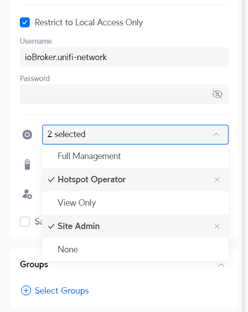

# IoBroker.unifi 网络
**测试：**

## IoBroker 的 unifi 网络适配器
Unifi Network 使用 websocket 接口从 unifi-network 应用程序接收实时信息

＃＃ 重要的
1. 该适配器完全基于 UniFi OS 开发。应提供与自托管网络控制器的兼容性，但不能保证。

2. **此适配器可能非常耗费资源！** 这取决于您的环境，例如您的网络中有多少个 unifi 设备和客户端。这可以通过适配器设置中的实时 API“debounce time [s]”参数进行一定程度的影响。实时事件不受此设置影响，只有设备、客户端等的“周期性”实时更新才会受到影响。

3. **适配器启动后并非所有状态都直接可用** 仅当网络控制器发送数据时才会创建和更新状态，这可能需要一些时间才能第一次发送数据

＃＃ 配置
### 本地用户（UniFi OS）
您需要在 UniFi OS 控制台中创建一个本地用户来登录。Ubiquiti SSO 云用户将无法使用。建议您使用管理员或具有完全读写权限的用户来充分利用集成功能，但这不是必需的。

1. 登录您的 UniFi OS 设备上的本地门户，然后单击“用户”。

**注意**：此操作**必须**通过 UniFi OS 的 IP 地址（例如 192.168.1.1）直接访问来完成，而不是通过 unifi.ui.com 或 UniFi 网络应用程序来完成。

2. 从左侧菜单转到**管理员和用户**，然后选择管理员选项卡或转到[IP 地址]/admins/（例如 192.168.1.1/admins/）。

3. 点击右上角的**+**，选择**添加管理员**。

4. 选择**仅限本地访问**并输入新的用户名和密码。

5. 选择**热点操作员**和**站点管理员**作为网络角色。

**注意** 这不是绝对必要的，如果权限不够，您将通过日志消息收到通知

## Changelog

<!--
	Placeholder for the next version (at the beginning of the line):
	### **WORK IN PROGRESS**
-->
### 1.1.7 (2025-10-19)

- (Scrounger) event 'UpgradeScheduled' added to ignore list
- (DEV2DEV-DE) german translation updated

### 1.1.6 (2025-10-08)

- (Scrounger) dependencies updated #22
- (Scrounger) firewall channel added #29
- (Scrounger) bug fix #28

### 1.1.5 (2025-10-06)

- (Scrounger) check site exist on self hosted controller
- (Scrounger) login bug fixes #27

### 1.1.4 (2025-10-06)

- (Scrounger) logging improved
- (Scrounger) auto detect UniFi OS or self hosted controller
- (Scrounger) auto translation bug fix
- (Scrounger) image downloading improved
- (Scrounger) bug fixes

### 1.1.3 (2025-10-03)

- (Scrounger) login bug fix for self hosted controllers v9.x.x

### 1.1.2 (2025-10-02)

- (Scrounger) login bug fix for self hosted controllers
- (Scrounger) dependencies updated
- (Scrounger) bug fixes

### 1.1.1 (2025-09-30)

- (Scrounger) bug fixes
- (Scrounger) roles added
- (Scrounger) reponsiv adapter config implemented

### 1.1.0 (2025-09-21)

- (Scrounger) dependencies updated
- (Scrounger) check adapter settings for timeout and interval implemented
- (Scrounger) translation optimized
- (Scrounger) bug fixes

### 1.1.0-beta.0 (2025-09-03)

- (Scrounger) replaced fetch with undici
- (Scrounger) firewall group added
- (Scrounger) more network events handler added
- (Scrounger) bug fixes

### 1.0.0-beta.0 (2025-04-25)

- (Scrounger) initial release

## License

MIT License

Copyright (c) 2025 Scrounger <scrounger@gmx.net>

Permission is hereby granted, free of charge, to any person obtaining a copy
of this software and associated documentation files (the "Software"), to deal
in the Software without restriction, including without limitation the rights
to use, copy, modify, merge, publish, distribute, sublicense, and/or sell
copies of the Software, and to permit persons to whom the Software is
furnished to do so, subject to the following conditions:

The above copyright notice and this permission notice shall be included in all
copies or substantial portions of the Software.

THE SOFTWARE IS PROVIDED "AS IS", WITHOUT WARRANTY OF ANY KIND, EXPRESS OR
IMPLIED, INCLUDING BUT NOT LIMITED TO THE WARRANTIES OF MERCHANTABILITY,
FITNESS FOR A PARTICULAR PURPOSE AND NONINFRINGEMENT. IN NO EVENT SHALL THE
AUTHORS OR COPYRIGHT HOLDERS BE LIABLE FOR ANY CLAIM, DAMAGES OR OTHER
LIABILITY, WHETHER IN AN ACTION OF CONTRACT, TORT OR OTHERWISE, ARISING FROM,
OUT OF OR IN CONNECTION WITH THE SOFTWARE OR THE USE OR OTHER DEALINGS IN THE
SOFTWARE.