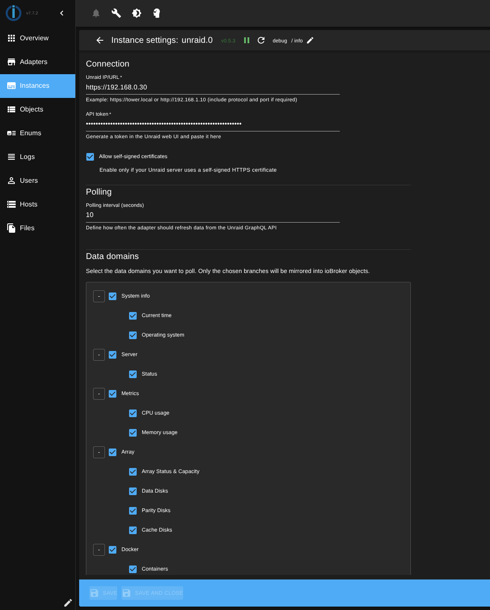

# IoBroker.unraid
> **⚠️ 开发中**：此适配器正在积极开发中。更多数据点和功能计划在未来的版本中添加。

**测试：** 

## IoBroker 的 unraid 适配器
该适配器通过 GraphQL API 将 ioBroker 连接到 Unraid 服务器，以监控系统指标和状态。

＃＃ 特征
- 监控 CPU 和内存使用情况（包括每个核心的统计数据）
- 跟踪服务器状态和网络信息
- 监控和控制 Docker 容器（启动/停止）
- 查看阵列磁盘（数据盘、奇偶校验盘、缓存盘）的健康状况信息
- 监控网络共享（使用情况、配置、文件系统详情）
- 监控和控制虚拟机（启动/停止/暂停/恢复/重启）
- 可配置的轮询间隔

＃＃ 配置
### 在 Unraid 中生成 API 令牌
#### 适用于 Unraid 7.2 之前的版本：
1. 从 Unraid 社区应用商店安装 **“Unraid Connect 插件”**
2. 安装完成后，请导航至：**设置 → 管理访问权限 → API 密钥**

#### 适用于 Unraid 7.2 及更高版本：
API 功能已内置，请直接前往：**设置 → 管理访问权限 → API 密钥**

#### 创建令牌：
1. 点击“添加 API 密钥”
2. 配置权限：
- **基本角色**：选择**“查看者”**（提供对系统信息、指标、磁盘等的读取权限）
- **附加权限**（控制功能所需）：
- **Docker 管理器**：允许启动/停止 Docker 容器
- **虚拟机管理器**：允许启动/停止/暂停虚拟机

**快速设置替代方案**：复制此模板字符串并将其粘贴到**API 密钥 → “从模板创建”**中：

```
?name=ioBroker+unraid+adapter+key&scopes=role%3Aviewer%2Cdocker%2Bvms%3Acreate_any%2Bdelete_any%2Bread_any%2Bupdate_any%2Carray%2Bdashboard%2Bdisk%2Binfo%2Blogs%2Bnetwork%3Aread_any
```

3. 给令牌起一个描述性名称（例如，“ioBroker”）。
4. 复制生成的令牌（API 密钥）——您将在适配器配置中需要它。


### 适配器设置
1. **基本 URL**：输入您的 Unraid 服务器地址（例如，`https://192.168.1.10` 或 `https://tower.local`）
2. **API令牌**：粘贴您在Unraid中生成的管理员令牌。
3. **轮询间隔**：设置获取数据的频率（默认值：60 秒，最小值：10 秒）
4. **自签名证书**：如果您的 Unraid 服务器使用自签名 HTTPS 证书，请启用此选项。
5. **数据域**：选择要监控的数据类别（系统信息、服务器状态、指标等）。

### 配置接口


### 创建的对象
适配器会为受监控的数据创建一个结构化的对象树：

<br>

<br>


＃＃ 要求
- Unraid 服务器（推荐版本 7.0.0 或更高）
- 对于 7.2 之前的版本：从社区应用程序安装“Unraid Connect 插件”
- 7.2 及以上版本：已内置 API 支持
- 具有查看者角色的 API 令牌（以及用于控制功能的 Docker/VM 管理器）
- 从 ioBroker 到 Unraid 服务器的网络访问

## Changelog

<!--
  Placeholder for the next version (at the beginning of the line):
  ### **WORK IN PROGRESS**
-->
### 0.7.1 (2025-11-30)

- (ingel81) Minor pipeline issues fixed

### 0.7.0 (2025-11-30)

- (ingel81) Migrated admin UI to @iobroker/adapter-react-v5 (React 18, MUI v6)
- (ingel81) Extended Unraid GraphQL schema (CPU package power and temperatures)
- (ingel81) Refined API token documentation with Viewer role permissions
- (ingel81) Updated dependencies (release-script 5.x, adapter-react-v5 8.x)

### 0.6.2 (2025-10-19)

- (ingel81) dependencies updated

### 0.6.2-alpha.1 (2025-10-19)

- (ingel81) npm deployment adjusted pt.2

### 0.6.2-alpha.0 (2025-10-19)

- (ingel81) npm deployment adjusted

### 0.6.1 (2025-09-28)

- (ingel81) fix: Use themecolors in settings

### 0.6.0 (2025-09-24)

- (ingel81) Added VM and Docker container control functionality
- (ingel81) Code refactoring and cleanup
- (ingel81) Translation

### 0.5.3 (2025-09-23)

- (ingel81) Support for node 20, 22 and 24

### 0.5.2 (2025-09-22)

- (ingel81) Documentation
- (ingel81) Minor admin page improvements

### 0.5.1 (2025-09-22)

- (ingel81) ESLint9 Migration
- (ingel81) Code refactor

### 0.5.0 (2025-09-21)

- (ingel81) More Unraid queries: Docker containers, shares, VMs, array disks with dynamic state creation,
- (ingel81) Apollo Client migration

### 0.4.1 (2025-09-21)

- (ingel81) Documentation

### 0.4.0 (2025-09-21)

- (ingel81) Adapter renamed to iobroker.unraid

### 0.3.0 (2025-09-21)

- (ingel81) Translations
- (ingel81) Logo
- (ingel81) Readme

### 0.2.2 (2025-09-21)

- (ingel81) Release testing with npm, reloaded2

## License

MIT License

Copyright (c) 2025 ingel81 <ingel81@sgeht.net>

Permission is hereby granted, free of charge, to any person obtaining a copy
of this software and associated documentation files (the "Software"), to deal
in the Software without restriction, including without limitation the rights
to use, copy, modify, merge, publish, distribute, sublicense, and/or sell
copies of the Software, and to permit persons to whom the Software is
furnished to do so, subject to the following conditions:

The above copyright notice and this permission notice shall be included in all
copies or substantial portions of the Software.

THE SOFTWARE IS PROVIDED "AS IS", WITHOUT WARRANTY OF ANY KIND, EXPRESS OR
IMPLIED, INCLUDING BUT NOT LIMITED TO THE WARRANTIES OF MERCHANTABILITY,
FITNESS FOR A PARTICULAR PURPOSE AND NONINFRINGEMENT. IN NO EVENT SHALL THE
AUTHORS OR COPYRIGHT HOLDERS BE LIABLE FOR ANY CLAIM, DAMAGES OR OTHER
LIABILITY, WHETHER IN AN ACTION OF CONTRACT, TORT OR OTHERWISE, ARISING FROM,
OUT OF OR IN CONNECTION WITH THE SOFTWARE OR THE USE OR OTHER DEALINGS IN THE
SOFTWARE.