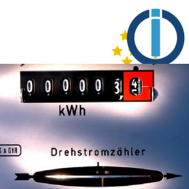

<h1>ioBroker.virtualpowermeter</h1>

## IoBroker 的 virtualpowermeter 适配器
Erzeugt Virtuelle Strommesser

Im Smarthome hat man viele Geräte die man zwar schalten kann, diese aber keinen integrierten Powermeter haben (meist Lichter)。

Mit diesem Adapter ist das Ziel zu jedem eingestelltem Datenpunkt (über Custom -> MaxWatt (z.B. 60W)) zwei zusätzliche Datenpunkte zu befüllen -> Energy_Power (z.B. 60 W) und Energy_Total (z.B. 2501,23 Wh)。
Zusätzlich werden Gruppen gebildet (diese werden unter virtualpowermeter.0.xxx abgelegt) die die summe der einzelnen Datenpunkte darstellt

Mit diesen neuen Datenpunkten kann dann eine Einfache Visualiserung durchgeführt werden。

Die neuen Datenpunkte (besonders die Gruppen) könnten super mit valuetrackerovertime weiterverarbeitet werden

## 实例设置

hier kan der Default-Name für das Power und Energy_Total definiert werden。

Die Einstellung 默认设置：Datapoint Destination bestimmt die default Einstellung beim erstellen eines neuen 自定义设置。贝“在状态文件夹”wird bei neuen Custom-Settings die Standardnamen für Power und Energie genutz。作为标准名称和 ObjectID des Custom-DP (.durch _ ersetzt) 的“在组中”作为标准名称，作为 Unterverzeichnis + der Standardname für Power und Energie genutz。 “其他任何地方” nutzt ebenfalls den Standardname für Power und Engery muss aber für jeden Custom-DP manuell angepasst werden。

＃＃ 自定义设置
 Die aktivierung eines Custom-Settings aktiviert 2 Datenpunkte。 Power -> Watt, Energy(_Total) -> Wh Der Speicherort setzt sich aus dem Datapoint Destination + Datapointname zusammen。

Wichtig：Wenn Destination "in Group" bzw wenn mehere DP im gleichen Verzeichnis "in current state tree" braucht jeder Datenpunkt seinen eindeutigen Namen。 wenn default-Destination "in Group" wird der Datenpunktname automatisch mit der ID des States ergänzt (.durch_ersetzt)。 Hier kann aber Auch z.B. Wohnzimmer_Licht.Power und Wohnzimmer_Licht.Energy angegeben werden。

## Custom Settings für Geräte die nur Power Angabe (Watt) und man die Wh zählen will
Es gibt Geräte die nur eine Watt ausgabe haben und man aber wissen will wieviel Strom verbraucht wurde。 Hierfür kann auch der VirtualPowermeter verwendet werden。 Dafür muss nur der Max-Wert vom Datenpunkt 和 der Max-Power vom VirtualPowermeter gleich sein。贝斯皮尔：

Beispiel mit valuetrackerovertime: 

<!-- 下一个版本的占位符（在行首）：

### __工作正在进行中__ -->

## Changelog
### 1.4.3 (2021-05-27)
* (bluefox) added support for admin5

### 1.4.1 (2021-02-13)
* (Omega236) on unit '%' interpret common.max as 100 if common.max not set

### 1.4.0 (2021-02-12)
* (Omega236) adding OptionalSwitch for Dimmer with On/Off State

### 1.3.2 (2021-01-27)
* (Omega236) group total is now its own counter
* (Omega236) improved precision

### 1.3.1 (2021-01-25)
* (Omega236) reduce initializations and optimize group handling

### 1.3.0 (2021-01-15)
* (scrounger) default ids for power and energie configurable through adapter settings
* (scrounger) custom: autocomplete for group input added
* (scrounger) option added -> group energy values can only increase 
* (Omega236) Check duplicate Destination DP
* (Omega236) allows to Set Destination of DP

### 1.2.2 (2020-12-26
* (Omega236) Group Calculations only after InitialFinished

### 1.2.1 (2020-04-15)
* (Omega236) translation

### 1.2.0 (2020-04-15)
* (Omega236) js-controller 3.x support

### 1.1.1 (2020-04-07)
* (Omega236) bugfix translation

### 1.1.0 (2020-04-05)
* (Omega236) inverted added

### 1.0.1
* (Omega236) SecurityUpdates

### 1.0.0
* (Omega236) Final Release

### 0.2.8
* (Omega236) Bug found on travis unsubscribeStatesAsync

### 0.2.6
* (Omega236) texts adapted

### 0.2.5
* (Omega236) awaits missing

### 0.2.4
* (Omega236) var remove and SettingPage Info and dic in class and .bind(this) (Template 1.10)

### 0.2.3
* (Omega236) CodeOptimierung nach eslint

### 0.2.1
* (Omega236) CodeOptimierung und bild

### 0.2.0
* (Omega236) Alle Funktionen implementiert, code noch nicht überprüft/optimiert/getestet

### 0.1.0
* (Omega236) Erste Version mit Grundfunktionalität

### 0.0.1
* (Omega236) initial release

## License
MIT License

Copyright (c) 2021 Omega236 general.of.omega@googlemail.com

Permission is hereby granted, free of charge, to any person obtaining a copy
of this software and associated documentation files (the "Software"), to deal
in the Software without restriction, including without limitation the rights
to use, copy, modify, merge, publish, distribute, sublicense, and/or sell
copies of the Software, and to permit persons to whom the Software is
furnished to do so, subject to the following conditions:

The above copyright notice and this permission notice shall be included in all
copies or substantial portions of the Software.

THE SOFTWARE IS PROVIDED "AS IS", WITHOUT WARRANTY OF ANY KIND, EXPRESS OR
IMPLIED, INCLUDING BUT NOT LIMITED TO THE WARRANTIES OF MERCHANTABILITY,
FITNESS FOR A PARTICULAR PURPOSE AND NONINFRINGEMENT. IN NO EVENT SHALL THE
AUTHORS OR COPYRIGHT HOLDERS BE LIABLE FOR ANY CLAIM, DAMAGES OR OTHER
LIABILITY, WHETHER IN AN ACTION OF CONTRACT, TORT OR OTHERWISE, ARISING FROM,
OUT OF OR IN CONNECTION WITH THE SOFTWARE OR THE USE OR OTHER DEALINGS IN THE
SOFTWARE.