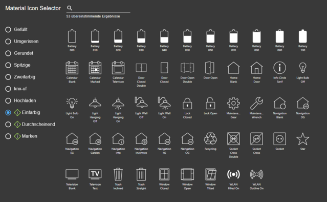
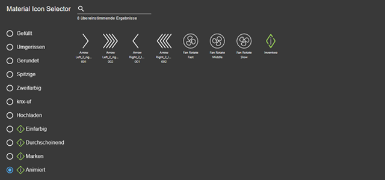

# IoBroker 适配器，适用于 ioBroker.vis 2.0
---

## 为 ioBroker.vis 适配器创建两个图标（仅适用于 VIS-2）
### **请注意：** 这些图标仅适用于 ioBroker.vis-2 适配器的 2.13.5 版本（或更高版本）！
更多信息稍后奉上

### 自版本1.x.x起可用

## 较早的更改
- [CHANGELOG_OLD.md](CHANGELOG_OLD.md)

## Changelog
<!--
	### **WORK IN PROGRESS**
-->
### 1.41.0 (2026-05-24)
- (skvarel) Added: New icons (star and gear filled)

### 1.40.1 (2026-05-24)
- (skvarel) Fixed: Issue repo-checker [W8917]

### 1.40.0 (2026-05-12)
- (skvarel) Added: New Icons (people filled)

### 1.39.0 (2026-05-10)
- (skvarel) Added: New Icons (people & map filled)

### 1.38.1 (2026-04-09)
- (skvarel) Fixed: Added Dependabot cooldown configuration (7 days) to reduce supply chain risk

## License

The MIT License (MIT)

Copyright (c) 2026 skvarel • <sk@inventwo.com>

Permission is hereby granted, free of charge, to any person obtaining a copy
of this software and associated documentation files (the "Software"), to deal
in the Software without restriction, including without limitation the rights
to use, copy, modify, merge, publish, distribute, sublicense, and/or sell
copies of the Software, and to permit persons to whom the Software is
furnished to do so, subject to the following conditions:

The above copyright notice and this permission notice shall be included in
all copies or substantial portions of the Software.

THE SOFTWARE IS PROVIDED "AS IS", WITHOUT WARRANTY OF ANY KIND, EXPRESS OR
IMPLIED, INCLUDING BUT NOT LIMITED TO THE WARRANTIES OF MERCHANTABILITY,
FITNESS FOR A PARTICULAR PURPOSE AND NONINFRINGEMENT. IN NO EVENT SHALL THE
AUTHORS OR COPYRIGHT HOLDERS BE LIABLE FOR ANY CLAIM, DAMAGES OR OTHER
LIABILITY, WHETHER IN AN ACTION OF CONTRACT, TORT OR OTHERWISE, ARISING FROM,
OUT OF OR IN CONNECTION WITH THE SOFTWARE OR THE USE OR OTHER DEALINGS IN
THE SOFTWARE.