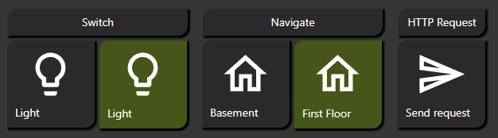
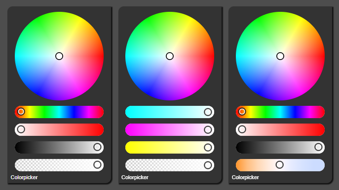

# 为 ioBroker.vis 2.0 开发小部件
＃＃ 关于
为 ioBroker VIS 2.0 添加开关、按钮、滑块等小部件。

＃＃ 内容
用于切换、导航等的各种小部件。

### 通用小部件

#### 各种内容类型

颜色选择器

### 小部件 - 滑块

### 小部件 - 开关

### 小部件 - 复选框

### 小部件—表格

＃＃＃ 设计
所有小部件都提供丰富的自定义设计选项，可根据您的需求定制外观和风格。

### 后续内容敬请期待……

## Changelog
<!--
    Placeholder for the next version (at the beginning of the line):
    ### **WORK IN PROGRESS**
-->
### 0.5.1 (2025-12-24)
- Added missing translations for the previous version

### 0.5.0 (2025-12-24)
- Added radial slider widget (#17)
- Added analog clock content type to universal widget (#100)
- Changed german translation for "custom"

### 0.4.2 (2025-12-22)
- Vite downgrade

### 0.4.1 (2025-12-18)
- Added image type to column for table widget (#97)
- Added custom datetime format support for table widget (#97)
- Fix issue in slider widget when steps is active but value is empty
- Changed module federation version to match vis 2.0 stable

### 0.4.0 (2025-12-13)
- Switched to TypeScript

### 0.3.12 (2025-12-06)
- Fixed content position caused by previous version

### 0.3.11 (2025-12-04)
- Added padding options for dialog titlebar (#102, #153)
- Added "close after x seconds" option for dialog (#102)
- Added option to hide dialog titlebar (#102)
- Added image resize and position options (#101)

### 0.3.10 (2025-11-20)
- Updated dependencies

### 0.3.9 (2025-09-20)
- Fixed border color label in universal widget states (#120)

### 0.3.8 (2025-09-19)
- Fix issue with table border radius and added option to set border radius (#99)
- Fix issue with universal widget and comparison other than "equal" (#109)
- Added option to inherit state colors from other widgets (#120

### 0.3.7 (2025-09-10)
- Removed code to print console logs to a widget for debugging purposes

### 0.3.6 (2025-09-01)
- Extended debugging by printing source file with line number

### 0.3.5 (2025-08-10)
- Fix for previous version

### 0.3.4 (2025-08-09)
- Added code to print console logs to a widget for debugging purposes

### 0.3.3 (2025-07-16)
- Added option to click through universal widget
- Fixed state not used then oid is left empty
- Added options to control table row line width and color
- Removed table background color to allow transparency

### 0.3.2 (2025-07-11)
* Support font styles in table widget (#78)
* Added border and shadow options for table widget (#78)

### 0.3.1 (2025-07-08)
* Change build to vite

### 0.3.0 (2025-07-08)
* Added new widget: Checkbox
* Fixed issue with table widget and object values (#77)
* Fixed translated text (#79)

### 0.2.2 (2025-05-24)
* Fixed build issue

### 0.2.1 (2025-05-23)
* Fixed build issue

### 0.2.0 (2025-05-22)
* Fixed dialog is opened on page load and view change
* New widget: Table

### 0.1.12 (2025-03-31)
* Fixed view in dialog is not triggered on state change and state value is not set when opened (#30)
* Added function to color images (#38)
* Allow custom size for dialog by using binding (#39)
* Fix dialog "close on click from outside" checkbox was inverted (#42)

### 0.1.11 (2024-07-18)
* Fixed issues mentioned by eslint

### 0.1.10 (2024-07-18)
* Removed styles libraries as they are not compatible with vis 2.0
* Fixed compare by for widget type view in dialog (#24)
* Fixed text color not working in slider and added other font styles (#25)
* Fixed switch doesn't toggle without defining values (#28)

### 0.1.9 (2024-05-24)
* Fixed missing object id if a type is nav (#14)
* Fixed content color for icons not working (#22)

### 0.1.7 (2024-05-22)
* Fixed missing object id if a type is nav (#14)
* Fixed image aspect ratio (#15)
* Added options to customize dialog

### 0.1.5 (2024-04-14)
* Added optional button click feedback options
* Added widget type to send http requests and open urls

### 0.1.4 (2024-04-14)
* Fixed issue in workflow

### 0.1.3 (2024-04-14)
* Fixed issue in widget state check. Also includes #12
* Removed second unused field 'button width' (#10)
* Added widget type Increase/Decrease value (#7)
* Added more info to readme
* Removed iobroker/adapter-core dependency
* Added node 20 to test-and-release workflow

### 0.1.2 (2024-04-08)
* Fixed issue editor crashes when changing "Comparison operator" or "Compare by" on multiple states.
* Fixesd issue state settings not used if condition is true.

### 0.1.1 (2024-04-05)
* Fixed wrong default value for comparison operator

### 0.1.0 (2024-04-05)
* Added new widget: Switch
* Added comparison operator and option to check for value or view for each state in universal widget
* Added steps to slider widget
* Fixed issue states not working if type is button or readonly
* Fixed issue value is set with wrong data type

### 0.0.7 (2024-04-03)
* Bug fix

### 0.0.6 (2024-04-03)
* Bug fix

### 0.0.5 (2024-04-02)
* Bug fix

### 0.0.4 (2024-04-01)
* Bug fix
* Added new widget: Table, still work in progress
* CSS settings divided into single groups

### 0.0.3 (2024-03-14)
* Bug fix

### 0.0.2 (2024-03-14)
* Bug fix

### 0.0.1 (2024-03-11)
* (jkvarel) Init

## License
The MIT License (MIT)

Copyright (c) 2025 jkvarel <jk@inventwo.com>

Permission is hereby granted, free of charge, to any person obtaining a copy
of this software and associated documentation files (the "Software"), to deal
in the Software without restriction, including without limitation the rights
to use, copy, modify, merge, publish, distribute, sublicense, and/or sell
copies of the Software, and to permit persons to whom the Software is
furnished to do so, subject to the following conditions:

The above copyright notice and this permission notice shall be included in
all copies or substantial portions of the Software.

THE SOFTWARE IS PROVIDED "AS IS", WITHOUT WARRANTY OF ANY KIND, EXPRESS OR
IMPLIED, INCLUDING BUT NOT LIMITED TO THE WARRANTIES OF MERCHANTABILITY,
FITNESS FOR A PARTICULAR PURPOSE AND NONINFRINGEMENT. IN NO EVENT SHALL THE
AUTHORS OR COPYRIGHT HOLDERS BE LIABLE FOR ANY CLAIM, DAMAGES OR OTHER
LIABILITY, WHETHER IN AN ACTION OF CONTRACT, TORT OR OTHERWISE, ARISING FROM,
OUT OF OR IN CONNECTION WITH THE SOFTWARE OR THE USE OR OTHER DEALINGS IN
THE SOFTWARE.