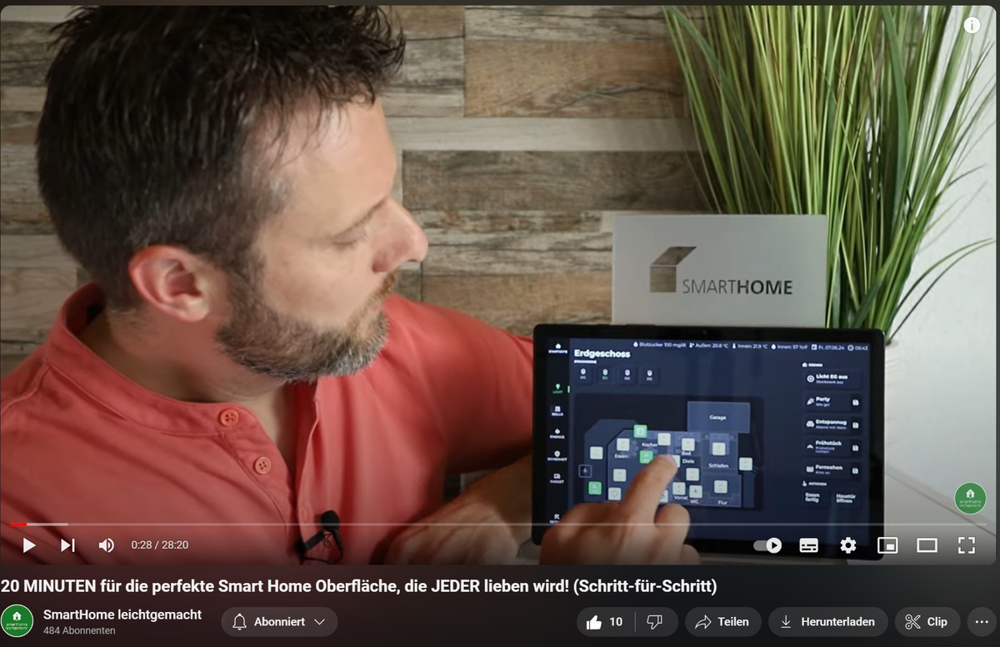

# IoBroker.vis 2.0 的特殊 Jaeger Design 小部件

您可以找到有关如何使用小部件[这里](https://www.youtube.com/playlist?list=PLddhldeLVrtl5Bhj6AAbkLabuIuyV0bVe)（德语）的视频。

视频 wie die Widgets benutzt werden können，kann man [耶尔](https://www.youtube.com/playlist?list=PLddhldeLVrtl5Bhj6AAbkLabuIuyV0bVe) finden。

## 使用“VIS-2 JAEGER 设计适配器”的智能家居 Oberfläche 概要
### 先行者
- 一个ioBroker系统
- Der Jäger 设计适配器（约 50 欧元）
- Grundkenntnisse im Umgang mit ioBroker

### 介绍
Der Jäger Design Adapter 是基于 vis-2 Adapter 和 ermöglicht es，通过单击和放置完成的 Oberfläche。 Verschiedene Widgets können hinzugefügt 和 angepasst werden，um Smart Home Geräte zu steuern。

### 上层建筑
Die Oberfläche besteht aus mehreren Bereichen：

- **Hauptmenü**：链接到 Hauptmenüpunkten 的 Spalte，然后点击它。
- **Statusleiste**：Oben können verschiedene wichtige Statusanzeigen hinzugefügt werden。
- **Mittlerer Bereich**：Hier können Szenen、Aktionen und Hinweise angezeigt werden。 Die rechte Seite ist frei gestaltbar und kann Informationen wie Sicherheit, Wetter, Hausgeräte und Energieverbrauch anzeigen。

### 声明
我的主菜单是位于 werden 的 Stockwerke ausgewählt werden。 Der Grundriss des Erdgeschosses zeigt alle Lichter，die durch Icons dargestellt werden。 Einige Icons 可以在任何地方使用、使用和照明。图标上的图标是带有弹出窗口和滑块的图标。
 法律上的法律约束：

### 罗拉登
我的菜单“Rolladen”可以查看有关的说明。图标位于 Rolladen 的 Höhe 和 Lamellenneigung 的弹出窗口中，并且单击图标。

### 能源
我的“Energie”菜单是在RaumTemperaturen in den einzelnen Räumen gesehen werden 中找到的。图标为 Ist- 和 Solltempern sowie den Zustand der Heizung und Fenster 和。在图标上点击图标，然后在弹出式窗口中进行温度调节和温度调节操作。

### 安全
我的菜单“Sicherheit”可以看到 der Zustand der Fenster gesehen werden。 Geöffnete Fenster werden rot dargestellt。

### 更多功能
Es können auch frei definierte Oberflächen erstellt werden, wie z.B.适配器“消耗”的说明或糖尿病 Nightscout 的说明。我的菜单“设置”可用于多种设置。

### YouTube 教程
有关详细信息和详细信息，请参阅 YouTube 教程和链接。

<!-- 下一版本的占位符（在行首）：

### **正在进行中** -->

## Changelog
### 1.3.9 (2024-12-05)
* (bluefox) Corrected confirmation dialog. Close now works
* (bluefox) Caught the possible error in thermostat

### 1.3.6 (2024-12-04)
* (bluefox) Corrected the icon dialog
* (bluefox) Corrected the ID select dialog
* (bluefox) Corrected the scene buttons

### 1.3.3 (2024-11-25)
* (bluefox) Corrected "close on click" option for shutter and dimmer
* (bluefox) Improved the build pipeline

### 1.3.1 (2024-09-23)
* (bluefox) Removed gulp from a build process
* (bluefox) Added the possibility to select camera from the "cameras" adapter

### 1.2.7 (2024-07-17)
* (bluefox) allowed multi-line buttons for the thermostat

### 1.2.6 (2024-07-16)
* (bluefox) Corrected the power state of the thermostat

### 1.2.5 (2024-07-12)
* (bluefox) Added possibility to control other IDs with memory buttons (Dimmer, Shutter)
* (bluefox) Added the power option for thermostat
* (bluefox) Implemented the writing of specific values for state widget
* (bluefox) Added label to state widget

### 1.2.1 (2024-07-07)
* (bluefox) Removed withStyles usage
* (bluefox) Added confirmation dialog

### 1.1.27 (2024-05-27)
* (bluefox) Added descriptions

### 1.1.26 (2024-05-23)
* (bluefox) Corrected font-size of thermostat

### 1.1.22 (2024-05-14)
* (bluefox) Added possibility to show a simple state without a border
* (bluefox) Added possibility to add a caption for some widgets

### 1.1.21 (2024-05-01)
* (bluefox) Changed layout for mobile view

### 1.1.20 (2024-04-09)
* (bluefox) Allowed changing font size for thermostat

### 1.1.19 (2024-03-12)
* (bluefox) Allowed changing the palette for every widget

### 1.1.15 (2024-03-06)
* (bluefox) Improved dimmer widget

### 1.1.14 (2024-02-21)
* (bluefox) Added top info in the mobile view

### 1.1.12 (2024-02-20)
* (bluefox) Corrected some layout issues

### 1.1.10 (2024-01-19)
* (bluefox) Small changes on layout and added new distance settings

### 1.1.8 (2024-01-18)
* (bluefox) Corrected info button in mobile view

### 1.1.5 (2023-12-05)
* (bluefox) Added an option to start action or scene from new line

### 1.1.0 (2023-11-29)
* (bluefox) Corrected license check
* (bluefox) Added class names to all important layout components

### 1.0.12 (2023-11-22)
* (bluefox) Allowed reordering of the actions and scenes
* (bluefox) Added a new option to show scenes before actions
* (bluefox) Added option to show value in dimmer
* (bluefox) Added option for adjustable width of the right view on the home page
* (bluefox) Added option to provide icons for scenes and actions
* (bluefox) Added option set the distance between menu items
* (bluefox) Added possibility to set control value for scenes
* (bluefox) Added possibility to adjust font size for scenes and actions

### 1.0.11 (2023-11-10)
* (bluefox) Corrected error local variables and controls

### 1.0.10 (2023-11-08)
* (bluefox) Corrected error with scenes
* (bluefox) Improved state widget with custom icons

### 1.0.9 (2023-11-07)
* (bluefox) Allowed setting distance between actions and scenes on the home page

### 1.0.8 (2023-11-06)
* (bluefox) Corrected the cameras widget

### 1.0.7 (2023-10-31)
* (bluefox) Added possibility to reorder info on status bar

### 1.0.5 (2023-10-17)
* (bluefox) Corrected error with fakeView

### 1.0.4 (2023-10-10)
* (bluefox) Corrected layout of thermostat

### 1.0.3 (2023-10-10)
* (bluefox) Corrected error if shutter was inverted

### 1.0.2 (2023-09-28)
* (bluefox) Corrected touch behavior for dimmer and shutter

### 1.0.1 (2023-09-26)
* (bluefox) Corrected small issues

### 1.0.0 (2023-08-11)
* (bluefox) Changed style of shutter and state widgets

### 0.6.5 (2023-08-09)
* (bluefox) Corrected view selector and empty menu item

### 0.6.4 (2023-07-31)
* (bluefox) Set constant width and height of thermostat icons

### 0.6.3 (2023-07-25)
* (bluefox) Added many new features

### 0.6.1 (2023-07-21)
* (bluefox) Added max height/width for floors

### 0.6.0 (2023-07-19)
* (bluefox) Corrected some errors with information

### 0.5.2 (2023-07-02)
* (bluefox) Support of false for scenes

### 0.5.0 (2023-06-28)
* (bluefox) Added support for the new vis
* (bluefox) Added page configurable margins

### 0.4.6 (2023-06-19)
* (bluefox) Corrected sub menu

### 0.4.5 (2023-06-13)
* (bluefox) Corrected visualization of view

### 0.4.0 (2023-05-31)
* (bluefox) Added exclusions
* (bluefox) Added possibility to show information on the very top of layout

### 0.3.2 (2023-04-05)
* (bluefox) Corrected license problem

### 0.3.1 (2023-03-22)
* (bluefox) Corrected build process

### 0.3.0 (2023-03-21)
* (bluefox) Implemented dark mode

### 0.2.3 (2023-03-09)
* (bluefox) update packages

### 0.2.2 (2023-03-06)
* (bluefox) Updated thermostat widget

### 0.2.1 (2023-02-03)
* (bluefox) Mobile views tuned

### 0.2.0 (2023-02-01)
* (bluefox) implemented mobile view

### 0.1.3 (2023-01-30)
* (bluefox) initial commit

## License
Copyright (c) 2022-2024 bluefox <dogafox@gmail.com>
All rights reserved.