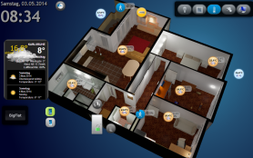

# IoBroker 的下一代可视化：vis-2
ioBroker平台的WEB可视化。

＃＃ 概述
- [许可证要求](#license-requirements)
- [安装与文档](#installation--documentation)
- [对象绑定](#bindings-of-objects)
- [筛选条件](#filters)
- [控制接口](#control-interface)
- [默认视图](#default-view)
- [权限系统](#permissions-system)
- [设置](#settings)
- [SVG 和 currentColor](#svg-and-currentcolor)

安装与文档
 

[在线演示](https://iobroker.click/)

## 对象的绑定
通常情况下，大多数组件都有一个 ObjectID 属性，该属性可以绑定到某个对象 ID 值。

但还有另一种方法可以将组件的*任何*属性绑定到某个 ObjectID。

只需将值写入属性 `{object.id}`（例如 `{hm-rpc.0.OEQ1880105.4.ACTUAL_TEMPERATURE}`），它就会绑定到此对象的值。

如果使用特殊格式，您甚至可以对其进行一些简单的操作，例如乘法或格式化。

例如，计算三角形的斜边：

`{h:javascript.0.myCustom.height;w:javascript.0.myCustom.width;Math.max(20, Math.sqrt(h*h + w*w))}` 将被解释为函数：

```js
value = await (async function () {
    var h = (await getState('javascript.0.myCustom.height')).val;
    var w = (await getState('javascript.0.myCustom.width')).val;
    return Math.max(20, Math.sqrt(h * h + w * w));
})();
```

或者

`{h:javascript.0.myCustom.height;w:javascript.0.myCustom.width;h*w}` 将简单地将高度乘以宽度。

您可以使用*任何* JavaScript（浏览器）函数。参数必须用冒号“:”定义，否则将被解释为公式。

注意类型。它们都被定义为字符串。为了确保该值会被当作数字处理，请使用 parseFloat 函数。

因此，我们的斜边计算公式为：

```
{h:javascript.0.myCustom.height;w:javascript.0.myCustom.width;Math.max(20, Math.sqrt(Math.pow(parseFloat(h), 2) + Math.pow(parseFloat(w), 2)))}
```

### 已弃用的格式
图案格式如下：

```
{objectID;operation1;operation2;...}
```

支持以下操作：

- `*` - 表示乘法。参数必须用方括号括起来，例如“*(4)”。在本例中，我们将该值乘以 4。
- `+` - 表示加法。参数必须用方括号括起来，例如“+(4.5)”。在这个例子中，我们将值 4.5 加上一个数。
- `-` - 表示减法。参数必须用方括号括起来，例如“-(-674.5)”。在本例中，我们从值 -674.5 中减去。
- `/` - 表示除法。参数必须用方括号括起来，例如“/(0.5)”。在本例中，我们将该值除以 0.5。
- `%` - 取模。参数必须用方括号括起来，例如 "%(5)"。在本例中，我们对 5 取模。
- `round` - 将数值四舍五入。
- `round(N)` - 将数值小数点后保留 N 位，例如，34.678;round(1) => 34.7
- `hex` - 将值转换为十六进制值。所有字母均为小写。
- `hex2` - 将值转换为十六进制值。所有字母均为小写。如果值小于 16，则会在前面添加一个零。
- `HEX` - 与 hex 相同，但大写。
- `HEX2` - 与 hex2 相同，但全部大写。
- `date` - 根据给定格式格式化日期。格式与 [iobroker.javascript](https://github.com/iobroker/iobroker.javascript/blob/master/README.md#formatdate) 中的格式相同。
- `min(N)` - 如果值小于 N，则取 N，否则取值。
- `max(M)` - 如果值大于 M，则取 M，否则取值。
- `sqrt` - 平方根
- `pow(n)` - N 的幂。
- `pow` - 2 的幂。
- `floor` - Math.floor
- `ceil` - Math.ceil
- `json` - 用于获取 JSON 或对象属性的操作。例如，`{id;json(common.name.en)}`
- `random(R)` - Math.random() * R，如果没有参数，则直接使用 Math.random()
- `formatValue(decimals)` - 根据系统设置格式化值并使用小数
- `date(format)` - 将值格式化为日期。格式类似于：“YYYY-MM-DD hh:mm:ss.sss”
- `momentDate(format, useTodayOrYesterday)` - 使用 Moment.js 将值格式化为日期。[必须根据 moment.js 库的说明输入已批准的格式](https://momentjs.com/docs/#/displaying/format/)。如果使用 `useTodayOrYesterday=true`，`moment.js` 格式 `ddd`/`dddd` 将被覆盖为今天/昨天。
- `array(element1,element2[,element3,element4])` - 返回索引处的元素。例如：`{id.ack;array(ack is false,ack is true)}`

你可以在任何文本中使用此模式，例如

```
My calculations with {objectID1;operation1;operation2;...} are {objectID2;operation3;operation4;...}
```

或颜色计算：

```
#{objectRed;/(100);*(255);HEX2}{objectGreen;HEX2}{objectBlue;HEX2}
```

要在对象 ID 末尾添加 `.ts` 或 `.lc`（表示最后修改时间），例如：

```
Last change: {objectRed.lc;date(hh:mm)}
```

### 特殊装订
有许多不同的内部绑定，用于在视图中提供附加信息：

* `username` - 显示已登录用户
* `view` - 实际视图的名称
* `wname` - 小部件名称
* `widget` - 是一个包含组件所有数据的对象。只能在 JavaScript 部分使用，例如 `{a:a;widget.data.name}`
* `widgetOid` - 使用小部件的 OID 在赋值部分为小部件赋值，例如 `{t:widgetOid.val;t}`
* `wid` - 实际控件的名称
* `language` - 可以是 `de`、`en` 或 `ru`。
* `实例` - 浏览器实例
* `login` - 是否需要登录（例如，显示/隐藏注销按钮）
* `local_*` - 如果状态名称以 `local_` 开头，则不会将其报告给 ioBroker，但会更新所有依赖于此状态的小部件。（当前浏览器会话的本地变量）

注意：要在计算中使用“:”（例如，在字符串公式中），请改用“::”。

**请记住**，样式定义将被解释为绑定，因此请使用 `{{style: value}}` 或直接使用。

```
{
	style: value
}
```

为此。

## 过滤器
为了在一个视图中可视化所有控件，您可以使用过滤器来减少视图中同时显示控件的数量。

每个小部件都有一个字段`filter`。如果您将其设置为某个值，例如`light`，则可以使用其他小部件`(bars - filters, filter - dropdown)`来控制哪个过滤器实际处于活动状态。

## 控制接口
Vis 创建了 3 个变量：

- `control.instance` - 此处应写入浏览器实例，如果要控制每个浏览器，则应写入 `FFFFFFFF`。
- `control.data` - 命令参数。请参阅具体命令说明。
- `control.command` - 命令名称。写入此变量以触发命令。这意味着在写入命令之前，“instance”和“data”必须已准备好数据。

命令：

* `alert` - 在 vis-2 中显示一个警告窗口。“control.data” 的格式为“message;title;jquery-icon”。标题和 jquery-icon 是可选的。图标名称可以在[这里](http://jqueryui.com/themeroller/)找到。要显示图标“ui-icon-info”，请写成 `Message;;info`。
* `changeView` - 切换到所需的视图。“control.data”必须包含视图名称。您也可以指定项目名称，例如 `project/view`。默认项目为 `main`。
* `refresh` - 重新加载 vis-2，例如在项目更改后在所有浏览器上重新加载。
* `reload` - 与 refresh 相同。
* `dialog` - 显示对话框窗口。对话框必须处于可见状态。选项之一：

- `静态 - HTML - 对话框`，
- `静态 - 图标 - 对话框`，
- `container - HTML - view in jqui Dialog`，
- `container - ext cmd - view in jqui Dialog`，
- `容器 - 图标 - 在 jqui 对话框中查看`，
- `容器 - 按钮 - 在 jqui 对话框中查看`。

`control.data` 必须具有对话框控件的 id，例如 `w00056`。

* `dialogClose`
* `popup` - 打开一个新的浏览器窗口。链接必须在 `control.data` 中指定，例如 http://google.com
* `playSound` - 播放声音文件。文件链接在 `control.data` 中指定，例如 http://www.modular-planet.de/fx/marsians/Marsiansrev.mp3。

您可以在 vis-2 中上传自己的文件，并使其播放，例如 `/vis-2.0/main/img/myFile.mp3`。

**重要提示**：浏览器在用户至少点击一次页面之前无法播放音频。这是浏览器的安全策略。您可以阅读更多内容 [这里](https://github.com/Hugo22O/chrome-autoplay)。

如果用户更改视图或在启动时，vis-2 将填充变量。

- `control.instance`：浏览器实例且 `ack=true`
- `control.data`：项目和视图名称，格式为 `project/view`，例如 `main/view`（以及 `ack=true`）
- `control.command`: `changedView` 和 `ack=true`

您可以将 JSON 字符串或对象写入 `control.command` 或 `{instance: 'AABBCCDD', command: 'cmd', data: 'ddd'}`。在这种情况下，实例和数据将从 JSON 对象中获取。

JavaScript适配器示例：

```js
setState('vis-2.0.control.command', { instance: '*', command: 'refresh', data: ''});
```

如果将 JSON 写成字符串，请确保它是可解析的，例如 `{"instance": "*", "command": "refresh", "data": ""}`，注意 `"`。

## 默认视图
您可以为每个视图定义所需的分辨率（菜单=>工具=>分辨率）。

这只是编辑模式下的视觉边框，用于显示特定设备的屏幕尺寸。在实时模式下，该边框将不可见，边框外的所有控件都可见。

此外，您还可以定义是否必须将此视图用作此分辨率的默认视图。

因此，每次调用 `index.html`（不包含 `#viewName`）时，都会打开最适合该分辨率的视图。

如果只有一个视图具有 *"Default"* 标志，则无论屏幕分辨率或方向如何，都会打开此视图。

例如，您可以创建“横屏移动”和“竖屏移动”两种视图，当您更改屏幕方向或屏幕尺寸时，这两种视图将自动切换。

有一个名为“基本 - 屏幕分辨率”的辅助小部件，它会显示实际屏幕分辨率以及最适合该分辨率的默认视图。

## 权限系统
＃＃＃ 项目
在项目管理对话框中，您可以为每个 ioBroker 用户配置 `read` 和 `write` 权限。

`read` 标志表示该项目在该用户运行时模式下可访问。

`write` 标志表示该项目在该用户编辑模式下可访问。

通过 ioBroker Admin 适配器创建新用户时，默认情况下该用户将同时拥有这两种权限。

＃＃＃ 看法
您还可以指定用户在运行时和编辑模式下可以访问哪些视图。

如果某个访问权限未在项目级别授予，则在视图级别指定这些权限无效，因为整个项目将无法访问。

请注意，每当您尝试访问当前用户没有权限的视图时，用户将看到项目选择面板。

### 小部件
如果用户没有 `read` 权限，则该组件在运行时不会渲染。如果用户没有 `write` 权限，则该组件在编辑模式下不会渲染。

＃＃ 设置
### 如果睡眠时间超过一定时长，请重新加载
有一条规则，当连接断开一段时间后，整个 VIS 页面将自动重新加载以同步项目。

您可以在“设置...”菜单中进行配置。如果您将间隔设置为“从不”，则页面将永远不会重新加载。

### 重连间隔
设置断开连接后重新连接尝试的间隔时间。如果设置为 2 秒，则会每 2 秒尝试重新建立连接。

### 暗黑重连屏幕
有时（例如在夜间）需要使用深色加载界面。您可以通过此选项进行设置。

请注意，这些设置仅对重新连接有效，对首次连接无效。


## SVG 和 currentColor
CSS 中的 currentColor 关键字允许元素继承其父元素的当前文本颜色。

它在 SVG（可缩放矢量图形）中尤其有用，因为它支持更动态的样式设置，并且更容易与 HTML 内容集成。

对于 SVG 中任何接受颜色值的属性，您可以使用 `currentColor` 关键字来代替具体的颜色值。

以下是一个包含圆形的简单 SVG 示例：

```xml
<svg width="100" height="100" xmlns="http://www.w3.org/2000/svg">
    <circle cx="50" cy="50" r="40" fill="currentColor" />
</svg>
```

在这种情况下，SVG 会采用父元素的颜色。

例如，如果它用于菜单中，而菜单是红色的，那么圆圈也会是红色的。

## 开发和调试
为了对 vis-2 编辑器本身进行调整、查找错误和进行调试，必须执行以下步骤。

1. 通过 GitHub 用户界面，将 iobroker/iobroker.vis-2 代码库 fork 到您自己的帐户。

2. 将仓库克隆到某个目录。复制 GitHub 仓库的 URL。命令如下：

```shell
git clone https://github.com/<your profile name>/ioBroker.vis-2.git
```

3. 使用你的 IDE 打开下载的仓库。

4. 要安装和下载所有必要的库，请在仓库根目录下的终端中运行以下命令。

```shell
npm run install-monorepo
```

5. 要在浏览器中启动编辑器，请执行以下命令。

必须在端口 8082 上提供一个已独立运行的 iobroker 服务器实例。

```shell
npm run start
```

- 调试功能可在浏览器中使用，例如 Chrome 浏览器，按 F12 键。
- 如果更改文件，编辑器支持自动重新加载。

## 待办事项
<!-- 下一版本的占位符（位于行首）：

### **正在进行中** -->

## Changelog
### 2.13.17 (2026-03-29)
* (@GermanBluefox) Removed debug code for theme

### 2.13.16 (2026-03-26)
* (@GermanBluefox) Fixing the usage of umlauts in patterns
* (@GermanBluefox) Fixing commands via control interface when sent as JSON

### 2.13.8 (2025-11-15)
* (@GermanBluefox) Updated packages

### 2.13.7 (2025-11-09)
* (@GermanBluefox) Updated packages
* (@GermanBluefox) Corrected the basic image refreshing

### 2.13.6 (2025-10-10)
* (@GermanBluefox) Prevent error by the icon selection dialog

## License
To use this adapter in `ioBroker` you need to accept the source code license of the adapter. The source code of this adapter is available under the CC BY-NC license.

Additionally, you need a license to use the adapter. The following license editions are available on https://iobroker.net/www/pricing 
* **Community-License: Free for private use!**: Get a free license by registering an account on [https://iobroker.net](https://iobroker.net). The license if checked online against the ioBroker license server when the vis-2 adapter is started, so an online connection at this time point is required!
* **Private use Offline-License**: For paying a small support fee, you can get rid of the required online license check on adapter startup. **Only for Private use!**
* **Commercial License**: When using Vis in a commercial environment or selling Vis as a part of ioBroker packages to your customers, this license is for you. License check is also not requiring an online connection.

## License
 Copyright (c) 2021-2026 Denis Haev, https://github.com/GermanBluefox <dogafox@gmail.com>,
  
 Creative Common Attribution-NonCommercial (CC BY-NC)

 http://creativecommons.org/licenses/by-nc/4.0/


Short content:
Licensees may copy, distribute, display and perform the work and make derivative works based on it only if they give the author or licensor the credits in the manner specified by these.
Licensees may copy, distribute, display, and perform the work and make derivative works based on it only for noncommercial purposes.
(Free for non-commercial use).