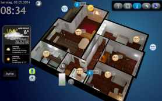

# IoBroker 的下一代可视化：vis-2
ioBroker 平台的 WEB 可视化。

＃＃ 概述
- [许可要求](#license-requirements)
- [安装和文档](#installation--documentation)
- [对象绑定](#bindings-of-objects)
- [过滤器](#filters)
- [控制接口](#control-interface)
- [默认视图](#default-view)
- [权限系统](#permissions-system)
- [设置](#settings)
- [SVG 和 currentColor](#svg-and-currentcolor)

安装和文档


[在线演示](https://iobroker.click/)

## 对象绑定
通常，大多数小部件都具有 ObjectID 属性，并且此属性可以与某个对象 ID 值绑定。
但是，还有另一种方法可以将小部件的 *任何* 属性绑定到某个 ObjectID。

只需写入属性`{object.id}`（例如`{hm-rpc.0.OEQ1880105.4.ACTUAL_TEMPERATURE}`），它就会绑定到此对象的值。
如果您使用特殊格式，您甚至可以使用它进行一些简单的操作，例如乘法或格式化。

例如，计算三角形的斜边：

`{h:javascript.0.myCustom.height;w:javascript.0.myCustom.width;Math.max(20, Math.sqrt(h*h + w*w))}` 将被解释为函数：

```js
value = await (async function () {
    var h = (await getState('javascript.0.myCustom.height')).val;
    var w = (await getState('javascript.0.myCustom.width')).val;
    return Math.max(20, Math.sqrt(h * h + w * w));
})();
```

或者

`{h:javascript.0.myCustom.height;w:javascript.0.myCustom.width;h*w}` 将简单地将高度与宽度相乘。

您可以使用*任何* javascript（浏览器）函数。参数必须用“:”定义，否则将被解释为公式。

注意类型。它们全部定义为字符串。要确保该值将被视为数字，请使用 parseFloat 函数。

因此我们的斜边计算如下：

```js
{h:javascript.0.myCustom.height;w:javascript.0.myCustom.width;Math.max(20, Math.sqrt(Math.pow(parseFloat(h), 2) + Math.pow(parseFloat(w), 2)))}
```

### 弃用的格式
Patten 的格式如下：

```js
{objectID;operation1;operation2;...}
```

支持以下操作：

- `*` - 乘法。参数必须放在括号中，如“*(4)”。在此示例中，我们将值乘以 4。
- `+` - 添加。参数必须放在括号中，如“+(4.5)”。在此示例中，我们将值添加到 4.5。
- `-` - 减去。参数必须放在括号中，如“-(-674.5)”。在此示例中，我们从值 -674.5 中减去。
- `/` - 除法。参数必须放在括号中，如“/(0.5)”。在此示例中，我们将值除以 0.5。
- `%` - 模数。参数必须放在括号中，如“%(5)”。在此示例中，我们取 5 的模数。
- `round` - 对值进行四舍五入。
- `round(N)` - 将值四舍五入到小数点后 N 位，例如 34.678；round(1) => 34.7
- `hex` - 将值转换为十六进制值。所有字母均为小写。
- `hex2` - 将值转换为十六进制值。所有字母均为小写。如果值小于 16，则将添加前导零。
- `HEX` - 与 hex 相同，但大写。
- `HEX2` - 与 hex2 相同，但大写。
- `date` - 根据给定格式格式化日期。格式与 [iobroker.javascript](https://github.com/iobroker/iobroker.javascript/blob/master/README.md#formatdate) 中的格式相同
- `min(N)` - 如果值小于 N，则取 N，否则取值
- `max(M)` - 如果值大于 M，则取 M，否则取值
- `sqrt` - 平方根
- `pow(n)` - N 的幂。
- `pow` - 2 的幂。
- `floor` - Math.floor
- `ceil` - Math.ceil
- `json` - 获取 json 或对象属性的操作。例如，`{id;json(common.name.en)}`
- `random(R)` - Math.random() * R，如果没有参数则仅使用 Math.random()
- `formatValue(decimals)` - 根据系统设置格式化值并使用小数
- `date(format)` - 将值格式化为日期。格式如下：“YYYY-MM-DD hh:mm:ss.sss”
- `momentDate(format, useTodayOrYesterday)` - 使用 Moment.js 将值格式化为日期。[必须根据 moment.js 库输入批准的格式](https://momentjs.com/docs/#/displaying/format/)。使用 `useTodayOrYesterday=true` 时，`moment.js` 格式 `ddd`/`dddd` 将被今天/昨天覆盖
- `array(element1,element2[,element3,element4])` - 返回索引的元素。例如：`{id.ack;array(ack is false,ack is true)}`

您可以在任何文本中使用此模式，例如

```
My calculations with {objectID1;operation1;operation2;...} are {objectID2;operation3;operation4;...}
```

或颜色计算：

```
#{objectRed;/(100);*(255);HEX2}{objectGreen;HEX2}{objectBlue;HEX2}
```

要显示对象的时间戳，请在对象 ID 末尾写入`.ts` 或`.lc`（表示最后更改），例如：

```
Last change: {objectRed.lc;date(hh:mm)}
```

### 特殊绑定
有许多不同的内部绑定可以在视图中提供附加信息：

* `username` - 显示已登录的用户
* `view` - 实际视图的名称
* `wname` - 小部件名称
* `widget` - 是包含所有 widget 数据的对象。只能在 JS 部分使用，例如 `{a:a;widget.data.name}`
* `widgetOid` - 使用小部件的 OID 在分配部分分配小部件的值，例如 `{t:widgetOid.val;t}`
* `wid` - 实际小部件的名称
* `language` - 可以是 `de`、`en` 或 `ru`。
* `instance` - 浏览器实例
* `login` - 是否需要登录（例如，显示/隐藏注销按钮）
* `local_*` - 如果状态名称从 `local_` 开始，则不会报告给 ioBroker，但会更新所有依赖于此状态的小部件。（当前浏览器会话的局部变量）

注意：要在计算中使用“：”（例如，在字符串公式中），请改用“::”。

**请记住**，样式定义将被解释为绑定，因此请使用`{{style: value}}` 或仅

```
{
	style: value
}
```

为此。

## 过滤器
为了在一个视图上直观地显示所有小部件的数量，您可以使用过滤器来减少视图上同时显示的小部件的数量。

每个小部件都有一个字段`filter`。如果您将其设置为某个值，例如`light`，那么您可以使用其他小部件`(bars - filters, filter - dropdown)`来控制哪个过滤器实际上处于活动状态。

## 控制接口
Vis 创建了 3 个变量：

- `control.instance` - 如果必须控制每个浏览器，则此处应写入浏览器实例或`FFFFFFFF`。
- `control.data` - 命令的参数。请参阅具体命令说明。
- `control.command` - 命令名称。写入此变量将触发命令。这意味着在写入命令之前，必须准备好“实例”和“数据”的数据。

命令：

* `alert` - 在 vis-2 中显示警告窗口。“control.data”具有以下格式“message;title;jquery-icon”。标题和 jquery-icon 是可选的。图标名称可以在[此处](http://jqueryui.com/themeroller/) 找到。要显示图标“ui-icon-info”，请写入 `Message;;info`。
* `changeView` - 切换到所需视图。“control.data”必须具有视图名称。您也可以将项目名称指定为`project/view`。默认项目是`main`。
* `refresh` - 重新加载 vis-2，例如在项目更改为在所有浏览器上重新加载后。
* `reload` — 与刷新相同。
* `dialog` - 显示对话框。对话框必须存在于视图中。以下之一：

- `静态 - HTML - 对话框`,
- `静态-图标-对话框`,
- `jqui 对话框中的容器 - HTML - 视图`,
- `容器 - ext cmd - jqui 对话框中的视图`,
- `容器-图标-在 jqui 对话框中查看`,
- `容器-按钮-在 jqui 对话框中查看`。

`control.data` 必须具有对话框小部件的 id，例如 `w00056`。

*`对话框关闭`
* `popup` - 打开一个新的浏览器窗口。必须在 `control.data` 中指定链接，例如 http://google.com
* `playSound` - 播放声音文件。文件链接在 `control.data` 中指定，例如 http://www.modular-planet.de/fx/marsians/Marsiansrev.mp3。

您可以在 vis-2 中上传自己的文件并让其播放，例如 `/vis-2.0/main/img/myFile.mp3`。
**重要** 浏览器无法播放音频，除非用户至少点击过一次页面。这是浏览器安全策略。[这里](https://github.com/Hugo22O/chrome-autoplay) 您可以阅读更多内容。

如果用户在开始时更改视图，则变量将由 vis-2 填充

- `control.instance`：浏览器实例和 `ack=true`
- `control.data`：项目和视图名称，格式为 `project/view`，例如 `main/view`（和 `ack=true`）
- `control.command`: `changedView` 和 `ack=true`

您可以将 JSON 字符串或对象写入 `control.command` 中，例如 `{instance: 'AABBCCDD', command: 'cmd', data: 'ddd'}`。在这种情况下，实例和数据将从 JSON 对象中获取。

JavaScript 适配器示例：

```js
setState('vis-2.0.control.command', { instance: '*', command: 'refresh', data: ''});
```

如果将 JSON 写为字符串，请确保它是可解析的，例如 `{"instance": "*", "command": "refresh", "data": ""}`，请注意 `"`。

## 默认视图
您可以为每个视图定义所需的分辨率（菜单=>工具=>分辨率）。
这只是编辑模式下的可视边框，用于显示某些特定设备的屏幕尺寸。在实时模式下，它将不可见，并且边框外的所有小部件都将可见。

此外，您可以定义是否必须将此视图用作此分辨率的默认视图。

因此，每次调用`index.html`（不带`#viewName`）时，都会打开最适合此分辨率的视图。
如果只有一个视图具有“默认”标志，则无论屏幕分辨率或方向如何，都会打开此视图。

例如，您可以创建两个视图“Landscape-Mobile”和“Portrait-Mobile”，当您改变方向或屏幕尺寸时，这两个视图将自动切换。

有一个辅助小部件“基本 - 屏幕分辨率”，可以显示实际屏幕分辨率和最适合该分辨率的默认视图。

## 权限系统
＃＃＃ 项目
在项目管理对话框中，您可以为每个 ioBroker 用户配置`read` 和`write` 权限。

`read` 标志表示此用户可以在运行时访问该项目。
`write` 标志表示此用户可以在编辑模式下访问该项目。

当通过 ioBroker Admin 适配器创建新用户时，默认情况下它将同时拥有两种权限。

＃＃＃ 看法
您还可以指定允许用户在运行时和编辑模式下访问哪些视图。
当未在项目级别授予其中一项访问权限时，在视图级别指定这些访问权限不会产生任何影响，因为整个项目将无法访问。

请注意，每当您尝试访问当前用户没有权限的视图时，用户将看到项目选择面板。

### 小部件
如果用户没有`read`权限，则小部件将不会在运行时呈现。如果用户没有`write`权限，则小部件将不会在编辑模式下呈现。

＃＃ 设置
### 如果睡眠时间超过
有一条规则，在断线一段时间后，整个 VIS 页面将重新加载以同步项目。
您可以在菜单“设置...”中配置它。如果您将间隔设置为“永不”，那么页面将永远不会重新加载。

### 重新连接间隔
设置断开连接时尝试连接的间隔。如果设置为 2 秒，则每 2 秒尝试建立连接一次。

### 重新连接屏幕变暗
有时（在晚上）需要使用暗色加载屏幕。使用此选项，您可以设置它。

请注意，这些设置仅对重新连接有效，对第一次连接无效。


## SVG 和 currentColor
CSS 中的 currentColor 关键字允许元素从其父元素继承当前文本颜色。
它在 SVG（可缩放矢量图形）中特别有用，因为它允许更动态的样式和更轻松地与 HTML 内容集成。

您可以使用 currentColor 关键字代替 SVG 中任何接受颜色值的属性的特定颜色值。
以下是 SVG 中带有圆圈的简单示例：

```xml
<svg width="100" height="100" xmlns="http://www.w3.org/2000/svg">
    <circle cx="50" cy="50" r="40" fill="currentColor" />
</svg>
```

在这种情况下，如果 SVG 采用父元素的颜色。
例如，如果它在菜单中使用并且菜单是红色的，则圆圈将是红色的。

## 开发和调试
为了对 vis-2 编辑器本身进行调整、搜索错误和调试，必须执行以下步骤。

1. 通过 GitHub 的用户界面将 iobroker/iobroker.vis-2 存储库分叉到您自己的帐户中

2. 将存储库克隆到目录中。从 GitHub 存储库复制 URL。命令如下

```shell
git clone https://github.com/<your profile name>/ioBroker.vis-2.git
```

3. 使用 IDE 打开下载的存储库

4. 要安装和下载所有必要的库，请在存储库根目录中的终端中运行以下命令

```shell
npm run install-monorepo
```

5.要在浏览器中启动编辑器，请执行以下命令。

端口 8082 上必须有一个单独运行的 iobroker 服务器实例。

```shell
npm run start
```

- 可在浏览器中进行调试，例如 chrome F12
- 如果您更改文件，则支持自动重新加载编辑器

待办事项
<!-- 下一版本的占位符（在行首）：

### **正在进行中** -->

## Changelog
### 2.11.1 (2024-12-02)
* (@GermanBluefox) Corrected navigation menu
* (@GermanBluefox) Migrated widgets to React: basic - frame, basic - note, basic - logout 
* (@GermanBluefox) Added the HTML rebuild button to settings
* (@GermanBluefox) Backend was migrated to TypeScript

### 2.10.8 (2024-11-22)
* (bluefox) Added new option for view: "Limit only for instances"

### 2.10.7 (2024-07-23)
* (bluefox) Optimization of the module federation

### 2.10.6 (2024-07-20)
* (bluefox) Improved the typing in typescript

### 2.10.4 (2024-07-16)
* (bluefox) Corrected the jumping by object selection
* (bluefox) Implemented swipe widget

### 2.10.3 (2024-07-11)
* (bluefox) Converted the CanJSWidget to typescript
* (bluefox) Added "clone" button to the attribute groups

### 2.10.2 (2024-07-10)
* (bluefox) Removed incompatible package for styles
* (bluefox) All widgets must be updated
* (bluefox) The basic input value widget was migrated to ReactJS

### 2.9.64 (2024-05-23)
* (bluefox) Added possibility to clear a text field by button

### 2.9.63 (2024-05-15)
* (bluefox) Migrated some files to typescript

### 2.9.60 (2024-05-07)
* (foxriver76) test automatic release

### 2.9.53 (2024-05-06)
* (bluefox) Allowed applying styles to jQui buttons

### 2.9.52 (2024-04-25)
* (bluefox) Navigation was improved: adjustable menu width and bulk edit were added

### 2.9.50 (2024-04-19)
* (bluefox) Corrected widget in widget behavior

### 2.9.49 (2024-04-11)
* (bluefox) Corrected the scroll buttons in Tabs widget
* (bluefox) Corrected resizers if the border width is set

### 2.9.48 (2024-03-30)
* (bluefox) Showed selected view in the view dialog
* (bluefox) Added customization of loading screen
* (bluefox) Respected the sentry disable flag in GUI

### 2.9.42 (2024-03-09)
* (bluefox) Allowed limiting the view size only on desktop
* (bluefox) Change word "Filter" to "Search"

### 2.9.40 (2024-03-05)
* (bluefox) Migrated the filter widget to react
* (bluefox) Migrated the basic link widget to react

### 2.9.39 (2024-03-01)
* (foxriver76) allow to use `widgetOid` in bindings
* (foxriver76) fixed various problems with Date Picker widget
* (foxriver76) made default option of Date Picker human readable and added option for full parseable date
* (bluefox) Added the possibility to add suffix by navigation widgets
* (bluefox) Improved the license manager

### 2.9.37 (2024-02-28)
* (foxriver76) TimePicker widget now saves the time instead of date by default, if you want old behavior use checkbox `asDate`

### 2.9.36 (2024-02-27)
* (foxriver76) fixed project-specific css not being applied

### 2.9.35 (2024-02-27)
* (foxriver76) user-specified css has now priority over widgets css
* (foxriver76) fixed crash case for broken grouped widgets

### 2.9.34 (2024-02-26)
* (foxriver76) detect admin user correctly in project permissions dialog

### 2.9.33 (2024-02-21)
* (foxriver76) fixed issue that last image is never shown in image8 widget
* (foxriver76) added possibility to define background and title color for jqui dialog
* (foxriver76) make it possible to click through signal image if in front of widget

### 2.9.32 (2024-02-16)
* (foxriver76) implemented buttons to show or hide all views in views manager
* (foxriver76) fixed issue with signals on RxWidgets
* (foxriver76) allow disabling Sentry only for this instance

### 2.9.31 (2024-02-06)
* (foxriver76) apply default overflow correctly
* (foxriver76) navigation style fixes (fix an icon background and allow to customize header text color)

### 2.9.30 (2024-02-06)
* (foxriver76) global css will no longer be deleted on adapter upload/update
* (foxriver76) allowed modifying style of navigation

### 2.9.29 (2024-02-05)
* (foxriver76) fixed multiple problems with nested groups
* (foxriver76) also made group/ungroup commands working in group view
* (foxriver76) allowed selecting widgets in a group via click (previously only dropdown worked)
* (foxriver76) fixed issue, that Basic Image 8 is not configurable for value 0

### 2.9.28 (2024-02-03)
* (foxriver76) correctly determine the vis instance in all cases

### 2.9.26 (2024-02-02)
* (foxriver76) do not show empty icon category if jquery style selected for jquery button widgets
* (foxriver76) added possibility to hide navigation after selection

### 2.9.25 (2024-01-29)
* (foxriver76) fixed resizing issue for relative widgets
* (foxriver76) do not crash when using visibility "only for groups"
* (foxriver76) do not crash if a widget tries to update widget on non-existent view

### 2.9.24 (2024-01-24)
* (foxriver76) Image 8 widget ported to react

### 2.9.23 (2024-01-24)
* (foxriver76) fixed another bug due to previous versions

### 2.9.22 (2024-01-22)
* (foxriver76) try to fix problems introduced with 2.9.21

### 2.9.21 (2024-01-19)
* (foxriver76) fixed crash case when fixing widgets
* (foxriver76) fixed bug, that opacity is applied twice on image edit mode overlay

### 2.9.20 (2024-01-18)
* (foxriver76) increased timeout for project import
* (foxriver76) added permissions on widget level

### 2.9.19 (2024-01-17)
* (foxriver76) fixed issue when resizing widget from the left side
* (foxriver76) added select box to dimension attributes if multiple widgets selected

### 2.9.18 (2024-01-15)
* (foxriver76) fixed issue that old attributes value is shown in some scenarios
* (foxriver76) dedicated permission system extended to view level

### 2.9.17 (2024-01-13)
* (foxriver76) dedicated permission system on project level introduced

### 2.9.16 (2024-01-11)
* (foxriver76) use the correct fallback values for widget signals determination

### 2.9.15 (2024-01-09)
* (foxriver76) fixed issue with BulkEditor

### 2.9.14 (2024-01-09)
* (foxriver76) fixed last change y-offset for some widgets
* (foxriver76) fixed issue where JquiState did not respect data type
* (foxriver76) fixed issues with BulkEdtior (dialog not closing and other dialog showing the wrong button)
* (foxriver76) implemented workaround resize bug for https://github.com/devbookhq/splitter/issues/15

### 2.9.13 (2024-01-08)
* (foxriver76) correctly detect IDs in bindings when they contain hash character
* (foxriver76) fix crash when multiple JquiState widgets selected
* (foxriver76) prevent showing widget in a group after it is already cut out
* (foxriver76) prevent usage of widgets which are not in a group for calculating rulers on group view

### 2.9.12 (2024-01-04)
* (foxriver76) optimized copy/paste/cut in groups

### 2.9.11 (2024-01-02)
* (foxriver76) fixed bug with visibility calculation

### 2.9.10 (2024-01-02)
* (foxriver76) remove accidentally added script file, which leads to crash

### 2.9.9 (2024-01-01)
* (foxriver76) allow importing views without attribute `activeWidgets`
* (foxriver76) make BasicBulb behave more like its old version
* (foxriver76) fixed issue that data of different widget is displayed in edit mode
* (foxriver76) fixed issue that every state update is used for visibility calculation
* (bluefox) migrated jQui select, jQui Radio steps widgets to react
* (bluefox) All jQui widgets were migrated to react

### 2.9.8 (2023-12-21)
* (foxriver76) fixed bug that no labels are shown for a background
* (foxriver76) prevent short flashing of widgets with visibility condition at a page load
* (foxriver76) fixed issue on theme switch

### 2.9.7 (2023-12-19)
* (bluefox) Allowed the read-only flag for Styled/Input

### 2.9.6 (2023-12-14)
* (foxriver76) fixed issues with the BulkEditor
* (foxriver76) scripts in HTML are now added to the DOM, instead of being executed in eval
* (foxriver76) fixed issues with Bulb widget if min/max was once filled
* (foxriver76) migrated "speech2text" widget to react

### 2.9.5 (2023-12-10)
* (foxriver76) open new views at the beginning
* (foxriver76) fixed crash case if signals are used
* (foxriver76) fixed material-design-widgets helper 
* (foxriver76) update references to view in widget when view is renamed
* (bluefox) jQui Toggle icon widget was migrated to react
* (bluefox) jQui Radio widget was migrated to react
* (bluefox) jQui Radio List widget was migrated to react
* (bluefox) Corrected last-change by React widgets

### 2.9.4 (2023-12-04)
* (foxriver76) fixed issues with display width

### 2.9.3 (2023-12-03)
* (bluefox) Added the possibility to limit hard the view size
* (foxriver76) implemented simple sort mechanic for navigation
* (foxriver76) fixed import of views, which were inside a folder
* (foxriver76) fixed theme also applied in iframe
* (foxriver76) do not simply reuse widget ids when importing or copying views
* (foxriver76) implemented basic bulb widget as React widget
* (foxriver76) made script tags work in basic html widget

### 2.9.2 (2023-11-29)
* (foxriver76) fixed reactivity in custom components
* (foxriver76) fixed import for groups
* (foxriver76) after creating a group it is now pre-selected
* (foxriver76) fields are now updated when moved via keyboard

### 2.9.1 (2023-11-28)
* (foxriver76) recalculate fields after moving widgets
* (foxriver76) fixed a pasting group on other view
* (foxriver76) fixed theme also applied in iframe
* (bluefox) implemented Basic Image as React widget

### 2.9.0 (2023-11-27)
* (bluefox) implemented SVG shape and Screen Resolution widgets natively
* (bluefox) implemented Basic iFrame as React widget
* (foxriver76) only allow zip files at project import
* (foxriver76) fix overflow being overwritten
* (foxriver76) sort pages and projects alphabetically
* (foxriver76) fixed problem on saving
* (foxriver76) fixed problem with groups when `always render` is activated
* (foxriver76) allow changing color and write lowercase in a tabs component
* (foxriver76) fixed problem that navigation from a alwaysRender page is shown on different page

### 2.8.0 (2023-11-24)
* (foxriver76) sort folders alphabetically in pages view
* (foxriver76) fixed deselecting widgets with ctrl + click
* (foxriver76) fixed display issue with a switch component
* (bluefox) implemented Basic Red Number widget natively
* (foxriver76) fixed copy/clone of grouped widgets
* (foxriver76) fixed problem with open/close dialog via state

### 2.7.0 (2023-11-22)
* (foxriver76) implemented Basic Bar widget natively

### 2.6.4 (2023-11-21)
* (foxriver76) fixed typescript build

### 2.6.3 (2023-11-20)
* (foxriver76) fixed several crash cases

### 2.6.2 (2023-11-20)
* (foxriver76) fixed crash case when editing group
* (foxriver76) fixed pasting groups
* (foxriver76) fixed problem jumping cursor and removed characters while typing

### 2.6.1 (2023-11-17)
* (bluefox) Showed "file too large" message by icon upload
* (bluefox) Made navigation bar for view as an own group
* (foxriver76) sorted views alphabetically
* (foxriver76) respect uppercase/lowercase in projects toolbar
* (bluefox) Redirect `dialog` and `dialogClose` commands to widgets

### 2.6.0 (2023-11-13)
* (foxriver76) implemented select/unselect all buttons
* (foxriver76) fixed bindings not working

### 2.5.0 (2023-11-11)
* (foxriver76) allowed using real html in prepend-HTML and append-HTML (basic string widget)
* (foxriver76) fixed problem while editing groups
* (foxriver76) do not automatically format button text as uppercase
* (foxriver76) do not automatically show page names as uppercase
* (bluefox) Implemented the signal icons for React widgets
* (bluefox) Implemented the last change indication for React widgets
* (bluefox) Implemented SVG Bool widget as React Component

### 2.4.0 (2023-11-08)
* (foxriver76) fixed issues with icon selector filter when changing category
* (foxriver76) fixed problem, that only the first widget is pasted
* (bluefox) added JSON binding operator
* (bluefox) Allowed using function as filter for Object ID
* (bluefox) Implemented View bar (with no menu)

### 2.3.6 (2023-11-06)
* (foxriver76) fixed issues with binding editor on style attributes
* (foxriver76) improved performance due to optimizations on auto save

### 2.3.5 (2023-11-03)
* (foxriver76) update adapter-react to have enhanced image support in file selector
* (foxriver76) fixed color of file browser in light mode
* (foxriver76) fixed the color inputs jumping to the end of input on modifying

### 2.3.4 (2023-11-02)
* (foxriver76) fix crash when selecting multiple widgets
* (foxriver76) removed duplicate `none` entry in `border-style` dropdown
* (foxriver76) fix crash when reordering widgets

### 2.3.3 (2023-10-30)
* (foxriver76) fixed problem, that vis is not loading if a single widget has a script error
* (bluefox) added the editor for bindings
* (bluefox) background does not used if in iframe

### 2.3.2 (2023-10-14)
* (bluefox) Allowed showing only selected widgets in edit mode
* (bluefox) Corrected the visibility calculation for old (CanJS) widgets

### 2.3.1 (2023-10-13)
* (bluefox) Corrected vertical gap between relative widgets
* (bluefox) Better input of numbers with min/max in attribute dialog

### 2.3.0 (2023-09-28)
* (bluefox) jQui widgets (many of them) were improved

### 2.2.7 (2023-09-18)
* (bluefox) Improved icon selector: you can upload your own icon directly
* (bluefox) Optimized loading: do not load unused widget sets

### 2.2.6 (2023-09-17)
* (bluefox) Date binding corrected
* (bluefox) Optimized loading of widgeteria
* (bluefox) Horizontal navigation is fixed

### 2.2.5 (2023-09-12)
* (bluefox) Implemented horizontal navigation

### 2.2.4 (2023-09-04)
* (bluefox) Corrected license checking

### 2.2.2 (2023-08-16)
* (bluefox) Changed sentry settings

### 2.2.1 (2023-08-15)
* (bluefox) Added possibility to filter widgets in edit mode
* (bluefox) Added possibility to change the order of relative widgets with drag&drop

### 2.2.0 (2023-08-14)
* (bluefox) Release candidate 1

### 2.1.7 (2023-08-10)
* (bluefox) Optimized the rendering of the widgets

### 2.1.6 (2023-07-30)
* (bluefox) First beta release

### 2.1.4 (2023-07-19)
* (bluefox) Allowed to add widgets to widgets

### 2.0.36 (2023-06-21)
* (bluefox) Added widgeteria

### 2.0.29 (2023-05-17)
* (bluefox) Corrected errors

### 2.0.10 (2022-12-01)
* (bluefox) Added the file browser

### 2.0.8 (2022-11-26)
* (bluefox) Improved the error handling

### 2.0.0 (2022-10-21)
* (bluefox) Completely new visualization, but partly compatible with the previous version

## License
To use this adapter in `ioBroker` you need to accept the source code license of the adapter. The source code of this adapter is available under the CC BY-NC license.

Additionally, you need a license to use the adapter. The following license editions are available on https://iobroker.net/www/pricing 
* **Community-License: Free for private use!**: Get a free license by registering an account on [https://iobroker.net](https://iobroker.net). The license if checked online against the ioBroker license server when the vis-2 adapter is started, so an online connection at this time point is required!
* **Private use Offline-License**: For paying a small support fee, you can get rid of the required online license check on adapter startup. **Only for Private use!**
* **Commercial License**: When using Vis in a commercial environment or selling Vis as part of ioBroker packages to your customers, this license is for you. License check is also not requiring an online connection.

## License
 Copyright (c) 2021-2024 Denis Haev, https://github.com/GermanBluefox <dogafox@gmail.com>,
  
 Creative Common Attribution-NonCommercial (CC BY-NC)

 http://creativecommons.org/licenses/by-nc/4.0/


Short content:
Licensees may copy, distribute, display and perform the work and make derivative works based on it only if they give the author or licensor the credits in the manner specified by these.
Licensees may copy, distribute, display, and perform the work and make derivative works based on it only for noncommercial purposes.
(Free for non-commercial use).