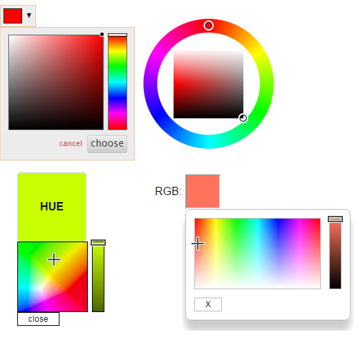

# IoBroker.vis-颜色选择器
`ioBroker.vis` 的颜色选择器小部件

<!--

### **正在进行中** -->

## Changelog
### 2.0.3 (2023-03-17)
* (bluefox) Made it work with vis-2.0

### 1.2.0 (2020-04-14)
* (bluefox) Corrected html structure

### 1.1.1 (2016-11-30)
* (Pmant) add new hue bulbs and fix gamut

### 1.1.0 (2016-05-31)
* (Pmant) add homematic colorpicker

### 1.0.2 (2016-05-20)
* (bluefox) Fix Philips HUE Colorpicker

### 1.0.0 (2016-05-19)
* (bluefox) rewrite all widgets

### 0.2.0 (2016-05-15)
* (Pmant) add hue CIE picker

### 0.1.3 (2016-01-25)
* (bluefox) add precision

### 0.1.2 (2016-01-25)
* (bluefox) enable ID Select dialog

### 0.1.1 (2015-09-27)
* (bluefox) update packets

### 0.1.0 (2015-07-09)
* (bluefox) initial checkin

## License
The MIT License (MIT)

Copyright (c) 2013-2023 Bluefox https://github.com/GermanBluefox,
              2013-2014 hobbyquaker https://github.com/hobbyquaker

Permission is hereby granted, free of charge, to any person obtaining a copy
of this software and associated documentation files (the "Software"), to deal
in the Software without restriction, including without limitation the rights
to use, copy, modify, merge, publish, distribute, sublicense, and/or sell
copies of the Software, and to permit persons to whom the Software is
furnished to do so, subject to the following conditions:

The above copyright notice and this permission notice shall be included in all
copies or substantial portions of the Software.

THE SOFTWARE IS PROVIDED "AS IS", WITHOUT WARRANTY OF ANY KIND, EXPRESS OR
IMPLIED, INCLUDING BUT NOT LIMITED TO THE WARRANTIES OF MERCHANTABILITY,
FITNESS FOR A PARTICULAR PURPOSE AND NONINFRINGEMENT. IN NO EVENT SHALL THE
AUTHORS OR COPYRIGHT HOLDERS BE LIABLE FOR ANY CLAIM, DAMAGES OR OTHER
LIABILITY, WHETHER IN AN ACTION OF CONTRACT, TORT OR OTHERWISE, ARISING FROM,
OUT OF OR IN CONNECTION WITH THE SOFTWARE OR THE USE OR OTHER DEALINGS IN THE
SOFTWARE.