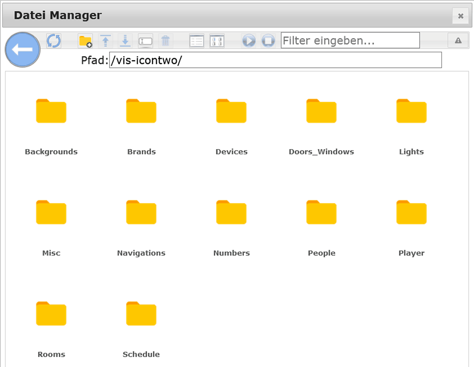
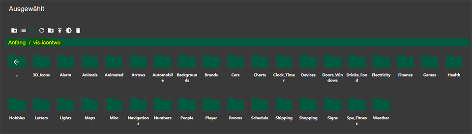
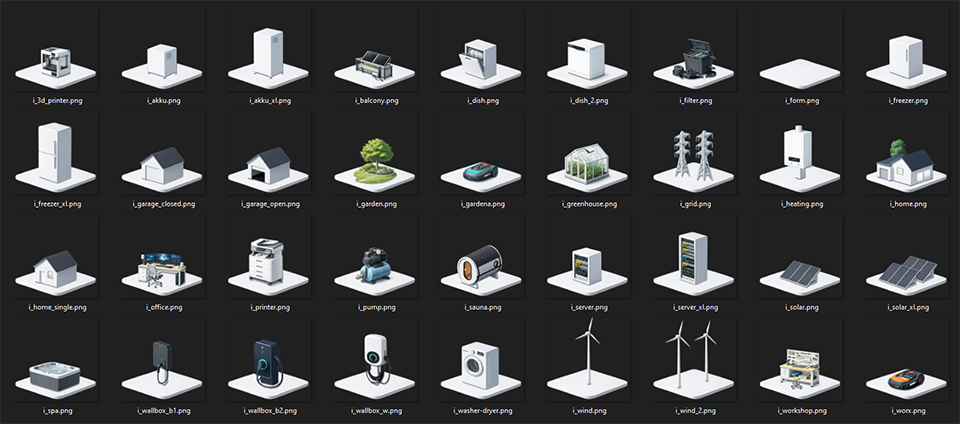
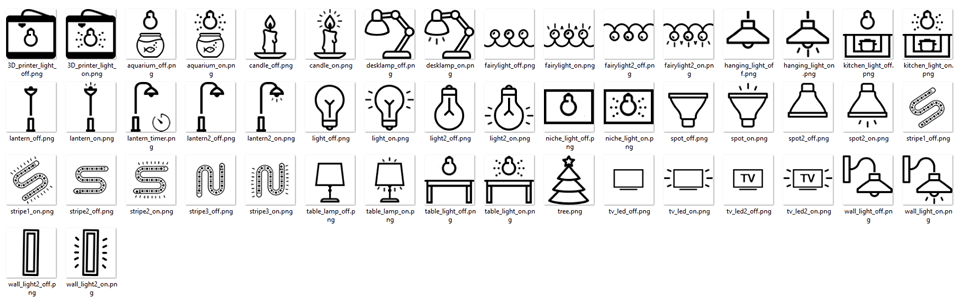
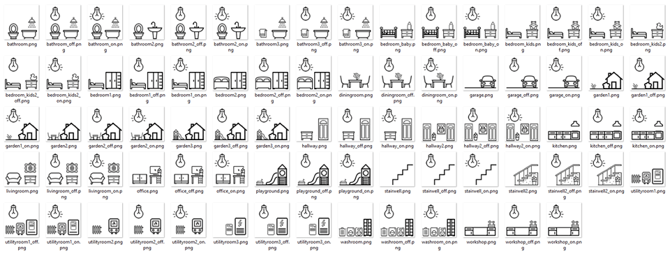
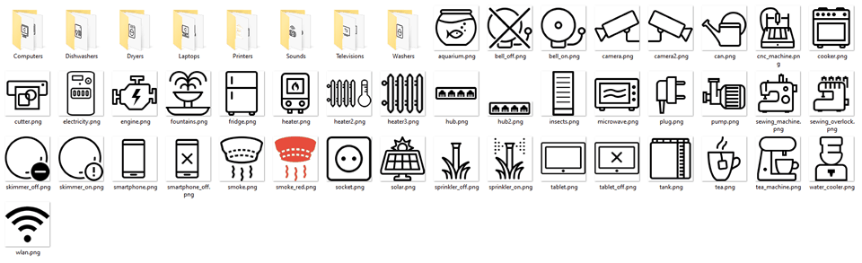

# IoBroker.vis-icontwo
## IoBroker.vis 适配器的图标适配器（适用于 VIS-1 和 VIS-2）
一个简单的图标适配器，用于您的可视化。

所有图标都可以在文件管理器（位于顶层）的 vis-icontwo 文件夹中找到。

#### VIS1：

#### VIS2：

＃＃ 预览
图标样式预览：

例如：3D图标（部分选择）（版本2.0.0以上可用）：

例如：灯光（部分选择）：

例如：房间（部分选择）：

例如：设备（部分选择）：

您可以在这里找到所有图标的完整概览（文件夹结构与文件管理器中的相同）：

-> https://icontwo.inventwo.com <-

## 较早的更改
- [CHANGELOG_OLD.md](CHANGELOG_OLD.md)

## Changelog
<!--
	### **WORK IN PROGRESS**
-->
### 2.11.3 (2026-03-17)
- (skvarel) Translated: Readme in english

### 2.11.2 (2026-03-12)
- (skvarel) Fixed: Issue detected by repository checker.

### 2.11.1 (2026-02-28)
- (skvarel) Fixed: Issue detected by repository checker.

### 2.11.0 (2026-02-26)
- (skvarel) Added: New 3D-Icons (poolrobot)

### 2.10.0 (2026-02-26)
- (skvarel) Added: New 3D-Icons (beach)

## License

The MIT License (MIT)

Permission is hereby granted, free of charge, to any person obtaining a copy
of this software and associated documentation files (the "Software"), to deal
in the Software without restriction, including without limitation the rights
to use, copy, modify, merge, publish, distribute, sublicense, and/or sell
copies of the Software, and to permit persons to whom the Software is
furnished to do so, subject to the following conditions:

The above copyright notice and this permission notice shall be included in
all copies or substantial portions of the Software.

THE SOFTWARE IS PROVIDED "AS IS", WITHOUT WARRANTY OF ANY KIND, EXPRESS OR
IMPLIED, INCLUDING BUT NOT LIMITED TO THE WARRANTIES OF MERCHANTABILITY,
FITNESS FOR A PARTICULAR PURPOSE AND NONINFRINGEMENT. IN NO EVENT SHALL THE
AUTHORS OR COPYRIGHT HOLDERS BE LIABLE FOR ANY CLAIM, DAMAGES OR OTHER
LIABILITY, WHETHER IN AN ACTION OF CONTRACT, TORT OR OTHERWISE, ARISING FROM,
OUT OF OR IN CONNECTION WITH THE SOFTWARE OR THE USE OR OTHER DEALINGS IN
THE SOFTWARE.

---

Several icons from Icons8 https://icons8.com/ 

Copyright (c) 2025-2026 [jkvarel](https://github.com/jkvarel) and [skvarel](https://github.com/skvarel) from [inventwo](https://github.com/inventwo)