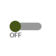

# IoBroker.vis-inventwo
## IoBroker.vis 适配器的小部件
Schalter、Slider、Tabellen、Regler、Checkboxen、Radiobuttons 等...<br> Mit unserem Widgets-Set hast du die freie Wahl individuelle Visualisierungen ganz einfür dein Smart-Home zu erstellen.


模拟乌伦[维特尔信息](https://github.com/inventwo/ioBroker.vis-inventwo/wiki/Universal-%26-Multi-Widget-Inhaltstypen)


数字乌伦[维特尔信息](https://github.com/inventwo/ioBroker.vis-inventwo/wiki/Universal-%26-Multi-Widget-Inhaltstypen)


颜色选择器[维特尔信息](https://github.com/inventwo/ioBroker.vis-inventwo/wiki/Colorpicker)


###### .. ab v 2.0.0
<table><tr><td><center><b>普遍的<br></b><br></td><td><center><b>多<br></b><br></td><td><center><b>图像<br></b><br></td><td><center><b>桌子<br></b><br></td></tr><tr><td colspan=4></td></tr><tr><td><center><b>列表<br></b><br></td><td><center><b>跑马灯<br></b><br></td><td><center><b>单选按钮<br></b><br></td><td><center><b>滑块<br>垂直的</b><br></td></tr><tr><td colspan=4></td></tr><tr><td><center><b>滑块<br>水平的</b><br></td><td><center><b>颜色滑块<br>水平的</b><br></td><td><center><b>颜色滑块<br>水平的</b><br></td><td><center><b>拨动开关<br></b><br></td></tr><tr><td colspan=4></td></tr><tr><td><center><b>基本开关<br></b><br></td><td><center><b>复选框/<br>单选按钮</b><br></td><td><center><b>选色器<br></b><br></td></tr></table>

Mit Hilfe unserer Widgets lassen sich folgende Projekte verwirklichen。 Zur Zeit befinden sich in unserem Adapter NUR die reinen Schaltflächen (siehe oben)。 Uhr und Wetter stammen aus anderen Adaptern und müssen ggf。 zusätzlich installiert werden。


---

## 下图
瀑布Dir unsere Arbeit gefällt und Du uns unterstützen möchtest，wir freuen uns über jede Spende。

（Dieser Link führt zu unserem PayPal-Konto und steht in keiner Verbindung zum ioBroker）

[](https://www.paypal.com/donate?hosted_button_id=7W6M3TFZ4W9LW)

---

## 3.3.3
- PopUp 中的 Multi-Widget View 问题

## 3.3.2
- 错误修正

## 3.3.1
- 错误修正

## 3.3.0
- Neues Widget：Konfigurierbarer Colorpicker for HEX、RGB、HSL、HSV 和 CIE/XY basierend auf [iro.js](https://iro.js.org/)

## 3.2.8
- 单选按钮列表：Mehrzeilige/Mehrspaltige Darstellung möglich [#393](https://github.com/inventwo/ioBroker.vis-inventwo/issues/393)
- JSON-Tabelle：Textausrichtung für Kopfzeile hinzugefügt [#394](https://github.com/inventwo/ioBroker.vis-inventwo/issues/394)

## 3.2.7
- 修正：弹出 schließt nicht bei Datenpunktwert

## 3.2.6
- JSON-Tabelle：Abhängigkeit eines Wertes färben 中的 Hintergrund pro Zeile [#280](https://github.com/inventwo/ioBroker.vis-inventwo/issues/280)
- JSON-Tabelle：Standardsortierung einer Spalte [#286](https://github.com/inventwo/ioBroker.vis-inventwo/issues/286)
- 通用和多小部件 ViewInPopUp：滚动视图 möglich [#344](https://github.com/inventwo/ioBroker.vis-inventwo/issues/344)
- 通用和多小部件 HTTP：链接 kann im gleichem oder neuem Tab geöffnet werden [#363](https://github.com/inventwo/ioBroker.vis-inventwo/issues/363)

- 修正：JSON-Tabelle funktioniert nun auch wenn nur ein einzelnes Objekt statt Array mit Objekten im Datenpunkt steht [#319](https://github.com/inventwo/ioBroker.vis-inventwo/issues/319)
- 已修复：JSON-Tabelle：10-stelliger Zeitstempel funktionierte nicht [#376](https://github.com/inventwo/ioBroker.vis-inventwo/issues/376)

## 3.2.5
- 错误修正

## 3.2.4
- 错误修正

## 3.2.3
- 错误修正

## 3.2.2
- 错误修正

## 3.2.1
- 问题 mit aktiver Textfarbe behoben (#302)
- Multi-Widget 和 unterschiedlichem Prüftyp behoben 问题 (#303)
- 问题是 Schließen mit View im PopUp behoben (#254)
- 基本导航功能的导航效果 (#304)
- 用于通用和多 Widget 的新 hinzugefügt Widget-Typ 'HTTP' (#249)
- Sichtbare Schritte für einfachen Slider hinzugefügt

## 3.2.0
- 通用和多部件的 Textfarbe aktiv/inaktiv
- Colorslider CIE Wert mit eckigen Klammern
- Fehler behoben，dass Schattenfarbe bei Universal- & Multiwidget nicht aktualisiert
- JSON 表格：Vorangestellter 和 angehänget 文本

## 3.1.3
- 错误修正

## 3.1.2
- 错误修正

## 3.1.1
- 错误修正

## 3.1.0
- 新小部件：Basisschalter
- Neues Widget：复选框/单选按钮
- Bug修复

## 3.0.11
- 错误修正

## 3.0.10
- 错误修正

## 3.0.9
- 错误修正

## 3.0.8
- 错误修正

## 3.0.7
- 错误修正

## 3.0.6
- 错误修正

## 3.0.5
- 错误修正

## 3.0.4
- 错误修正

## 3.0.3
- 错误修正

## 3.0.2
- 错误修正

## 3.0.1
- 错误修正

## 3.0.0
```diff
#### ACHTUNG ####
Nach dem Update sind die Icons vom Universal- und Multiwidget
nicht zu sehen, sind aber nicht weg! Damit diese wieder zu sehen sind müssen
die Widgets einmal EINZELN im Editor angeklickt werden.
```

- Beim Universal- 和 Multiwidget 可以在 Inhaltstyp geändert werden 中使用。
    - 输入类型：图片（标准）、模拟 Uhr、数字 Uhr 和 HTML/文本
    - 模拟和数字Uhr：Farbe des Ziffernblatts under Zeiger kann frei gewählt werden, Zeitzone kann geändert werden
    -Statt dem Icon 可以在本征文本或数据包中根据 Binding angezeigt werden 进行
- Vergleichsoperatoren Größer-Gelich 和 Kleiner-Gleich
- PopUp kann per Datenpunk geoffnet werden
- 错误修复：
    - Colorslider unsichtbar wenn für CIE kein Wert vorhanden ist
    - 弹出窗口中的链接功能
    - 状态 Rückmeldedauer funktioniert nicht richtig

## 2.9.7
- 错误修正

## 2.9.6
- 错误修正

## 2.9.5
- 错误修正

## 2.9.4
- 错误修正

## 2.9.3
- 与 PopUp 相关的提示：单击“注册”按钮并单击“PopUp 中的按钮提示”
- Zustände wurden bei 在 PopUp nicht richtig angezeigt 中查看

## 2.9.2
- 弹出窗口的日期问题。阿东！韦尔登的数据点

## 2.9.1
- 错误修正

## 2.9.0
- Multi-Widget-Status 可以通过 Widget-Typ nach Datenpunkten oder Views prüfen 实现
- 选项 zum automatischen Schließen des Popups hinzugefügt
- Bug修复

## 2.8.3
- 错误修正

## 2.8.2
- Colorslider 问题：Wert wird nicht in Datenpunkt gesetzt，wenn“Wert bei Freigabe aktualisieren” aktiviert ist”，

## 2.8.1
- Fehler behoben：颜色滑块 RGB aktualisiert bei Dp änderung nicht（WICHTIG：Datanpunkte müssen neu ausgewählt werden！）

## 2.8.0
- 在通用和多部件的弹出选项中查看
- 错误修正

## 2.7.11
- 错误修正

## 2.7.10
- 通用和多部件问题
- 通用和多部件中的 Bildwechesl 问题

## 2.7.9
- Image-Widget hinzugefügt 的图片选项
- Fehler von vorheriger 版本 behoben

## 2.7.8
- 问题 mit Textausrichtung behoben
- Image-Widget 中的 Bildgröße 问题

## 2.7.7
- Bildgröße behoben 的问题
- Farbregler behoben 的问题，dass der Wert beim loslassen nicht gespeichert wurde

## 2.7.6
- Navi-Widget 的 Symbolfarbe 问题
- Touch-Geräten behoben 的 Hervorhebung 问题
- Radiobutton-Widget 和 Datentyp Zahlen behobenn 的问题

## 2.7.5
- JSON Tabelle farbliche Schwellenwerte für Zahlen
- Fehler beim Slider behoben wenn ungültiger Wert im Datenpunkt steht
- Fehler behoben：Signalbilder wurden mit eingefärbt
- 选项 um Bildfarbe zu invertieren eingefügt, um Farbfilter zu umgehen
- 颜色滑块可支持 HEX、RGB 和 CIE unterscheiden

## 2.7.4
- Für Hover-Farben hinzugefügt 的 Fehlende Übersetzung

## 2.7.3
- Fehler beim Multi-State und mehreren Zuständen behoben
- 按钮的 Schatten und Rand Hover hinzugefügt

## 2.7.2
- Fehler 在 Radiobutton mit Bildfarbe behoben
- Fehler behoben：Doppeltes klicken bei State mit Verweildauer
- 按钮效果
- Sliderwertss behoben 的问题
- 滑块文本 anhängen möglich

## 2.7.1
- 错误修正

## 2.7.0
- 新小部件：Farbslider
- JSON Tabelle Spaltenformat 布尔值和数字
- JSON Tabelle Kopfzeile kann Fixiert werden
- JSON Tabelle Fehler beim sortieren behoben
- JSON Tabelle konfigurierbare Dummyzeile wenn JSON leer ist
——费勒·贝霍本

## 2.6.0
- 通用和多小部件 Vergleichsoperatoren gleich、größer、kleiner und nicht hinzugefügt
- 滑块最小/最大反转
- 滑块 Wert erst beim loslassen setzen
- Widget um Wert zu erhöhen oder zu senken
- JSON Tabelle Fehler 和 Datum behoben

。 JSON 表格

- JSON Tabelle Platzhalter wenn Eintrag leer ist
- JSON Tabelle Spalten können per Klick sortiert werden

## 2.5.11
- 错误修正

## 2.5.10
- 错误修正

## 2.5.9
- Der Prozess der Bildfarbfilterung wurde geändert
- Die Bildfarbe kann jetzt ein Datenpunkt sein

## 2.5.8
- 错误修正

## 2.5.7
- 错误修正

## 2.5.6
- 错误修正

## 2.5.5
- 错误修正

## 2.5.4
- 错误修复（状态：doppeltes senden dese Wertes bei touch）

## 2.5.3
- Grauer Kippschalter hinzugefügt

## 2.5.2
- 错误修正

## 2.5.1
- 错误修正

## 2.5.0
- Kippschalter hinzugefügt
- 错误修正

## 2.4.3
- 错误修正

## 2.4.2
- 错误修正

## 2.4.1
- 错误修正

## 2.4.0
- Randstil zur JSON-Tabelle hinzugefügt
- Farbauswahö für Icons zu allen Widgets hinzugefügt
- 费勒贝赫邦

## 2.3.2
- 与小部件“在小部件中查看”相关的导航功能

## 2.3.1
- Fehler 在 JSON Tabelle behoben 中

## 2.3.0
- 问题是，bei dem Schaltflächen zweimal Werte senden
- Tabellenzellen hinzugefügt 的数据/Uhrzeit 和 Bildformat
- 通用和多小部件属性可以点击小部件属性

## 2.2.3
- Fehler 在 JSON Tabelle behoben 中

## 2.2.2
- Fehler im Multi Widget behoben：典型导航中的图像和文本

## 2.2.1
- Fehler in JSON Tabelle behoben, wenn kein gültiges JSON-Objekt vorhanden ist
- Fehler 在价值清单中：Wert wrd nicht aktualisiert

## 2.2.0
- Datenpunktwerte werden jetzt bei allen Widgets 在编辑器 angezeigt 中
- 新小工具：字幕 (Laufschrift)
- 普遍和多状态 Verweildauer hinzugefügt
- 列表小部件 Abstand zwischen den Einträgen kann eingestell werden

## 2.1.0
- Datenpunktwerte werden im VIS Editor angezeigt！

## 2.0.1
- 过度行为
- 边境法贝贝霍本
- Widget-Untertitel behoben

## 2.0.0
- 开关、按钮、导航和背景小部件 (sowie die kleinen Ausführungen) zu einem einzigen Widget zussammengeführt -> dem 通用小部件
- Multi Widget -> wie das Universal，nur dass hier auf mehrere Datenpunkte und Werte geprüft werden kann (ähnlich der Signalbild Funktion)
- 图像小部件可以查看数据
- 单选按钮 hinzugefügt
- Werteliste hinzugefügt (Kann Liste aus einem Datenpunkt oder manuell eingetragenem Text erstellen)

## 1.3.8
- 将滑块步长更改为十进制
- 修复了数值问题

### 1.3.7
- 修复了触摸屏上的导航问题

### 1.3.6
- 添加了导航设置状态选项
- 修复了没有配置的数据点的问题

### 1.3.5
- 添加了表格刷新率

### 1.3.4
- 删除了图标和背景，更改了配置，修复了导航

### 1.3.3
- 修复了背景小部件值选项

### 1.3.2
- 错误修复

### 1.3.1
- 更改了导航按钮颜色行为
- 添加了新图标

### 1.3.0
- 添加了 JSON 表
- 增加了导航延迟
- 按钮中的文本现在可以是 HTML
- 添加了新图标

### 1.2.3
- 添加了导航活动颜色
- 修复了值切换的状态颜色

## 1.2.2
- 错误修复：滑块值、配置

## 1.2.1
- 修复了滑块小部件：分为两个小部件（水平和垂直）

### 1.2.0
- 添加了图像小部件
- 添加了滑块来更改所有 4 个角的边框半径（如果此版本对您来说是更新，您需要单击 vis 编辑器中的每个按钮才能恢复默认角）
- 添加了新图标

### 1.1.1
- 错误修复

### 1.1.0
- 添加了滑块小部件
- 添加了镜像选项
- 添加了新图标
- 更改按钮小部件以使用默认字体和文本选项

### 1.0.0
- 小部件背景和内容不透明度，开关可以从布尔值更改为值，将图标从白色更改为黑色，添加无缝背景

### 0.1.2
- Bug修复

...

### 0.1.1
- Bug修复

...

### 0.1.0（Erstveröffentlichung）
- 发明两个设计小部件

...

### 0.0.1
- Die Idee ist geboren

---

## Changelog

## License

Copyright (c) 2022 [jkvarel](https://github.com/jkvarel) und [skvarel](https://github.com/skvarel) von [inventwo](https://github.com/inventwo)

MIT License (nur in englisch / englisch only)

Permission is hereby granted, free of charge, to any person obtaining a copy
of this software and associated documentation files (the "Software"), to deal
in the Software without restriction, including without limitation the rights
to use, copy, modify, merge, publish, distribute, sublicense, and/or sell
copies of the Software, and to permit persons to whom the Software is
furnished to do so, subject to the following conditions:

The above copyright notice and this permission notice shall be included in all
copies or substantial portions of the Software.

THE SOFTWARE IS PROVIDED "AS IS", WITHOUT WARRANTY OF ANY KIND, EXPRESS OR
IMPLIED, INCLUDING BUT NOT LIMITED TO THE WARRANTIES OF MERCHANTABILITY,
FITNESS FOR A PARTICULAR PURPOSE AND NONINFRINGEMENT. IN NO EVENT SHALL THE
AUTHORS OR COPYRIGHT HOLDERS BE LIABLE FOR ANY CLAIM, DAMAGES OR OTHER
LIABILITY, WHETHER IN AN ACTION OF CONTRACT, TORT OR OTHERWISE, ARISING FROM,
OUT OF OR IN CONNECTION WITH THE SOFTWARE OR THE USE OR OTHER DEALINGS IN THE
SOFTWARE.

---

Icons from Icons8 https://icons8.com/

---

Copyright (c) 2020-2023 jkvarel jkvarel@inventwo.com