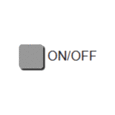

# IoBroker.vis-inventwo
## 小部件 für den ioBroker.vis 适配器
Schalter、Slider、Tabellen、Regler、Checkboxen、Radiobuttons 和 mehr...<br> Mit unserem Widgets-Set hast du die freie Wahl individuelle Visualisierungen ganz einfach für dein Smart-Home zu erstellen。


模拟 Uhren [维特信息](https://github.com/inventwo/ioBroker.vis-inventwo/wiki/Universal-%26-Multi-Widget-Inhaltstypen)


数字 Uhren [维特信息](https://github.com/inventwo/ioBroker.vis-inventwo/wiki/Universal-%26-Multi-Widget-Inhaltstypen)


颜色选择器[维特信息](https://github.com/inventwo/ioBroker.vis-inventwo/wiki/Colorpicker)


###### ..ab v 2.0.0
<table><tr><td><center><b>普遍的<br></b><br></td><td><center><b>多<br></b><br></td><td><center><b>图片<br></b><br></td><td><center><b>桌子<br></b><br></td></tr><tr><td colspan=4></td></tr><tr><td><center><b>列表<br></b><br></td><td><center><b>选框<br></b><br></td><td><center><b>单选按钮<br></b><br></td><td><center><b>滑块<br>垂直的</b><br></td></tr><tr><td colspan=4></td></tr><tr><td><center><b>滑块<br>水平的</b><br></td><td><center><b>颜色滑块<br>水平的</b><br></td><td><center><b>颜色滑块<br>水平的</b><br></td><td><center><b>拨动开关<br></b><br></td></tr><tr><td colspan=4></td></tr><tr><td><center><b>基本开关<br></b><br></td><td><center><b>复选框/<br>单选按钮</b><br></td><td><center><b>选色器<br></b><br></td></tr></table>

Mit Hilfe unserer Widgets lassen sich folgende Projekte verwirklichen。 Zur Zeit befinden sich in unserem Adapter NUR die reinen Schaltflächen (siehe oben)。 Uhr und Wetter stammen aus anderen Adaptern und müssen ggf。 zusätzlich installiert werden。


---

## Unterstützung
Falls Dir unsere Arbeit gefällt und Du uns unterstützen möchtest, wir freuen uns über jede Spende。

(Dieser Link führt zu unserem PayPal-Konto und steht in keiner Verbindung zum ioBroker)

[](https://www.paypal.com/donate?hosted_button_id=7W6M3TFZ4W9LW)

---

## 3.3.3
- 问题 mit Umrandungsfarbe beim 弹出窗口中的多小部件视图 behoben

## 3.3.2
- 错误修正

## 3.3.1
- 错误修正

## 3.3.0
- Neues Widget: Konfigurierbarer Colorpicker für HEX, RGB, HSL, HSV und CIE/XY basierend auf [iro.js](https://iro.js.org/)

## 3.2.8
- 单选按钮列表：Mehrzeilige/Mehrspaltige Darstellung möglich [#393](https://github.com/inventwo/ioBroker.vis-inventwo/issues/393)
- JSON-Tabelle：Textausrichtung für Kopfzeile hinzugefügt [#394](https://github.com/inventwo/ioBroker.vis-inventwo/issues/394)

## 3.2.7
- 修正：弹出 schließt nicht bei Datenpunktwert

## 3.2.6
- JSON-Tabelle：Abhängigkeit eines Wertes färben 中的 Hintergrund pro Zeile [#280](https://github.com/inventwo/ioBroker.vis-inventwo/issues/280)
- JSON-Tabelle：Standardsortierung einer Spalte [#286](https://github.com/inventwo/ioBroker.vis-inventwo/issues/286)
- 通用和多小部件 ViewInPopUp：滚动查看 möglich [#344](https://github.com/inventwo/ioBroker.vis-inventwo/issues/344)
- Universal- & Multi-Widget HTTP: Link kann im gleichem oder neuem Tab geöffnet werden [#363](https://github.com/inventwo/ioBroker.vis-inventwo/issues/363)

- 修复：JSON-Tabelle funktioniert nun auch wenn nur ein einzelnes Objekt statt Array mit Objekten im Datenpunkt steht [#319](https://github.com/inventwo/ioBroker.vis-inventwo/issues/319)
- 修复：JSON-Tabelle：10-stelliger Zeitstempel funktionierte nicht [#376](https://github.com/inventwo/ioBroker.vis-inventwo/issues/376)

## 3.2.5
- 错误修正

## 3.2.4
- 错误修正

## 3.2.3
- 错误修正

## 3.2.2
- 错误修正

## 3.2.1
- 问题 mit aktiver Textfarbe behoben (#302)
- 问题 mit Multi-Widget und unterschiedlichem Prüftyp behoben (#303)
- 问题 beim Schließen mit View im PopUp behoben (#254)
- Navigationseffekte aus der Basisnavigation hinzugefügt (#304)
- Neu hinzugefügt Widget-Typ 'HTTP' für Universal- und Multi-Widget (#249)
- Sichtbare Schritte für einfachen Slider hinzugefügt

## 3.2.0
- Textfarbe aktiv/inaktiv für Universal- & Multiwidget
- Colorslider CIE Wert mit eckigen Klammern
- Fehler behoben, dass Schattenfarbe bei Universal- & Multiwidget nicht aktualisiert
- JSON Tabelle: Vorangestellter und angehänget 文本

## 3.1.3
- 错误修正

## 3.1.2
- 错误修正

## 3.1.1
- 错误修正

## 3.1.0
- Neues 小工具：Basisschalter
- Neues 小部件：复选框/单选按钮
- Bug修复

## 3.0.11
- 错误修正

## 3.0.10
- 错误修正

## 3.0.9
- 错误修正

## 3.0.8
- 错误修正

## 3.0.7
- 错误修正

## 3.0.6
- 错误修正

## 3.0.5
- 错误修正

## 3.0.4
- 错误修正

## 3.0.3
- 错误修正

## 3.0.2
- 错误修正

## 3.0.1
- 错误修正

## 3.0.0
```diff
#### ACHTUNG ####
Nach dem Update sind die Icons vom Universal- und Multiwidget
nicht zu sehen, sind aber nicht weg! Damit diese wieder zu sehen sind müssen
die Widgets einmal EINZELN im Editor angeklickt werden.
```

- Beim Universal- und Multiwidget kann der Inhaltstyp geändert werden。
    - Inhaltstypen: Bild (Standard), Analoge Uhr, Digitale Uhr und HTML/Text
    - Analoge und digitale Uhr: Farbe des Ziffernblatts under Zeiger kann frei gewählt werden, Zeitzone kann geändert werden
    -Statt dem Icon kann ein eigener Text oder ein Datenpunktwert per Binding angezeigt werden
- Vergleichsoperatoren Größer-Gelich und Kleiner-Gleich
- 每个 Datenpunk geöffnet werden 的 PopUp kann
- 修正：
    - Colorslider unsichtbar wenn für CIE kein Wert vorhanden ist
    - 链接 funktionieren nicht im Popup
    - 国家 Rückmeldedauer funktioniert nicht Richtig

## 2.9.7
- 错误修正

## 2.9.6
- 错误修正

## 2.9.5
- 错误修正

## 2.9.4
- 错误修正

## 2.9.3
- Fehler mit PopUp behoben: Klick zum schließen wurde direkt nach Öffnen registriert und Klick löste Buttons hinter dem PopUp aus
- Zustände wurden bei View in PopUp nicht Richtig angezeigt

## 2.9.2
- 问题 mit Datenpunkt zum Schließen des Popups behoben。阿通！ Der Datenpunkt muss erneut ausgewählt werden

## 2.9.1
- 错误修正

## 2.9.0
- Multi-Widget-Status können unabhängig vom Widget-Typ nach Datenpunkten oder Views prüfen
- Optionen zum automatischen Schließen des Popups hinzugefügt
- Bug修复

## 2.8.3
- 错误修正

## 2.8.2
- 问题 mit Colorslider behoben: Wert wird nicht in Datenpunkt gesetzt, wenn "Wert bei Freigabe aktualisieren" aktiviert ist",

## 2.8.1
- Fehler behoben: Color Slider RGB aktualisiert bei Dp Änderung nicht (WICHTIG: Datenpunkte müssen neu ausgewählt werden!)

## 2.8.0
- 在弹出选项中查看 Universal- und Multi-Widget hinzugefügt
- 错误修正

## 2.7.11
- 错误修正

## 2.7.10
- 问题 mit Bildern im Universal und Multi Widget behoben
- 问题 mit Bildwechesl im Universal und Multi Widget behoben

## 2.7.9
- Option für die Bildgröße für das Image-Widget hinzugefügt
- Fehler von vorheriger 版本 behoben

## 2.7.8
- 问题 mit Textausrichtung behoben
- 问题 mit Bildgröße im Image-Widget behoben

## 2.7.7
- 问题 mit der Bildgröße behoben
- 问题 mit dem Farbregler behoben, dass der Wert beim loslassen nicht gespeichert wurde

## 2.7.6
- 问题 mit Symbolfarbe für Navi-Widget behoben
- 问题 mit Hervorhebung auf Touch-Geräten behoben
- 问题 mit Radiobutton-Widget und Datentyp Zahlen behobenn

## 2.7.5
- JSON Tabelle farbliche Schwellenwerte für Zahlen
- Fehler beim Slider behoben wenn ungültiger Wert im Datenpunkt steht
- Fehler behoben：Signalbilder wurden mit eingefärbt
- 选项 um Bildfarbe zu invertieren eingefügt，um Farbfilter zu umgehen
- 颜色滑块 kann nun zwischen HEX、RGB 和 CIE unterscheiden

## 2.7.4
- Fehlende Übersetzung für Hover-Farben hinzugefügt

## 2.7.3
- Fehler beim Multi-State und mehreren Zuständen behoben
- Schatten und Rand Hover für Buttons hinzugefügt

## 2.7.2
- 费勒在 Radiobutton mit Bildfarbe behoben
- Fehler behoben: Doppeltes klicken bei State mit Verweildauer
- Hovereffekt für Buttons eingefügt
- 问题 mit anzeigen des Sliderwertss behoben
- 滑块文本anhängenmöglich

## 2.7.1
- 错误修正

## 2.7.0
- Neues 小工具：Farbslider
- JSON Tabelle Spaltenformat boolean und number
- JSON Tabelle Kopfzeile kann fixiert werden
- JSON Tabelle Fehler beim sortieren behoben
- JSON Tabelle konfigurierbare Dummyzeile wenn JSON leer ist
- 费勒贝霍本

## 2.6.0
- Universal- & Multi-Widget Vergleichsoperatoren gleich, größer, kleiner und nicht hinzugefügt
- 滑块最小/最大 invertieren
- Slider Wert erst beim loslassen setzen
- Widget um Wert zu erhöhen oder zu senken
- JSON Tabelle Fehler mit Datum behoben

. JSON Tabelle anzeige von Millisekunden möglich

- JSON Tabelle Platzhalter wenn Eintrag leer ist
- JSON Tabelle Spalten können per Klick sortiert werden

## 2.5.11
- 错误修正

## 2.5.10
- 错误修正

## 2.5.9
- Der Prozess der Bildfarbfilterung wurde geändert
- Die Bildfarbe kann jetzt ein Datenpunkt sein

## 2.5.8
- 错误修正

## 2.5.7
- 错误修正

## 2.5.6
- 错误修正

## 2.5.5
- 错误修正

## 2.5.4
- 修正（状态：doppeltes senden dese Wertes bei touch）

## 2.5.3
- Grauer Kippschalter hinzugefügt

## 2.5.2
- 错误修正

## 2.5.1
- 错误修正

## 2.5.0
- Kippschalter hinzugefügt
- 错误修正

## 2.4.3
- 错误修正

## 2.4.2
- 错误修正

## 2.4.1
- 错误修正

## 2.4.0
- Randstil zur JSON-Tabelle hinzugefügt
- Farbauswahö für Icons zu allen Widgets hinzugefügt
- 费勒贝赫邦

## 2.3.2
- Fehler bei der Navigation mit dem Widget 'View in Widget' behoben

## 2.3.1
- JSON Tabelle behoben 中的 Fehler

## 2.3.0
- 问题behoben，bei dem Schaltflächen zweimal Werte senden
- Datum / Uhrzeit und Bildformat für Tabellenzellen hinzugefügt
- Universal- und Multi-Widget-Attribute werden beim Klicken auf Widget aktualisiert

## 2.2.3
- JSON Tabelle behoben 中的 Fehler

## 2.2.2
- Fehler im Multi Widget behoben: Bilder und Text wechseln nicht bei Typ Navigation

## 2.2.1
- JSON Tabelle behoben 中的 Fehler，wenn kein gültiges JSON-Objekt vorhanden ist
- 价值列表中的费勒 behoben: Wert wird nicht aktualisiert

## 2.2.0
- Datenpunktwerte werden jetzt bei allen Widgets im Editor angezeigt
- Neues 小工具：Marquee (Laufschrift)
- Universal und Multi State Verweildauer hinzugefügt
- List Widget Abstand zwischen den Einträgen kann eingestell werden

## 2.1.0
- Datenpunktwerte werden im VIS Editor angezeigt！

## 2.0.1
- Übersetzungsfehler behoben
- 边境法比贝霍本
- Widget-Untertitel behoben

## 2.0.0
- 开关、按钮、导航和背景小部件 (sowie die kleinen Ausführungen) zu einem einzigen 小部件 zussammengeführt -> dem 通用小部件
- Multi Widget -> wie das Universal, nur dass hier auf mehrere Datenpunkte und Werte geprüft werden kann (Ähnlich der Signalbild Funktion)
- Image Widget kann nun auf Datenpunkt prüfen
- 单选按钮hinzugefügt
- Werteliste hinzugefügt (Kann Liste aus einem Datenpunkt oder manuell eingetragenem Text erstellen)

## 1.3.8
- 将滑块步长更改为十进制
- 修正数值问题

### 1.3.7
- 修复了触摸屏上的导航问题

### 1.3.6
- 为导航添加了设置状态选项
- 修复了没有配置的数据点的问题

### 1.3.5
- 增加了表格的刷新率

### 1.3.4
- 移除图标和背景，更改配置，修复导航

### 1.3.3
- 固定背景小部件值选项

### 1.3.2
- 错误修复

### 1.3.1
- 改变了导航按钮的颜色行为
- 添加了新图标

### 1.3.0
- 添加了 JSON 表
- 增加了导航延迟
- 按钮中的文本现在可以是 HTML
- 添加了新图标

### 1.2.3
- 添加了导航活动颜色
- 固定值开关的状态颜色

## 1.2.2
- 错误修复：滑块值、配置

## 1.2.1
- 固定滑块小部件：分成两个小部件（水平和垂直）

### 1.2.0
- 添加了图像小部件
- 添加滑块以更改所有 4 个角的边框半径（如果此版本是您的更新，您需要单击 vis-editor 中的每个按钮以恢复默认角）
- 添加了新图标

### 1.1.1
- 错误修复

### 1.1.0
- 添加了滑块小部件
- 添加镜像选项
- 添加了新图标
- 更改按钮小部件以使用默认字体和文本选项

### 1.0.0
- 小部件背景和内容不透明度，开关可以从布尔值更改为值，将图标从白色更改为黑色，添加无缝背景

### 0.1.2
- Bug修复

...

### 0.1.1
- Bug修复

...

### 0.1.0 (Erstveröffentlichung)
- inventwo设计小部件

...

### 0.0.1
- Die Idee ist geboren

---

## Changelog

## License

Copyright (c) 2022 [jkvarel](https://github.com/jkvarel) und [skvarel](https://github.com/skvarel) von [inventwo](https://github.com/inventwo)

MIT License (nur in englisch / englisch only)

Permission is hereby granted, free of charge, to any person obtaining a copy
of this software and associated documentation files (the "Software"), to deal
in the Software without restriction, including without limitation the rights
to use, copy, modify, merge, publish, distribute, sublicense, and/or sell
copies of the Software, and to permit persons to whom the Software is
furnished to do so, subject to the following conditions:

The above copyright notice and this permission notice shall be included in all
copies or substantial portions of the Software.

THE SOFTWARE IS PROVIDED "AS IS", WITHOUT WARRANTY OF ANY KIND, EXPRESS OR
IMPLIED, INCLUDING BUT NOT LIMITED TO THE WARRANTIES OF MERCHANTABILITY,
FITNESS FOR A PARTICULAR PURPOSE AND NONINFRINGEMENT. IN NO EVENT SHALL THE
AUTHORS OR COPYRIGHT HOLDERS BE LIABLE FOR ANY CLAIM, DAMAGES OR OTHER
LIABILITY, WHETHER IN AN ACTION OF CONTRACT, TORT OR OTHERWISE, ARISING FROM,
OUT OF OR IN CONNECTION WITH THE SOFTWARE OR THE USE OR OTHER DEALINGS IN THE
SOFTWARE.

---

Icons from Icons8 https://icons8.com/