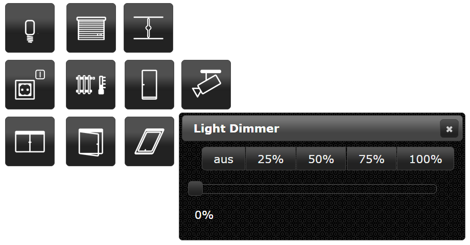

# IoBroker.vis-jqui-mfd
＃＃ 描述
ioBroker.vis 的 jqui-mfd 小部件集。小部件的样式为 Windows jQuery UI 界面，图标来自[开放自动化项目](https://github.com/OpenAutomationProject/knx-uf-iconset)。

<!-- 下一个版本的占位符（在行首）：

### **正在进行中** -->

## Changelog
### 1.1.0 (2022-10-11)
* (bluefox) Make it compatible with ioBroker.vis 2.0

### 1.0.12 (2018-06-27)
* (bluefox) Custom10-Widget and Light-Widget are fixed if the icon color used

### 1.0.11 (2018-02-18)
* (Bjoern3003) Heating widget was extended

### 1.0.9 (2017-10-13)
* (bluefox) Fix iframes

### 1.0.8 (2017-07-12)
* (KNXBroker) Fix of ShutterDialog Labels

### 1.0.7 (2017-05-14)
* (bluefox/Apollon77) Fix size of lamp-off-svg

### 1.0.6 (2016-11-24)
* (bluefox) Add to all dialogs autoclose

### 1.0.5 (2016-09-13)
* (bluefox) add blind widget

### 1.0.4 (2016-07-28)
* (bluefox) fix custom 10 dialog

### 1.0.3 (2016-07-25)
* (jens-maus) removed left over debugger statement

### 1.0.2 (2016-07-21)
* (jens-maus) implemented color support for each separate state of the jqui-mfd wigets

### 1.0.0 (2016-06-14)
* (bluefox) increase default width of popup windows

### 0.1.0 (2015-10-31)
* (bluefox) change Light Dialog => to OnOff Dialog
* (bluefox) expand auto close with timeout

### 0.0.1 (2015-09-20)
* (bluefox) initial checkin

## License
 Copyright (c) 2013-2022 hobbyquaker https://github.com/hobbyquaker, bluefox https://github.com/GermanBluefox
 MIT