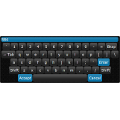
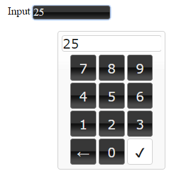

# IoBroker.vis-keyboard

使用了 Jeremy Satterfield 开发的非常优秀的 jQuery 插件。（原作者：Jeremy Satterfield，由 Rob Garrison 更新和维护）

github - http://github.com/Mottie/Keyboard

＃＃ 用法
您可以将此组件放置在视图上，所有带有输入字段的组件都将拥有虚拟键盘。您必须将此组件放置在每个视图上。

此外，您还可以向小部件类添加 `keyboard-num` 以强制使用数字键盘，或添加 `keyboard-all` 以强制使用全文键盘。

<!-- 下一版本的占位符（位于行首）：

### **正在进行中** -->

## Changelog
### 0.0.3 (2025-10-30)
- (bluefox) updated packages

### 0.0.2 (2015-10-28)
- (bluefox) update plugin

### 0.0.1 (2015-10-21)
- (smiling_Jack) initial checkin

## License
 Copyright (c) 2015-2025 smiling_Jack
 MIT