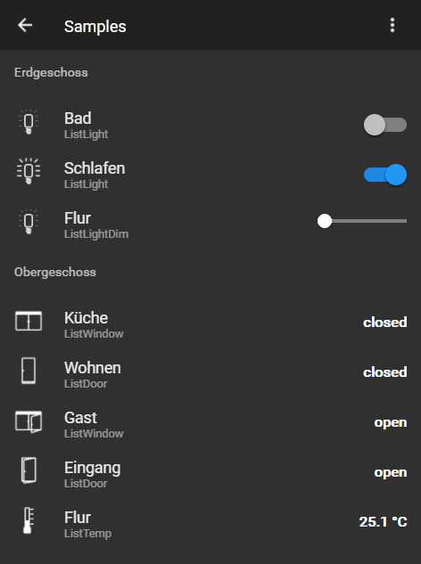

# IoBroker.vis-材料
Material - ioBroker.vis 的材质小部件。

您可以阅读material.js、material.html文件中的说明

这些小部件是 Uhula 材料设计风格的补充，您可以在这里找到：https://github.com/Uhula/ioBroker-Material-Design-Style

## Changelog
### 0.1.5 (2018-07-11)
- (pix) feat: new window shutter widget

### 0.1.4 (2018-07-10)
- (pix) feat: new humidity widget

### 0.1.3 (2018-01-21)
- (nisio) feat: new dimmer widget

### 0.1.2 (2018-01-20)
- (nisio) feat: switch added to light widget

### 0.1.1 (2018-01-14)
- (nisio) feat: temperature and light widget

### 0.1.0 (2018-01-13)
- (nisio) Initial version for public testing (includes css from material design styles V1.8)

### 0.0.1 (2018-01-01)
- (nisio) Initial version for internal testing

## License
The MIT License (MIT)

Copyright (c) 2015-2023 nisiode <nisio.air@gmail.com>

Permission is hereby granted, free of charge, to any person obtaining a copy
of this software and associated documentation files (the "Software"), to deal
in the Software without restriction, including without limitation the rights
to use, copy, modify, merge, publish, distribute, sublicense, and/or sell
copies of the Software, and to permit persons to whom the Software is
furnished to do so, subject to the following conditions:

The above copyright notice and this permission notice shall be included in all
copies or substantial portions of the Software.

THE SOFTWARE IS PROVIDED "AS IS", WITHOUT WARRANTY OF ANY KIND, EXPRESS OR
IMPLIED, INCLUDING BUT NOT LIMITED TO THE WARRANTIES OF MERCHANTABILITY,
FITNESS FOR A PARTICULAR PURPOSE AND NONINFRINGEMENT. IN NO EVENT SHALL THE
AUTHORS OR COPYRIGHT HOLDERS BE LIABLE FOR ANY CLAIM, DAMAGES OR OTHER
LIABILITY, WHETHER IN AN ACTION OF CONTRACT, TORT OR OTHERWISE, ARISING FROM,
OUT OF OR IN CONNECTION WITH THE SOFTWARE OR THE USE OR OTHER DEALINGS IN THE
SOFTWARE.