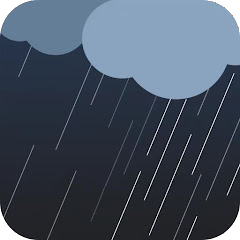

# IoBroker.weathersense
**测试：**

## IoBroker 的 WeatherSense 适配器
WeatherSense 是一款气象站云服务。此适配器从 WeatherSense 服务器读取数据。

请参阅：https://play.google.com/store/apps/details?id=com.emax.weahter&hl=de_CH

一些 WiFi 气象站使用 WeatherSense Cloud。

例如，Ideoon (Pearl) 的这个 WiFi 气象站：

＃＃ 使用：
只需输入您的 WeatherSense 帐户登录信息（电子邮件和密码）。
气象站数据存储在 WeatherSense 数据点中。
数据也可以通过 MQTT 发送。

## Changelog
### 3.0.2 (2025-08-29)

- Passwords protected, clean convert string > number

### 3.0.1 (2025-08-18)

- Delay 0-117s added

### 3.0.0 (2025-08-18)

- Type and channel position swapped for more meaningful sorting

### 2.0.2 (2025-08-17)

- Unit hPa added

### 2.0.1 (2025-08-17)

- More data output
- Cleaner type & channel output

### 1.0.3 (2025-07-03)

- Delay with different syntax

### 1.0.2 (2025-07-02)

- New release because SSH troubles in dev portal

### 1.0.1 (2025-07-02)

- Code cleanups

### 1.0.0 (2025-07-01)

- Initial release

## License

MIT License

Copyright (c) 2025 Daniel Luginbühl <webmaster@ltspiceusers.ch>

Permission is hereby granted, free of charge, to any person obtaining a copy
of this software and associated documentation files (the "Software"), to deal
in the Software without restriction, including without limitation the rights
to use, copy, modify, merge, publish, distribute, sublicense, and/or sell
copies of the Software, and to permit persons to whom the Software is
furnished to do so, subject to the following conditions:

The above copyright notice and this permission notice shall be included in all
copies or substantial portions of the Software.

THE SOFTWARE IS PROVIDED "AS IS", WITHOUT WARRANTY OF ANY KIND, EXPRESS OR
IMPLIED, INCLUDING BUT NOT LIMITED TO THE WARRANTIES OF MERCHANTABILITY,
FITNESS FOR A PARTICULAR PURPOSE AND NONINFRINGEMENT. IN NO EVENT SHALL THE
AUTHORS OR COPYRIGHT HOLDERS BE LIABLE FOR ANY CLAIM, DAMAGES OR OTHER
LIABILITY, WHETHER IN AN ACTION OF CONTRACT, TORT OR OTHERWISE, ARISING FROM,
OUT OF OR IN CONNECTION WITH THE SOFTWARE OR THE USE OR OTHER DEALINGS IN THE
SOFTWARE.