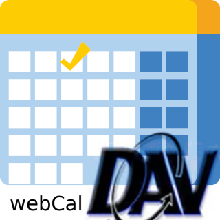

# IoBroker.webcal
**测试：** 

## IoBroker 的 webcal 适配器
使用这个 ioBroker 适配器，您可以

- 从 WEBDAV、CALDAV、CARDDAV 或 Google 日历获取事件。
- 根据事件添加新的日历项目

### 日历帐户
**Nextcloud** 使用基本身份验证和以下网址（您可以通过共享链接获取）

`https://<domain>/<optional basePath>/remote.php/dav/calendars/<username>/<optional displaName>`

**Google** 请参阅[使用谷歌API](doc/google.md)

- 在ioBroker中使用以下设置
    - name = 内部名称，如果与 google-calendar 名称匹配，则将使用该名称
- 验证方法 = 谷歌
- 秘密=客户秘密
- 刷新令牌=您从上面获得的
- 客户端 ID = 您的客户端 ID

**下载iCal** 您可以下载一个ical日历作为日历，不支持dav。但这不是只读的，意味着无法添加日历项目

＃＃＃ 数据点
**添加新活动**

您可以根据事件添加新的日历条目。请使用以下语法：

`relDays[@calendar] | date|datetime[ - date|datetime][@calendar]`

relDays - 从今天或日期/日期时间开始的天数作为可解析的日期或日期时间 @calendar 是可选的日历名称，默认是第一个定义的日历

也可以通过脚本：

```
sendTo("webcal.0", "addEvents", {
    calendar: "smarthome",
    events: [
      {
        summary: "test",
        start: "9.8.23 23:00",
        end: "10.08.2023 14:00"
      },
      {
        summary: "failed test",
		description: "long description",
        start: "9.8"
      }
    ]
  },function(events){
    /* callback function
	   object events will be repeat from input,
	   with additional status or error field,
	   also startDate and endDate are provided as Object data
	*/
	log(events);
  })
```

日志的输出将是：

```
[
  {
    "summary": "test",
    "start": "9.8.23 23:00",
    "end": "10.08.2023 14:00",
    "startDate": {
      "year": 2023,
      "month": 8,
      "day": 9,
      "hour": 23,
      "minute": 0,
      "second": 0,
      "isDate": false
    },
    "endDate": {
      "year": 2023,
      "month": 8,
      "day": 10,
      "hour": 14,
      "minute": 0,
      "second": 0,
      "isDate": false
    },
    "status": "successfully added"
  },
  {
    "summary": "failed test",
    "description": "long description",
    "start": "9.8",
    "startDate": {
      "year": 0,
      "month": 1,
      "day": 2,
      "hour": 0,
      "minute": 0,
      "second": 0,
      "isDate": false
    },
    "error": "start: invalid date"
  }
]
```

如果未给出`calendar`，则将使用defaultCalender

`event`字段`end`和`description`是可选的

**可以通过脚本删除事件**：

```
sendTo("webcal.0", "deleteEvents", {
    calendar: "smarthome",
    events: [
      {
        id: "e3fcbf3b-651c-470f-b307-9d20be5902eb"
      },
      {
        id: "failed test"
      }
    ]
  },function(events){
    /* callback function
	   object events will be repeat from input,
	   with additional status or error field,
	*/
	log(events);
  })
```

日志的输出将是：

```
[
  {
    "id": "e3fcbf3b-651c-470f-b307-9d20be5902eb
    "status": "successfully deleted"
  },
  {
    "id": "failed test",
    "error": "not found"
  }
]
```

### 可视化
如果您想使用 iobroker [vis-material-design](https://github.com/Scrounger/ioBroker.vis-materialdesign#calendar)，你可以使用[这个](doc/vis-material-design.js) 脚本

### 已知错误
中断（异常）一系列事件将被忽略

### 免责声明 该项目使用以下组件：
- [tsDav](https://github.com/natelindev/tsdav)
- [ical](https://github.com/kewisch/ical.js)
- [dayJS](https://github.com/iamkun/dayjs)

## Changelog
<!--
	Placeholder for the next version (at the beginning of the line):
	### **WORK IN PROGRESS**	* ()

-->
### 1.3.0 (2023-10-31)	
* (dirkhe) add choose calendar for events
* (dirkhe) add example script for vis-material-designmaterial
* (dirkhe) add event id to JSON data
* (dirkhe) add event delete function
* (dirkhe) fix endtime
* (dirkhe) fix missing upate of iQontrol States

### 1.2.0 (2023-08-15)	
* (dirkhe) add description for sendTo-addEvent
* (dirkhe) fix calculating events
* (dirkhe) add log which google calendar is used 
* (dirkhe) add datefilter for readonly 
* (dirkhe) add readonly client for ical

### 1.1.0 (2023-08-09)
* (dirkhe) add addEvent-command to sendTo
* (dirkhe) fix date parsing, if day only one digit
* (dirkhe) update dependecies

### 1.0.7 (2023-08-06)	
* (dirkhe) change event state type from group to folder

### 1.0.6 (2023-08-06)	
* (dirkhe) add pictured Google API documentation
* (dirkhe) fix property of button
* (dirkhe) add housekeeping for setInterval/setTimeout
* (dirkhe) check updateinterval for minimum of 10 minutes

### 1.0.5 (2023-04-26)	
* (dirkhe) set update addEvent-states to 00:10
* (dirkhe) fix timeframe for JSON data
* (dirkhe) fix layout for config

### 1.0.4 (2023-04-08)
* (dirkhe) fix environment setup

### 1.0.2 (2023-04-07)
* (dirkhe) publish to npm

### 1.0.0 (2023-04-07)
* (dirkhe) rework i18n

### 0.4.0 (2023-03-05)
* (dirkhe) add Event default Calendar
* (dirkhe) add iQontrol options for addEvent

### 0.3.0 (2023-02-22)
* (dirkhe) add Calendar Inactive
* (dirkhe) fix calc for jsonEvent and next
* (dirkhe) add dateText to jsonEvent

#### 0.2.0 (2023-02-21)
* (dirkhe) add next event and json data
* (dirkhe) add Iqontrol format to addEvent DP

### 0.1.0 (2023-02-16)
* (dirkhe) initial release
* (dirkhe) fix not shown times with daysPast 
* (dirkhe) complete rework and implement Google

## License
MIT License

Copyright (c) 2023 dirkhe 

Permission is hereby granted, free of charge, to any person obtaining a copy
of this software and associated documentation files (the "Software"), to deal
in the Software without restriction, including without limitation the rights
to use, copy, modify, merge, publish, distribute, sublicense, and/or sell
copies of the Software, and to permit persons to whom the Software is
furnished to do so, subject to the following conditions:

The above copyright notice and this permission notice shall be included in all
copies or substantial portions of the Software.

THE SOFTWARE IS PROVIDED "AS IS", WITHOUT WARRANTY OF ANY KIND, EXPRESS OR
IMPLIED, INCLUDING BUT NOT LIMITED TO THE WARRANTIES OF MERCHANTABILITY,
FITNESS FOR A PARTICULAR PURPOSE AND NONINFRINGEMENT. IN NO EVENT SHALL THE
AUTHORS OR COPYRIGHT HOLDERS BE LIABLE FOR ANY CLAIM, DAMAGES OR OTHER
LIABILITY, WHETHER IN AN ACTION OF CONTRACT, TORT OR OTHERWISE, ARISING FROM,
OUT OF OR IN CONNECTION WITH THE SOFTWARE OR THE USE OR OTHER DEALINGS IN THE
SOFTWARE.