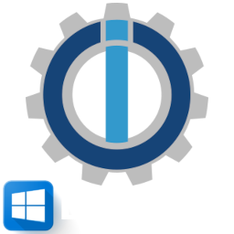

# IoBroker.wiobrowser
## 信息
用于 ioBroker 的 Windows 全屏浏览器适配器的控制

这个适配器通过 tcp.socket 连接到 wioBrowser 来控制它。有 3 种不同的 wioBrowser 应用程序：+ wioBrowser WebView2 框架 + wio 浏览器 Chromium 框架 + wioNoweb（没有网络的相同功能）

wioBrowser 是一个可以通过 ioBroker 控制的 Windows 全屏浏览器，它显示可以在适配器中设置的单个网站或网站幻灯片。信息也会传输到适配器：+ CPU 负载 + 可用内存 + 平板电脑或笔记本电脑上的当前电池放电 + 主机名 + IP

他还可以控制： + 屏幕开/关 + 退出应用程序 + 音量 +/- + 静音开/关 + 亮度 +/- + 使用开关运行程序，例如C:\ClickMonitorDDC\ClickMonitorDDC_7_2.exe b 100 + 短信 + 语音

*** Dieser Adapter verbindet sich über tcp.socket mit dem wioBrowser，嗯 ihn zu steuern。 Es gibt 3 unterschiedliche wioBrowser 应用程序：+ wioBrowser WebView2 框架 + wioBrowser Chromium 框架 + wioNoweb (Gleiche Funktionen ohne Web)

wioBrowser ist ein Windows Fullscreen Browser der sich über ioBroker steuern lässt, er zeigt einzelne Webseiten an oder eine Webseiten Slideshow die man im Adapter einstellen kann。 Es werden auch Infos an den Adapter übertragen: + CPU Last + freier Speicher + aktuelle Batterieentladung bei Tablet oder Notebook + 主机名 + IP

Er kann auch steuern：+ Bildschirm an/aus + App bedenden + Lautstärke +/- + Stumm an/aus + Helligkeit +/- + Program mit Schaltern ausführen z.B C:\ClickMonitorDDC\ClickMonitorDDC_7_2.exe b 100 + Text Nachrichten + Sprach Nachrichten

＃＃ 关联
* [ioBroker 论坛适配器线程](https://forum.iobroker.net/topic/50982/neuer-adapter-wiobrowser-f%C3%BCr-windows)
* [Tutorial über die Messages](https://forum.iobroker.net/topic/51534/tutorial-wiobrowser-windows-desktop-popup-messages) vom User hydrotec

## Changelog
### 1.1.2
* (bettman66) translate

### 1.1.1
* (bettman66) update readme

### 1.1.0
* (bettman66) window transparency

### 1.0.0
* (bettman66) stable

## License
The MIT License (MIT)

Copyright (c) 2022 Walter Zengel <w.zengel@gmx.de>

Permission is hereby granted, free of charge, to any person obtaining a copy
of this software and associated documentation files (the "Software"), to deal
in the Software without restriction, including without limitation the rights
to use, copy, modify, merge, publish, distribute, sublicense, and/or sell
copies of the Software, and to permit persons to whom the Software is
furnished to do so, subject to the following conditions:

The above copyright notice and this permission notice shall be included in
all copies or substantial portions of the Software.

THE SOFTWARE IS PROVIDED "AS IS", WITHOUT WARRANTY OF ANY KIND, EXPRESS OR
IMPLIED, INCLUDING BUT NOT LIMITED TO THE WARRANTIES OF MERCHANTABILITY,
FITNESS FOR A PARTICULAR PURPOSE AND NONINFRINGEMENT. IN NO EVENT SHALL THE
AUTHORS OR COPYRIGHT HOLDERS BE LIABLE FOR ANY CLAIM, DAMAGES OR OTHER
LIABILITY, WHETHER IN AN ACTION OF CONTRACT, TORT OR OTHERWISE, ARISING FROM,
OUT OF OR IN CONNECTION WITH THE SOFTWARE OR THE USE OR OTHER DEALINGS IN
THE SOFTWARE.