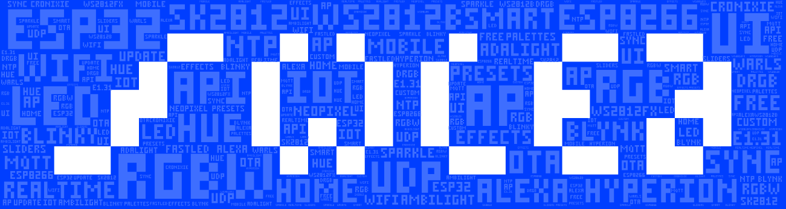

# IoBroker.wled

**此适配器使用服务 [Sentry.io](https://sentry.io) 自动向作为开发人员的我报告异常和代码错误以及新设备架构。** 更多详细信息见下文！

## IoBroker 的 wled 适配器
ESP8266/ESP32 网络服务器的快速且功能丰富的实现，用于控制 NeoPixel（WS2812B、WS2811、SK6812、APA102）LED 或基于 SPI 的芯片组，如 WS2801！

[WLED - Github 项目](https://github.com/Aircoookie/WLED)@Aircoookie

＃＃ 指示
适配器会使用 Bonjour 服务自动尝试在您的网络中查找 WLED 设备。
已知问题：具有 VLAN 分离的网络大多不路由广播流量，这意味着自动检测将失败。

别担心，在这种情况下，您可以通过 IP 地址手动添加设备。

1) 确保您的 WLED 设备正在运行并可通过网络访问 2) 安装适配器 3) 配置数据轮询和自动检测周期的间隔时间 4 - A) 启动适配器，设备应自动检测 4 - B) 如果 A 失败, 使用 Add-Device 按钮提供设备 IP 地址 5) 适配器将立即发送更改并每 x 秒轮询数据（可配置）

＃＃ 去做
* [ ] 将轮询切换到套接字连接，等待 WLED 固件的实现

＃＃ 支持我
如果您喜欢我的作品，请随时提供个人捐赠（这是 DutchmanNL 的个人捐赠链接，与 ioBroker 项目无关！）

## 什么是 Sentry.io 以及向该公司的服务器报告什么？
Sentry.io 是一项服务，供开发人员从他们的应用程序中获取有关错误的概述。而这正是在这个适配器中实现的。

当适配器崩溃或发生其他代码错误时，此错误消息也会出现在 ioBroker 日志中，并提交给 Sentry。当您允许 iobroker GmbH 收集诊断数据时，您的安装 ID（这只是一个唯一 ID **没有**关于您、电子邮件、姓名等的任何其他信息）也包括在内。这允许 Sentry 对错误进行分组并显示受此类错误影响的唯一用户数量。所有这些都帮助我提供基本上从不崩溃的无错误适配器。

## Changelog
<!--
    Placeholder for the next version (at the beginning of the line):
    ### __WORK IN PROGRESS__
-->
### 0.5.9 (2021-08-11)
* (DutchmanNL) added new state attributes reported by Sentry
* (DutchmanNL) added min & max for brightness value to support iOT adapter

### 0.5.8 (2021-08-11)
* (DutchmanNL) added new state attributes reported by Sentry
* (DutchmanNL) Bugfix Live override datapoint created as read-only #252
* (DutchmanNL) excluded value "PIR" from data write due to current formatting

### 0.5.7 (2021-08-10)
* (foxriver76) we fixed some incorrect object types, fixes warnings with JS-Controller 3.3.x [#215](https://github.com/DrozmotiX/ioBroker.wled/issues/215) & [#209](https://github.com/DrozmotiX/ioBroker.wled/issues/209)
* (DutchmanNL) add support for WLED 0.13.x (added types fps, ndc, ip, of)

### 0.5.6 (2021-01-03)
* (DutchmanNL) Bugfix : State type definition for time and pmt

### 0.5.5 (2021-01-03)
* (DutchmanNL) add development option to disable sentry
* (DutchmanNL) split API calls, avoid not needed query's
* (DutchmanNL) Bugfix : issue with boolean attributes #40
* (DutchmanNL) add new state definition for WLED version 0.11
* (DutchmanNL) Bugfix : You are assigning a string to the state "wled.0.xxxx.seg.0.col.0

### 0.5.4 (2020-09-02)
* (DutchmanNL) Support WLED 0.10.2, new state definitions implemented
* (DutchmanNL) Update state definitions
* (DutchmanNL) Remove log messages for missing states (Sentry report only)
* (DutchmanNL) Bugfix : 0.5.3 decommissioned, update to 0.5.4 !

### 0.5.2 (2020-08-29)
* (DutchmanNL) Bugfix : Add missing Attributes with WLED 0.10.0

### 0.5.1 (20-04-2020) Avoid writing objects unnecessarily, Sentry implemented
* (DutchmanNL) Implement Sentry
* (DutchmanNL) Bugfix : Devicename
* (DutchmanNL) Bugfix : Warning with JS Controler 3.0.7
* (DutchmanNL) Bugfix : Avoid writing objects unnecessarily

### 0.5.0 Stable release
* (DutchmanNL) Added translations
* (DutchmanNL) Release to stable repository, beta testing finished

### 0.3.0 Bugfix : Correct handling of polling timer
* (DutchmanNL  & Jey-Cee) Bugfix : Polling timer not saved
* (DutchmanNL) Bugfix : Correct handling of "online" state
* (DutchmanNL) Bugfix : Polling timer (offline devices did not reconnect)

### 0.2.6 Bugfix : Hex state value change
* (DutchmanNL) Bugfix : Hex state value change

### 0.2.5 Stable release candidate
* (DutchmanNL) Code cleanup
* (DutchmanNL) Improved logging information
* (DutchmanNL) Make polling timer configurable
* (DutchmanNL) Correct handling of device online state
* (DutchmanNL) Show online state in instance configuration

### 0.2.0 Possibility to add devices by IP-adress
* (DutchmanNL) Bugfix io-package
* (DutchmanNL) Improved logging at adapter start
* (DutchmanNL) Possibility to add devices by IP-adress implemented. (Needed for situations were autoscan fails)
* (DutchmanNL) Ensure known devices get connected immediatly after adapter start instead of waiting for network scan

### 0.1.9 Code improvements
* (DutchmanNL) Code cleanup and optimalisation
* (DutchmanNL) FIX memory leak by proper handling of bonjour service

### 0.1.8 Bugfix
* (DutchmanNL) Solved incorrect formated API call at state changes causing warning message

### 0.1.7 Bugfix
* (DutchmanNL) Fixed error when API call fails (write warning to log and retry at intervall time)

### 0.1.6 HEX color states implemented
* (DutchmanNL) HEX color states implemented

### 0.1.5 Stable Beta release

### 0.1.2
* (DutchmanNL) Implement drop down menu for effects

### 0.1.1
* (DutchmanNL) Implemented states hidden from JSON-API : tt / psave / nn / time
* (DutchmanNL) Improve logging issue

### 0.1.0
* (DutchmanNL) initial release

## License
MIT License

Copyright (c) 2020 DutchmanNL <rdrozda86@gmail.com>

Permission is hereby granted, free of charge, to any person obtaining a copy
of this software and associated documentation files (the "Software"), to deal
in the Software without restriction, including without limitation the rights
to use, copy, modify, merge, publish, distribute, sublicense, and/or sell
copies of the Software, and to permit persons to whom the Software is
furnished to do so, subject to the following conditions:

The above copyright notice and this permission notice shall be included in all
copies or substantial portions of the Software.

THE SOFTWARE IS PROVIDED "AS IS", WITHOUT WARRANTY OF ANY KIND, EXPRESS OR
IMPLIED, INCLUDING BUT NOT LIMITED TO THE WARRANTIES OF MERCHANTABILITY,
FITNESS FOR A PARTICULAR PURPOSE AND NONINFRINGEMENT. IN NO EVENT SHALL THE
AUTHORS OR COPYRIGHT HOLDERS BE LIABLE FOR ANY CLAIM, DAMAGES OR OTHER
LIABILITY, WHETHER IN AN ACTION OF CONTRACT, TORT OR OTHERWISE, ARISING FROM,
OUT OF OR IN CONNECTION WITH THE SOFTWARE OR THE USE OR OTHER DEALINGS IN THE
SOFTWARE.