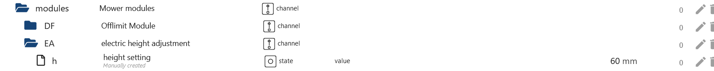
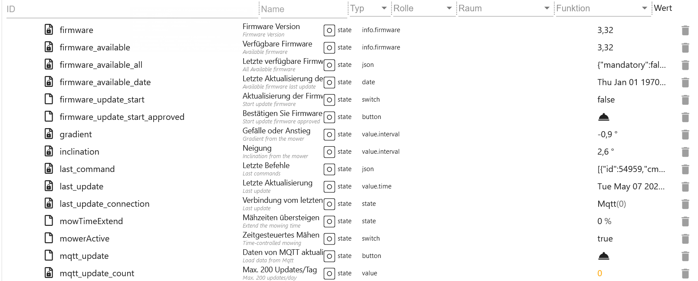

# IoBroker.worx 适配器
＃＃ 描述
### 实例设置
- `App Email`：您的 APP 用户名（电子邮件）
- `应用密码`：您的应用密码
- `应用程序名称`：选择您的设备
- `更新间隔（分钟）` 更新所有数据的间隔（范围从 10 到 1440）
- `EdgeCut 延迟`：EdgeCut 何时启动（例如 5 秒后开始修剪草坪）
- `距离和时间（以分钟和米为单位）`：默认小时和公里
- `在令牌更新后更新 MQTT 数据。`：在刷新令牌后加载 Worx 数据。


＃＃＃ 文件夹
- `activityLog`：您的活动日志（可能为有线和视觉/控制）
- `areas`: 区域（可以连接/控制）
- `multiZones`：多区域（可实现视觉/控制）
- `日历`：时间表（可以进行有线和视觉/控制）
- `模块`：您的模块（可能的线路和视觉/控制）
- `mower`：你的割草机（可用电线和视觉/控制）
- `product`：设备的所有属性（Wire & Vision / readonly）
- `rawMqtt`: 来自云端的所有数据 (Wire & Vision / readonly)


### ActivityLog（Wire 和 Vision）
- `last_update`：最后更新时间戳（Wire＆Vision/只读）
- `manuell_update`：加载当前活动日志（状态改变后自动加载 - 可以使用 Wire & Vision/控制）
- `payload`：活动日志作为 JSON 表（用于 VIS 或 Blockly）


### 区域（线路）
- `actualArea`：当前
- `actualAreaIndicator`: 下一个数组区域开始
- `area_0`: 区域 1 的起始位置（以米为单位）（数组=0）（可更改）
- `area_1`: 区域 2 的起点，单位为米（数组=1）（可更改）
- `area_2`: 区域 3 的起点，单位为米（数组=2）（可更改）
- `area_3`: 区域 4 的起点，单位为米（数组=3）（可更改）
- `startSequence`：数组区域开始（0-9 个事件）例如仅在区域 3 中开始 [2,2,2,2,2,2,2,2,2,2]（可更改）
- `zoneKeeper`：在狭窄区域交叉口安全驾驶（必须创建区域）（从固件 3.30 开始）（可更改）


### 日历（电报）
- 例如，时间设置为星期三

- `wednesday.borderCut`：有或无bordercut（立即更改值）（可更改）
- `wednesday.startTime`：开始时间 hh:mm (0-23/0-59) 例如 09:00（无延迟更改值）（可更改）
- `wednesday.workTime`：工作时间（分钟）（180 分钟 = 3 小时）例如 30 = 结束时间 09:30（立即更改值）（可更改）
- `calJson_sendto`：如果所有状态都已设置，则按下按钮发送（延迟 1.1 秒）。割草机现在将割草 30 分钟（可更改）
- `calJson_tosend`：此数据将发送到 Mqtt（割草计划/自动设置）。您也可以自己创建此 JSON。（可更改）
- `calendar.calJson`：每周割草计划的数组。您也可以自己创建此数组。（割草计划 1/自动设置 - 仅适用于电线）（可更改）
- `calendar.calJson2`：每周割草计划的数组。您也可以自己创建此数组。（割草计划 2/自动设置 - 仅适用于电线）（可更改）


### 日历（愿景）
- 例如，时间设置为星期五
- 标准情况下，会创建 2 个时间段。如果在 APP 中创建了 3 个时间段，ioBroker 中也会创建 3 个时间段。如果再次减少到 2 个时间段，ioBroker 中会删除这些时间段。时间段最多的一天将作为所有日期的参考。

- `friday.time_0.borderCut`：有无边框（立即更改值）（可更改）
- `friday.time_0.startTime`：开始时间 hh:mm (0-23/0-59) 例如 09:00（立即更改值）（可更改）
- `friday.time_0.workTime`：工作时间（分钟）（180 分钟 = 3 小时）例如 30 = 结束时间 09:30（立即更改值）（可更改）
- `friday.time_0.enabled_time`：激活或停用时间。（无延迟设置）（可以更改）
- `friday.time_0.zones`：应接近哪些区域，例如示例 [1,2,3]（无延迟设置）（可以更改）
- `calJson_sendto`：如果所有状态都已设置，则将此按钮设置为 true（延迟 1.1）。割草机现在将割草 30 分钟！（可更改）
- `calJson_tosend`: 这个 JSON 是自动填充然后发送给 Mqtt 的。当然你也可以自己创建。(可更改)
- `add_timeslot`：添加额外的时间段。重启后，未使用的时间段将被删除。（可更改）


### 示例时间段（愿景）
- `calJson_tosend` 此 JSON 将在周日输入 1 次，并删除所有其他日期。整个星期必须始终提交。

```json
[
    {
        "e": 1, // 0=deactivated/1=activated - Set 0 for deactivated this slot
        "d": 0, // Days 0=sunday, 1=monday, 2=tuesday, 3=wednesday, 4=thursday, 5=friday, 6=saturday
        "s": 360, // Start time in minutes 06:00 (360/60) - (320/60 = 5 hours and 20 minutes)
        "t": 180, // Mowing time in minutes = End time 09:00 (180/60) - (200/60 = 3 hours and 20 minutes)
        "cfg": {
            "cut": {
                "b": 1, // 0=without BorderCut/1=with BorderCut
                "z": [1] // Which zones [1,2,6]
            }
        }
    }
]
```

### 模块（Wire 和 Vision）
- 禁区模块（电线和视觉）

- `DF.OLMSwitch_Cutting`：防止磁带被碾过 - true-on/false-off
- `DF.OLMSwitch_FastHoming`：快速返回充电站 - 使用磁条制作的快捷方式 - 真开/假关

- ACS 模块（仅限有线）

- `US.ACS`: 启用或禁用 ACS - 1-开/0-关
- `US.ACS_Status`: 来自 ACS 模块的状态

- EA 模块（仅限视觉）

- `EA.height`：割草机甲板高度调节范围为 30-60，增量为 5 毫米

- HL 模块（仅限视觉）
- `HL.status`：状态头灯
- `HL.enabled`: 前照灯安装是 = 1/否 = 0
- `HL.on`: 日光 = 0/黑暗 = 1

  

### 割草机（Wire and Vision）
- `AutoLock`：自动锁定真开/假关（有线和视觉/可更改）
- `AutoLockTimer`：定时器自动锁定，最长 10 分钟，每步 30 秒（有线和视觉/可更改）
- `batteryChargeCycle`：电池充电周期（电线和视觉/只读）
- `batteryCharging`：电池充电 false->no/true->yes （电线和视觉/只读）
- `batteryState`：电池状态（％）（电线和视觉/只读）
- `batteryTemperature`：电池温度（摄氏度）（电线和视觉/只读）
- `batteryVoltage`：电池电压（伏特）（电线和视觉/只读）
- `cameraStatus`：相机状态 0=OK/1=Error (Vision/readonly)
- `cameraError`: 相机错误 0=OK/1=Error (Vision/readonly)
- `cutOverSlabs`: 切换板开启 = true / 关闭 = false （视觉/可更改）
- `direction`：以度为单位的方向（wire & Vision/readonly）
- `edgecut`: 启动 EdgeCut (线材 & 视觉/可更改)
- `error`：来自割草机的错误消息（wire & Vision/readonly）

```json
{
    "states": {
        "0": "No error", //(Draht & Vision & RTK)
        "1": "Trapped", //(Draht & Vision & RTK-Body)
        "2": "Lifted", //(Draht & Vision & RTK-Body)
        "3": "Wire missing", //(Draht)
        "4": "Outside boundary", //(Draht & Vision & RTK-Body)
        "5": "Raining", //(Draht & Vision & RTK-Body)
        "6": "Close door to cut grass", //(Draht)
        "7": "Close door to go home", //(Draht)
        "8": "Blade motor fault", //(Draht & Vision & RTK-Body)
        "9": "Wheel motor fault", //(Draht & Vision & RTK-Body)
        "10": "Trapped timeout fault", //(Draht & Vision & RTK-Body)
        "11": "Upside down", //(Draht & Vision & RTK-Body)
        "12": "Battery low", //(Draht & Vision & RTK)
        "13": "Wire reversed", //(Draht)
        "14": "Charge error", //(Draht & Vision & RTK-Body)
        "15": "Home search timeout", //(Draht & Vision)
        "16": "Wifi locked", //(Draht & Vision)
        "17": "Battery over temperature", //(Draht & Vision & RTK)
        "18": "Dummy model", //(Draht)
        "19": "Battery trunk open timeout", //(Draht & Vision)
        "20": "Wire signal out of sync", //(Draht)
        "100": "Charging station docking error", //(RTK-Body)
        "101": "HBI error", //(RTK-Body)
        "102": "OTA upgrade error", //(Vision & RTK)
        "103": "Map error", //(RTK)
        "104": "Excessive slope", //(RTK-Body)
        "105": "Unreachable zone", //(RTK-Body)
        "106": "Unreachable charging station", //(RTK-Body)
        "107": "Calibration needed", //(RTK-Head)
        "108": "Insufficient sensor data", //(RTK)
        "109": "Training start disallowed", //(RTK)
        "110": "Camera error", //(Vision)
        "111": "Lawn exploration required", //(Vision)
        "112": "Mapping exploration failed", //(Vision)
        "113": "RFID reader error", //(Vision)
        "114": "Headlight error", //(Vision)
        "115": "Missing charging station", //(RTK-Body)
        "116": "Blade height adjustment blocked", //(Vision & RTK-Body)
        "117": "Unsupported blade height", //(Vision & RTK-Body)
        "118": "Manual firrnware upgrade required", //(Vision & RTK-Body)
        "119": "Area limit exceeded", //(RTK-Body)
        "120": "Charging station undocking error" //(RTK-Body)
    }
}
```


- `firmware`: 当前安装的固件 (wire & Vision/readonly)
- `firmware_available`: 可用固件 (wire & Vision/readonly)
- `firmware_available_all`：最后可用的固件为 JSON - 当有新更新可用时，此 JSON 将被更新（wire & Vision/readonly）

```json
{
    "mandatory": false,
    "product": {
        "uuid": "1236ll8d-0000-0000-9999-07ff6690003f",
        "version": "3.30.0+1",
        "released_at": "2023-05-24",
        "changelog": "•\tSupport for new models \tWR166E and WR184E\n•\tImproved Grass cutting coverage\n•\tImproved ACS\n•\tAdded Zone Keeper function (need to be enabled by app)\n•\tImproved wheel torque algorithm\n• \tNew FML firmware\n•\tFixed \"FML\" and \"Radiolink\" Activation problem\n•\tFixed some translations error\n•\tRain delay can now be cleared pressing START / HOME button, (1 minute after countdown has started)\n•\tImproved PRO Battery management\n• \tImproved boundary wire recognition\n• \tFixed border cut when zones are active\n• \tNew wifi firmware for board HW REV > 7\n\nThe Worx Landroid team would like to thank our amazing beta testers, with hundreds of hours of their own free time to make this firmware possible."
    }
}
```

- `firmware_available_date`：固件可用日期 - 当适配器重新安装且无可用更新时，为虚拟 1970-01-01（wire & Vision/readonly）
- 来自 dat.fw 的 `firmware_body` 值 (Vision/readonly)
- 来自 dat.head.fw 的 `firmware_head` 值 (Vision/readonly)
- `firmware_update_start`：分 2 步启动固件更新 - 请参阅下文 `firmware_update_start_approved`（有线和视觉/可更改）
- `firmware_update_start_approved`：开始固件更新 - `firmware_update_start` 必须设置为 true (wire & Vision/changeable)
- `gradient`：梯度（线和视觉/只读）
- `inclination`：倾斜度（线和视觉/只读）
- `last_command`: 来自 iobroker 或 APP 的最后一个请求，以 JSON 表形式 (wire & Vision/readonly)
- `last_update` 最后更新 (wire & Vision/readonly)
- `last_update_connection` 哪个连接（Mqtt 或 Cloud / wire & Vision/readonly）
- `mowTimeExtend`：割草时间延长百分比范围：-100%->100%（有线/可变）
- `mowerActive`：暂停割草计划（有线/可更改）
- `mqtt_update`: 每天最多更新 150 条 Mqtt 数据（有线和视觉/可更改）
- `mqtt_update_count`：计数器更新 Mqtt 数据（有线和视觉/只读）
- `notification`：通过 JS 控制器启用或禁用通知。输出离线和错误消息。（设计与愿景/可更改）

</br> 

- `oneTimeJson`: 一次性割草为 JSON (wire & Vision/可更改)

```json
{
    "wtm": 60, //Minutes
    "bc": 0 //0=w/o bordercut 1=with bordercut or use the next State
}
```

- `oneTimeStart`：一次性割草开始“首先为 Vision 设置 oneTimeWithBorder、oneTimeWorkTime 和 oneTimeZones” - 延迟 1.1 秒（线路和 Vision/可更改）
- `oneTimeWithBorder`: 带 bordercut - 无延迟更改值（线和视觉/可更改）
- `oneTimeWorkTime`：工作时间最长为 8 小时，每 30 分钟为一个步骤 - 无延迟更改值（线路和视觉/可更改）
- `oneTimeZones`: 设置区域 [1,2,4] (视觉/可更改)
- `online`：割草机在线（有线和视觉/只读）
- `partyModus`：Partymodus 开启/关闭（线路与视觉/可更改）
- `暂停`：割草机断电开启/关闭（电线和视觉/可更改）
- `reset_battery_time`：分两步重置电池电量（线路和视觉/可更改）
- `reset_battery_time_approved`：确认重置电池电量 - `reset_battery_time` 必须设置为 true （线路和视觉/可修改）
- `reset_blade_time`：分两步重置刀片工作时间（电线和视觉/可更改）
- `reset_blade_time_approved`：确认重置刀片工作时间 - `reset_battery_time` 必须设置为 true （电线和视觉/可更改）


- `rfidStatus`：状态 RF 传感器 0=OK/1=Error（视觉/只读）
- `sendCommand`: 发送 cmd 命令 (wire & Vision/changeable)

```json
{
    "states": {
        "1": "Start", //(wire & Vision & RTK)
        "2": "Stop", //(wire & Vision & RTK)
        "3": "Home", //(wire & Vision & RTK)
        "4": "Follow border", //(wire & Vision & RTK)
        "5": "Wi-Fi Lock", //(wire & Vision unknown)
        "6": "Wi-Fi Unlock", //(wire & Vision)
        "7": "Reset Log", //(wire & Vision & RTK)
        "8": "Pause over border", //(wire & Vision)
        "9": "Safe go home", //(wire & Vision unknown)
        "10": "Start once", //(Vision)
        "100": "Pairing command", //(Vision)
        "101": "Border Cut", //(Vision & RTK)
        "102": "Resume cutting", //(RTK)
        "103": "Start driving", //(Draht & Vision & RTK)
        "104": "Stop driving" //(Draht & Vision & RTK)
    }
}
```

- `state`：True 表示启动割草机，False 表示停止割草机（电线和视觉/可更改）
- `status`：状态割草机（电线和视觉/只读）

```json
{
    "states": {
        "0": "IDLE", //(wire & Vision & RTK-Body)
        "1": "Home", //(wire & Vision & RTK-Body)
        "2": "Start sequence", //(wire)
        "3": "Leaving home", //(wire & Vision & RTK-Body)
        "4": "Following border", //(wire)
        "5": "Searching home", //(wire & Vision & RTK-Body)
        "6": "Searching border", //(wire & Vision)
        "7": "Mowing", //(wire & Vision & RTK-Body)
        "8": "Lifted", //(wire & Vision & RTK-Body)
        "9": "Trapped", //(wire & Vision & RTK-Body)
        "10": "Blade blocked", //(wire & Vision & RTK-Body)
        "11": "Debug", //(wire)
        "12": "Driving", //(wire & Vision)
        "13": "Digital fence escape", //(wire & Vision)
        "30": "Going home", //(wire & Vision)
        "31": "Zone training", //(wire & Vision)
        "32": "Border Cut", //(wire & Vision)
        "33": "Searching zone", //(wire & Vision)
        "34": "Pause", //(wire & Vision)
        "100": "Map training (completable)", //(RTK-Head)
        "101": "Map processing", //(RTK)
        "102": "Upgrading firmware", //(RTK)
        "103": "Moving to zone", //(RTK-Body)
        "104": "Going home", //(RTK-Body)
        "105": "Ready for training", //(RTK-Head)
        "106": "Map download in progress", //(RTK)
        "107": "Map upload in progress", //(RTK-Head)
        "108": "Map training paused", //(RTK-Head)
        "109": "Map training (not completable)", //(RTK-Head)
        "110": "Border crossing", //(Vision)
        "111": "Exploring lawn", //(Vision)
        "112": "Moving to recovery point", //(RTK-Body)
        "113": "Waiting for position", //(RTK-Body)
        "114": "Map training (driving)", //(Vision & RTK-Body)
        "115": "Map training (rolling back)" //(Vision)
    }
}
```

- `torque`：车轮扭矩范围 -50->50（线和视觉/可变）
- `totalBladeTime`: 刀片总时间（电线和视觉/只读）
- `totalDistance`：总距离（电线和视觉/只读）
- `totalTime`: 总工作时间 (wire & Vision/readonly)
- `waitRain`：降雨延迟最大为 12 小时，步长为 30 分钟，0 为关闭（有线和视觉/可更改）
- `waitRainCountdown` 当传感器从湿变干时开始倒计时（电线和视觉/只读）（当前已禁用）
- `waitRainSensor` 状态 0 表示干燥，1 表示潮湿（电线和视觉/只读）
- `wifiQuality`：WiFi 质量（有线和视觉/只读）

```json
{
    "rain": {
        "s": 0, // 0 for dry and 1 for wet (Wire & Vision)
        "cnt": 59 // Start countdown when changing from s=1 wet to s=0 dry - rain was detected (Wire & Vision)
    }
}
```


### 另外对于视觉
- 多区域
- `multiZones.zones.zone_1.borderDistance`: 切割边框时，到边缘的距离（以毫米为单位） - 允许 50 毫米、100 毫米、150 毫米和 200 毫米 - 使用 Blockly 立即设置 - 更改写入 `multiZones.multiZones`（视觉/可更改）
- `multiZones.zones.zone_1.chargingStation`: 如果在此区域找到充电站，则为 1。0 表示没有充电站 - 使用 Blockly 立即设置 - 更改写入 `multiZones.multiZones` (vision/changeable)
- `multiZones.zones.zone_1.cutOverBorder`：如果检测到平板则为 1，否则为 0。使用 Blockly 立即设置 - 更改写入 `multiZones.multiZones`（视觉/可更改）
- `multiZones.zones.zone_1.zone_id`: 编号 - 从 1 开始 - （vision/readonly）
- `multiZones.passages.passage_01.tagIdFrom`: zoneIdFrom 的 RFID id - 使用 Blockly 立即设置 - 更改写入 `multiZones.multiZones` (vision/changeable)
- `multiZones.passages.passage_01.tagIdTo`: zoneIdTo 的 RFID id - 使用 Blockly 立即设置 - 更改写入 `multiZones.multiZones` (vision/changeable)
- `multiZones.passages.passage_01.zoneIdFrom`：区域来自（必须 zoneIdFrom < zoneIdTo） - 使用 Blockly 立即设置 - 更改写入 `multiZones.multiZones`（vision/changeable）
- `multiZones.passages.passage_01.zoneIdTo`: 区域关闭 (必须 zoneIdTo > zoneIdFrom) - 使用 Blockly 立即设置 - 更改写入 `multiZones.multiZones` (vision/changeable)
- `multiZones.multiZones`: 多区域 JSON (Vision/changeable) [示例](#example-blockly-sendMultiZonesJson-vision)
- `multiZones.sendMultiZonesJson`：延迟 1.1 秒将更改发送到 Worx（视觉/可更改）

例子：

```json
{
    "mz": {
        "p": [
            // Passages between zones
            {
                "z1": 1, // Zone from (must z1 < z2)
                "z2": 2, // Zone to (must z2 > z1)
                "t1": "E000000000000000", // RFID id from z1
                "t2": "E0000000KKKKKKKK" // RFID id from z2
            }
        ],
        "s": [
            // The zones themselves
            {
                "id": 1, // Numbering - Start with 1
                "c": 1, // 1 if the charging station is in this zone. 0 for no charging station.
                "cfg": {
                    "cut": {
                        "bd": 100, // Edge cut the distance to the edge in mm - allowed 50mm, 100mm, 150mm and 200mm
                        "ob": 0 // 1 for driving over slabs if they are detected, otherwise 0. Different per-zone is not allowed
                    }
                }
            },
            {
                "id": 2, // Numbering
                "c": 0, // 1 if the charging station is in this zone. 0 for no charging station.
                "cfg": {
                    "cut": {
                        "bd": 100, // Edge cut the distance to the edge in mm - allowed 50mm, 100mm, 150mm and 200mm
                        "ob": 0 // 1 for driving over slabs if they are detected, otherwise 0. Different per-zone is not allowed
                    }
                }
            }
        ]
    }
}
```

无区域的默认设置：

```json
{
    "mz": {
        "p": [],
        "s": [
            {
                "id": 1,
                "c": 1,
                "cfg": {
                    "cut": {
                        "bd": 150,
                        "ob": 0
                    }
                }
            }
        ]
    }
}
```


- 割草机
- `log_improvement`：发送改进日志至 worx 禁用/启用（可更改）
- `log_troubleshooting`：将故障排除日志发送到 worx 禁用/启用（可更改）


- 割草机
- `paused`：暂停计划（分钟）（可更改）


### Info_mqtt（有线和视觉）
- `incompleteOperationCount`：提交给连接但尚未完成的操作总数。未确认的操作是其中的一部分。
- `incompleteOperationSize`：提交给连接但尚未完成的操作的总数据包大小。未确认的操作是其中的一部分。
- `unackedOperationCount`：已发送到服务器并在完成之前等待相应 ACK 的操作总数。
- `unackedOperationSize`：已发送到服务器并在等待相应 ACK 才能完成的操作的总数据包大小。
- `last_update`: 来自 token 的最后更新
- `next_update`: 来自 token 的下一次更新
- `online`：MQTT 连接状态（false=离线/true=在线）


### 示例 Blockly sendMultiZonesJson Vision
```
<xml xmlns="https://developers.google.com/blockly/xml">
  <variables>
    <variable id="${]4s$w?n24Az}=7iAIY">mz</variable>
    <variable id="o.FQ]_Xa!tHn2T7Ak{Pt">value</variable>
    <variable id="/@E4iFRMr:x+u?{7yFlB">test</variable>
    <variable id="jxTInS{}mk_)WJa[:,fA">i</variable>
  </variables>
  <block type="procedures_defcustomnoreturn" id="u:w*aBH!92nydG0Mu.1-" x="-87" y="-87">
    <mutation statements="false">
      <arg name="mz" varid="${]4s$w?n24Az}=7iAIY"></arg>
      <arg name="value" varid="o.FQ]_Xa!tHn2T7Ak{Pt"></arg>
    </mutation>
    <field name="NAME">set_bd</field>
    <field name="SCRIPT">bXouY2ZnLmN1dC5iZCA9IDE1MA==</field>
    <comment pinned="false" h="80" w="160">Beschreibe diese Funktion …</comment>
  </block>
  <block type="variables_set" id="jiP0218}2,Y]B]RdKD~`" x="-87" y="-35">
    <field name="VAR" id="/@E4iFRMr:x+u?{7yFlB">test</field>
    <value name="VALUE">
      <block type="convert_json2object" id=";Ef{FHk_~heeozyHFxci">
        <value name="VALUE">
          <block type="get_value" id="LMfldD:[D4%}yWE8,N0y">
            <field name="ATTR">val</field>
            <field name="OID">worx.0.xxxxxxxxxxxxxxxxxxxx.multiZones.sendMultiZonesJson</field>
          </block>
        </value>
      </block>
    </value>
    <next>
      <block type="controls_forEach" id="D{XG==q$flbH?32eX%D(">
        <field name="VAR" id="jxTInS{}mk_)WJa[:,fA">i</field>
        <value name="LIST">
          <block type="get_attr" id="b~2/cb$WhEj*9i6,(ey5">
            <value name="PATH">
              <shadow type="text" id="+n~;GfHf{,#D!5D}H+m=">
                <field name="TEXT">s</field>
              </shadow>
            </value>
            <value name="OBJECT">
              <block type="variables_get" id="YloS$N%I=6[yk;loD*1O">
                <field name="VAR" id="/@E4iFRMr:x+u?{7yFlB">test</field>
              </block>
            </value>
          </block>
        </value>
        <statement name="DO">
          <block type="procedures_callcustomnoreturn" id="er{Pwq:Y7n_I|CQoup,|">
            <mutation name="set_bd">
              <arg name="mz"></arg>
              <arg name="value"></arg>
            </mutation>
            <value name="ARG0">
              <block type="variables_get" id="(-_i0(y:W}U_x?s(7k%4">
                <field name="VAR" id="jxTInS{}mk_)WJa[:,fA">i</field>
              </block>
            </value>
            <value name="ARG1">
              <block type="math_number" id="{2u/=v!k|yJsOesq[CU^">
                <field name="NUM">150</field>
              </block>
            </value>
            <next>
              <block type="debug" id="b1}}DmS-[_W:+Y+$|%)r">
                <field name="Severity">log</field>
                <value name="TEXT">
                  <shadow type="text" id="7wx?ca_U[S~8DA4}*RXx">
                    <field name="TEXT">test</field>
                  </shadow>
                  <block type="variables_get" id="_zz;w64g-!E$zX$]pvyI">
                    <field name="VAR" id="/@E4iFRMr:x+u?{7yFlB">test</field>
                  </block>
                </value>
              </block>
            </next>
          </block>
        </statement>
        <next>
          <block type="debug" id="o[S0+1%{oLU+r:03tz7=">
            <field name="Severity">log</field>
            <value name="TEXT">
              <shadow type="text" id="7wx?ca_U[S~8DA4}*RXx">
                <field name="TEXT">test</field>
              </shadow>
              <block type="variables_get" id="tjqxQ(MO|CR~/Xq5;Pm[">
                <field name="VAR" id="/@E4iFRMr:x+u?{7yFlB">test</field>
              </block>
            </value>
            <next>
              <block type="control" id="C^lZ^SNIQ#,vh}?hSG_O">
                <mutation xmlns="http://www.w3.org/1999/xhtml" delay_input="false"></mutation>
                <field name="OID">worx.0.xxxxxxxxxxxxxxxxxxxx.multiZones.sendMultiZonesJson</field>
                <field name="WITH_DELAY">FALSE</field>
                <value name="VALUE">
                  <block type="convert_object2json" id="z)EXA+%8lB4K#7!Hp1V%">
                    <field name="PRETTIFY">FALSE</field>
                    <value name="VALUE">
                      <block type="variables_get" id="C4np)gS@^Y*?-0I+R6+r">
                        <field name="VAR" id="/@E4iFRMr:x+u?{7yFlB">test</field>
                      </block>
                    </value>
                  </block>
                </value>
              </block>
            </next>
          </block>
        </next>
      </block>
    </next>
  </block>
</xml>

<xml xmlns="https://developers.google.com/blockly/xml">
  <variables>
    <variable id="${]4s$w?n24Az}=7iAIY">mz</variable>
    <variable id="o.FQ]_Xa!tHn2T7Ak{Pt">value</variable>
    <variable id="/@E4iFRMr:x+u?{7yFlB">test</variable>
    <variable id="jxTInS{}mk_)WJa[:,fA">i</variable>
  </variables>
  <block type="procedures_defcustomnoreturn" id="u:w*aBH!92nydG0Mu.1-" x="-87" y="-87">
    <mutation statements="false">
      <arg name="mz" varid="${]4s$w?n24Az}=7iAIY"></arg>
      <arg name="value" varid="o.FQ]_Xa!tHn2T7Ak{Pt"></arg>
    </mutation>
    <field name="NAME">set_bd</field>
    <field name="SCRIPT">bXouY2ZnLmN1dC5iZCA9IDE1MA==</field>
    <comment pinned="false" h="80" w="160">Beschreibe diese Funktion …</comment>
  </block>
  <block type="variables_set" id="jiP0218}2,Y]B]RdKD~`" x="-87" y="-35">
    <field name="VAR" id="/@E4iFRMr:x+u?{7yFlB">test</field>
    <value name="VALUE">
      <block type="convert_json2object" id=";Ef{FHk_~heeozyHFxci">
        <value name="VALUE">
          <block type="get_value" id="LMfldD:[D4%}yWE8,N0y">
            <field name="ATTR">val</field>
            <field name="OID">worx.0.xxxxxxxxxxxxxxxxxxxx.multiZones.sendMultiZonesJson</field>
          </block>
        </value>
      </block>
    </value>
    <next>
      <block type="controls_forEach" id="D{XG==q$flbH?32eX%D(">
        <field name="VAR" id="jxTInS{}mk_)WJa[:,fA">i</field>
        <value name="LIST">
          <block type="get_attr" id="b~2/cb$WhEj*9i6,(ey5">
            <value name="PATH">
              <shadow type="text" id="+n~;GfHf{,#D!5D}H+m=">
                <field name="TEXT">s</field>
              </shadow>
            </value>
            <value name="OBJECT">
              <block type="variables_get" id="YloS$N%I=6[yk;loD*1O">
                <field name="VAR" id="/@E4iFRMr:x+u?{7yFlB">test</field>
              </block>
            </value>
          </block>
        </value>
        <statement name="DO">
          <block type="procedures_callcustomnoreturn" id="er{Pwq:Y7n_I|CQoup,|">
            <mutation name="set_bd">
              <arg name="mz"></arg>
              <arg name="value"></arg>
            </mutation>
            <value name="ARG0">
              <block type="variables_get" id="(-_i0(y:W}U_x?s(7k%4">
                <field name="VAR" id="jxTInS{}mk_)WJa[:,fA">i</field>
              </block>
            </value>
            <value name="ARG1">
              <block type="math_number" id="{2u/=v!k|yJsOesq[CU^">
                <field name="NUM">150</field>
              </block>
            </value>
            <next>
              <block type="debug" id="b1}}DmS-[_W:+Y+$|%)r">
                <field name="Severity">log</field>
                <value name="TEXT">
                  <shadow type="text" id="7wx?ca_U[S~8DA4}*RXx">
                    <field name="TEXT">test</field>
                  </shadow>
                  <block type="variables_get" id="_zz;w64g-!E$zX$]pvyI">
                    <field name="VAR" id="/@E4iFRMr:x+u?{7yFlB">test</field>
                  </block>
                </value>
              </block>
            </next>
          </block>
        </statement>
        <next>
          <block type="debug" id="o[S0+1%{oLU+r:03tz7=">
            <field name="Severity">log</field>
            <value name="TEXT">
              <shadow type="text" id="7wx?ca_U[S~8DA4}*RXx">
                <field name="TEXT">test</field>
              </shadow>
              <block type="variables_get" id="tjqxQ(MO|CR~/Xq5;Pm[">
                <field name="VAR" id="/@E4iFRMr:x+u?{7yFlB">test</field>
              </block>
            </value>
            <next>
              <block type="control" id="C^lZ^SNIQ#,vh}?hSG_O">
                <mutation xmlns="http://www.w3.org/1999/xhtml" delay_input="false"></mutation>
                <field name="OID">worx.0.xxxxxxxxxxxxxxxxxxxx.multiZones.sendMultiZonesJson</field>
                <field name="WITH_DELAY">FALSE</field>
                <value name="VALUE">
                  <block type="convert_object2json" id="z)EXA+%8lB4K#7!Hp1V%">
                    <field name="PRETTIFY">FALSE</field>
                    <value name="VALUE">
                      <block type="variables_get" id="C4np)gS@^Y*?-0I+R6+r">
                        <field name="VAR" id="/@E4iFRMr:x+u?{7yFlB">test</field>
                      </block>
                    </value>
                  </block>
                </value>
              </block>
            </next>
          </block>
        </next>
      </block>
    </next>
  </block>
</xml>
```

＃＃＃ 或者
```
<xml xmlns="https://developers.google.com/blockly/xml">
  <variables>
    <variable id="2#Mf$#JFCN9Nw2F2L[?=">x</variable>
    <variable id="fNt-C|86(glunJ:-t=dK">p</variable>
    <variable id="Rci4:iMYXzjoI2k]P^X)">s</variable>
    <variable id="[t-srB,I/UkXaWBk4*A*">list</variable>
    <variable id="]WA|%5f=H9^9uiLc;KS[">new_json</variable>
  </variables>
  <block type="procedures_defcustomreturn" id="@Y/LobsPw4k!jQb)fI!." x="88" y="13">
    <mutation statements="false">
      <arg name="x" varid="2#Mf$#JFCN9Nw2F2L[?="></arg>
      <arg name="p" varid="fNt-C|86(glunJ:-t=dK"></arg>
      <arg name="s" varid="Rci4:iMYXzjoI2k]P^X)"></arg>
    </mutation>
    <field name="NAME">json</field>
    <field name="SCRIPT">eFsicCJdID0gcDsNCnhbInMiXSA9IHM7DQpyZXR1cm4geA==</field>
    <comment pinned="false" h="80" w="160">Describe this function...</comment>
  </block>
  <block type="variables_set" id="WAsPqIMv;bh95{7~Y!D!" x="88" y="63">
    <field name="VAR" id="[t-srB,I/UkXaWBk4*A*">list</field>
    <value name="VALUE">
      <block type="convert_json2object" id="S5uRAnpcGp/7*1b,aum~">
        <value name="VALUE">
          <block type="text" id="}n3]_HIP*7y5GMEo-!c3">
            <field name="TEXT">{p:[],s:[]}</field>
          </block>
        </value>
      </block>
    </value>
    <next>
      <block type="variables_set" id="Kf#KkskB7l|uDiI!(fjq">
        <field name="VAR" id="]WA|%5f=H9^9uiLc;KS[">new_json</field>
        <value name="VALUE">
          <block type="procedures_callcustomreturn" id="K;OJHrji~09PeJ33q.gl">
            <mutation name="json">
              <arg name="x"></arg>
              <arg name="p"></arg>
              <arg name="s"></arg>
            </mutation>
            <value name="ARG0">
              <block type="variables_get" id="ipM^e+~#-hoo0(047Ybo">
                <field name="VAR" id="[t-srB,I/UkXaWBk4*A*">list</field>
              </block>
            </value>
            <value name="ARG1">
              <block type="lists_create_with" id="HJIZHLc]lL0Tgqe$E~Ul">
                <mutation items="0"></mutation>
              </block>
            </value>
            <value name="ARG2">
              <block type="lists_create_with" id="JH=jADj%lYJ(:7%v[o+3">
                <mutation items="1"></mutation>
                <value name="ADD0">
                  <block type="convert_json2object" id="@5BT0}WJ`srV89LD5h?D">
                    <value name="VALUE">
                      <block type="text" id="=.e.D[I2IQ{u!4;(-D-,">
                        <field name="TEXT">{"id":1,"c":1,"cfg":{"cut":{"bd":150,"ob":1}}}</field>
                      </block>
                    </value>
                  </block>
                </value>
              </block>
            </value>
          </block>
        </value>
        <next>
          <block type="control" id="k$;?LM/[x-TbZ^m=F4}i">
            <mutation xmlns="http://www.w3.org/1999/xhtml" delay_input="false"></mutation>
            <field name="OID">worx.0.xxxxxxxxxx.multiZones.sendMultiZonesJson</field>
            <field name="WITH_DELAY">FALSE</field>
            <value name="VALUE">
              <block type="convert_object2json" id="b~2Bz}OiNg{V]!QgN^J7">
                <field name="PRETTIFY">FALSE</field>
                <value name="VALUE">
                  <block type="variables_get" id="b|+SOSd+ZD@*XHPGu*I(">
                    <field name="VAR" id="]WA|%5f=H9^9uiLc;KS[">new_json</field>
                  </block>
                </value>
              </block>
            </value>
          </block>
        </next>
      </block>
    </next>
  </block>
</xml>
```

### 或直接
```
{"p": [],"s": [{"id": 1, "c": 1, "cfg": {"cut": {"bd": 100, "ob": 1}}}]}
```


### 不允许


## Changelog

**WORK IN PROGRESS**

-   (Lucky-ESA) Added JS-Controller Notification

### 3.1.0 (2024-09-10)

-   (Lucky-ESA) Added Landroid IP
-   (Lucky-ESA) Fixed interval
-   (Lucky-ESA) Fixed Vision Edgecut

### 3.0.2 (2024-05-12)

-   (Lucky-ESA) mowTimeExtend restricted input
-   (Lucky-ESA) Fixed TypeError

### 3.0.1 (2024-05-08)

-   (Lucky-ESA) Preperation mission Kress new API
-   (Lucky-ESA) Fixed TypeError
-   (Lucky-ESA) Fixed missing activity states
-   (Lucky-ESA) Added update interval in instance setting
-   (Lucky-ESA) Added last update

### 3.0.0 (2024-04-25)

-   (Lucky-ESA) Fixed Sentry messages
-   (Lucky-ESA) Catch publish crash
-   (Lucky-ESA) Added Vision completely
-   (Lucky-ESA) Node 18 required
-   (Lucky-ESA) JS-Controller >= 5.0.19 required
-   (Lucky-ESA) Admin >=6.13.16 required
-   (Lucky-ESA) Catch aws_cer error and use old mqtt connection
-   (Lucky-ESA) Delete ping

### 2.3.4 (2023-10-19)

-   (Lucky-ESA) Fixed folder without raw
-   (Lucky-ESA) Changed Loglevel at refresh token
-   (Lucky-ESA) Fixed restriction vision bordercut
-   (Lucky-ESA) Fixed check json vision startsequence

### 2.3.3 (2023-09-25)

-   (Lucky-ESA) Added cmd wifi lock for Vision
-   (Lucky-ESA) Fixed [#761](https://github.com/iobroker-community-adapters/ioBroker.worx/issues/761)
-   (Lucky-ESA) Added sequence for Vision
-   (Lucky-ESA) Checking working hours and locktime
-   (Lucky-ESA) Fixed incorrect log message for firmware update

### 2.3.2 (2023-07-21)

-   (Lucky-ESA) Wrong folder for areas
-   (Lucky-ESA) New data points can only be read

### 2.3.1 (2023-07-20)

-   (Lucky-ESA) Added Firmware Update
-   (Lucky-ESA) Deleted board info request - Worx disabled endpoint
-   (Lucky-ESA) Added reset blade time and battery time
-   (Lucky-ESA) Added ping after refresh token
-   (Lucky-ESA) Added german description
-   (TA2k) Changed firmware request
-   (Lucky-ESA) Changed auth-endpoint
-   (Lucky-ESA) Some bug fixes
-   (Lucky-ESA) Fix unique mqtt clientid
-   (Lucky-ESA) Fix [#704](https://github.com/iobroker-community-adapters/ioBroker.worx/issues/704)
-   (Lucky-ESA) readme.md translated [#703](https://github.com/iobroker-community-adapters/ioBroker.worx/issues/703)
-   (Lucky-ESA) New Mqtt connection Fix [#590](https://github.com/iobroker-community-adapters/ioBroker.worx/issues/590)

### 2.2.0 (2023-06-27)

-   (Lucky-ESA) Removed mowerActive for Vision
-   (Lucky-ESA) Add Vision paused schedule
-   (Lucky-ESA) Add Vision partyModus
-   (Lucky-ESA) Fix ping request Vision
-   (Lucky-ESA) Fix send message inheritance
-   (Lucky-ESA) Fix [#684](https://github.com/iobroker-community-adapters/ioBroker.worx/issues/684)
-   (Lucky-ESA) Fix deviceArray inheritance
-   (Lucky-ESA) Add Vision mowers w/o Status & Error message
-   (Lucky-ESA) Add ZoneKeeper for previous mowers

### 2.1.3

-   (TA2k) Add ping option in the instance settings

### 2.1.2

-   (TA2k) Improve reconnection for multiple mower

### 2.1.1

-   (TA2k) Change reconnection times

### 2.1.0

-   (TA2k) Move Calendar setState to one Json and other fixes to prevent blocking because of too many sending requests

### 2.0.3

-   (TA2k) Add manual refresh. Fix empty status and firmware format. Reduce info logs.

### 2.0.1

-   (TA2k) Adapter rewritten. Added product info and activity log. rawMqtt values improved and compatible with Node v18.

### 1.7.0 (2022-09-28)

-   (TA2k) fix login

### 1.6.6 (2022-06-25)

-   (MeisterTR) fix edgecut

### 1.6.5 (2022-06-19)

-   (Apollon77) Remove logic to set a 0/0/0 nutrition level when deactivated again as it was in pre 1.6 versions also on second place

### 1.6.4 (2022-06-18)

-   (Apollon77) Remove logic to set a 0/0/0 nutrition level when deactivated again as it was in pre 1.6 versions
-   (Apollon77) fix error cases reported by Sentry

### 1.6.3 (2022-06-17)

-   (Apollon77) fix some error cases reported by Sentry

### 1.6.2 (2022-06-17)

-   (TA2k) fix issues introduced in 1.6.0

### 1.6.1 (2022-06-17)

-   (Apollon77) fix some error cases reported by Sentry

### 1.6.0 (2022-06-16)

-   (Apollon77) fix some error cases reported by Sentry

### 1.5.5 (2021-09-29)

-   (MeisterTR) fix error

### 1.5.0 (2021-09-26)

-   (MeisterTR) many fixes
-   (MeisterTR) add torque control
-   (MeisterTR) fixed States

### 1.4.3 (2021-07-25)

-   (MeisterTR) fix Partymode detection

### 1.4.2 (2021-07-24)

-   (MeisterTR) fix bug with OLMSwitch_Cutting
-   (MeisterTR) fix bug with PartyMode
-   (TA2k) fix error with wrong serialnumber (please delete all objects manually)
-   (MeisterTR) fix bug in autolock function

### 1.4.1 (2021-07-06)

-   (MeisterTR) fix bug in sendCommand (please remove state manually)

### 1.4.0 (2021-07-05)

-   (TA2k) update testing
-   (TA2k) add gps coordinates
-   (TA2k) add new status states
-   (TA2k) add new Autolock states
-   (TA2k) add new OffLinits states

### 1.3.7 (03.06.2021)

-   (TA2k) type fixes

### 1.3.6 (27.05.2021)

-   (MeisterTR) bugfixes
-   (MeisterTR) better errorhandling

### 1.2.9 (02.12.2020)

-   (MeisterTR) add sentry
-   (MeisterTR) Bugfix (error type of sc... again) (IOBROKER-WORX-3)

### 1.2.4 (15.11.2020)

-   (MeisterTR) Bugfix (error type of sc...)
-   (MeisterTR) change Testing to git

### 1.2.3 (29.08.2020)

-   (MeisterTR) add option to crate a Json Obj to set mowtime with scripts
-   (MeisterTR) add option to disable weather
-   (MeisterTR) add double Shedule, oneTimeShedule, PartyMode
-   (MeisterTR) fix setIntervall => setTimeout
-   (MeisterTR) fix error with Meter and Min. in Config
-   (MeisterTR) add Kress and Landxcape

### 1.0.0 (03.12.2019)

-   (MeisterTR) bump Version
-   (MeisterTR) transfer to community

### 0.4.0 (03.08.2019)

-   (MeisterTR) fix multimower
-   (MeisterTR) change loglevel
-   (MeisterTR) fix online Status

### 0.3.1 (12.06.2019)

-   (MeisterTR) add delay for edgecut in config
-   (MeisterTR) fix mowtime error

### 0.2.0 (01.06.2019)

-   (MeisterTR) add border
-   (MeisterTR) fix small errors
-   (MeisterTR) code cleanup

### 0.0.1

-   (MeisterTR) initial release

## License

MIT License

Copyright (c) 2023-2024 TA2k <tombox2020@gmail.com>

Permission is hereby granted, free of charge, to any person obtaining a copy
of this software and associated documentation files (the "Software"), to deal
in the Software without restriction, including without limitation the rights
to use, copy, modify, merge, publish, distribute, sublicense, and/or sell
copies of the Software, and to permit persons to whom the Software is
furnished to do so, subject to the following conditions:

The above copyright notice and this permission notice shall be included in all
copies or substantial portions of the Software.

THE SOFTWARE IS PROVIDED "AS IS", WITHOUT WARRANTY OF ANY KIND, EXPRESS OR
IMPLIED, INCLUDING BUT NOT LIMITED TO THE WARRANTIES OF MERCHANTABILITY,
FITNESS FOR A PARTICULAR PURPOSE AND NONINFRINGEMENT. IN NO EVENT SHALL THE
AUTHORS OR COPYRIGHT HOLDERS BE LIABLE FOR ANY CLAIM, DAMAGES OR OTHER
LIABILITY, WHETHER IN AN ACTION OF CONTRACT, TORT OR OTHERWISE, ARISING FROM,
OUT OF OR IN CONNECTION WITH THE SOFTWARE OR THE USE OR OTHER DEALINGS IN THE
SOFTWARE.