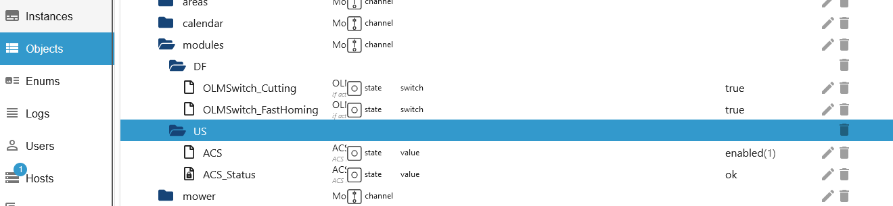
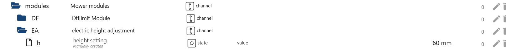
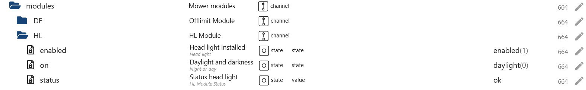
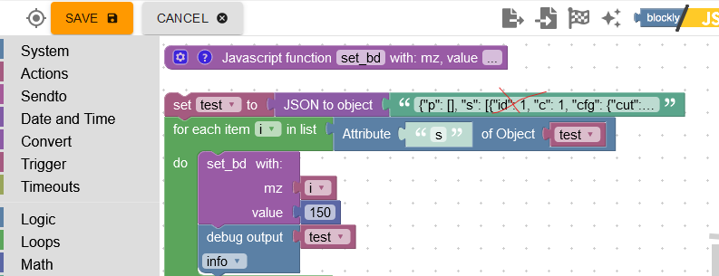

# IoBroker.worx 适配器
＃ 概括
- [实例设置](#instance-settings)
- [登录信息 JSON](#login-infos-worx0logininfo)
- [所有文件夹](#folder)
- [activityLog (Wire and Vision)](#activitylog-wire-and-vision)
- [区域（线）](#areas-wire)
- [日历（wire）](#calendar-wire)
- [日历（愿景）](#calendar-vision)
- [模块（线控和视觉）](#modules-wire-and-vision)
- [mower (Wire and Vision)](#mower-wire-and-vision)
    - [info_mqtt（Draht und Vision）]（#info_mqtt-wire-and-vision）
- [更多视觉信息](#additionally-for-vision)
- [速率限制](#速率限制)
- [示例 Blockly sendMultiZonesJson Vision](#example-blockly-sendmultizonesjson-vision)

## 重要信息
🟢 两次活动切换操作之间有 1.1 秒的暂停时间</br> 🔴 无延迟，下一次活动操作也无延迟

无效</br> 🟢🟢🟢

有效</br> 🟢1,1🟢1,1🟢

无效</br> 🔴🔴🟢🟢

有效</br> 🔴🔴🟢1,1🟢

无效</br> 🔴🟢🔴🟢

有效</br> 🔴🟢1,1🔴🟢

＃＃ 描述
### 实例设置
[概括](#summary)

- `应用邮箱`：您的应用用户名（邮箱）
- `应用密码`：您的应用密码
- `应用名称`：选择您的设备
- `更新间隔（分钟）` 更新所有数据的间隔时间（取值范围为 10 至 1440）`
- `边缘修剪延迟`：边缘修剪何时开始（例如，修剪草坪 5 秒后开始）
- `距离和时间（分钟和米）：默认单位为小时和公里
- `令牌更新后更新 MQTT 数据。`: 刷新令牌后加载 Worx 数据。
- `通过通知显示错误（适用于所有设备）`: 开启/关闭所有设备的通知（可在“对象”下为每个设备开启/关闭）
- `删除会话数据` 如果登录遇到问题，请删除当前会话
- `重置登录计数器` 重置登录计数器
- `每日请求次数限制 (50-180)`：限制每日请求次数。这些是 API 查询，例如设定的间隔和刷新令牌后的更新（在实例设置中）。每次重启都会生成 4 个请求。此外，还会生成 1 个固件状态查询和 1 个活动日志查询（割草机的每次状态/错误更改）。将此值设置为 100 位，并检查晚上 11:55 发送的查询次数。然后将此数字加 10。
- “每 10 分钟请求限制 (4-15)”：API 请求限制 - Sollte auf 4 stehen da sonst ein Neustart nicht möglich wäre。
- “每天 MQTT 限制（1-250 个专业设备）”：请求 Limitierung über MQTT。 Die Auswahl ist pro Geräte。
- `每天重启次数限制 (1-10)`：防止未知和意外的适配器重启。
- `MQTT-Verbindung auswählen`：
- `Alte AWS-Verbindung`：使用旧的 MQTT 连接。缺点：每 20 分钟强制断开连接，重新建立连接需要 1 秒钟。
- `Neue AWS-Verbindung`：使用新的 MQTT 连接。缺点：由于令牌的原因，连接每小时都会断开并重新建立。如果模块遇到错误，则会自动使用旧连接。
    - `MQTT5-Verbindung (derzeit nicht verfügbar)`：当前不可用。然后将使用旧的连接。

</br> </br> 

### 登录信息 `worx.0.loginInfo`
[概括](#summary)

```json
{
    "loginCounter": 1, // Login counter
    "loginDiff": [1741458177709], // Time difference of the last 10 logins
    "lastLoginTimestamp": 1741458177709, // Last login as timestamp
    "lastLoginDate": "2025-03-08T18:22:57.710Z", // Last login as ISO string WITHOUT time zone
    "refreshCounter": 1, // Counter for refreshToken (reset on restart)
    "refreshHistory": [1741516809807], // History refreshToken as timestamp
    "lastRefreshTimestamp": 1741459690942, // Last refreshToken as timestamp
    "lastRefreshDate": "2025-03-08T18:48:10.942Z", // Last refreshToken as ISO String WITHOUT time zone
    "nextRefreshTimestamp": 1743548215943, // Next refreshToken as timestamp
    "nextRefreshDate": "2025-04-01T22:56:55.943Z", // Next refreshToken as ISO String WITHOUT time zone
    "lastError": "", // Last error message
    "errorHistory": [], // History errors as timestamp
    "errorCounter": 0, // Counter of error messages (reset on restart)
    "lastErrorTimestamp": 0, // Last error message as timestamp
    "lastErrorDate": "" // Last error message as ISO string WITHOUT time zone
}
```

＃＃＃ 文件夹
[概括](#summary)

- `activityLog`：您的活动日志（支持 Wire 和 Vision / 可控）
- `areas`：区域（可布线/控制）
- `multiZones`：多区域（可视/可控）
- `日历`：时间安排（可通过 Wire & Vision / Control 实现）
- `模块`：您的模块（线控和视觉/控制均可）
- `mower`: 您的割草机（支持有线和视频控制）
- `product`：设备的所有属性（Wire & Vision / 只读）
- `rawMqtt`：所有来自云端的数据（Wire & Vision / 只读）


### 活动日志（线控和视觉）
[概括](#summary)

- `last_update`：上次更新时间戳（Wire & Vision / 只读）
- `manuell_update`：加载当前活动日志（状态更改后自动加载 - 可通过 Wire & Vision / 控制）
- `payload`：活动日志，格式为 JSON 表格（适用于 VIS 或 Blockly）


### 区域（电线）
[概括](#summary)

- `actualArea`：当前
- `actualAreaIndicator`：下一个数组区域开始
- `area_0`：区域 1 的起始位置（单位：米）（数组=0）（可更改）🟢
- `area_1`：区域 2 的起始位置（单位：米）（数组=1）（可更改）🟢
- `area_2`：区域 3 的起始位置（单位：米）（数组大小=2）（可更改）🟢
- `area_3`：区域 4 的起始位置（单位：米）（数组大小=3）（可更改）🟢
- `startSequence`：数组区域起始位置（0-9 个事件），例如：仅从区域 3 开始 [2,2,2,2,2,2,2,2,2,2,2]（可更改）🟢
- `zoneKeeper`：在狭窄区域交叉口安全驾驶（必须创建区域）（固件版本 3.30 起）（可更改）🟢


### 日历（Wire）
[概括](#summary)

例如：星期三的时间设定
- `wednesday.borderCut`：启用或禁用边框裁剪（更改值无需等待）（可更改）🔴
- `wednesday.startTime`：开始时间 hh:mm (0-23/0-59) 例如 09:00（可立即更改值）（可更改）🔴
- `wednesday.workTime`：工作时间，以分钟为单位（180 分钟 = 3 小时），例如 30 = 结束时间 09:30（可立即更改值）（可更改）🔴
- `calJson_sendto`：如果所有状态都已设置，则按下按钮发送（延迟 1.1 秒）。割草机将开始割草 30 分钟（可更改）🟢
- `calJson_tosend`：此数据将发送到 MQTT（割草计划/自动设置）。您也可以自行创建此 JSON 文件。（可更改）🟢
- `calendar.calJson`：每周割草计划的数组。您也可以自行创建此数组。（割草计划 1/自动设置 - 仅适用于线路）（可更改）🔴
- `calendar.calJson2`：每周割草计划的数组。您也可以自行创建此数组。（割草计划 2/自动设置 - 仅适用于线路）（可更改）🔴


### 日历（愿景）
[概括](#summary)

例如：设定星期五的时间
- 默认情况下，系统会创建 2 个时间段。如果在 APP 中创建了 3 个时间段，ioBroker 中也会创建 3 个时间段。如果时间段数量再次减少到 2 个，则 ioBroker 中创建的这 3 个时间段将被删除。时间段数量最多的一天将作为所有日期的参考值。
- `friday.time_0.borderCut`：启用或禁用边框裁剪（更改值无需等待）（可更改）🔴
- `friday.time_0.startTime`：开始时间 hh:mm (0-23/0-59) 例如 09:00（可立即更改值）（可更改）🔴
- `friday.time_0.workTime`：工作时间（分钟）（180 分钟 = 3 小时），例如 30 = 结束时间 09:30（可立即更改值）（可更改）🔴
- `friday.time_0.enabled_time`：启用或禁用时间。（设置后无延迟）（可更改）🔴
- `friday.time_0.zones`：应接近哪些区域，例如示例 [1,2,3]（设置为无延迟）（可更改）🔴
- `calJson_sendto`：如果所有状态都已设置，则将此按钮设置为 true。割草机现在将割草 30 分钟！（可更改）🟢
- `calJson_tosend`：此 JSON 数据将自动填充并发送到 MQTT。当然，您也可以自行创建。（可更改）🔴
- `add_timeslot`：添加一个额外的时间段。重启后，未使用的时间段将被移除。（可更改）🔴

 

### 示例时段（视觉）
- `calJson_tosend` 此 JSON 会在周日添加一次，并删除其他所有日期。必须始终提交整周的数据。🔴

```json
[
    {
        "e": 1, // 0=deactivated/1=activated - Set 0 for deactivated this slot
        "d": 0, // Days 0=sunday, 1=monday, 2=tuesday, 3=wednesday, 4=thursday, 5=friday, 6=saturday
        "s": 360, // Start time in minutes 06:00 (360/60) - (320/60 = 5 hours and 20 minutes)
        "t": 180, // Mowing time in minutes = End time 09:00 (180/60) - (200/60 = 3 hours and 20 minutes)
        "cfg": {
            "cut": {
                "b": 1, // 0=without BorderCut/1=with BorderCut
                "z": [1] // Which zones [1,2,6]
            }
        }
    }
]
```

### 模块（线缆和视觉）
[概括](#summary)

- 禁区模块（线缆和视觉）
- `DF.OLMSwitch_Cutting`：防止磁带被碾压 - 真/假
- `DF.OLMSwitch_FastHoming`：快速返回充电站 - 使用磁条制成的快捷方式 - 真/假

- ACS模块（仅线缆）
- `US.ACS`：启用或禁用 ACS - 1 表示开启，0 表示关闭 🟢
- `US.ACS_Status`：来自 ACS 模块的状态（只读）

- EA 模块（仅限 Vision）
- `EA.height`：割草机刀盘高度调节范围为 30-60，以 5 毫米为增量 🟢

- HL模块（仅限视觉）
- `HL.status`: 前照灯状态（只读）
- `HL.enabled`：大灯已安装 是 = 1/否 = 0 🟢
- `HL.on`：日光 = 0/黑暗 = 1 🟢

- NL 模块（仅限 Vision Cloud）
- `NL.error`：错误代码（代码未知）（只读）
- `NL.status`: NearLink 模块状态 ok/err（只读）
- `NL.connection_X.mac`：MAC 地址（只读）
- `NL.connection_X.rssi`: RSSI（只读）
- `NL.connection_X.type`: 类型（只读）
- `NL.connection_X.vers`：固件版本（只读）
- `NL.connection_X.wifi_rssi`: Wifi RSSI（只读）
- `NL.connection_X.wifi_stat`: Wi-Fi 状态（只读）

   

### 割草机（Wire and Vision）
[概括](#summary)

- `自动锁定`：自动锁定功能（真/假，有线和视觉/可更改）🟢
- `自动锁定定时器`：定时器自动锁定，最长10分钟，以30秒为步长（有线和可视/可更换）🟢
- `batteryChargeCycle`: 电池充电周期（有线和 Vision/只读）
- `batteryCharging`: 电池充电 false->no/true->yes (wire & Vision/readonly)
- `batteryState`：电池状态（百分比）（有线和视觉/只读）
- `batteryTemperature`：电池温度（摄氏度）（有线和Vision/只读）
- `batteryVoltage`：电池电压（单位：伏特）（线控和视觉/只读）
- `cameraStatus`: 摄像头状态 0=正常/1=错误（视觉/只读）
- `cameraError`：相机错误 0=正常/1=错误（视觉/只读）
- `cutOverSlabs`：切割板开启 = true / 关闭 = false（Vision/可更改）🟢
- `direction`：方向（度）（wire 和 Vision/只读）
- `edgecut`：启动 EdgeCut（线框和 Vision/可更改）🟢
- `error`: 来自割草机的错误信息（wire & Vision/只读）

```json
{
    "states": {
        "0": "No error", //(Draht & Vision & RTK)
        "1": "Trapped", //(Draht & Vision & RTK-Body)
        "2": "Lifted", //(Draht & Vision & RTK-Body)
        "3": "Wire missing", //(Draht)
        "4": "Outside boundary", //(Draht & Vision & RTK-Body)
        "5": "Rain delay", //(Draht & Vision & RTK-Body)
        "6": "Close door to cut grass", //(Draht)
        "7": "Close door to go home", //(Draht)
        "8": "Blade motor fault", //(Draht & Vision & RTK-Body)
        "9": "Wheel motor fault", //(Draht & Vision & RTK-Body)
        "10": "Trapped timeout fault", //(Draht & Vision & RTK-Body)
        "11": "Upside down", //(Draht & Vision & RTK-Body)
        "12": "Battery low", //(Draht & Vision & RTK)
        "13": "Wire reversed", //(Draht)
        "14": "Charge error", //(Draht & Vision & RTK-Body)
        "15": "Home search timeout", //(Draht & Vision)
        "16": "Wifi locked", //(Draht & Vision)
        "17": "Battery over temperature", //(Draht & Vision & RTK)
        "18": "Dummy model", //(Draht)
        "19": "Battery trunk open timeout", //(Draht & Vision)
        "20": "Wire signal out of sync", //(Draht)
        "100": "Charging station docking error", //(RTK-Body)
        "101": "HBI error", //(RTK-Body)
        "102": "OTA upgrade error", //(Vision & RTK)
        "103": "Map error", //(RTK)
        "104": "Excessive slope", //(RTK-Body)
        "105": "Unreachable zone", //(RTK-Body)
        "106": "Unreachable charging station", //(RTK-Body)
        "107": "Calibration needed", //(RTK-Head)
        "108": "Insufficient sensor data", //(RTK)
        "109": "Training start disallowed", //(RTK)
        "110": "Camera error", //(Vision)
        "111": "Lawn exploration required", //(Vision)
        "112": "Mapping exploration failed", //(Vision)
        "113": "RFID reader error", //(Vision)
        "114": "Headlight error", //(Vision)
        "115": "Missing charging station", //(RTK-Body)
        "116": "Blade height adjustment blocked", //(Vision & RTK-Body)
        "117": "Unsupported blade height", //(Vision & RTK-Body)
        "118": "Manual firrnware upgrade required", //(Vision & RTK-Body)
        "119": "Area limit exceeded", //(RTK-Body)
        "120": "Charging station undocking error" //(RTK-Body)
    }
}
```


- `firmware`: 当前已安装的固件（Wire & Vision/只读）
- `firmware_available`: 可用固件（有线和视觉/只读）
- `firmware_available_all`：最新可用固件（JSON 格式） - 当有新更新可用时，此 JSON 数据将会更新（Wire & Vision/只读）

```json
{
    "mandatory": false,
    "product": {
        "uuid": "1236ll8d-0000-0000-9999-07ff6690003f",
        "version": "3.30.0+1",
        "released_at": "2023-05-24",
        "changelog": "•\tSupport for new models \tWR166E and WR184E\n•\tImproved Grass cutting coverage\n•\tImproved ACS\n•\tAdded Zone Keeper function (need to be enabled by app)\n•\tImproved wheel torque algorithm\n• \tNew FML firmware\n•\tFixed \"FML\" and \"Radiolink\" Activation problem\n•\tFixed some translations error\n•\tRain delay can now be cleared pressing START / HOME button, (1 minute after countdown has started)\n•\tImproved PRO Battery management\n• \tImproved boundary wire recognition\n• \tFixed border cut when zones are active\n• \tNew wifi firmware for board HW REV > 7\n\nThe Worx Landroid team would like to thank our amazing beta testers, with hundreds of hours of their own free time to make this firmware possible."
    }
}
```

- `firmware_available_date`: 可用固件日期 - 虚拟值 1970-01-01，表示适配器重新安装且没有可用更新（有线和视觉/只读）
- `firmware_body` 值来自 dat.fw（Vision/readonly）
- `firmware_head` 值来自 dat.head.fw（Vision/readonly）
- `firmware_update_start`：分两步启动固件更新 - 请参阅下方的 `firmware_update_start_approved`（有线和视觉/可更换）🔴
- `firmware_update_start_approved`：启动固件更新 - `firmware_update_start` 必须设置为 true（线控和视觉/可更换）🟢
- `gradient`：以度为单位的渐变（wire 和 Vision/只读）
- `inclination`：倾斜角度（以度为单位）（wire & Vision/readonly）
- `last_command`：来自 iobroker 或 APP 的最后一个请求，以 JSON 表格形式返回（wire 和 Vision/只读）
- `last_update` 上次更新（wire & Vision/readonly）
- `last_update_connection` 是哪个连接（MQTT 或云端/Wire & Vision/只读）
- `mowTimeExtend`：割草时间延长百分比范围：-100%->100%（可设置/可更改）🟢
- `mowerActive`：false 表示暂停割草计划 60 分钟，true 表示停止割草并进入派对模式（可手动设置/更改）🟢
- `mqtt_update`：每日最多更新 150 条 MQTT 数据（Wire & Vision/Changeable）🟢
- `mqtt_update_count`: MQTT 数据更新计数器（wire 和 Vision/只读）
- `notification`：通过 JS 控制器启用或禁用通知。离线状态和错误信息会输出。（设计与愿景/可更改）🔴
- `notification_excluded`：哪些错误 ID 不应显示（用逗号分隔 ID [IDS](#error-ids)）🔴

</br> 

- `oneTimeJson`：一次性割草数据以 JSON 格式存储（wire 和 Vision/changeable）

```json
{
    "wtm": 60, //Minutes
    "bc": 0 //0=w/o bordercut 1=with bordercut or use the next State
}
```

- `oneTimeStart`：一次性割草启动“首先为 Vision 设置 oneTimeWithBorder、oneTimeWorkTime 和 oneTimeZones” - 延迟 1.1 秒（线控和 Vision/可更改）🟢
- `oneTimeWithBorder`：带边框裁剪 - 无需延迟即可更改值（线框和 Vision/可更改）🔴
- `oneTimeWorkTime`：最长工作时间 8 小时，以 30 分钟为单位递增 - 可立即更改值（线控和视觉/可更改）🔴
- `oneTimeZones`：设置时区 [1,2,4]（视觉/可更改）🔴
- `online`: Mower online (wire & Vision/只读)
- `partyModus`：派对模式开启/关闭（有线和视觉/可更改）🟢
- `partyModeTimer`：限制派对模式的持续时间。可选值为 1 至 1440 分钟。将 `partyMode` 设置为“false”即可再次停用。停用后，应用程序中不会显示派对模式，但计时器会继续倒计时。（可自定义/可更改）🟢
- `暂停`：割草机刹车开关（线控和视觉/可更换）🟢
- `reset_battery_time`：分两步重置电池充电时间（有线和可视/可更换）🔴
- `reset_battery_time_approved`：确认重置电池充电 - `reset_battery_time` 必须设置为 true（线控和视觉/可修改）🔴
- `reset_blade_time`：分两步重置刀片工作时间（线控和可更换刀片）🔴
- `reset_blade_time_approved`：确认重置刀片工作时间 - `reset_battery_time` 必须设置为 true（线控和视觉/可更换）🔴


- `rfidStatus`：射频传感器状态 0=正常/1=错误（视觉/只读）
- `sendCommand`：发送命令（线控和视觉/可更换）🟢

### 发送命令
```json
{
    "states": {
        "1": "Start", //(wire & Vision & RTK)
        "2": "Stop", //(wire & Vision & RTK)
        "3": "Home", //(wire & Vision & RTK)
        "4": "Follow border", //(wire & Vision & RTK)
        "5": "Wi-Fi Lock", //(wire & Vision unknown)
        "6": "Wi-Fi Unlock", //(wire & Vision)
        "7": "Reset Log", //(wire & Vision & RTK)
        "8": "Pause over border", //(wire & Vision)
        "9": "Safe go home", //(wire & Vision unknown)
        "10": "Start once", //(Vision)
        "100": "Pairing command", //(Vision)
        "101": "Border Cut", //(Vision & RTK)
        "102": "Resume cutting", //(RTK)
        "103": "Start driving", //(Draht & Vision & RTK)
        "104": "Stop driving" //(Draht & Vision & RTK)
    }
}
```

- `state`：True 表示启动割草机，False 表示停止割草机（线控和视觉/可更改）
- `status`: 割草机状态（有线和视觉/只读）

### 状态 ID
```json
{
    "states": {
        "0": "IDLE", //(wire & Vision & RTK-Body)
        "1": "Home", //(wire & Vision & RTK-Body)
        "2": "Start sequence", //(wire)
        "3": "Leaving home", //(wire & Vision & RTK-Body)
        "4": "Following border", //(wire)
        "5": "Searching home", //(wire & Vision & RTK-Body)
        "6": "Searching border", //(wire & Vision)
        "7": "Mowing", //(wire & Vision & RTK-Body)
        "8": "Lifted", //(wire & Vision & RTK-Body)
        "9": "Trapped", //(wire & Vision & RTK-Body)
        "10": "Blade blocked", //(wire & Vision & RTK-Body)
        "11": "Debug", //(wire)
        "12": "Driving", //(wire & Vision)
        "13": "Digital fence escape", //(wire & Vision)
        "30": "Going home", //(wire & Vision)
        "31": "Zone training", //(wire & Vision)
        "32": "Border Cut", //(wire & Vision)
        "33": "Searching zone", //(wire & Vision)
        "34": "Pause", //(wire & Vision)
        "100": "Map training (completable)", //(RTK-Head)
        "101": "Map processing", //(RTK)
        "102": "Upgrading firmware", //(RTK)
        "103": "Moving to zone", //(RTK-Body)
        "104": "Going home", //(RTK-Body)
        "105": "Ready for training", //(RTK-Head)
        "106": "Map download in progress", //(RTK)
        "107": "Map upload in progress", //(RTK-Head)
        "108": "Map training paused", //(RTK-Head)
        "109": "Map training (not completable)", //(RTK-Head)
        "110": "Border crossing", //(Vision)
        "111": "Exploring lawn", //(Vision)
        "112": "Moving to recovery point", //(RTK-Body)
        "113": "Waiting for position", //(RTK-Body)
        "114": "Map training (driving)", //(Vision & RTK-Body)
        "115": "Map training (rolling back)" //(Vision)
    }
}
```

- `扭矩`：车轮扭矩范围 -50->50（线控和可视/可更换）🟢
- `totalBladeTime`：刀片总运行时间（线控和 Vision/只读）
- `totalDistance`：总距离（有线和 Vision/只读）
- `totalTime`：总工作时间（线控和视觉/只读）
- `waitRain`：雨天延迟时间最长为 12 小时，以 30 分钟为单位递增，0 表示关闭（线控和视觉/可更改）🟢
- `waitRainCountdown` 当传感器从潮湿变为干燥时开始倒计时（有线/只读）（视觉功能已禁用）
- `waitRainSensor` 状态：0 表示干燥，1 表示潮湿（有线/只读）（视觉功能已禁用）
- `wifiQuality`: Wi-Fi 质量（有线和 Vision/只读）

```json
{
    "rain": {
        "s": 0, // 0 for dry and 1 for wet (Wire & Vision)
        "cnt": 59 // Start countdown when changing from s=1 wet to s=0 dry - rain was detected (Wire & Vision)
    }
}
```


### 此外，对于视力
[概括](#summary)

多区域
- `multiZones.zones.zone_1.borderDistance`：边界切割时，到边缘的距离，单位为毫米 - 允许值为 50 毫米、100 毫米、150 毫米和 200 毫米 - 可使用 Blockly 即时设置 - 更改写入 `multiZones.multiZones` (vision/changeable) 🔴
- `multiZones.zones.zone_1.chargingStation`：1 表示在此区域内找到充电站。0 表示未找到充电站。- 使用 Blockly 即时设置 - 更改将写入 `multiZones.multiZones` (vision/changeable) 🔴
- `multiZones.zones.zone_1.cutOverBorder`：如果检测到平板，则为 1，否则为 0。使用 Blockly 设置，无需延迟 - 更改将写入 `multiZones.multiZones`（视觉/可更改）🔴
- `multiZones.zones.zone_1.zone_id`：编号 - 从 1 开始 - （视觉/只读）🔴
- `multiZones.passages.passage_01.tagIdFrom`：zoneIdFrom 的 RFID ID - 使用 Blockly 即时设置 - 更改写入 `multiZones.multiZones`（vision/changeable）🔴
- `multiZones.passages.passage_01.tagIdTo`：zoneIdTo 的 RFID ID - 使用 Blockly 即时设置 - 更改写入 `multiZones.multiZones`（可视/可更改）🔴
- `multiZones.passages.passage_01.zoneIdFrom`：区域起始 ID（必须 zoneIdFrom < zoneIdTo） - 使用 Blockly 即时设置 - 更改将写入 `multiZones.multiZones`（vision/changeable）🔴
- `multiZones.passages.passage_01.zoneIdTo`：区域已关闭（必须 zoneIdTo > zoneIdFrom） - 使用 Blockly 即时设置 - 更改将写入 `multiZones.multiZones`（vision/changeable）🔴
- `multiZones.multiZones`：多区域 JSON（Vision/可更改）[示例](#example-blockly-sendMultiZonesJson-vision) 🔴
- `multiZones.sendMultiZonesJson`：将更改延迟 1.1 秒发送到 Worx（视觉/可更改）🟢

例子：

```json
{
    "mz": {
        "p": [
            // Passages between zones
            {
                "z1": 1, // Zone from (must z1 < z2)
                "z2": 2, // Zone to (must z2 > z1)
                "t1": "E000000000000000", // RFID id from z1
                "t2": "E0000000KKKKKKKK" // RFID id from z2
            }
        ],
        "s": [
            // The zones themselves
            {
                "id": 1, // Numbering - Start with 1
                "c": 1, // 1 if the charging station is in this zone. 0 for no charging station.
                "cfg": {
                    "cut": {
                        "bd": 100, // Edge cut the distance to the edge in mm - allowed 50mm, 100mm, 150mm and 200mm
                        "ob": 0 // 1 for driving over slabs if they are detected, otherwise 0. Different per-zone is not allowed
                    }
                }
            },
            {
                "id": 2, // Numbering
                "c": 0, // 1 if the charging station is in this zone. 0 for no charging station.
                "cfg": {
                    "cut": {
                        "bd": 100, // Edge cut the distance to the edge in mm - allowed 50mm, 100mm, 150mm and 200mm
                        "ob": 0 // 1 for driving over slabs if they are detected, otherwise 0. Different per-zone is not allowed
                    }
                }
            }
        ]
    }
}
```

默认不带区域：

```json
{
    "mz": {
        "p": [],
        "s": [
            {
                "id": 1,
                "c": 1,
                "cfg": {
                    "cut": {
                        "bd": 150,
                        "ob": 0
                    }
                }
            }
        ]
    }
}
```


割草机
- `log_improvement`：向 Worx 发送改进日志（可禁用/启用，可更改）🟢
- `log_troubleshooting`：将故障排除日志发送到 Worx 禁用/启用（可更改）🟢


割草机
- `paused`：暂停的日程安排（分钟）（可更改）🟢


### Info_mqtt（Wire and Vision）
[概括](#summary)

- `incompleteOperationCount`：已提交到连接但尚未完成的操作总数。未确认的操作是其中的一部分。
- `incompleteOperationSize`：已提交到连接但尚未完成的操作的总数据包大小。未确认的操作是其中的一部分。
- `unackedOperationCount`：已发送到服务器并正在等待相应 ACK 才能完成的操作总数。
- `unackedOperationSize`：已发送到服务器并正在等待相应 ACK 才能完成的操作的总数据包大小。
- `last_update`：令牌的最后一次更新
- `next_update`：令牌的下一次更新
- `online`：MQTT 连接状态（false=离线/true=在线）


### 速率限制
[概括](#summary)

- 值 worx.0.blocking

锁定将在24小时后自动解除。下次令牌更新时，所有设置将被重置。

```json
{
    "block": false, // true = 429 too many request is activ
    "start": 0, // Start of the blocking as a timestamp
    "time": "", // With time zone
    "retry-after": 0 // How long you are blocked
}
```

- 值 worx.0.requestsrateLimit

可以手动更改计数器，以消除任何过早锁定。

```json
{
    "apiCounter": 6, // API request per day
    "apiLast": 1751483518418, // Last API request as timestamp
    "apiTime": "2025-07-02T19:11:58.418Z", // Last API request with time zone
    "apiRequest": [
        // All API requests
        {
            "count": 1,
            "request": "https://api.worxlandroid.com/api/v2/product-items?status=1&gps_status=1",
            "time": "2025-07-02T19:11:58.418Z"
        },
        {
            "count": 2,
            "request": "https://api.worxlandroid.com/api/v2/product-items/xxx/firmware-upgrade",
            "time": "2025-07-02T19:11:58.895Z"
        },
        {
            "count": 3,
            "request": "https://api.worxlandroid.com/api/v2/product-items/xxx/activity-log",
            "time": "2025-07-02T19:11:59.130Z"
        },
        {
            "count": 4,
            "request": "https://api.worxlandroid.com/api/v2/products",
            "time": "2025-07-02T19:11:59.364Z"
        },
        {
            "count": 5,
            "request": "https://api.worxlandroid.com/api/v2/users/me",
            "time": "2025-07-02T19:12:00.318Z"
        },
        {
            "count": 6,
            "request": "https://id.worx.com/oauth/token?",
            "time": "2025-07-03T18:12:46.628Z"
        }
    ],
    "mqttDevice": {
        // MQTT Counter per device
        "xxxF3": {
            "mqttCount": 6, // Counter MQTT commands
            "mqttLast": 1751651797646, // Last command with time zone
            "mqttTime": "2025-07-04T17:56:37.646Z", // Letzter Kommando mit Zeitzone
            "mqttBlock": true, // true = Kommandos deaktiviert / false = Kommandos aktiv
            "mqttRequest": [
                // Last commands
                {
                    "count": 1,
                    "message": "{\"id\":23210,\"cmd\":0,\"lg\":\"de\",\"sn\":\"xxx\",\"tm\":\"21:12:00\",\"dt\":\"02/07/2025\"}",
                    "time": "2025-07-02T19:12:00.811Z"
                },
                {
                    "count": 2,
                    "message": "{\"id\":58731,\"cmd\":0,\"lg\":\"de\",\"sn\":\"xxx\",\"tm\":\"20:12:49\",\"dt\":\"03/07/2025\"}",
                    "time": "2025-07-03T18:12:49.586Z"
                },
                {
                    "count": 3,
                    "message": "{\"id\":3925,\"cmd\":0,\"lg\":\"de\",\"sn\":\"xxx\",\"tm\":\"20:20:41\",\"dt\":\"03/07/2025\"}",
                    "time": "2025-07-03T18:20:41.579Z"
                },
                {
                    "count": 4,
                    "message": "{\"id\":3265,\"cmd\":0,\"lg\":\"de\",\"sn\":\"xxx\",\"tm\":\"21:10:19\",\"dt\":\"03/07/2025\"}",
                    "time": "2025-07-03T19:10:19.292Z"
                },
                {
                    "count": 5,
                    "message": "{\"id\":28606,\"cmd\":0,\"lg\":\"de\",\"sn\":\"xxx\",\"tm\":\"21:11:20\",\"dt\":\"03/07/2025\"}",
                    "time": "2025-07-03T19:11:20.634Z"
                },
                {
                    "count": 6,
                    "message": "{\"id\":12891,\"cmd\":0,\"lg\":\"de\",\"sn\":\"xxx\",\"tm\":\"19:56:37\",\"dt\":\"04/07/2025\"}",
                    "time": "2025-07-04T17:56:37.646Z"
                }
            ]
        },
        "xxxE2": {
            "mqttCount": 0,
            "mqttLast": 0,
            "mqttBlock": false,
            "mqttRequest": []
        },
        "xxxC5": {
            "mqttCount": 0,
            "mqttLast": 0,
            "mqttBlock": false,
            "mqttRequest": []
        },
        "xxx2F": {
            "mqttCount": 0,
            "mqttLast": 0,
            "mqttBlock": false,
            "mqttRequest": []
        }
    },
    "mqttDay": "27-4", // calendar week-day. When changing everything is reset
    "restartCount": 6, // Counter restart adapter
    "restartLast": 1751569817003, // Last restart
    "restartTime": "2025-07-03T19:10:17.003Z", // Last restart with time zone
    "day": "27-4" // calendar week-day. When changing everything is reset
}
```


### 示例 Blockly sendMultiZonesJson Vision
[概括](#summary)

```
<xml xmlns="https://developers.google.com/blockly/xml">
  <variables>
    <variable id="${]4s$w?n24Az}=7iAIY">mz</variable>
    <variable id="o.FQ]_Xa!tHn2T7Ak{Pt">value</variable>
    <variable id="/@E4iFRMr:x+u?{7yFlB">test</variable>
    <variable id="jxTInS{}mk_)WJa[:,fA">i</variable>
  </variables>
  <block type="procedures_defcustomnoreturn" id="u:w*aBH!92nydG0Mu.1-" x="-87" y="-87">
    <mutation statements="false">
      <arg name="mz" varid="${]4s$w?n24Az}=7iAIY"></arg>
      <arg name="value" varid="o.FQ]_Xa!tHn2T7Ak{Pt"></arg>
    </mutation>
    <field name="NAME">set_bd</field>
    <field name="SCRIPT">bXouY2ZnLmN1dC5iZCA9IDE1MA==</field>
    <comment pinned="false" h="80" w="160">Beschreibe diese Funktion …</comment>
  </block>
  <block type="variables_set" id="jiP0218}2,Y]B]RdKD~`" x="-87" y="-35">
    <field name="VAR" id="/@E4iFRMr:x+u?{7yFlB">test</field>
    <value name="VALUE">
      <block type="convert_json2object" id=";Ef{FHk_~heeozyHFxci">
        <value name="VALUE">
          <block type="get_value" id="LMfldD:[D4%}yWE8,N0y">
            <field name="ATTR">val</field>
            <field name="OID">worx.0.xxxxxxxxxxxxxxxxxxxx.multiZones.sendMultiZonesJson</field>
          </block>
        </value>
      </block>
    </value>
    <next>
      <block type="controls_forEach" id="D{XG==q$flbH?32eX%D(">
        <field name="VAR" id="jxTInS{}mk_)WJa[:,fA">i</field>
        <value name="LIST">
          <block type="get_attr" id="b~2/cb$WhEj*9i6,(ey5">
            <value name="PATH">
              <shadow type="text" id="+n~;GfHf{,#D!5D}H+m=">
                <field name="TEXT">s</field>
              </shadow>
            </value>
            <value name="OBJECT">
              <block type="variables_get" id="YloS$N%I=6[yk;loD*1O">
                <field name="VAR" id="/@E4iFRMr:x+u?{7yFlB">test</field>
              </block>
            </value>
          </block>
        </value>
        <statement name="DO">
          <block type="procedures_callcustomnoreturn" id="er{Pwq:Y7n_I|CQoup,|">
            <mutation name="set_bd">
              <arg name="mz"></arg>
              <arg name="value"></arg>
            </mutation>
            <value name="ARG0">
              <block type="variables_get" id="(-_i0(y:W}U_x?s(7k%4">
                <field name="VAR" id="jxTInS{}mk_)WJa[:,fA">i</field>
              </block>
            </value>
            <value name="ARG1">
              <block type="math_number" id="{2u/=v!k|yJsOesq[CU^">
                <field name="NUM">150</field>
              </block>
            </value>
            <next>
              <block type="debug" id="b1}}DmS-[_W:+Y+$|%)r">
                <field name="Severity">log</field>
                <value name="TEXT">
                  <shadow type="text" id="7wx?ca_U[S~8DA4}*RXx">
                    <field name="TEXT">test</field>
                  </shadow>
                  <block type="variables_get" id="_zz;w64g-!E$zX$]pvyI">
                    <field name="VAR" id="/@E4iFRMr:x+u?{7yFlB">test</field>
                  </block>
                </value>
              </block>
            </next>
          </block>
        </statement>
        <next>
          <block type="debug" id="o[S0+1%{oLU+r:03tz7=">
            <field name="Severity">log</field>
            <value name="TEXT">
              <shadow type="text" id="7wx?ca_U[S~8DA4}*RXx">
                <field name="TEXT">test</field>
              </shadow>
              <block type="variables_get" id="tjqxQ(MO|CR~/Xq5;Pm[">
                <field name="VAR" id="/@E4iFRMr:x+u?{7yFlB">test</field>
              </block>
            </value>
            <next>
              <block type="control" id="C^lZ^SNIQ#,vh}?hSG_O">
                <mutation xmlns="http://www.w3.org/1999/xhtml" delay_input="false"></mutation>
                <field name="OID">worx.0.xxxxxxxxxxxxxxxxxxxx.multiZones.sendMultiZonesJson</field>
                <field name="WITH_DELAY">FALSE</field>
                <value name="VALUE">
                  <block type="convert_object2json" id="z)EXA+%8lB4K#7!Hp1V%">
                    <field name="PRETTIFY">FALSE</field>
                    <value name="VALUE">
                      <block type="variables_get" id="C4np)gS@^Y*?-0I+R6+r">
                        <field name="VAR" id="/@E4iFRMr:x+u?{7yFlB">test</field>
                      </block>
                    </value>
                  </block>
                </value>
              </block>
            </next>
          </block>
        </next>
      </block>
    </next>
  </block>
</xml>

<xml xmlns="https://developers.google.com/blockly/xml">
  <variables>
    <variable id="${]4s$w?n24Az}=7iAIY">mz</variable>
    <variable id="o.FQ]_Xa!tHn2T7Ak{Pt">value</variable>
    <variable id="/@E4iFRMr:x+u?{7yFlB">test</variable>
    <variable id="jxTInS{}mk_)WJa[:,fA">i</variable>
  </variables>
  <block type="procedures_defcustomnoreturn" id="u:w*aBH!92nydG0Mu.1-" x="-87" y="-87">
    <mutation statements="false">
      <arg name="mz" varid="${]4s$w?n24Az}=7iAIY"></arg>
      <arg name="value" varid="o.FQ]_Xa!tHn2T7Ak{Pt"></arg>
    </mutation>
    <field name="NAME">set_bd</field>
    <field name="SCRIPT">bXouY2ZnLmN1dC5iZCA9IDE1MA==</field>
    <comment pinned="false" h="80" w="160">Beschreibe diese Funktion …</comment>
  </block>
  <block type="variables_set" id="jiP0218}2,Y]B]RdKD~`" x="-87" y="-35">
    <field name="VAR" id="/@E4iFRMr:x+u?{7yFlB">test</field>
    <value name="VALUE">
      <block type="convert_json2object" id=";Ef{FHk_~heeozyHFxci">
        <value name="VALUE">
          <block type="get_value" id="LMfldD:[D4%}yWE8,N0y">
            <field name="ATTR">val</field>
            <field name="OID">worx.0.xxxxxxxxxxxxxxxxxxxx.multiZones.sendMultiZonesJson</field>
          </block>
        </value>
      </block>
    </value>
    <next>
      <block type="controls_forEach" id="D{XG==q$flbH?32eX%D(">
        <field name="VAR" id="jxTInS{}mk_)WJa[:,fA">i</field>
        <value name="LIST">
          <block type="get_attr" id="b~2/cb$WhEj*9i6,(ey5">
            <value name="PATH">
              <shadow type="text" id="+n~;GfHf{,#D!5D}H+m=">
                <field name="TEXT">s</field>
              </shadow>
            </value>
            <value name="OBJECT">
              <block type="variables_get" id="YloS$N%I=6[yk;loD*1O">
                <field name="VAR" id="/@E4iFRMr:x+u?{7yFlB">test</field>
              </block>
            </value>
          </block>
        </value>
        <statement name="DO">
          <block type="procedures_callcustomnoreturn" id="er{Pwq:Y7n_I|CQoup,|">
            <mutation name="set_bd">
              <arg name="mz"></arg>
              <arg name="value"></arg>
            </mutation>
            <value name="ARG0">
              <block type="variables_get" id="(-_i0(y:W}U_x?s(7k%4">
                <field name="VAR" id="jxTInS{}mk_)WJa[:,fA">i</field>
              </block>
            </value>
            <value name="ARG1">
              <block type="math_number" id="{2u/=v!k|yJsOesq[CU^">
                <field name="NUM">150</field>
              </block>
            </value>
            <next>
              <block type="debug" id="b1}}DmS-[_W:+Y+$|%)r">
                <field name="Severity">log</field>
                <value name="TEXT">
                  <shadow type="text" id="7wx?ca_U[S~8DA4}*RXx">
                    <field name="TEXT">test</field>
                  </shadow>
                  <block type="variables_get" id="_zz;w64g-!E$zX$]pvyI">
                    <field name="VAR" id="/@E4iFRMr:x+u?{7yFlB">test</field>
                  </block>
                </value>
              </block>
            </next>
          </block>
        </statement>
        <next>
          <block type="debug" id="o[S0+1%{oLU+r:03tz7=">
            <field name="Severity">log</field>
            <value name="TEXT">
              <shadow type="text" id="7wx?ca_U[S~8DA4}*RXx">
                <field name="TEXT">test</field>
              </shadow>
              <block type="variables_get" id="tjqxQ(MO|CR~/Xq5;Pm[">
                <field name="VAR" id="/@E4iFRMr:x+u?{7yFlB">test</field>
              </block>
            </value>
            <next>
              <block type="control" id="C^lZ^SNIQ#,vh}?hSG_O">
                <mutation xmlns="http://www.w3.org/1999/xhtml" delay_input="false"></mutation>
                <field name="OID">worx.0.xxxxxxxxxxxxxxxxxxxx.multiZones.sendMultiZonesJson</field>
                <field name="WITH_DELAY">FALSE</field>
                <value name="VALUE">
                  <block type="convert_object2json" id="z)EXA+%8lB4K#7!Hp1V%">
                    <field name="PRETTIFY">FALSE</field>
                    <value name="VALUE">
                      <block type="variables_get" id="C4np)gS@^Y*?-0I+R6+r">
                        <field name="VAR" id="/@E4iFRMr:x+u?{7yFlB">test</field>
                      </block>
                    </value>
                  </block>
                </value>
              </block>
            </next>
          </block>
        </next>
      </block>
    </next>
  </block>
</xml>
```

＃＃＃ 或者
```
<xml xmlns="https://developers.google.com/blockly/xml">
  <variables>
    <variable id="2#Mf$#JFCN9Nw2F2L[?=">x</variable>
    <variable id="fNt-C|86(glunJ:-t=dK">p</variable>
    <variable id="Rci4:iMYXzjoI2k]P^X)">s</variable>
    <variable id="[t-srB,I/UkXaWBk4*A*">list</variable>
    <variable id="]WA|%5f=H9^9uiLc;KS[">new_json</variable>
  </variables>
  <block type="procedures_defcustomreturn" id="@Y/LobsPw4k!jQb)fI!." x="88" y="13">
    <mutation statements="false">
      <arg name="x" varid="2#Mf$#JFCN9Nw2F2L[?="></arg>
      <arg name="p" varid="fNt-C|86(glunJ:-t=dK"></arg>
      <arg name="s" varid="Rci4:iMYXzjoI2k]P^X)"></arg>
    </mutation>
    <field name="NAME">json</field>
    <field name="SCRIPT">eFsicCJdID0gcDsNCnhbInMiXSA9IHM7DQpyZXR1cm4geA==</field>
    <comment pinned="false" h="80" w="160">Describe this function...</comment>
  </block>
  <block type="variables_set" id="WAsPqIMv;bh95{7~Y!D!" x="88" y="63">
    <field name="VAR" id="[t-srB,I/UkXaWBk4*A*">list</field>
    <value name="VALUE">
      <block type="convert_json2object" id="S5uRAnpcGp/7*1b,aum~">
        <value name="VALUE">
          <block type="text" id="}n3]_HIP*7y5GMEo-!c3">
            <field name="TEXT">{p:[],s:[]}</field>
          </block>
        </value>
      </block>
    </value>
    <next>
      <block type="variables_set" id="Kf#KkskB7l|uDiI!(fjq">
        <field name="VAR" id="]WA|%5f=H9^9uiLc;KS[">new_json</field>
        <value name="VALUE">
          <block type="procedures_callcustomreturn" id="K;OJHrji~09PeJ33q.gl">
            <mutation name="json">
              <arg name="x"></arg>
              <arg name="p"></arg>
              <arg name="s"></arg>
            </mutation>
            <value name="ARG0">
              <block type="variables_get" id="ipM^e+~#-hoo0(047Ybo">
                <field name="VAR" id="[t-srB,I/UkXaWBk4*A*">list</field>
              </block>
            </value>
            <value name="ARG1">
              <block type="lists_create_with" id="HJIZHLc]lL0Tgqe$E~Ul">
                <mutation items="0"></mutation>
              </block>
            </value>
            <value name="ARG2">
              <block type="lists_create_with" id="JH=jADj%lYJ(:7%v[o+3">
                <mutation items="1"></mutation>
                <value name="ADD0">
                  <block type="convert_json2object" id="@5BT0}WJ`srV89LD5h?D">
                    <value name="VALUE">
                      <block type="text" id="=.e.D[I2IQ{u!4;(-D-,">
                        <field name="TEXT">{"id":1,"c":1,"cfg":{"cut":{"bd":150,"ob":1}}}</field>
                      </block>
                    </value>
                  </block>
                </value>
              </block>
            </value>
          </block>
        </value>
        <next>
          <block type="control" id="k$;?LM/[x-TbZ^m=F4}i">
            <mutation xmlns="http://www.w3.org/1999/xhtml" delay_input="false"></mutation>
            <field name="OID">worx.0.xxxxxxxxxx.multiZones.sendMultiZonesJson</field>
            <field name="WITH_DELAY">FALSE</field>
            <value name="VALUE">
              <block type="convert_object2json" id="b~2Bz}OiNg{V]!QgN^J7">
                <field name="PRETTIFY">FALSE</field>
                <value name="VALUE">
                  <block type="variables_get" id="b|+SOSd+ZD@*XHPGu*I(">
                    <field name="VAR" id="]WA|%5f=H9^9uiLc;KS[">new_json</field>
                  </block>
                </value>
              </block>
            </value>
          </block>
        </next>
      </block>
    </next>
  </block>
</xml>
```

### 或直接
```
{"p": [],"s": [{"id": 1, "c": 1, "cfg": {"cut": {"bd": 100, "ob": 1}}}]}
```


### 不允许
 

## Changelog

### **WORK IN PROGRESS**

- (copilot) Adapter requires node.js >= 22 now
- (Lucky-ESA) MQTT connection status display fixed
- (Lucky-ESA) NearLink module added to Vision Cloud
- (Lucky-ESA) Objects from Protocol 1 changed to read-only

### 3.3.0 (2026-04-12)

- (copilot) Adapter requires admin >= 7.7.22 now
- (Lucky-ESA) Dependencies updated
- (Lucky-ESA) Error HTTP 405 fixed
- (Lucky-ESA) Preparation Vision Cloud Mower
- (Lucky-ESA) Sentry Error from "Vision Cloud" fixed

### 3.2.7 (2025-08-16)

- (Lucky-ESA) MQTT connection selection added
- (Lucky-ESA) Rate limit selection added in instance settings
- (Lucky-ESA) Admin 7.6.17 required

### 3.2.6 (2025-06-29)

- (Lucky-ESA) Added rate limit for API request

### 3.2.5 (2025-06-25)

- (Lucky-ESA) MQTT connection changed

### 3.2.4 (2025-06-14)

- (Lucky-ESA) TypeError native_excluded fixed

[Older changelogs can be found there](CHANGELOG_OLD.md)

## License

MIT License

Copyright (c) 2026 iobroker-community-adapters <iobroker-community-adapters@gmx.de>  
Copyright (c) 2023-2025 TA2k <tombox2020@gmail.com>

Permission is hereby granted, free of charge, to any person obtaining a copy
of this software and associated documentation files (the "Software"), to deal
in the Software without restriction, including without limitation the rights
to use, copy, modify, merge, publish, distribute, sublicense, and/or sell
copies of the Software, and to permit persons to whom the Software is
furnished to do so, subject to the following conditions:

The above copyright notice and this permission notice shall be included in all
copies or substantial portions of the Software.

THE SOFTWARE IS PROVIDED "AS IS", WITHOUT WARRANTY OF ANY KIND, EXPRESS OR
IMPLIED, INCLUDING BUT NOT LIMITED TO THE WARRANTIES OF MERCHANTABILITY,
FITNESS FOR A PARTICULAR PURPOSE AND NONINFRINGEMENT. IN NO EVENT SHALL THE
AUTHORS OR COPYRIGHT HOLDERS BE LIABLE FOR ANY CLAIM, DAMAGES OR OTHER
LIABILITY, WHETHER IN AN ACTION OF CONTRACT, TORT OR OTHERWISE, ARISING FROM,
OUT OF OR IN CONNECTION WITH THE SOFTWARE OR THE USE OR OTHER DEALINGS IN THE
SOFTWARE.