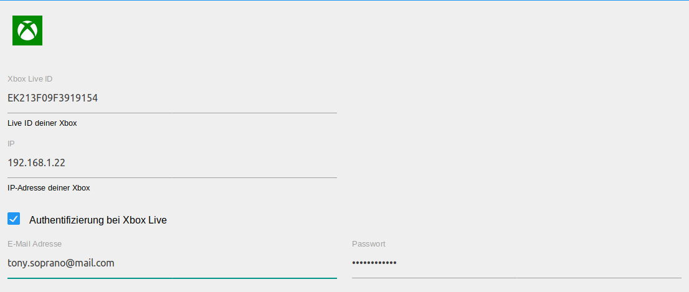
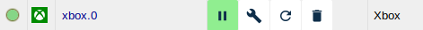
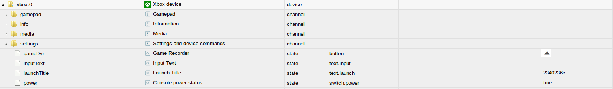

# Xbox 适配器
Xbox 适配器可以将 Xbox One 或 Xbox One X 游戏机集成到 ioBroker 系统中。

＃＃ 概述
### Xbox One 游戏机
Xbox One 是微软开发的一款游戏机，可以玩目前流行的视频游戏。此外，Xbox One 能够控制家庭影院系统的各种组件，并支持使用 Microsoft 应用程序。<br/> Xbox One 的进一步表现目前是 Xbox One X 和 Xbox One S，它们提供与原始控制台相同的功能，但性能有所提高。

### Xbox 适配器
可以为每个 Xbox One 控制台设置 Xbox 适配器，从而可以控制和读取信息。<br/>适配器自动以对象的形式创建所有命令和状态。也可以读出大部分状态，例如B、当前标题、开机状态等。通过专门写入或读取创建的对象，可以改变其状态，触发或查询动作。

##预安装要求
1、在添加适配器之前，主机系统上至少要安装Python 3.5

被安装。

2. 如果 Xbox 要通过适配器开机，则

['快速启动](https://support.xbox.com/de-DE/xbox-one/console/learn-about-power-modes)必须在控制台中配置。

## 致谢
非常感谢 [团队打开 Xbox](https://openxbox.org/) 开发和提供 [xbox-rest-服务器](https://github.com/OpenXbox/xbox-smartglass-rest-python) 和相关的库。

＃＃ 安装
适配器的一个实例是从 ioBroker 管理界面安装的。可在此处找到必要安装步骤的详细说明 (TODO:LINK)。<br/><br/>完成适配器实例的安装后，会自动打开一个配置窗口。

＃＃ 配置
<br/> <span style="color:grey">*管理界面*</span>

|领域 |说明 |
|:-------------|:-------------|
|Xbox Live ID |这里应该输入Xbox的Live ID，可以在控制台的设置中找到。|
|IP |此处应输入控制台的 IP 地址。|
|在 Xbox Live 上进行身份验证|如果选中该复选框，将使用电子邮件地址和密码登录 Xbox Live。|
|电子邮件地址|应在此处输入 Xbox Live 帐户的电子邮件地址。|
|密码 |应在此处输入 Xbox Live 帐户的关联密码。|

完成配置后，使用`SPEICHERN UND SCHLIEßEN`退出配置对话框。
这会导致适配器重新启动。

## 实例
适配器的安装已在`Instanzen`部分中创建了 Xbox 适配器的活动实例。<br/><br/> <br/> <span style="color:grey">*第一个例子*</span>

可以在 ioBroker 服务器上创建多个 Xbox 适配器实例。一个也可以同时连接到多个 ioBroker 服务器。如果要由 ioBroker 服务器控制多台设备，则应为每个 Xbox 创建一个实例。<br/><br/>适配器是激活还是连接到 Xbox 由实例状态字段的颜色指示。如果鼠标指针指向该符号，则会显示更多详细信息。

## 适配器的对象
在 `Objekte` 部分，Xbox 支持的所有信息和活动都以树状结构列出。此外，还会告知与 Xbox 的通讯是否顺畅。

</br> <span style="color:grey">*Xbox 适配器项目*</span>

对象根据下面的通道进行细分。
列出每个数据点及其关联的数据类型和权限。只要是按钮，就省略类型和权限的描述。
权限可以是读 (R) 或写 (W)。每个数据点至少可以读取 (R)，而其他数据点也可以写入。要搜索特定数据点，我们建议使用组合键“STRG + F”。

### 频道：关于
* info.connection

    |数据类型|权限|
    |:---:|:---:|
    |布尔|R|

   *只读指示器，当 ioBroker 连接到 Xbox 时为真。*

* info.currentTitles

    |数据类型|权限|
    |:---:|:---:|
    |字符串|R|

*由键值对组成的只读 JSON 字符串。 Key 是运行轨迹的名称，Value 是轨迹的 16 进制 ID。此 ID 可用于使用 settings.launchTitle 状态启动所需的标题。*

* info.activeTitleName

    |数据类型|权限|
    |:---:|:---:|
    |字符串|R|

    *包含活动标题的名称（标题在前面），以字符串的形式。*

* info.activeTitleId

    |数据类型|权限|
    |:---:|:---:|
    |字符串|R|

    *包含转换为十六进制字符串的前景轨道的 ID。*

* info.activeTitleImage

    |数据类型|权限|
    |:---:|:---:|
    |字符串|R|

    *以字符串的形式包含指向前景中标题的封面图像的链接。*

* info.activeTitleType

    |数据类型|权限|
    |:---:|:---:|
    |字符串|R|

    *包含以只读字符串形式出现在前台的标题类型，例如'游戏'。*

* info.gamertag

    |数据类型|权限|
    |:---:|:---:|
    |字符串|R|

    *包含当前已验证帐户的玩家代号的字符串值。*

* info.gamerscore

  |数据类型|权限|
  |:---:|:---:|
  |编号|R|

  *包含当前已验证帐户的玩家分数的数值。*

* info.installedApplications

  |数据类型|权限|
  |:---:|:---:|
  |字符串|R|

  *String 包含当前安装的应用程序的逗号分隔列表。不包括 DLC。 *

* info.authenticated

    |数据类型|权限|
    |:---:|:---:|
    |布尔|R|

    *布尔值，如果与 Xbox Live 的身份验证成功，则为 true，否则为 false。*

### 频道：设置
* 设置.power

    |数据类型|权限|
    |:---:|:---:|
    |布尔值|读/写|

*可用于打开和关闭 Xbox 的布尔值。该值还可以作为 Xbox 是打开还是关闭的指示器。*

* settings.launchTitle/launchStoreTitle

    |数据类型|权限|
    |:---:|:---:|
    |字符串|读/写|

*通过将字符串值设置为十六进制标题 ID，可以在 Xbox 上启动标题。
活动游戏的标题 ID 可以通过 info.currentTitles 状态找到。
状态会在提交到 Xbox 后立即得到确认，这并不意味着命令已执行。*

   *例子：*

```javascript
setState('settings.launchTitle', '2340236c', false); // Starte Red Dead Redemption 2
```

   *`launchStoreTitle`允许设置有意义的名称*

* settings.inputText

    |数据类型|权限|
    |:---:|:---:|
    |字符串|读/写|

*通过描述字符串状态，可以将文本插入到活动输入字段中，例如B. 发送私信或输入代码。
状态会在提交到 Xbox 后立即得到确认，这并不意味着命令已执行。*

   *例子：*

```javascript
setState('settings.inputText', 'H1 M8 h0w d0 u do?', false); // Versendet einen nerdigen Text
```

* settings.gameDvr

    |数据类型|权限|
    |:---:|:---:|
    |字符串|W|

*记录游戏定义时间的可写字符串。如果已在设置中完成身份验证，则该状态可用。
此外，经过身份验证的帐户必须登录到 Xbox，并且游戏必须在前台。

    *例子：*

```javascript
setState('settings.gameDvr', '-60,30', false); // zeichne die letzten 60 Sekunden bis zu den nächsten 30 Sekunden auf (90 Sekunden gesamt)
```

### 频道：游戏手柄
* 游戏手柄.a

   *模拟控制器的 A 按钮。*

* 游戏手柄.b

   *模拟控制器的 B 按钮。*

* 游戏手柄.x

   *模拟控制器的 X 按钮。*

* 游戏手柄.y

   *模拟控制器的 Y 按钮。*

* 游戏手柄.clear

   *模拟控制器的“清除”按钮。*

* 游戏手柄.dPadDown

   *模拟控制器上的 DPAD 向下按钮。*

* 游戏手柄.dPadUp

   *模拟控制器的 DPAD 向上按钮。*

* 游戏手柄.dPadRight

   *模拟控制器上的 DPAD 右键。*

* 游戏手柄.dPadLeft

   *模拟控制器上的 DPAD 左按钮。*

* 游戏手柄.注册

   *模拟控制器的“注册”按钮。*

* 游戏手柄.leftShoulder

   *模拟按下控制器的左肩按钮。*

* 游戏手柄.rightShoulder

   *模拟按下控制器的右肩按钮。*

* 游戏手柄.leftThumbstick

   *模拟控制器上的左摇杆推动。*

* 游戏手柄.rightThumbstick

   *模拟控制器上的右摇杆推动。*

* 游戏手柄.menu

   *模拟控制器的菜单按钮。*

* 游戏手柄.nexus

   *模拟控制器上的 Nexus (Xbox) 按钮。*

* 游戏手柄.view

   *模拟控制器上的“查看”按钮。*

### 渠道：媒体
* media.seek

    |数据类型|权限|
    |:---:|:---:|
    |数字|读/写|

*跳转到媒体内容中特定点的数值。状态一到服务器就被确认了，并不代表它实际上已经被执行了。*

* 媒体播放

   *播放媒体内容的按钮。*

*媒体.暂停

   *用于暂停媒体内容的按钮。*

* 媒体播放暂停

   *媒体内容的组合播放/暂停按钮。*

* 媒体.back

   *媒体内容的后退按钮。*

* media.channelDown

   *向下切换媒体内容频道的按钮。*

* media.channelUp

   *向上切换媒体内容频道的按钮。*

* 媒体.fastForward

   *用于快进媒体内容的按钮。*

*媒体.菜单

   *媒体内容的菜单按钮。*

* media.nextTrack

   *播放媒体内容时跳至下一曲目的按钮。*

* media.previousTrack

   *播放媒体内容时跳到上一首曲目的按钮。*

* 媒体记录

   *媒体内容的录制按钮。*

*媒体.倒带

   *用于倒带媒体内容的按钮。*

*媒体.停止

   *媒体内容的停止按钮。*

* 媒体.view

   *媒体内容的查看按钮。*

### 文件夹：朋友
为每个朋友创建一个频道，其中有几个只读状态。

## Changelog
<!--
	Placeholder for the next version (at the beginning of the line):
	### __WORK IN PROGRESS__
-->
### 1.0.0 (2022-09-09)
* (foxriver76) updated dependencies
* (foxriver76) see previous beta versions

### 1.0.0-beta.10 (2022-08-20)
* (foxriver76) we now determine correct store locale for germany if system language is "de"

### 1.0.0-beta.9 (2022-08-07)
* (foxriver76) we fixed `activeTitleName` of applications which have no short title

### 1.0.0-beta.8 (2022-08-03)
* (foxriver76) removed unused messagebox

### 1.0.0-beta.7 (2022-08-02)
* (foxriver76) we have revived acknowledgment flag for power on state

### 1.0.0-beta.6 (2022-08-02)
* (foxriver76) we are now synchronizing friends

### 1.0.0-beta.5 (2022-08-01)
* (foxriver76) fixed `activeTitleImage` which is now the cover and always an url
* (foxriver76) optimized `launchStoreTitle` by preventing API calls for DLCs
* (foxriver76) added gamerscore as state (synched every 10 minutes)
* (foxriver76) added list of installed applications to a new state

### 1.0.0-beta.4 (2022-07-30)
* (foxriver76) we have optimized `launchStoreTitle` to check for installed apps first
* (foxriver76) we have optimized error logging

### 1.0.0-beta.2 (2022-07-30)
* (foxriver76) added `launchStoreTitle` state to launch apps by their names

### 1.0.0-beta.1 (2022-07-29)
* (foxriver76) fixed missing state objects

### 1.0.0-beta.0 (2022-07-29)
* (foxriver76) complete TypeScript rewrite
* (foxriver76) removed Python dependencies by siwtching to Xbox API written in Node.js
* (foxriver76) fixed title launch (closes #39)
* (foxriver76) fixed Xbox Live Auth (closes #63)

### 0.7.10 (2022-05-20)
* (foxriver76) fixed error with mising admin ui on new installations

### 0.7.9 (2022-05-20)
* (foxriver76) fixed wrong default value of `media.seek` (closes #113)

### 0.7.8 (2022-02-20)
* (foxriver76) we now set `unsafePerm` flag to ensure compatibility with future controller
* (foxriver76) updated dependencies

### 0.7.7 (2021-04-18)
* (foxriver76) do not log rest server logging on levels above debug, so it can be activated when needed

### 0.7.6 (2021-03-29)
* (foxriver76) added `requests` package as pip dev
* (foxriver76) added logging for rest server

### 0.7.3 (2020-12-25)
* (foxriver76) fixed debug logging on discovery

### 0.7.2 (2020-11-23)
* (foxriver76) removed logging of error on adapter stoppage due to rest server termination
* (foxriver76) removed warn logging for debugging
* (foxriver76) fixed currentTitles and activeTitle states

### 0.7.0 (2020-11-04)
* (foxriver76) replaced deprecated requests module by axios
* (foxriver76) migrated to xbox-smartglass 1.3
* (foxriver76) removed Python3.6 support 
* (foxriver76) event based rest server startage (faster and more robust)
* (foxriver76) GameDVR now supports custom time

### 0.6.9 (2020-11-02)
* (foxriver76) dependency upgrade, fixes installation problems

### 0.6.8 (2020-09-24)
* (foxriver76) minor optimization

### 0.6.5 (2020-05-28)
* (foxriver76) fixed problem with auth-only states

### 0.6.4 (2020-05-11)
* (foxriver76) compatibility with controller v3

### 0.6.3 (2020-04-02)
* (foxriver76) try specific python versions first on install
* (foxriver76) bump dependency, because of auth bug in smartglass

### 0.6.1 (2020-03-17)
* (foxriver76) fixes for compact mode compatibility
* (foxriver76) more translations added
* (foxriver76) minor optimizations

### 0.6.0 (2020-03-01)
* (foxriver76) dependency upgrade (smartglass has been refactored)
* __python 3.6 required!__

### 0.5.12 (2020-01-17)
* (foxriver76) let js-controller know which apt packages are required

### 0.5.11 (2019-11-27)
* (foxriver76) we not try to install apt packages any longer if already installed

### 0.5.8
* (foxriver76) increased stopTimeout to successfully shut down adapter on windows based systems
* (foxriver76) now using setStateChanged instead of own implementation

### 0.5.7
* (foxriver76) fix gamertag not set if no state on the object exists yet

### 0.5.6
* (foxriver76) if still logged in dont log warning/set auth false anymore
* (foxriver76) on logout only set auth to false, but keep gamertag

### 0.5.5
* (foxriver76) minor optimizations

### 0.5.3
* (foxriver76) improve log message quality
* (foxriver76) more promisification
* (foxriver76) minor fix for compact mode

### 0.5.0
* (foxriver76) support of compact mode
* (foxriver76) fixes and optimizations

### 0.4.4
* (foxriver76) small fixes and optimizations

### 0.4.2
* (foxriver76) use adapter-core module

### 0.4.1
* (foxriver76) minor type fix

### 0.4.0
* (foxriver76) Seek converted to number, to jump to specific position
* (foxriver76) try reauthentication when auth gets lost

### 0.3.0
* (foxriver76) new state activeTitleType added
* (foxriver76) minor fixes
* (foxriver76) authentication for 2 factor auth added

### 0.2.2
* (foxriver76) minor fix when currentTitles empty, activeTitle states should be too
* (foxriver76) dont set info.connection on power off, because will be
self detected and prevents reconnection on shutdown

### 0.2.1
* (foxriver76) minor fix on state name

### 0.2.0
* (foxriver76) Authentication for Xbox Live added
* (foxriver76) When logged in current titles contains the correct title full name
* (foxriver76) Added decryption and encryption
* (foxriver76) minor fixes
* (foxriver76) Added new states

### 0.1.7
* (foxriver76) rest-server will now be stopped on windows unload too
* (foxriver76) enhanced windows debug logging

### 0.1.6
* (foxriver76) fix rest-server start on win when nopy not in own node_modules folder

### 0.1.5
* (foxriver76) starting rest-server on windows fixed
* (foxriver76) stopping rest-server on windows fixed

### 0.1.4
* (foxriver76) set info.connection and settings.power to false on unload
* (foxriver76) not only rely on ping to check if xbox is on, use available too

### 0.1.3
* (foxriver76) minor fix
* (foxriver76) bump smartglass-rest requirement to 0.9.7
* (foxriver76) enables pwoer on for not multicastable consoles
* (foxriver76) only use discovery when Xbox disconnected and online

### 0.1.2
* (foxriver76) fix when currentTitles is empty

### 0.1.1
* (foxriver76) minor fixes
* (foxriver76) explicit require versions of python deps
* (foxriver76) fix for power on, when Xbox not in broadcast network

### 0.1.0
* (foxriver76) brought back live id to settings
* (foxriver76) input text state to enter text in an open text field
* (foxriver76) ability to find consoles which are not available via broadcast
* (foxriver76) info state for active titles & launch title state

### 0.0.13
* (foxriver76) minor fix
* (foxriver76) restart adapter on rest server error
* (foxriver76) log when losing connection without ping

### 0.0.12
* (foxriver76) when console unavailable, also do not connect
* (foxriver76) debug logging for unavailable console
* (foxriver76) only set power states on change

### 0.0.11
* (foxriver76) minor connection fix

### 0.0.10
* (foxriver76) when status is connecting, don't connect again

### 0.0.9
* (foxriver76) LiveID is not necessary anymore

### 0.0.8
* (foxriver76) If reconnect attempts fail often in a row, only log it once
* (foxriver76) removed unneeded objects from io-package and adjusted title

### 0.0.6
* (foxriver76) Stop making connect requests when already connected
* (foxriver76) more user friendly logging
* (foxriver76) more robustness in nopys path

### 0.0.5
* (foxriver76) using relative paths for starting server
* (foxriver76) adding commands for windows
* (foxriver76) enhanced installation manual

### 0.0.4
* (foxriver76) automatically install required Debian packages
* (foxriver76) updated Readme
* (foxriver76) make installation for Windows possible
* (foxriver76) improved logging
* (foxriver76) detect OS

### 0.0.3
* (foxriver76) fixed state handling
* (foxriver76) using ping to check consoles power status instead of connection
* (foxriver76) stop powering on if it is unsuccessful for 15 seconds
* (foxriver76) restarting adapter when REST snpm erver is down

### 0.0.2
* (foxriver76) fixed endpoints
* (foxriver76) automated installation of dependencies
* (foxriver76) readme updated
* (foxriver76) code optimized

### 0.0.1
* (foxriver76) initial release

## License
The MIT License (MIT)

Copyright (c) 2018-2022 Moritz Heusinger <moritz.heusinger@gmail.com>

Permission is hereby granted, free of charge, to any person obtaining a copy
of this software and associated documentation files (the "Software"), to deal
in the Software without restriction, including without limitation the rights
to use, copy, modify, merge, publish, distribute, sublicense, and/or sell
copies of the Software, and to permit persons to whom the Software is
furnished to do so, subject to the following conditions:

The above copyright notice and this permission notice shall be included in
all copies or substantial portions of the Software.

THE SOFTWARE IS PROVIDED "AS IS", WITHOUT WARRANTY OF ANY KIND, EXPRESS OR
IMPLIED, INCLUDING BUT NOT LIMITED TO THE WARRANTIES OF MERCHANTABILITY,
FITNESS FOR A PARTICULAR PURPOSE AND NONINFRINGEMENT. IN NO EVENT SHALL THE
AUTHORS OR COPYRIGHT HOLDERS BE LIABLE FOR ANY CLAIM, DAMAGES OR OTHER
LIABILITY, WHETHER IN AN ACTION OF CONTRACT, TORT OR OTHERWISE, ARISING FROM,
OUT OF OR IN CONNECTION WITH THE SOFTWARE OR THE USE OR OTHER DEALINGS IN
THE SOFTWARE.