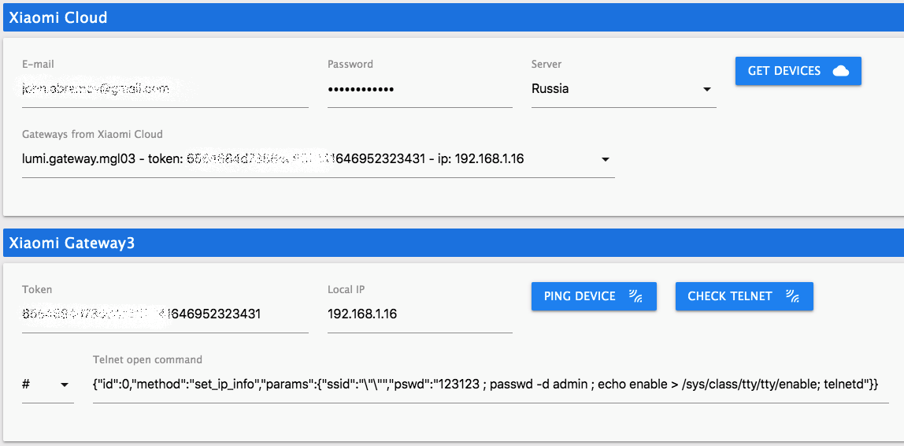

# IoBroker.xiaomi-gateway3

## Xiaomi-gateway3 ioBroker 适配器
该适配器允许 ioBroker 与小米网关 3 通信并使用它来控制小米设备。
适配器通过 MQTT 协议与网关通信（它连接到内置 MQTT 代理）。但是，您必须通过 Mi Home (Cloud) 将网关和设备配对。

## 早期版本
适配器目前处于开发阶段。但已经具备随时可用的功能。

对于成功的适配器开发，它需要社区帮助，主要是在测试适配器和设备方面。

＃＃ 谢谢
大部分代码基于[AlexxIT](https://github.com/AlexxIT) 项目[XiaomiGateway3](https://github.com/AlexxIT/XiaomiGateway3)改写而来

##你能提供什么帮助？
首先，您可以简单地安装适配器、使用它并报告任何问题。

此外，如果您有很多不同的设备，您可以通过启用选项`Debug output (to state)`（见下文）来帮助改进它们的支持，并在收集调试数据几天后给我调试输出。

## 硬件和限制

适配器支持`Xiaomi Gateway 3 (ZNDMWG03LM and ZNDMWG02LM)`在这些版本的原始固件上运行：

- `v1.5.0_0026`（基于它开发）
- `v1.5.0_0102`（类似于`1.5.0_0026`，但未经测试）

您可以使用这些版本的自定义或库存固件刷新网关：[维基](https://github.com/AlexxIT/XiaomiGateway3/wiki)。

__*!!Attantion:*__ 固件版本低于`1.4.7_0000` 适配器不支持也不支持。不保证支持低于 `v1.5.0_0026` 的版本。

## 支持的设备
- [x] 测试
- [ ] 未测试

### Zigbee 设备
- [ ] Aqara 灯泡 (ZNLDP12LM)
- [ ] Aqara 按钮 (WXKG11LM)
- [ ] Aqara 魔方 (MFKZQ01LM)
- [ ] Aqara 窗帘 (ZNCLDJ11LM)
- [ ] Aqara 窗帘 B1 (ZNCLDJ12LM)
- [ ] Aqara 门锁 S1 (ZNMS11LM)
- [ ] Aqara 门锁 S2 (ZNMS12LM)
- [ ] Aqara 门锁 S2 Pro (ZNMS12LM)
- [x] Aqara 门传感器 (MCCGQ11LM)
- [ ] Aqara 双壁按钮 (WXKG02LM)
- [ ] Aqara 双壁按钮 D1 (WXKG07LM)
- [ ] Aqara 双壁开关 (QBKG03LM,QBKG12LM)
- [ ] Aqara 双壁开关 D1 (QBKG22LM,QBKG24LM)
- [ ] Aqara 双壁开关 E1 (QBKG39LM,QBKG41LM)
- [ ] Aqara 双壁开关 H1 (WS-EUK02)
- [ ] Aqara 双壁开关 US (WS-USC04)
- [x] Aqara 运动传感器 (RTCGQ11LM)
- [ ] Aqara Opple 四键 (WXCJKG12LM)
- [ ] Aqara 欧普 MX480 (XDD13LM)
- [ ] Aqara 欧普 MX650 (XDD12LM)
- [ ] Aqara Opple 六按钮 (WXCJKG13LM)
- [ ] Aqara Opple 两个按钮 (WXCJKG11LM)
- [ ] Aqara 插头 (SP-EUC01)
- [ ] Aqara 精密运动传感器 (RTCGQ13LM)
- [ ] Aqara 继电器 (LLKZMK11LM)
- [ ] Aqara 继电器 T1 (DLKZMK11LM,SSM-U01,SSM-U02)
- [ ] Aqara 卷帘 (ZNGZDJ11LM)
- [ ] Aqara 卷帘 E1 (ZNJLBL01LM)
- [ ] Aqara 摇动按钮 (WXKG12LM)
- [ ] Aqara 单墙按钮 (WXKG03LM)
- [ ] Aqara 单墙按钮 D1 (WXKG06LM)
- [ ] Aqara 单墙开关 (QBKG04LM,QBKG11LM)
- [ ] Aqara 单墙开关 D1 (QBKG21LM,QBKG23LM)
- [ ] Aqara 单墙开关 E1 (QBKG38LM,QBKG40LM)
- [ ] Aqara 单墙开关 H1 (WS-EUK01)
- [ ] Aqara 插座 (QBCZ11LM)
- [x] Aqara TH 传感器 (WSDCGQ11LM,WSDCGQ12LM)
- [ ] Aqara TVOC 空气质量监测仪 (VOCKQJK11LM)
- [ ] Aqara 恒温器 S2 (KTWKQ03ES)
- [ ] Aqara 三重墙壁开关 D1 (QBKG25LM,QBKG26LM)
- [ ] Aqara 振动传感器 (DJT11LM)
- [ ] Aqara 漏水传感器 (SJCGQ11LM)
- [ ] 霍尼韦尔气体传感器 (JTQJ-BF-01LM/BW)
- [ ] 霍尼韦尔烟雾传感器 (JTYJ-GD-01LM/BW)
- [ ] 宜家灯泡 E14 (LED1649C5)
- [ ] 宜家灯泡 E14 400 lm (LED1536G5)
- [ ] 宜家灯泡 E27 1000 流明 (LED1623G12)
- [ ] 宜家灯泡 E27 950 lm (LED1546G12)
- [ ] 宜家灯泡 E27 980 lm (LED1545G12)
- [ ] 宜家 GU10 灯泡 400 lm (LED1537R6,LED1650R5)
- [ ] 小米按钮 (WXKG01LM)
- [x] 小米门磁 (MCCGQ01LM)
- [ ] 小米光传感器 (GZCGQ01LM)
- [ ] 小米运动传感器 (RTCGQ01LM)
- [x] 小米插头 (ZNCZ02LM)
- [ ] 小米插头欧盟 (ZNCZ04LM)
- [ ] 小米插头 TW (ZNCZ03LM)
- [ ] 小米插头美国 (ZNCZ12LM)
- [ ] 小米 TH 传感器 (WSDCGQ01LM)

### BLE 设备
- [ ] Aqara 门锁 N100 (ZNMS16LM)
- [ ] Aqara 门锁 N200 (ZNMS17LM)
- [ ] 霍尼韦尔烟雾报警器 (JTYJ-GD-03MI)
- [ ] 小米闹钟 (CGD1)
- [ ] 小米门锁 (MJZNMS02LM,XMZNMST02YD)
- [ ] 小米门磁 2 (MCCGQ02HL)
- [ ] 小米鲜花护理 (HHCCJCY01)
- [ ] 小米花盆 (HHCCPOT002)
- [ ] 小米魔方 (XMMF01JQD)
- [ ] 小米驱蚊液 (WX08ZM)
- [x] 小米运动传感器 2 (RTCGQ02LM)
- [ ] 小米夜灯 2 (MJYD02YL-A)
- [ ] 小米清平门磁 (CGH1)
- [ ] 小米青屏运动传感器 (CGPR1)
- [ ] 小米清屏 TH Lite (CGDK2)
- [ ] 小米青屏 TH 传感器 (CGG1)
- [ ] 小米保险箱 (BGX-5/X1-3001)
- [x] 小米 TH 时钟 (LYWSD02MMC)
- [ ] 小米 TH 传感器 (LYWSDCGQ/01ZM)
- [x] 小米 TH 传感器 2 (LYWSD03MMC)
- [ ] 小米牙刷 T500 (MES601)
- [ ] 小米漏水传感器 (SJWS01LM)
- [ ] 小米 ZenMeasure 时钟 (MHO-C303)
- [ ] 小米 ZenMeasure TH (MHO-C401)
- [ ] Yeelight 按钮 S1 (YLAI003)

_**注意：** BLE 设备在配对后第一次可能没有状态，因为我不知道设备的规格，也没有为所有设备定义属性。当设备更新相应的属性时，将添加状态。我希望我能在你的帮助下随着时间的推移解决这个问题。_

＃＃ 配置
要连接网关，您需要获取网关的 IP 和 TOKEN。您可以手动或从云端执行此操作。

_**注意：**从云端获取设备存在问题。我还没有得到代码或云的这个问题，但是你现在应该尝试多次获取（按下按钮）设备（直到你最终得到）。_

您还必须选择 telnet open 命令（在大多数情况下选项 #2）。您可以通过按钮测试连接和远程登录。

*这里 ping 不是真正的 ping。这是对设备可用性的更多检查。*

 

您有几个选项来配置适配器和网关。

### 适配器设置
- [x] __收集统计数据__ 

适配器收集有关 zigbee 设备消息的统计信息：收到多少，错过多少等。统计存储在每个设备的状态中，可以在“标签”页面（从侧边栏菜单）中查看。  _**注意：**适配器在重启时重置统计信息。_

- [x] __Debug 输出（到状态）__ 

适配器会将一些调试信息输出到每个设备的状态中。

### 基本 Gateway3 设置
- [x] __Telnet 启用__ 

默认启用并且必须保持启用。在这里仅供参考。

- [x] __启用公共 MQTT__ 

默认启用并且必须保持启用。在这里仅供参考。

- [x] __锁定固件__ 

设置 true（或 false）以禁用（或启用）升级网关固件的可能性。

- [x] __禁用蜂鸣器__ 

设置为 true 以禁用烦人的蜂鸣器信号或设置为 false 以启用所有信号。

### 高级网关3 设置
- [x] __存储在内存中（测试版）__ 

将设备数据库文件移动到内存。这可以改善 zigbee 和蓝牙设备的工作。 __*但可能会丢失一些数据。使用风险自负。*__

### 日志设置
- [x] __调试日志__ 

启用调试日志记录。如果禁用其他日志记录选项，则无效。

- [x] __Lumi MQTT 消息__ 

启用 Lumi (zigbee) 设备的 MQTT 消息记录。

- [x] __Ble MQTT 消息__ 

启用 BLE 设备的 MQTT 消息记录。

- [x] __所有其余的__ 

启用所有其他适配器消息。

##标签页
＃＃＃ 统计

- 默认情况下不加载统计信息。您必须使用按钮“重新加载”来更新页面上的统计信息。

- 您也可以使用“清除”按钮清除统计信息。这实际上并没有清理统计数据。您只需清除具有统计信息的状态即可。这在适配器重新启动时很有用，因为 ioBroker 状态在重新启动时不会清除。

_**注意：**您应该记住，这并不是网关和设备之间的 zigbee 消息的真正统计（zigbee 协议统计）。这是获得适配器的消息的统计信息。这是什么意思？适配器没有区别是网关不从设备获取消息或适配器本身不从网关获取消息（通过 MQTT）。如果在任何情况下（例如 Wi-Fi 连接问题）适配器没有从网关获取消息，它会将这些消息解释为丢失，但实际上 zigbee 是可以的。_

## Changelog
<!--
    Placeholder for the next version (at the beginning of the line):
    ### **WORK IN PROGRESS**
-->
### 0.3.1 (2022-01-17)
* Bug fixes and code improvements
* Improved support firmware 1.5.1_0032 and some devices

### 0.3.0 (2021-12-10)
* Improved adapter logging

### 0.2.0 (2021-12-07)
* Added states classes and rewrote code with using them
* Added tab-page of adapter
* Added zigbee (lumi) devices statistic
* A lot of code improvements

### 0.1.0 (2021-11-09)
* (Evgenii Abramov) Added support for BLE devices (needed tests)
* (Evgenii Abramov) Improvements for zigbee and BLE support
* (Evgenii Abramov) Added output for debug purpose
* (Evgenii Abramov) A lot of code improvements

### 0.0.1-alpha.0 (2021-10-13)
* (Evgenii Abramov) Initial release

## License
MIT License

Copyright (c) 2022 Evgenii Abramov <john.abramov@gmail.com>

Permission is hereby granted, free of charge, to any person obtaining a copy
of this software and associated documentation files (the "Software"), to deal
in the Software without restriction, including without limitation the rights
to use, copy, modify, merge, publish, distribute, sublicense, and/or sell
copies of the Software, and to permit persons to whom the Software is
furnished to do so, subject to the following conditions:

The above copyright notice and this permission notice shall be included in all
copies or substantial portions of the Software.

THE SOFTWARE IS PROVIDED "AS IS", WITHOUT WARRANTY OF ANY KIND, EXPRESS OR
IMPLIED, INCLUDING BUT NOT LIMITED TO THE WARRANTIES OF MERCHANTABILITY,
FITNESS FOR A PARTICULAR PURPOSE AND NONINFRINGEMENT. IN NO EVENT SHALL THE
AUTHORS OR COPYRIGHT HOLDERS BE LIABLE FOR ANY CLAIM, DAMAGES OR OTHER
LIABILITY, WHETHER IN AN ACTION OF CONTRACT, TORT OR OTHERWISE, ARISING FROM,
OUT OF OR IN CONNECTION WITH THE SOFTWARE OR THE USE OR OTHER DEALINGS IN THE
SOFTWARE.