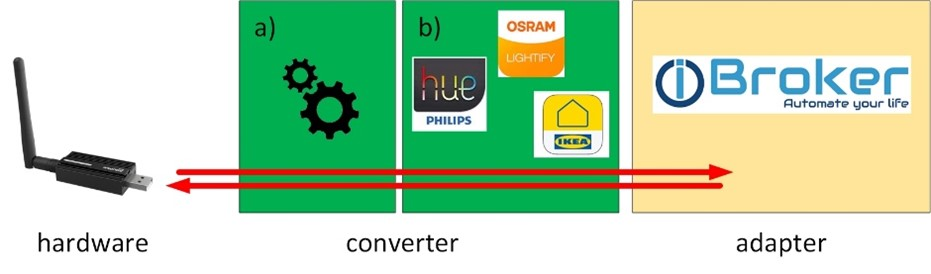
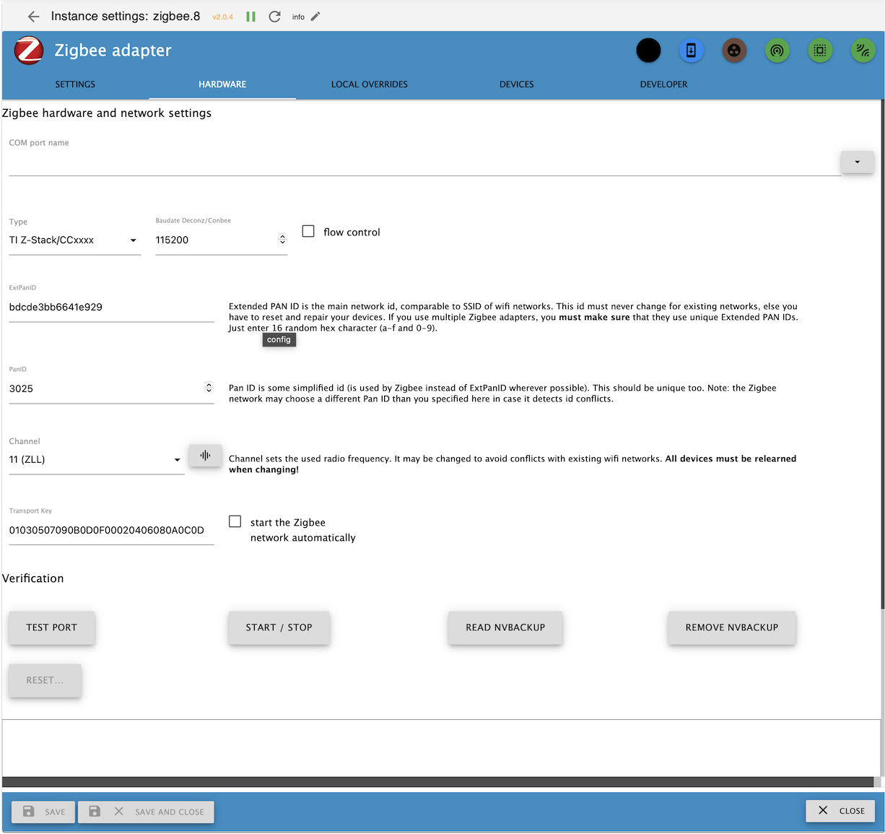
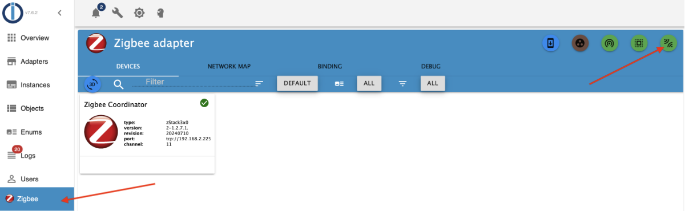
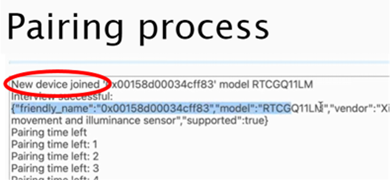
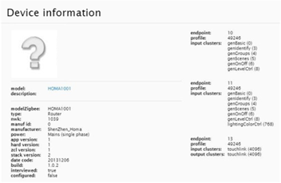

# IoBroker ZigBee 设备适配器
使用 ZigBee 网络协调器，可以创建一个专用的 ZigBee 网络，ZigBee 设备（灯具、调光器、传感器等）可以加入该网络。由于 ZigBee 适配器能够与协调器直接交互，因此无需制造商（小米/Tradfri/Hue）提供的任何网关/网桥即可控制这些设备。有关 ZigBee 的更多信息，请参阅 [这里](https://github.com/Koenkk/zigbee2mqtt/wiki/ZigBee-network)。

＃＃ 硬件
协调器（见上文）需要额外的硬件来实现 USB 和 ZigBee 无线信号之间的转换。协调器有三种类型：

- 树莓派的插件模块（**不**推荐使用这些模块。）
- USB连接模块，可以是开发板，也可以是U盘。
网络协调员

完整的兼容协调器列表请参见[这里](https://www.zigbee2mqtt.io/guide/adapters/)。我们建议仅使用标有“推荐”的协调器。安装所需固件的说明也在此处提供。

协调器也出售预装固件的版本。以下情况适用：**任何固件与 Zigbee2mqtt.io 兼容的协调器也可以与 ZigBee 适配器一起使用**。

目前（截至2025年3月），“Sonoff ZIGBEE 3.0 USB-STICK CC2652P”（包括CC2652P和EZSP芯片组版本）以及搭载Cod.m和/或XTG固件的网络协调器非常流行。Conbee II和Conbee III也经常被使用。强烈建议不要使用搭载CC2530/CC2531芯片的TI协调器——这些芯片现在已被视为过时产品。

连接到 ZigBee 网络的设备会将自身状态传输到协调器，并通知协调器发生的事件（例如按钮按下、运动检测、温度变化等）。这些信息会显示在适配器中相应的 ioBroker 对象下，从而可以在 ioBroker 中进行进一步处理。此外，还可以向 ZigBee 设备发送命令（例如更改插座和灯具的状态、设置颜色和亮度等）。

＃＃ 软件
该软件分为“转换器”和“适配器”两部分。

转换器

转换器分为两部分：  a) 提供来自 ZigBee 无线电信号的数据。此 [软件部分](https://github.com/Koenkk/zigbee-herdsman) 用于所有 ZigBee 设备。  b) 将数据通过适配器定义的接口传输到设备特定的 [加工](https://github.com/Koenkk/zigbee-herdsman-converters)。

   - 适配器 

该软件部分实现了转换器与 ioBroker 的连接。[适配器](https://github.com/ioBroker/ioBroker.zigbee) 包括用于管理 ZigBee 设备的图形用户界面以及用于控制 ZigBee 设备的 ioBroker 对象的创建。

＃＃ 安装
1. 将协调器硬件连接到运行 ioBroker 的计算机（如果是 LAN/Wlan 协调器，则连接到网络）。 
2. 在服务器上打开控制台。对于基于 Unix/Linux 的系统，可以通过 SSH 远程完成此操作。根据所使用的操作系统，可能需要其他程序（例如 Windows 上的 PuTTY）。 
3. 确定协调器路径。在 Unix/Linux 系统中，该路径通常位于 /dev/serial/by-id 目录中。或者，也可能是 /dev/ttyUSB*、/dev/ttyAM*（Unix/Linux）、/dev/tty.usbserial-*（macOS）或 com*（Windows）。 

以下示例展示了在树莓派上安装 Linux 系统的过程。命令 `ls -la /dev/serial/by-id/` 会生成图中所示的输出。

4. ioBroker -&gt; 安装 ZigBee 适配器，这里以 1.8.10 版本为例。   这将安装所有必需的软件组件（转换器和适配器）。   
5. 打开适配器配置。上图显示的是接口版本 3.0.0 或更高版本。

在这种情况下，管理员会指示 ZigBee 子系统是否已启动 (A)。

6. 输入协调器 (B) 的端口。对于 USB 协调器，此端口为之前确定的设备路径。对于通过网络控制的协调器，必须以 tcp://ip:port 的形式指定网络地址和端口，而不是设备路径。如果适配器本身（而非 Zigbee 子系统）处于活动状态，则会显示可用串行接口列表供选择。选择时，请遵循以下规则：
- 如果系统使用多个连接不同 USB 设备的适配器进行通信，则必须从 /dev/serial/by-id 目录（如果可用）中选择端口。这样可以确保系统重启后适配器与协调器的关联仍然保留。
- 如果只使用一个 USB 设备，建议使用 /dev/TTY* 端口。这样，如果协调器出现故障，就可以用相同的设备进行更换，而无需调整配置。
7. 分配网络 ID 和 Pan ID，以便将其与无线范围内的其他 ZigBee 网络区分开来。例如，从适配器版本 2.1.0 开始，ExtPanID (C) 和 PanID (D) 会自动预先分配随机值，直到保存配置为止。 
8. 选择合适的 ZigBee 信道 (E)。请注意，ZigBee 和 2.4GHz Wi-Fi 共享同一频段。因此，最佳信道取决于多种因素，其中包括所在区域使用的 Wi-Fi 信道。ZigBee 和 Wi-Fi 的信道名称并不相同，例如，Wi-Fi 信道 11 和 ZigBee 信道 11 互不干扰。建议将选择范围限定在 ZigBee Light Link (ZLL) 信道（11、15、20、25）内。如果选择的信道不属于 ZLL，界面会在所选信道上方显示一个带有感叹号的黄色三角形。 适配器成功启动后，还可以通过配置执行网络通道扫描。 

**注意：**从适配器版本 3.1.0 开始，无需删除配置并重新配对所有设备即可更改通道。个别设备可能不会响应通道更改请求；这些设备需要重新配对。这种情况最常发生在终端设备上。 

9. 检查 Zigbee 子系统是否正在启动。为此，请尝试使用“启动/停止”(F) 功能启动 Zigbee 子系统。启动尝试的进度可以在日志中查看。启动过程中，图标 (A) 会从黑/红变为黑/橙。如果启动成功，图标将完全消失；否则，图标会再次变为红色，日志中的消息将提供有关原因的线索。 

也可以使用同一个按钮停止 Herdsman 服务。图标也会显示为黑/橙色。**重要提示：在某些情况下，停止服务可能需要长达 2 分钟的时间，尤其是在使用网络协调器时。** 请耐心等待。Herdsman 服务终止后，图标会显示为黑/红色，并显示“Herdsman 服务已停止！”的消息。

根据错误情况，Herdsman 服务无法启动的原因可能有很多。如果只是超时，建议立即重试。如果配置不一致，相关数据会显示在日志中。适配器提供了两种解决冲突的选项：

- 从NV备份中读取数据。在这种情况下，需要调整适配器的配置。
- 删除 NV 备份。在这种情况下，适配器的配置保持不变。这将**强制**重建网络，因此需要重置并重新训练所有先前训练过的设备。 

日志输出也可用于在 [ioBroker论坛](https://forum.iobroker.net) 中查找解决方案。请选中相关消息并以**文本**形式发布到论坛中。

10. Zigbee 网络配置正确且启动无误后，就可以将适配器设置为开机自动启动网络了。只需勾选标有“自动启动 Zigbee 网络”的复选框即可。

## 配对
每个 ZigBee 设备（开关、灯泡、传感器等）都必须与协调器配对（配对）： 

- ZigBee 设备：

每个 ZigBee 设备只能连接到一个 ZigBee 网络。如果 ZigBee 设备仍然保存着与其他协调器（例如 Philips Hue Bridge）的配对信息，则必须先将其与该 ZigBee 网络解除连接。最好通过原 ZigBee 网络的用户界面（例如 Philips Hue 应用）来完成此解除连接操作。或者，您也可以将 ZigBee 设备重置为出厂设置。 通常有以下几种方法可以将 ZigBee 设备置于配对模式 

1. 从 ZigBee 网络中取消配对 ZigBee 设备
2. 按下 ZigBee 设备上的配对按钮。
3. 关闭 ZigBee 设备的供电电压，然后再重新打开。

ZigBee 设备随后会进入配对模式，通常持续 60 秒。与恢复出厂设置的步骤类似，激活配对模式也取决于相应的设备类型（如有必要，请阅读 ZigBee 设备的操作说明）。

- 协调员：

按下绿色按钮，使协调器进入配对模式 60 秒。  

   - 等待对话框中出现“新设备已加入”的提示： 

- 检查配对：

待配对的设备必须受 ioBroker ZigBee 适配器支持。理想情况下，ZigBee 适配器中会显示新设备（例如 Philips Light Stripe），并创建相应的 ioBroker 对象： 

最坏的情况下，该 ZigBee 设备目前不受支持。下一节将介绍如何才能使用此 ZigBee 设备。

## 目前为止未知 ZigBee 设备的配对情况
对于以前未知的 ZigBee 设备，ZigBee 设备名称（例如 HOMA1001）在配对期间会显示后缀“supported”：false。   

旋转此图块可查看有关 ZigBee 设备的详细信息：    

在 [github.com](https://github.com/ioBroker/ioBroker.zigbee/issues) 注册后，可以通过“issue”报告丢失的 ZigBee 设备：

 

请在问题描述中包含有关图块的详细信息（见上文），并创建一份简要说明（最好使用英文），然后提交。开发人员随后会回复该问题。

因此，可能出现以下两种情况之一：

- 适配 Zigbee Herdsman 转换器。这需要更新 Zigbee 适配器的版本，该版本会先经过测试，然后发布到最新软件仓库中。
- 创建一个“外部转换器”——一个包含 JS 代码的文件，可以将其复制到 Zigbee 适配器的数据目录，并在适配器的配置中指定。

两种情况下，重启适配器即可——适配器将创建相应的适配数据点。如果数据点不再受支持，它们将以橙色高亮显示，适​​配器将显示一个用于删除孤立数据点的按钮。

## ZigBee适配器中的符号
| 图标 | 描述 |
|----------------------------|------------------------------------------------------------------------------------------------------------------------------------------------------------------------------------------------------------------------------------------------------------------------------------------------------------------------------------------------------------------------------------------------------------------------------------------------------------------------------------------------------------------------------------------------------------------------------------------------------------------------------------------------------------------------------|
|  | **州级清理** 删除未连接的 ioBroker 对象。这些对象可以通过“排除”操作创建。 |
|  | **检查固件更新**  Zigbee适配器支持OTA固件升级，前提是连接的设备支持此功能。此按钮用于启动固件更新检查——实际升级需要在每个设备上单独进行。 |
|  | **添加组**  Zigbee 规范支持创建设备组，这些设备组可以通过单个命令进行统一控制。虽然该规范几乎支持任何命令作为组命令，但 Zigbee 适配器中的实现仅限于灯泡——此按钮可用于创建新组。可以通过设备 | 添加和移除成员。 |
|  | **重置并配对 Touchlink**  Touchlink 是 Zigbee Light Link (ZLL) 的一项功能，它允许物理距离较近的设备在无需连接协调器的情况下相互通信。并非所有设备都支持此功能。要通过 Touchlink 将 Zigbee 设备重置为出厂设置，请将设备靠近（&lt; 10 厘米）Zigbee 协调器，然后按下绿色图标。**警告** 如果 Touchlink 重置过程未正确执行，则较远位置的设备也可能会被重置。如有疑问，建议暂时拔掉受影响设备的电源。 |
|  | **与二维码配对** 有些设备需要额外的安全码才能与网络配对。该安全码通常以二维码的形式出现在设备上和/或说明书中。只有预先输入了相应的安全码，才能与这些设备配对。**注意** 许多说明书会指定使用制造商提供的应用程序读取二维码，以便将设备连接到制造商的网关，即使这些设备本身不支持安全码。在这种情况下，尝试输入安全码时，适配器会显示错误。如果出现这种情况，建议尝试“正常”对设备进行编程。 |
|  | **与二维码配对** 有些设备需要额外的安全码才能与网络配对。该安全码通常以二维码的形式出现在设备上和/或说明书中。只有预先输入了相应的安全码，才能与这些设备配对。**注意** 许多说明书会指定使用制造商提供的应用程序读取二维码，以便将设备连接到制造商的网关，即使这些设备本身不支持安全码。在这种情况下，尝试输入安全码时，适配器会显示错误。如果出现这种情况，建议尝试“正常”对设备进行编程。| |  | **配对** 启动新 ZigBee 设备的配对过程。按下此按钮将打开网络，持续时间为 10 到 250 秒（可配置），以便将新设备添加到网络中。 |

## 设备磁贴
| 图标 | 描述 |
|  | 此 ZigBee 设备上次进行数据交换至今的时间。 |
|  | 电池电量（如果设备报告电池电量）。 |
|    | 此 ZigBee 设备上的 ZigBee 无线信号强度（&lt;10 为差，&lt;50 为中等，&gt;50 为好）。ZigBee 是一种无线网状网络。大多数电源供电的 ZigBee 设备（例如，飞利浦 Hue 灯）都可以充当 ZigBee 路由器，即无线节点。因此，ZigBee 设备不一定需要与协调器建立直接的无线连接，而是可以使用网络中的任何路由器进行无线连接。每增加一个 ZigBee 路由器，网络的无线覆盖范围就会扩大。所有 ZigBee 设备都会定期检查是否有更佳的无线路径，并自动切换到该路径。但是，此过程可能需要几分钟时间。 手动将设备分配给路由器**是不可能的**。 当设备被视为“未连接”时，会显示红色带叉的符号。 |
|   | 组的状态 绿色圆圈表示该群组有成员且功能正常；红色 X 表示该群组为空或因其他原因无法使用。 |
|  | 信息 打开设备信息显示页面。此页面显示的信息直接来自设备，也适用于未知设备。 |
|  | （重新）配置设备。 此按钮用于触发设备配置，该配置用于告知设备要自动向协调器报告哪些数据。配置项在该设备的*转换器*中定义。请注意，设备必须处于活动状态，配置尝试才能成功。如果设备未处于活动状态，则尝试将超时，并且该设备将被放入待配置设备队列中，以便在设备 i 下次发送消息时进行配置。 |
|  | 调试设备 启用/禁用此设备的扩展调试消息生成。图标颜色指示当前状态：（黑/白：无调试消息，绿色：调试消息 - 可通过此按钮停用。橙色：通过 zigbee.x.info.debugmessages 下的过滤器获取调试消息。） |
|  | 开/关 此按钮可用于激活/停用设备。停用的设备不会进行任何通信。 |
|  | 分配图像/名称 此按钮允许您为特定设备分配名称、图标或选项。请注意，此分配**仅**在设备级别进行。型号级别的分配通过设置完成。即使删除设备，以这种方式进行的设置也会保留。 |
|  | 编辑名称/组 此按钮可用于更改设备与一个或多个组的关联。此按钮仅适用于可分配到组的设备。注意：遥控器不会自动添加到组中，需要使用“绑定”选项卡将其绑定到组。 |
|  | 删除设备 开始删除此设备。 |
|  | 删除设备 开始删除此设备。 |

## 附加信息 Zigbee 适配器与 [Zigbee2mqtt 项目（[GitHub 链接](https://github.com/Koenkk/zigbee2mqtt)）可以直接通过 MQTT 或其自带的适配器与 ioBroker 配合使用。](https://github.com/arteck/ioBroker.zigbee2mqtt) 共享相同的库（zigbee-herdsman、zigbee-herdsman-converters）。 由于库是共享的，zigbee2mqtt.io 支持的任何设备最终都会被 Zigbee 适配器支持。由于需要进行兼容性检查，这可能会有几天或几周的延迟。提交问题描述设备及其与 zigbee2mqtt.io 的集成情况通常会导致临时解决方案或适配器更新，从而在 Zigbee 适配器中添加对该设备的支持。 与此适配器相关的其他主题也记录在相关的[维基百科](https://github.com/ioBroker/ioBroker.zigbee/wiki)中。

## Changelog
### 3.2.5 (2025-10-31)
* (asgothian) changed setState for lasterror

### 3.2.4 (2025-10-31)
* (asgothian) added missing state

### 3.2.3 (2025-10-31)
* (asgothian) Improvements on debug UI
* (asgothian) Option 'resend_states' to publish state values to device on reconnect
* (asgothian) Improved group card
* (asgothian) Improved group info
* (asgothian) Modified coordinator card (2 sides)
* (asgothian) retry on error 25
* (asgothian) clear stashed error messages
* (asgothian) ZHC 25.50.0 or newer

### 3.2.2 (2025-10-27)
* (asgothian) Bugfix on delete object.
* (asgothian) improved device query.
* (asgothain) fixed delete device with local overrides.
*

### 3.2.1 (2025-10-26)
* (asgothian) fix bug #2640
*

### 3.2.0 (2025-10-26)
* (asgothian) remove local overrides tab from config
* (asgothian) establish local data tab in config to edit global and device level settings and options
* (asgothian) remove the local overrides tab
* (asgothian) remove the ability to set model level overrides from device tab.
* (asgothian) fix errors for 'polling' devices with changed poll times.
* (asgothian) warning icon for devices which are not completely interviewed.
* (asgothian) improved router detection for opening the network
* (asgothian) bugfix: open network on router
* (asgothian) ZHC 25.x latest, ZH 6.1.3,
* (asgothian) restore from in-adapter backup

### 3.1.6 (2025-10-21)
* (asgothian) Bugfixes
*

### 3.1.5 (2025-10-04)
* (asgothian) Bugfixes
* (asgothian) ZHC25.36.0
* (asgothian) reduced stopTimeout to 5s

### 3.1.4 (2025-09-26)
* (asgothian) Remove extra logging
* (asgothian) Add extra configurations
* (asgothian) Do not read states from deactivated devices
* (asgothian) Ignore deactivated devices for group state updates
* (asgothian) Change display for deactivated devices in the object tree (gray, no connected icon)
* (asgothian) more detailed device debug
* (asgothian) device debug UI improvements
* (asgothian) Pairing and device Query buttons on router cards
* (asgothian) ZHC 25.31.0, ZH 6.1.2 or newer
* (asgothian) Options based on ZHC defined options

### 3.1.2 (2025-09-15)
* (asgothian) Fix pairing bug
* (asgothian) add ping messages to device debug to verify ping failure reasons
* (asgothian) Fix bug that blocked group names and renaming
* (asgothian) removed extra warning message for resolveEntity

### 3.1.1 (2025-09-14)
* (asgothian) ZHC 25.x ZH 6.x
* (asgothian) Refactor main/statescontroller/zigbeecontroller
* (asgothian) Allow groups to trigger member state reads (via state memberupdate)
* (asgothian) Allow groups to set state based on accumulated member states (via state stateupdate)
* (asgothian) Trigger state read at device announce (via Settings: Read states at device announce)
* (asgothian) Trigger state read at adapter start for all pingable devices (via settings: 'try to read all states at adapter start' and 'read delay' (in seconds))
* (asgothian) Bugfix: Error in automatic restart function
* (asgothian) Bugfix: Error in device_query blocked certain states from being read
* (asgothian) Change to device Query: 15 second delay between queries only for automated queries. Manual queries are not affected

### 3.1.0 (2025-08-02)
* (asgothian) ZHC 24.9.0
* (asgothian) ZH 5.x
* (asgothian) extend and stop pairing countdown

### 3.0.5 (2025-08-27)
* (asgothian) fix random error where devices are not shown due to illegal groups
* (asgothian) drop support for node 18
* (asgothian) Required node Versions Node 20.19.0 or 22.11.0 or newer (courtesy of ZH 4.4.1 / ZHC 24.8.0)

### 3.0.3 (2025-07-27)
* (asgothian) fix 'icon' error for unknown devices
* (asgothian) fix state for level.color.rgb role (hex_color, accepts only #rrggbb values
* (asgothian) ZH 4.4.1
* (asgothian) ZHC 23.72.1
* (asgothian) preparation for breaking change in ZHC 24.0.0

### 3.0.2 (2025-07-07)
* (asgothian) fix images

### 3.0.1 (2025-04-25)
* (AlexHaxe)  Fix for Ikea SOMRIG configuration raising 'definition.endpoint is not a function' error.
* (asgothian) Access to 'zigbee2mqtt options as settings in zigbee adapter (ALPHA Stage !)
* (asgothian) Fix for 'error: zigbee.0 (1118300) zigbee.0 already running' at adapter start (Alpha Stage)
* (asgothian) Updated hardware configuration panel - exchanged text buttons for buttons with icons.
* (asgothian) Limited states on device tiles to states which are read only or which can be modified sensibly via the device tile.
*

### 3.0.0 (2025-04-08)
* (asgothian) Breaking change: Start of zigbee subsystem requires checking the 'start the Zigbee network automatically' checkbox. !!!
* (asgothian) Hardware configuration panel
* (asgothian) Update for external converter - detect /dist/ subfolder
* (asgothian) Update device image: use of icons defined in external converter (beta)
*

### 2.0.5 (2025-03-25)
* (asgothian) ZHC 23.6.0
* (asgothian) ZH 3.3.x
* (asgothian) removed extra logging
* (asgothian) fixed memory issue.
* (asgothian) Configure on Message - 5 attempts.
* (arteck) update transmitPower
* (asgothian) fix crash in ZigbeeController.ByteArrayToString
* (AlexHaxe) device designation for  devices without mapped model (allows use in groups and bindings)
*

### 2.0.4 (2025-03-09)
* (arteck) back to 2.0.2

### 2.0.3 (2025-03-07)
* (asgothian) fix configured info
* (asgothian) fix battery voltage (V -> mV)
* (asgothian) enable debug interface v1.0
* (asgothian) Push Zigbee-Herdsman to 2.5.7
* (asgothian) Push Zigbee-Herdsman-Converters to 23.1.1
* (asgothian) fix configure on message
* (asgothian) remove extra warning messages
* (asgothian) fix Adapter-Checker notes
* (asgothian) improve base64 image detection
* (asgothian) removed unused adaptert objects (info.groups, excludes) from adapter config

### 2.0.2 (2025-03-02)
* (asgothian)  expose generation with expose function requiring a device. (Issue #1842)
* (asgothian) fix failure to configure for devices needing multiple configurations (Issue #2375)
* (asgothian) fix hold/release and press/release action handling (Issue #2387)
* (asgothian) fix lib/legacy requirement for external converters (Issue #2376)
* (asgothian) improved external converter handling
* (asgothian) fix OTA bug
* (asgothian) improved message handling for devices which report values outside their defined ranges
* (asgothian) preparation for ZHC 22.x (model definition loaded on demand
* (asgothian) fix legacy definition for devices
* (asgothian) added action state for remotes.
*

### 2.0.1 (2025-02-25)
* BREAKING CHANGES
*
* switch to converters 21 changes the exposes for a large numbern of devices (mostly remotes)
* new method for controlling color based on subchannels for rgb, hs and xy
* Exposes as default for ALL devices. Use of old definition as option only
* Requires Node 20.x or newer
*
* (asgothian) Fix Pairing
* (asgothian) change ping
* (asgothian) delay map generation until refresh is activated, map messages after generation
* (asgothian) remove bindings tab from zigbee tab
* (asgothian) reorder tabs in configuration
* (asgothian) remove binding tab from configuration
* (asgothian) remove map from configuration
* (asgothian) add debug to zigbee tab
* (asgothian) Herdsman 3.2.5, Converters 21.30.0
* (asgothian) Exposes as default, use of old device definitions as legacy optional
* (asgothian) User specific images (model based, device based)
* (asgothian) Improved group editing - remove members from group card

### 1.10.14 (2025-01-01)
* (arteck) Herdsman 2.1.9, Converters 20.58.0
* (asgothian) Fix: Aqara T1M (CL-L02D)
* (arteck) deleteDeviceStates change to deleteObj

### 1.10.13 (2024-11-10)
* (arteck) corr icon download bug (axios)

### 1.10.12 (2024-11-03)
* (asgothian) corr Channel Scan

### 1.10.11 (2024-11-02)
* BREAKING CHANGE
*
*  bugs : ChannelScan is currently not available
*
*
* (lebrinkma) fix linter errors
* (asgothian) disable map display for deactivated devices
* (asgothian) new option on map: disable physics interaction
* (asgothian) new zigbee-herdsman-converters 20.28.0
* (asgothian) new zigbee-herdsman 2.1.1
* (asgothian) Allow use of keyless converters (used for TuYa and compatible devices in zigbee-herdsman-converters
* (arteck) swap from request to axios
* (arteck) delete groups works again

### 1.10.9 (2024-09-05)
* (arteck) typo admin settings
* (arteck) eslint config

### 1.10.8 (2024-09-05)
* (arteck) corr admin settings
* (arteck) add new eslint version

### 1.10.7 (2024-09-05)
* (arteck) add flow control option
* (asgothian) add new NewHerdsman
* (arteck) add new ezsp coordinator Firmware (7.4.1.0)

### 1.10.5 (2024-06-21)
* (arteck) icon ota device update
* (arteck) icon fix

### 1.10.4 (2024-04-20)
* (arteck) core update
* (arteck) dependency update

### 1.10.3 (2024-04-06)
* (arteck) dependency update

### 1.10.2 (2024-01-25)
* (arteck) dependency update

### 1.10.1 (2024-01-21)
* (arteck) Baudrate is now configurable. works ONLY with Deconz/Conbee(38400)
* (arteck) add nvbackup.json delete button

### 1.10.0 (2024-01-13)
* (arteck) new zigbee-herdsman-converters 18.x
* (arteck) configure message is now a warning

 ***********************************************

### 1.0.0 (2020-01-22)
* Powered by new [zigbee-herdsman](https://github.com/Koenkk/zigbee-herdsman) library and new [converters database](https://github.com/Koenkk/zigbee-herdsman-converters)
* Drop support NodeJS 6
* Serialport 8.0.5 (in zigbee-herdsman)
* More new devices
* Some design update
* Binding

------------------------------------------------------------------------------

## License
The MIT License (MIT)

Copyright (c) 2018-2025 Kirov Ilya <kirovilya@gmail.com>

Permission is hereby granted, free of charge, to any person obtaining a copy
of this software and associated documentation files (the "Software"), to deal
in the Software without restriction, including without limitation the rights
to use, copy, modify, merge, publish, distribute, sublicense, and/or sell
copies of the Software, and to permit persons to whom the Software is
furnished to do so, subject to the following conditions:

The above copyright notice and this permission notice shall be included in
all copies or substantial portions of the Software.

THE SOFTWARE IS PROVIDED "AS IS", WITHOUT WARRANTY OF ANY KIND, EXPRESS OR
IMPLIED, INCLUDING BUT NOT LIMITED TO THE WARRANTIES OF MERCHANTABILITY,
FITNESS FOR A PARTICULAR PURPOSE AND NONINFRINGEMENT. IN NO EVENT SHALL THE
AUTHORS OR COPYRIGHT HOLDERS BE LIABLE FOR ANY CLAIM, DAMAGES OR OTHER
LIABILITY, WHETHER IN AN ACTION OF CONTRACT, TORT OR OTHERWISE, ARISING FROM,
OUT OF OR IN CONNECTION WITH THE SOFTWARE OR THE USE OR OTHER DEALINGS IN
THE SOFTWARE.