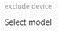

# ZigBee 设备的 ioBroker 适配器
在协调器的帮助下，基于“Texas Instruments CC253x”（和其他）芯片，创建了一个 ZigBee 网络，供 ZigBee 设备（灯泡、调光器、传感器等）加入。由于与协调器直接交互，ZigBee 适配器无需任何制造商网关/网桥（Xiaomi/Tradfri/Hue）即可控制设备。有关 ZigBee 的更多信息，请参见[这里](https://github.com/Koenkk/zigbee2mqtt/wiki/ZigBee-network)。

＃＃硬件
协调器需要额外的硬件（见上文），以实现 USB 和 ZigBee 无线电信号之间的转换。有 2 组：

• RaspberryPi 的附件模块（其旧版本且不支持 Zigbee V3）<br> • USB 棒之类的硬件

    

其中一些设备需要安装合适的固件才能运行：所需的闪存器/编程器和准备过程在[这里](https://github.com/Koenkk/zigbee2mqtt/wiki/Getting-started) 或 [这里（俄语）](https://github.com/kirovilya/ioBroker.zigbee/wiki/%D0%9F%D1%80%D0%BE%D1%88%D0%B8%D0%B2%D0%BA%D0%B0)中进行了描述。

“Sonoff ZIGBEE 3.0 USB STICK CC2652P”越来越受欢迎：

   - 刷新合适的固件并不是绝对必要的（硬件已随合适的固件一起交付）
   - 支持较新的 ZigBee 3.0 标准

连接到 ZigBee 网络的设备将其状态传输给协调器并通知其事件（按钮按下、运动检测、温度变化等）。此信息显示在相应 ioBroker 对象下的适配器中，因此可以在 ioBroker 中进一步处理。还可以向 ZigBee 设备发送命令（更改插座和灯的状态、颜色和亮度设置等）。

＃＃软件
软件分为“转换器”和“适配器”。


   - 转换器

转换器分为两部分：<br> a) ZigBee 无线电信号数据的一般规定。此[软件部分](https://github.com/Koenkk/zigbee-herdsman)适用于所有 ZigBee 设备。<br> b) 将特定于设备的数据[加工](https://github.com/Koenkk/zigbee-herdsman-converters)传送至适配器的已定义接口。

   - 适配器<br>

      该软件部分是转换器与ioBroker的连接。 [适配器](https://github.com/ioBroker/ioBroker.zigbee) 包括用于管理 ZigBee 设备的图形用户界面以及用于控制 ZigBee 设备的 ioBroker 对象的创建。

＃＃ 安装
1. 将协调器硬件连接到 Raspberry Pi。<br>
2. 通过 PuTTY 连接到 RaspberryPi。<br>
3. 删除任何现有的 ZigBee 备份文件。否则，ZigBee 适配器将不会在 ioBroker 中变绿，并且 ioBroker 日志将指出适配器配置错误<br>
4.找出协调者的路径：

`ls -la /dev/serial/by-id/`

5. ioBroker -&gt; 安装 ZigBee 适配器，这里版本 1.8.10<br> <br>这将安装所有必需的软件部件（转换器和适配器）。
6. 打开适配器 -&gt;  -&gt; 输入之前确定的协调器路径，添加 /dev/serial/by-id/:<br>路径末尾不得有空格。
7. 配置网络 ID 和 Pan ID，以区别于无线电范围内的其他 ZigBee 网络，例如<br>

    <br>  

8. 检查ioBroker中适配器是否变绿。目标状态：<br> <br>否则，请阅读 ioBroker 日志并查找错误原因，同时查看我们的论坛。

## 配对
每个 ZigBee 设备（开关、灯泡、传感器...）必须与协调器配对（配对）：<br>

   - ZigBee 设备：

每个 ZigBee 设备只能连接到 1 个 ZigBee 网络。如果 ZigBee 设备仍然保存有针对不同协调器（例如 Philips Hue Bridge）的配对信息，则必须首先将其与该 ZigBee 网络解耦。这种与旧 ZigBee 网络的解耦优选地通过旧 ZigBee 网络的用户界面（例如 Philips Hue 应用程序）来完成。或者，您可以将 ZigBee 设备重置为出厂设置。<br>通常有以下选项可将 ZigBee 设备置于配对模式<br>

        1. 取消 ZigBee 设备与 ZigBee 网络的配对
        2. 按 ZigBee 设备上的配对按钮
        3. 关闭 ZigBee 设备的电源电压，然后再打开

然后，ZigBee 设备通常会处于配对模式 60 秒。与恢复出厂设置的过程类似，激活配对模式也取决于相应的设备类型（如有必要，请阅读 ZigBee 设备的操作说明）。

   - 协调员：

按下绿色按钮使协调器进入配对模式 60 秒。<br> 

   - 等待对话框中出现“新设备已加入”：<br>


   - 检查配对：

要配对的设备必须受 ioBroker ZigBee 适配器支持。在最好的情况下，新设备会显示在 ZigBee 适配器中（例如 Philips Light Stripe），并创建相应的 ioBroker 对象： 

   - 在最坏的情况下，当前不支持 ZigBee 设备。下一节将介绍使用该 ZigBee 设备需要做什么。

## 目前未知 ZigBee 设备的配对
到目前为止，对于未知的 ZigBee 设备，在配对期间会出现 ZigBee 设备的 ZigBee 名称（例如 HOMA1001），并添加“statesMapping 中未描述”的内容<br><br> <br>

转动此图块可为您提供有关 ZigBee 设备的详细信息：<br>  <br>

在 [github.com](https://github.com/ioBroker/ioBroker.zigbee/issues) 注册后，必须通过“问题”报告丢失的 ZigBee 设备：

<br>

   - 将图块的详细信息（见上文）插入问题中，创建简短文档（最好是英文）并发送。然后开发人员将通过该问题做出回应。

修改相关文件后，必须重新启动 ZigBee 适配器，并且必须取消 ZigBee 设备与协调器的配对：<br>之后，可以重复配对。配对后目标状态：<br> <br>

对于某些 ZigBee 设备，需要在 ioBroker 对象中显示新 ZigBee 设备的所有软件接口（“公开”），以便能够使用该 ZigBee 设备的所有功能。在这种情况下，新的 ZigBee 设备必须包含在“排除”组中。

<br>

 ->  ->  -> 选择 ZigBee 设备（例如 HOMA1001） -> <br>重新启动 ZigBee 适配器后，新的 ZigBee 设备现在应该可以不受限制地工作。

## ZigBee 适配器内的符号
|图标|描述 |
| ------------- | ------------- |
|  | **状态清理** 删除无效的 ioBroker 对象，这可能是“排除”过程导致的。 |
|  | **添加组** 使用此功能，ZigBee 设备可以组合成一个逻辑组，然后通过一个 ioBroker 对象一起控制，例如Brightness=20 将组中所有 ZigBee 设备的亮度设置为 20。 |
|  | **Touchlink 重置和配对** Touchlink 是一种 ZigBee 功能，允许物理上彼此靠近的设备无需位于同一网络中即可相互通信。并非所有设备都支持此功能。要通过 Touchlink 将 ZigBee 设备重置为出厂设置，请将设备靠近 ZigBee 协调器（< 10 厘米），然后按此绿色图标。 |
|  | **使用二维码配对** 对于某些 ZigBee 设备，可以使用二维码进行配对。 |
|  | **让我们开始配对** 开始新 ZigBee 设备的配对过程。 |
|  |自上次与此 ZigBee 设备交换数据以来的时间。 |
|  |此 ZigBee 设备上的 ZigBee 无线电信号的强度（<10 差，<50 中，>50 好）。ZigBee 是无线网状网络。大多数主电源供电的 ZigBee 设备（例如 Philips Hue 灯泡）都可以充当 ZigBee 路由器，这意味着充当无线电节点。因此，ZigBee 设备不一定必须与协调器建立直接无线连接，而是可以使用网络中的任何路由器进行无线连接。因此，每个 ZigBee 路由器都扩展了网络的无线电范围。所有 ZigBee 设备都会定期检查是否有更好的无线电路由并自动切换。但是，此过程可能需要几分钟时间。 |
|  |此 ZigBee 设备上的 ZigBee 无线电信号的强度（<10 差，<50 中，>50 好）。ZigBee 是无线网状网络。大多数主电源供电的 ZigBee 设备（例如 Philips Hue 灯泡）都可以充当 ZigBee 路由器，这意味着充当无线电节点。因此，ZigBee 设备不一定必须与协调器建立直接无线连接，而是可以使用网络中的任何路由器进行无线连接。因此，每个 ZigBee 路由器都扩展了网络的无线电范围。所有 ZigBee 设备都会定期检查是否有更好的无线电路由并自动切换。但是，此过程可能需要几分钟时间。 |

＃＃ 附加信息
有[其他](https://www.zigbee2mqtt.io/)具有相同的功能和相同的技术，通过MQTT协议与相同的设备通信。如果 ZigBee2MQTT 项目中包含任何改进或新支持的设备，也可以将它们添加到该项目中。如果您发现任何差异，请写一个问题，我们会处理。
与此适配器相关的其他主题也记录在相关的 wiki 中。

## Changelog
### 1.10.2 (2024-01-25)
* (arteck) dependency update

### 1.10.1 (2024-01-21)
* (arteck) Baudrate is now configurable. works ONLY with Deconz/Conbee( 38400 )
* (arteck) add nvbackup.json delete button

### 1.10.0 (2024-01-13)
* (arteck) new zigbee-herdsman-converters 18.x
* (arteck) configure message is now a warning

### 1.9.7 (2024-01-05)
* (arteck) corr configure for some devices

### 1.9.6 (2024-01-01)
* (arteck) corr ikea bug 
* (crckmc) trv child lock works

### 1.9.5 (2023-12-29)
* (arteck) update dependency
* (arteck) min node 18.x.

### 1.9.4 (2023-12-29)
* (arteck) typo

### 1.9.3 (2023-12-26)
* (arteck) last zhc Version 16.x
* (arteck) corr reboot in statecontroller

### 1.9.2 (2023-12-25)
* (arteck) gen states from exposes as function
* (arteck) rebuild dev_names.json with state cleanup button

### 1.9.1 (2023-12-23)
* (arteck) corr TypeError: Cannot read properties of undefined (reading 'state')

### 1.9.0 (2023-12-22)
* (arteck) up to new zhc
* (arteck) update dependency

### 1.8.27 (2023-12-22)
* (arteck) update dependency

### 1.8.26 (2023-12-22)
* (arteck) corr toZigbee message
* (arteck) add deviceManager

### 1.8.25 (2023-12-17)
* zhc 16.x 
* (arteck) corr group from exclude dialog

### 1.8.24 (2023-09-05)
* (arteck) switch to exposes tab for some Aqara Devices [more infos](https://github.com/ioBroker/ioBroker.zigbee/wiki/Exposes-for-device-integration)

### 1.8.23 (2023-08-10)
* (arteck) query from xiaomi is now better

### 1.8.22 (2023-08-05)
* (arteck) crash when meta is empty

### 1.8.21 (2023-07-31)
* (arteck) no converter found

### 1.8.20 (2023-07-31)
* (arteck) add log

### 1.8.19 (2023-07-31)
* (arteck) fix occupancy_timeout
* (arteck) fix battery percentage and voltage

### 1.8.18 (2023-07-16)
* (arteck) little fix sentry and error log

### 1.8.17 (2023-07-15)
* (arteck) sentry corr

### 1.8.16 (2023-07-11)
* (arteck) battery corr

### 1.8.15 (2023-07-11)
* (arteck) corr battery status

### 1.8.13 (2023-07-09)
* (arteck) ota corr
* (arteck) devices are wrong with enum exposes
* (arteck) select field for groups is larger 
* (kirovilya) tuya.whitelabel corr

### 1.8.12 (2023-06-30)
* (arteck) new Documentation (thx Stefan)

### 1.8.11 (2022-12-10)
* (arteck) fix compsite exposes with list

### 1.8.10 (2022-12-12)
* (asgothian) fix group access
* (asgothian) add option for pairing code:
   A new icon allows to open the network after first entering a pairing code
   listed on the device
* (asgothian) easier use of external converters
   - external converters can now be placed in the zigbee adapter data folder
   - no absolite path is required to access them
   - external converters posted on the github for zigbee-herdsman-converters
     should work as they are - folders for libraries are rewritten to match
     the expected location when 'required' from within the zigbee adapter
   - Log entries will identify which files are entered as converters. Errors
     in these files should not cause the adapter to crash - instead, use of
     external converters may be unavailable.

### 1.8.9 (2022-12-10)
* (arteck) fix lidl plug

### 1.8.7 (2022-12-01)
* (arteck) fix exposes

### 1.8.5 (2022-11-30)
* (arteck) fix for new code

### 1.8.3 (2022-11-30)
* (arteck) back to old source

### 1.8.1 (2022-11-28)
* (bluefox) Packages updated
* (bluefox) Added names of serial ports in configuration dialog

### 1.7.7 (2022-11-24)
* dep update

### 1.7.6 (2022-07-23)
* (kirovilya) fix selecting nodes in admin
* (arteck) ikea fix

### 1.7.5 (2022-06-01)
* (arteck) error message for undefined devices or icons

### 1.7.4 (2022-05-30)
* (arteck) missing icons with multiple description

### 1.7.2 (2022-05-28)
* (arteck) download missing icons corr

### 1.7.1 (2022-05-28)
* (arteck) available status in admin is colored
* (arteck) disable Backups checkbox in settings
* (arteck) we keep last 10 backup files
* (arteck) download missing icons automatically (manual upload needed)

### 1.6.18 (2022-04-21)
* (arteck) fix pairing modus

### 1.6.17 (2022-04)
 rollback

### 1.6.16 (2022-02-16)
* (arteck) admin dep fix
* (arteck) colored objects for online/offline state

### 1.6.15 (2022-02-08)
* (arteck) Battery status % calculation was changed for xiaomi devices

### 1.6.14 (2022-01)
* (asgothian) OTA limitation
  - devices with the available state set to false are excluded from OTA updates (and the update check)
  - devices with link_quality 0 are excluded from OTA updates (and the update check)
* (asgothian) Device deactivation:
  - Devices can be marked inactive from the device card.
  - inactive devices are not pinged
  - state changes by the user are not sent to inactive devices.
  - when a pingable device is marked active (from being inactive) it will be pinged again.
  - inactive devices are excluded from OTA updates.
* (asgothian) Group rework part 2:
  - state device.groups will now be deleted with state Cleanup
  - state info.groups is now obsolete and will be deleted at adapter start (after transferring data to
    the new storage)
* (asgothian) Device name persistance.
  - Changes to device names made within the zigbee adapter are stored in the file dev_names.json. This file
    is not deleted when the adapter is removed, and will be referenced when a device is added to the zigbee adapter. Deleting and reinstalling the adapter will no longer remove custom device names, nor will deleting and adding the device anew.
* (asgothian) Readme edit to reflect the current information on zigbee coordinator hardware.
* (arteck) Zigbee-Herdsman 0.14.4, Zigbee-Herdsman-Converters 14.0.394

### 1.6.13 (2022-01)

* (kirovilya) update to Zigbee-Herdsman 0.14

### 1.6.12 (2022-01)
* (asgothian) Groups were newly revised (read [here](https://github.com/ioBroker/ioBroker.zigbee/pull/1327) )
   -  object device.groups is obsolet..the old one is no longer up to date

### 1.6.9 (2021-12)
* (simatec) fix admin Dark-Mode
* (asgothian) Expose Access Handling
* (arteck) translations
* (asgothian) fix groups
* (agross) use different normalization rules

### 1.6.1 (2021-08)
* (kirovilya) herdsman compatibility

### 1.6.0 (2021-08-09)

### 1.5.6 (2021-05-26)
* (kirovilya) new UI add

### 1.5.5 (2021-05-05)
* Fixes for new zigbee-herdsman-converters
* UI fixes

### 1.5.3 (2021-04-30)
* (arteck) Fix for js-controller 3.3.*

### 1.5.2 (2021-04-29)
* (asgothian) Groups on dashboard

### 1.5.1 (2021-04-14)
* (kirovilya) Dashboard
* (asgothian) Groups (reworked)
* [Experimental support EZSP protocol for EFR32 chips](https://github.com/Koenkk/zigbee-herdsman/issues/319) (zigbee-herdsman)

### 1.4.4 (2021-02-14)
* (kirovilya) External converters https://www.zigbee2mqtt.io/information/configuration.html#external-converters-configuration
* (asgothian) Enhancement ping process
* (asgothian) Devive query state-button
* (asgothian) State Cleanup button
* (arteck) Setting to use exposes instead of internal device description

### 1.4.1 (2020-12)
* (o0shojo0o) added a kelvin possibility into colortemp
* (asgothian) Hue_calibration for exposed devices (Use requires PR on zigbee-herdsman-converters, PR is being worked on)
* (asgothian) fix Tuya Thermostat: restore lost property "preset"
* (asgothian) Change for Device Availability: Stagger initial ping by 200 ms to prevent network congestion due to a large number of ping requests
* (asgothian) Change for Device Availability: Ping request triggered on reconnect. Before the herdsman Ping function is used, the adapter attempts to read the "state" dp. If this is successful, no ping is sent and the state is set
* (asgothian) Change for Device Availability: Set link Quality to 0 when a device is not connected, 10 when it is reconnecting.
* (asgothian) fix for message "illegal properties x,y" - remove color and color_temp from readable states on device available again (Issue #607)
* (asgothian) RGB Color can now be entered as "named" color. Implemented names are taken from the list of extended web colors on wikipedia (https://en.wikipedia.org/wiki/Web_colors)
* (asgothian) change in how RGB color is parsed. Incomplete colors will now be parsed successfully. #FFF will result in R 0, G 15, B 255
* (asgothian) change in OTA: Message that a device does not respond for OTA query downgraded to "info" from "error"
* (asgothian) new coordinator card

### 1.4.0 (2020-12)
* Many new devices available

Starting from version 1.4.0, new devices in iobroker.zigbee will be added automatically, based on the *exposes* described in zigbee-herdsman-converters.
The *exposes* section describes the device's capabilities, events and control commands. In iobroker.zigbee these descriptions are converted to iobroker states.
This means that the new device is described correctly enough in zigbee-herdsman-converters to start working with iobroker.zigbee (do not need to add it to our /lib/devices files.js and /lib/states.js).

The only thing that is not described (yet, it may change in the future) in zigbee-herdsman-converters is the device image. This is why the device icon on network map uses external links to the resource https://www.zigbee2mqtt.io/images/devices/*.
If you want to use local images, then you need to put the image file in /admin/img and briefly describe the device in the /lib/devices.js file without the *states*:
```
{
    models: [‘01MINIZB’],
    icon: 'img/ITEAD01ZBMINI. png',
}
```
in this case, the *states* attribute will be formed based on the *exposes* description and the image will be local.

### 1.3.1 (2020-10-30)
* [Experimental Zigate support](https://github.com/Koenkk/zigbee-herdsman/issues/242) (zigbee-herdsman)
* New devices by:
    asgothian, arteck, kirovilya, PaulchenPlump

### 1.3.0 (2020-10-07)
* More stable (zigbee-herdsman)
* Backup prior database and nv-data (for z-stack 3) before start adapter
* Allow to select bind cluster
* Admin Tab support (experimental)
* (UncleSamSwiss, DutchmanNL) Translation
* New devices by:
    arteck, kirovilya, Shade, krumbholz, fre, Alex18081, ae, asgothian,
    Strunzdesign, kairauer, VLGorskij, Hesse-Bub, PaulchenPlump, blackrozes

### 1.2.1 (2020-08-16)
* Fixes after changing device identify method
* (Garfonso) Allow to unbind from coordinator

### 1.2.0 (2020-08-09)
* Serialport 9.0.0. (zigbee-herdsman)
* Drop support Node < 10 (zigbee-herdsman)
* Device now identify (for zigbee-herdsman-converters) by model not zigbeeModel

Improvements and fixes:
* (Strunzdesign) Fixed the mapping between bulb levels and adapter levels
* (kirovilya) Fix ota for unavailable devices
* (kirovilya) Lazy states - created only when an event arrives
* (kirovilya) States generator - states are created depending on the device and its endpoints
* (Shade) Fixed WXKG11LM clicks
* (allofmex) Improved DeveloperTab logs
* (allofmex) Add humidity and temperature calibration state to Tuya RH3052
* (kirovilya) Fixed a typo due to which extPanID was not set
* (allofmex) Retry reconnect gateway all the time for tcp connected gateway
* (kirovilya) Allow to collect zigbee-herdsman logs to iobroker logs
* (kirovilya) Additional states for QBKG12LM

New devices:
* (kirovilya) BlitzWolf BW-IS3, Paulmann 500.67, Paulmann 798.09
* (kirovilya) DiY Geiger counter https://modkam.ru/?p=1591
* (kirovilya) DiY 8 Relays + 8 switches https://modkam.ru/?p=1638
* (kirovilya) DiY Freepad https://github.com/diyruz/freepad
* (kirovilya) Neo Zigbee Siren Alarm https://szneo.com/en/products/show.php?id=241
* (Shade) RB 278 T
* (arteck) TS0601_thermostat
* (arteck) TS0121
* (arteck) GL-D-004Z
* (Shade) WXKG07LM
* (drohne200) 1746430P7
* (sebastian) 4058075816459
* (itProfi) SGMHM-I1
* (arteck) owvfni3
* (arteck) TS0001, TS0111
* (Daniel Dreier) Paulmann 500.45
* (arteck) ZK-EU-2U
* (Newan) Busch-Jaeger 6735/6736/6737
* (andrico21) ZM-L03E-Z
* (arteck) 915005106701, 9290018187B
* (frankjoke) HGZB-20-UK, GL-W-001Z
* (arteck) 4034031P7, 3435011P7
* (arteck) TS0041
* (agross) 5062231P7, 5062431P7
* (kirovilya) TI0001-switch, TI0001-socket
* (arteck) RB 178 T
* (arteck) HGZB-07A, AV2010/22, AV2010/22A, TS0041, TS0043
* (nbars) E1744
* (Florian Look) GS361A-H04
* (arteck) ICZB-IW11SW
* (kirovilya) HS2WD-E
* (Sacred-Shadow) FL 130 C
* (arteck) HS3SA, 9290022169, 4096730U7, AC10787, SP 220, SP 222, SP 224, 07004D, BW-IS2, InstaRemote
* (kirovilya) MCLH-08, MCLH-05
* (Sacred-Shadow) 1746130P7
* (mar565) GUNNARP panel round
* (Erdnuss3003) 4090531P7

### 1.1.1 (2020-04-17)
* (kirovilya) Critical. Fixed error starting adapter if cc-chip was only flashed
* (kirovilya) Nue/3A FNB56-ZSW02LX2.0
* (Strunzdesign) Added missing raw button events for Philips Hue Smart Button ROM001
* (Sacred-Shadow) Fix Color for Outdoor Lantern W RGBW OSRAM

### 1.1.0 (2020-04-12)
new Zigbee-herdsman features:
* ConBee/RaspBee (experimental support) https://github.com/Koenkk/zigbee-herdsman/issues/72
* OTA update for some devices (IKEA, OSRAM and other) https://github.com/Koenkk/zigbee2mqtt/issues/2921
* Touchlink reset and join https://github.com/Koenkk/zigbee2mqtt/issues/2396
* Green Power devices support https://github.com/Koenkk/zigbee2mqtt/issues/3322
* (peterfido) iCasa KPD14S und KPD18S hinzu
* (kirovilya) Moes Zigbee Thermostatic Radiator
* (kirovilya) LifeControl power plug MCLH-03, bulb MCLH-02, water leak MCLH-07, door sensor MCLH-04
* (kirovilya) Philips LCT002, LCT011, LTW015, LWG004
* (kirovilya) Gledopto GL-C-007 with with channel
* (MultivitaminJuice) Iluminize 511.040
* (Sacred-Shadow) Bitron 902010/24
* (kirovilya) Color indication of LQI and Battery icon
* (kirovilya) Device info modal dialog
* (arteck) Philips LCT026
* (obakuhl) Improvements Osram switch mini
* (arteck) Nue / 3A FB56+ZSW1GKJ2.5, LXN-1S27LX1.0
* (agross) Philips Signe Floor and Table
* (arteck) TRADFRI bulb E14 WS 470lm, OSRAM PAR16 TW Z3
* (kirovilya) Smart remote controller (4 buttons)
* (allofmex) OTA updates
* (kirovilya) Aqara opple change mode keys (for binding)
* (palsch) Heiman HS2WD-E siren

### 1.0.4 (2020-03-14)
* (kirovilya) Philips Hue Adore Bathroom Mirror Light
* (kirovilya) Oujiabao Gas and carbon monoxide alarm
* (kirovilya) Tuya SOS button
* (Erdnuss3003) Schwaiger ZBT-DIMLight-GLS0800
* (arteck) Smart Home Pty FB56-ZCW11HG1.4, LXT56-LS27LX1.7
* (arteck) Xiaomi plug lumi.plug.mmeu01
* (arteck) Innr RS 228 T, RS 230 C
* (arteck) Gledopto GL-MC-001, GL-D-003ZS
* (allmyjoes) Bitron AV2010/21A
* (arteck) Osram Panel TW 595 UGR22
* (kirovilya) IKEA SURTE door WS 38x64
* (andigandi) Philips Hue LCG002, Hue LTG002
* (arteck) iCasa ICZB-FC
* (arteck) Osram A60 DIM Z3
* (arteck) Paulmann 371000001
* (DaCHRIS) Osram PAR16 DIM Z3
* (DaCHRIS) Philips LWG001
* (DaCHRIS) Illuminize 511.202
* (SchumyHao) TERNCY-SD01 knob dimmer
* (SchumyHao) Xiaomi lumi.lock.aq1
* (kirovilya) New eWeLink devices: button, TH sensor, contact sensor, motion sensor
* (kirovilya) Allow pairing to routers (again)
* (Erdnuss3003) Philips Hue LCT021
* (root) Trust ZWLD-100 water leak sensor
* (smartpran) Bitron AV2010/32

### 1.0.3 (2020-02-09)
* (Tw1nh34d) Hornbach FLAIR LED
* (asgothian) Hue smart button, Heiman smoke sensor
* (kirovilya) Philips LTC014, LTC015
* (kirovilya) Power states for QBKG11LM
* (Garfonso) Change role for occupancy state to 'sensor.motion'
* (kirovilya) Change illuminance state to illuminance_lux (for lux value)
* (arteck) Philips LCF002
* (arteck) TRADFRI open/close remote
* (kirovilya) Tuya sensor TS0201

### 1.0.2 (2020-01-29)
* (kirovilya) All button events for Aqara Opple switch
* (ma-john) OSRAM PAR16 RGBW Z3
* (arteck) Phillips LWA004
* (MiniMe6666) Heiman SmokeSendor-N-3.0
* (kirovilya) Force remove device
* (kirovilya) Fix some networkmap bugs
* (kirovilya) Extended info button
* (kirovilya) Long press for WXKG01LM

### 1.0.1 (2020-01-23)
* fix for old z-stack firmware

### 1.0.0 (2020-01-22)
* Powered by new [zigbee-herdsman](https://github.com/Koenkk/zigbee-herdsman) library and new [converters database](https://github.com/Koenkk/zigbee-herdsman-converters)
* Drop support NodeJS 6
* Serialport 8.0.5 (in zigbee-herdsman)
* More new devices
* Some design update
* Binding

## License
The MIT License (MIT)

Copyright (c) 2018-2024 Kirov Ilya <kirovilya@gmail.com>

Permission is hereby granted, free of charge, to any person obtaining a copy
of this software and associated documentation files (the "Software"), to deal
in the Software without restriction, including without limitation the rights
to use, copy, modify, merge, publish, distribute, sublicense, and/or sell
copies of the Software, and to permit persons to whom the Software is
furnished to do so, subject to the following conditions:

The above copyright notice and this permission notice shall be included in
all copies or substantial portions of the Software.

THE SOFTWARE IS PROVIDED "AS IS", WITHOUT WARRANTY OF ANY KIND, EXPRESS OR
IMPLIED, INCLUDING BUT NOT LIMITED TO THE WARRANTIES OF MERCHANTABILITY,
FITNESS FOR A PARTICULAR PURPOSE AND NONINFRINGEMENT. IN NO EVENT SHALL THE
AUTHORS OR COPYRIGHT HOLDERS BE LIABLE FOR ANY CLAIM, DAMAGES OR OTHER
LIABILITY, WHETHER IN AN ACTION OF CONTRACT, TORT OR OTHERWISE, ARISING FROM,
OUT OF OR IN CONNECTION WITH THE SOFTWARE OR THE USE OR OTHER DEALINGS IN
THE SOFTWARE.