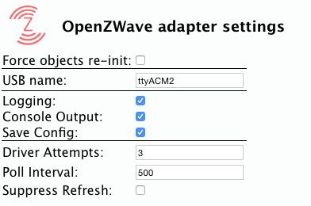

＃ioBroker zwave适配器
Zwave支持openzwave。

对于此适配器，使用了受良好支持的npm模块：https://github.com/OpenZWave/node-openzwave-shared您应该找出Z-Wave棒的USB端口名称，并在适配器设置中进行设置。

##重要信息
-首次运行时，适配器需要一些时间来计算iobroker中的所有对象。
-如果添加设备，则让适配器完成其工作，然后稍等片刻。
-如果设备在随附的管理站点中不可见，则表示该设备未完全导入ioBroker。

##安装
首先，仅在ARM Linux（例如Raspberry Pi（2））上测试实现。
您需要一个完整的开发环境（gcc，make等）

###安装其他软件包
在某些系统上，有必要安装其他软件包。因此，在安装适配器之前，请在控制台上运行以下命令：

```bash
apt-get install pkg-config libudev-dev build-essential curl unzip
```

###仅适用于Raspberry Pi3：激活GPIO UART
在Raspberry Pi 3上，默认情况下，UART由蓝牙模块占用。要激活它以与GPIO模块一起使用，请按照以下步骤操作：

1.`sudo nano / boot / cmdline.txt`
1.删除“ console = serial0,115200”
1.保存文件并关闭

2.`sudo nano / boot / config.txt`

查找以下各行。如果使用`#`注释掉了它们，则将其删除。如果它们不存在，请将它们添加到文件末尾：

*`dtoverlay = pi3-miniuart-bt`
*`enable_uart = 1`
*`force_turbo = 1`

3.重启

###第一次开始
GPIO模块通常具有类似于`/dev/ttyAMA0`或`/dev/ttyACM0`§的地址。
可以在`/dev/ttyUSB0`或`/dev/ttyUSB1`下找到USB记忆棒。

-进入iobroker管理员并添加Zwave适配器（安装时间相当长，请耐心等待）
-启动新的zwave Adapter实例，然后从管理UI的下拉列表中选择控制器设备的地址。
-如果未检测到设备，请在关闭适配器后对其进行检查或尝试手动输入其地址。
-等待直到“实例”选项卡中的指示器变为绿色，或者在iobroker日志中找到消息“ zwave.0扫描已完成”。

＃＃＃ 已知的问题
如果启动适配器后出现以下（或类似的）错误

```
libopenzwave.so.1.4: cannot open shared object file: No such file or directory
```

您可以通过运行来修复它

```
sudo ldconfig
```

要么

```
sudo ldconfig /usr/local
```

要么

```
sudo ldconfig /usr/local/lib64
```

如果所有这些命令都不起作用，则可能会执行以下过程：

1.`sudo nano / etc / ld.so.conf.d / zwave.conf`
1.输入`/ usr / local / lib64`
1.使用“ CTRL + X”退出编辑器，使用“ Y”确认以保存更改

1.`sudo ldconfig`

##配置
在管理设置中，您可以设置以下属性

-USB名称（Z-Wave棒的USB端口）
-记录（启用记录到OZW_Log.txt）
-控制台输出（将日志记录复制到控制台，全部记录到ioBroker.log）
-保存配置（编写XML网络布局，在Linux上创建/zwcfg_<HOMEID>.xml）
-驾驶员尝试（放弃前请尝试多次）
-轮询间隔（轮询之间的间隔，以毫秒为单位）
-禁止刷新（如果没有更改，则不发送更新）



##日志文件/配置设置
如果您已将iobroker安装到默认文件夹中：

 -日志文件：/opt/iobroker/node_modules/iobroker.zwave/node_modules/openzwave-shared/OZW_Log.txt在Linux上
 -配置：Linux上的/opt/iobroker/node_modules/iobroker.zwave/node_modules/zwcfg_<HOMEID>.xml

##设备添加或删除
如果添加或删除设备，则需要60秒钟。然后页面将自动重新加载。

如果更改名称或位置，则需要5秒钟。然后页面将自动重新加载。

＃＃ 特征
在OpenZWave Configurator中，您可以查看所有节点及其类。

当前支持以下操作（仅在上下文菜单中）：

-设置节点本身的名称和位置
-改变课程价值

当前支持以下全局操作：

-添加节点
-删除节点
-刷新节点（通过ioBroker通信刷新节点）

＃＃ 去做
### ZWave特定
-场景
-集团管理
-轮询
-控制器命令
-配置命令

###全球
-测试更多硬件
-将配置和日志文件移至iobroker默认路径（/ opt / iobroker / log，/ opt / iobroker / data / files / zwave）
-语言支持（英语，德语，俄语）

##经过测试的硬件
### ZWave
-ZME_UZB1 USB记忆棒
-用于RaspBerry的RazBerry GPIO板（1/2）

### Fibaro
-FGBS001通用二进制传感器
-FGS222双继电器开关2x1.5kW
-FGWPE墙塞
-FGSS001烟雾传感器
-FGMS001运动传感器
-FGS-223双开关2
-FGR-222卷帘门2
-FGDW-002门窗传感器2

###丹佛斯
-丹佛斯Living Connect Room恒温器（类型0003，ID 8010）
-丹佛斯Z温控器014G0013

## Changelog

### 2.0.0
* (cburghardt) Added ldconfig to installation and upgraded openzwave. Fixes #99. If this causes issues, please run the ioBroker fixer first!

### 1.7.2
* (cburghardt) Fixed a crash

### 1.7.1
* (cburghardt) Updated openzwave

### 1.7.0
* (cburghardt) Added multi-instance associations

### 1.6.3
* (cburghardt) Update openzwave version
* (cburghardt) Verify that the correct version of openzwave is installed by checking the manufacturer revision
* (cburghardt) Don't refresh the association menu directly after adding or removing for sleeping devices as it is not updated
* (cburghardt) Add `removeFailedNode` command

### 1.6.1
* (cburghardt) Fix issues 75 and 76

### 1.6.0
* (cburghardt) Cleanup obsolete states on startup
* (cburghardt) Added confirmation dialog for hard reset
* (cburghardt) Translation fixes
* (cburghardt) Removed non-existing `getNeighbors` function
* (cburghardt) Display network map
* (cburghardt) Allow manual input of a serial port together with the selection
* (cburghardt) Suppress permission denied warnings during installation

### 1.5.1
* (cburghardt) The *refresh node* command no longer excludes the node

### 1.5.0
* (AlCalzone) Update OpenZWave dependency to version 1.6

### 1.4.2
* (AlCalzone) Also escape spaces in state IDs.

### 1.4.1
* (AlCalzone) Pinned version of OpenZWave to 1.4 because 1.6 is not compatible yet

### 1.4.0
* (AlCalzone) Fixed breaks with OpenZWave 1.6
* (AlCalzone) Switched to new testing
* (AlCalzone) Support for compact mode

### 1.3.2 (2018-11-28)
* (AlCalzone) Replace all chars in state IDs that are forbidden in JS-Controller 1.5+
* (AlCalzone) Include @types/iobroker and strongly type adapter config properties

### 1.3.0
* (AlCalzone) Experimental support for CentralScene

### 1.2.0 (2018-07-25)
* (AlCalzone) Forbidden chars in state IDs are replaced

### 1.1.0 (2018-05-01)
* (AlCalzone) Use new OZW version for compatibility with NodeJS 10

### 1.0.0 (2018-01-31)
* (AlCalzone) Simplified resolving the location of the JS-Controller

### 0.9.0 (2017-10-28)
* (AlCalzone) Fixed lifeline detection in admin UI
* (AlCalzone) Updated buttons to match their behaviour in OZW
* (AlCalzone) Only set adapter status to green after OZW is done initializing
* (AlCalzone) Fixed hard reset: also delete all nodes from ioBroker
* (Pmant/AlCalzone) Parse decimal values into floats, not strings

### 0.8.0 (2017-07-12)
* (Apollon77) Update to Openzwave-shared 1.4

### 0.7.0 (2017-07-12)
* (Pmant/AlCalzone) Several fixes and add association ui

### 0.6.0 (2017-05-01)
* (Pmant) Support secure devices

### 0.5.2 (2017-04-05)
* (AlCalzone) improved handling of instance status objects

### 0.5.0 (2017-01-08)
* (bluefox) Update openzwave-shared
* (ekarak) Change install process

### 0.4.4 (2016-11-27)
* (AlCalzone) Fix enumeration values

### 0.4.3 (2016-11-26)
* (bluefox) add state "info.scanCompleted"

### 0.4.2 (2016-11-15)
* (AlCalzone) Read devices from dev and not from serialport

### 0.4.1 (2016-11-14)
* (AlCalzone) Allow set of parameters

### 0.4.0 (2016-11-01)
* (bluefox) Rewrite adapter completely

### 0.2.5 (2015-12-21)
 - (husky-koglhof) Object tree build now on change/added/ready from zwave
 - Default Role/Type/State (needed for history)
 - openzwave-shared 1.1.6
 - last openzwave from github
 - OpenZWave Security

### 0.2.4 (2015-12-05)
 - (husky-koglhof) fixed hardcoded values
   Admin Page can Add / Remove ZWave Devices

### 0.2.3 (2015-11-11)
 - (bluefox) try to fix io-package.json

### 0.2.2 (2015-09-28)
 - (ekarak) API changes for openzwave-shared 1.0.8+

### 0.2.3 (2015-11-11)
 - (bluefox) try to fix io-package.json

### 0.2.2 (2015-09-28)
 - (ekarak) API changes for openzwave-shared 1.0.8+

### 0.2.1 (2015-08-24)
 - (husky-koglhof) Fixed Errors with Config save at OpenZwave Configurator

### 0.2.0 (2015-08-05)
 - (husky-koglhof) Added OpenZWave Configurator, changed Dependency from openzwave to openzwave-shared, Implemented stateChange, objectChange Functions, Implemented extended Settings

### 0.1.0 (2015-01-03)
 - enable npm install.

### 0.0.9 (2014-11-22)
 - Support of new naming concept.

### 0.0.8 (2014-10-31)
 - Fix names of classes.

### 0.0.6 (2014-10-30)
 - Show in config found tty ports.

### 0.0.3 (2014-10-30)
 - Classify channels.

### 0.0.2 (2014-10-28)
 - Initial commit. Still non-functional.

## License

Copyright (c) 2014-2019 bluefox <dogafox@gmail.com>, husky-koglhof <husky.koglhof@icloud.com>

SOFTWARE NOTICE AND LICENSE

OpenZWave is free software: you can redistribute it and/or modify
it under the terms of the GNU Lesser General Public License as published
by the Free Software Foundation, either version 3 of the License,
or (at your option) any later version.

OpenZWave is distributed in the hope that it will be useful,
but WITHOUT ANY WARRANTY; without even the implied warranty of
MERCHANTABILITY or FITNESS FOR A PARTICULAR PURPOSE.  See the
GNU Lesser General Public License for more details.

You should have received a copy of the GNU Lesser General Public License
along with OpenZWave.  If not, see <http://www.gnu.org/licenses/>.