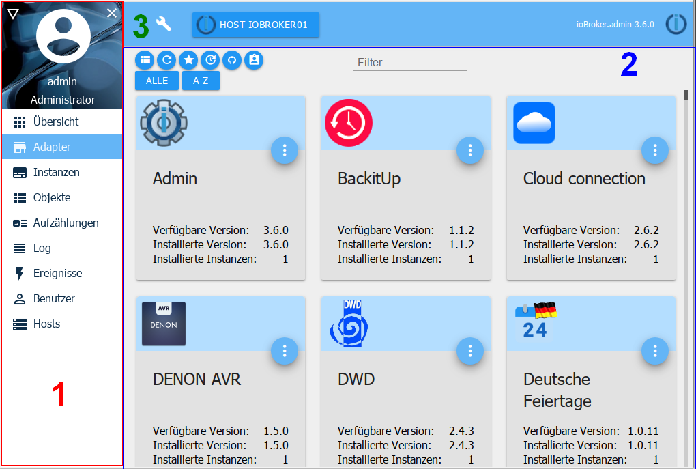

# 用户界面
!> **由于文档的范围，这只是概述；通过部分标题链接到选项卡的页面上提供了详细信息。请点击标题。**

管理适配器是基本适配器，用于操作整个 ioBroker 安装。它提供了一个网络界面。这在“`<IP-Adresse des Servers>:8081`”下被称为。

该适配器是在安装ioBroker时直接创建的，无需手动安装；

除其他外，可以通过适配器提供的 GUI 访问以下功能：

* 输入系统范围的设置
* 安装附加适配器及其实例
* 访问实例的配置
* 访问对象及其状态概览
* 访问用户和组的管理
* 访问日志文件（协议）
* 主机管理
* 文件管理

适配器视图分为区域 1 - 菜单栏、2 - 主窗口和 3 - 系统设置

## 菜单栏
菜单栏包含多个菜单项。在基本安装中，这些点的显示如图所示。安装附加适配器后，可以使用左上角 (1) 的三角形图标激活或停用附加点，以获得更好的概览。

例如，为了在移动设备上拥有更多空间，可以缩小菜单栏并隐藏或显示：

## 主窗口
主窗口显示与所选菜单项相关的内容。

通过标题链接的页面上提供了有关此内容的详细信息。

[概述](https://www.iobroker.net/#de/documentation/admin/overview.md) 具有自己的 Web 界面的所有页面以及有关主机的信息均显示在此处。

[适配器](https://www.iobroker.net/#de/documentation/admin/adapter.md) 此处显示和管理可用和已安装的适配器。

[实例](https://www.iobroker.net/#de/documentation/admin/instances.md) 此处列出了已通过适配器选项卡安装的实例，并可进行相应配置。

[对象](https://www.iobroker.net/#de/documentation/admin/objects.md) 通过适配器集成的设备的托管对象结构和数据点。可以在这里创建和删除对象。可以使用“向上箭头”和“向下箭头”按钮上传或下载整个对象结构。

如果值显示为红色，则表示尚未得到接收者确认（ack = false）。

[枚举](https://www.iobroker.net/#de/documentation/admin/enums.md) 此处列出了 Homematic CCU 中的收藏夹、交易和房间。

[协议](https://www.iobroker.net/#de/documentation/admin/log.md)日志显示在此处

在实例选项卡中，可以为各个实例设置要记录的日志级别。在选择菜单中选择要显示的最低日志级别。如果发生错误，选项卡上的标签将显示为红色。

[用户](https://www.iobroker.net/#de/documentation/admin/users.md) 可以在此处创建用户并将其添加到现有组中。

[主机](https://www.iobroker.net/#de/documentation/admin/hosts.md) 有关安装 ioBroker 的计算机的信息。  如果有新版本可用，菜单栏中的此条目中会出现一条注释。

[脚本](scripts.md) 如果安装了 Java 脚本适配器，您可以使用 javascript、Blockly 或 Typescript 在此页面上创建自己的脚本。

[文件](https://www.iobroker.net/#de/documentation/admin/files.md) 用于管理文件的文件管理器。

## 系统设置
在此处打开的菜单中，可以进行[系统设置](https://www.iobroker.net/#de/documentation/admin/settings.md)，例如语言、时间和日期格式以及其他系统范围的设置。

还可以在此处设置存储库和安全设置。

[Übersicht]: https://www.iobroker.net/#de/documentation/admin/overview.md

[Adapter]: https://www.iobroker.net/#de/documentation/admin/adapter.md

[Instanzen]: https://www.iobroker.net/#de/documentation/admin/instances.md

[Objekte]: https://www.iobroker.net/#de/documentation/admin/objects.md

[Aufzählungen]: https://www.iobroker.net/#de/documentation/admin/enums.md

[Log]: https://www.iobroker.net/#de/documentation/admin/log.md

[文件](https://www.iobroker.net/#de/documentation/admin/files.md)

[Benutzer]: https://www.iobroker.net/#de/documentation/admin/users.md

[Hosts]: https://www.iobroker.net/#de/documentation/admin/hosts.md

[Systemeinstellungen]: https://www.iobroker.net/#de/documentation/admin/settings.md