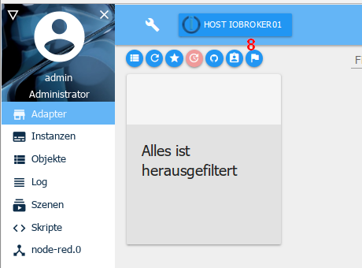

# 适配器选项卡
可用和已安装的适配器在此处显示和管理。

##标题行
在标题行中有最重要流程的图标。每个图标都有上下文帮助。为此，只需在图标上按住鼠标一段时间即可。

### 1 - 切换视图
此按钮可用于在平铺视图和表格视图之间切换（切换功能）

### 2 - 更新显示
每次重新启动时都会自动检查更新。此按钮可用于手动启动搜索或刷新页面。

### 3 - 仅显示已安装的适配器
选择此图标时，仅显示已安装实例的适配器（切换功能）

### 4 - 显示带有更新的适配器
选择此图标时，仅显示可用更新的适配器（切换功能）。可更新适配器的磁贴有一个绿色标题。如果适配器没有更新，则会出现相应的消息。

标题栏中还会出现另一个图标：

单击此图标 (8) 更新所有可用的适配器。

### 5 - 从它自己的 URL 安装适配器
!> ** 注意：使用此选项可能会导致 ioBroker 安装出现问题。** 来自 GitHub 的适配器可能仍在开发中，因此无法正常工作！这些只能在生产系统中谨慎使用。建议等待稳定版本！

使用 Octocat 图标，可以从自己的路径（URL 或文件路径）或 GitHub 的预发布版本安装适配器。

单击此图标后，将打开相应的选择窗口：

在 ***FROM GITHUB*** 选项卡下，只需在下拉菜单中选择所需的适配器，即可安装最新的初步版本。

选择 ***ANY*** 选项卡时，可以在字段中输入任何文件路径或 URL（例如外部适配器开发人员的 URL）并安装相应的适配器。

### 6 - 开启专家模式
专家模式还允许安装旧版本的适配器。如果选择此按钮 (9)，则磁贴中会出现一个附加图标，通过该图标可以安装早期版本。

### 7 - 过滤器
您可以在此处使用过滤器术语搜索特定适配器。