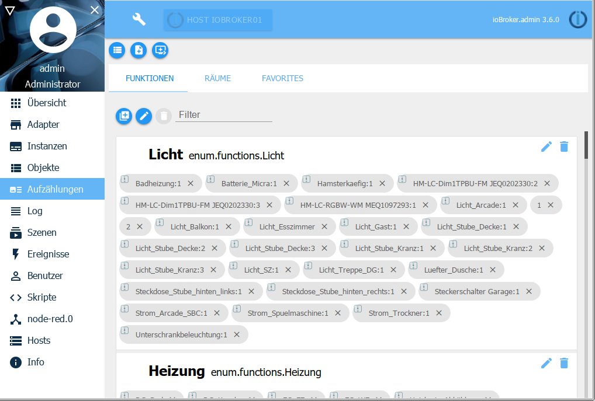
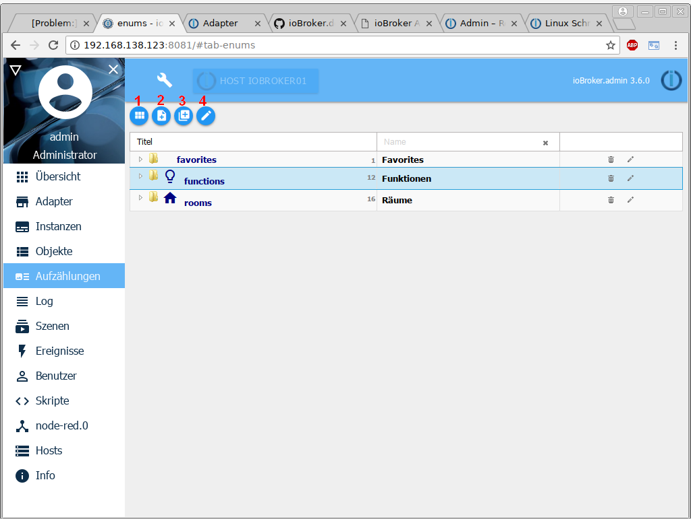
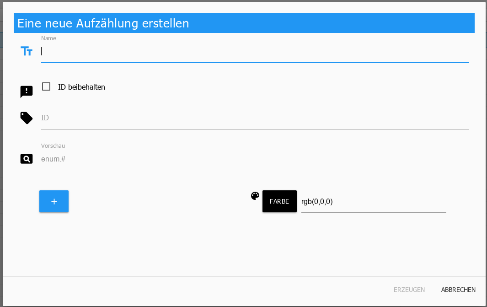
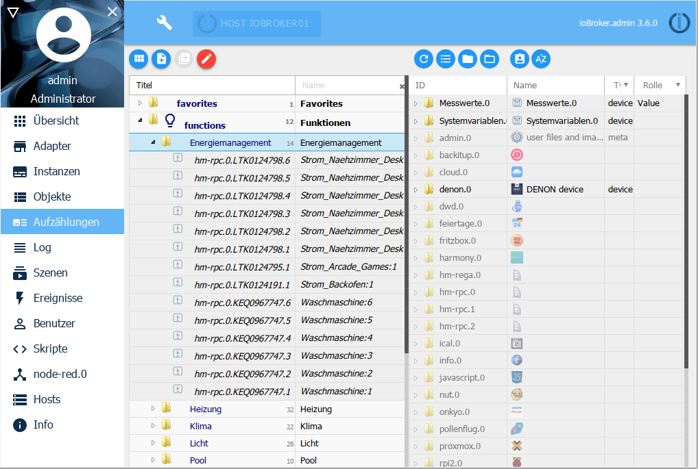

此处列出了收藏夹、交易和房间。如果有 HomeMatic 安装，则采用其中包含的列表。
例如，您还可以创建自己的列表，然后可以在脚本中使用这些列表。

您可以使用标题栏中的第一个图标切换到列表视图。此视图用于以下情况：

##标题行
在标题行中有最重要流程的图标。每个图标都有上下文帮助。为此，只需在图标上按住鼠标一段时间即可。

### 1 - 切换视图
此按钮可用于在平铺视图和列表视图之间切换（切换功能）

### 2 - 创建一个新列表
使用此按钮会创建一个新列表。为此将打开一个新窗口

**姓**

在此处输入列表所需的名称。或者，也可以将此列表的图标拖放到此字段中。

** 保留 ID **

创建新列表时默认取消选中此复选框，因为此处创建了新 ID。

在现有列表的编辑模式（见下文）中，可以在不更改 ID 的情况下更改名称。

**预览**

枚举的完整 ID 显示在此处。

**颜色**

此时可以选择要标记列表的颜色。

在平铺视图中，平铺以这种颜色着色，在列表视图中，枚举名称的行以这种颜色加下划线。

### 3 - 创建一个新类别
使用此按钮，将创建一个类似于列表的新类别（例如功能/房间等）。

### 4 - 编辑
可以使用此按钮管理枚举的数据点。
首先，使用鼠标单击标记所需的列表，然后激活编辑模式。

屏幕现在分为两部分：

右半部分的结构对应于 [Objects page] [] 的结构。

只需将数据点拖动到左侧所需的枚举中，即可从右侧拖动数据点。

使用垃圾桶图标删除列表中的数据点。

[Objekte-Seite]: https://www.iobroker.net/#de/documentation/admin/objects.md