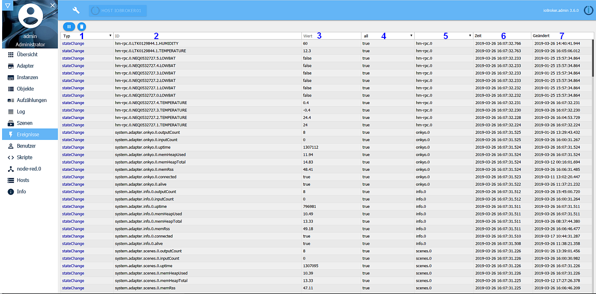

所有数据点的当前状态都显示在此选项卡中。
此处无法更改值。

##标题行
标题行中有最重要过程的图标。每个图标都有上下文帮助。为此，只需将鼠标放在图标上一会儿即可。

###详细的图标：
### 1-暂停视图
使用此按钮，您可以停止当前最新事件的显示。然后，按钮变为黄色背景，在该背景上计算“未命中”事件的数量。

！>由于事件有时会在毫秒范围内更新，因此可能会延迟直至（包括冻结）显示

再次单击该按钮将开始实时显示。

### 2-删除显示
此按钮清除屏幕

##页面内容
现有事件显示在页面上的表格中。最近的事件在顶部。

通过单击列标题，可以根据某些条件进行过滤。

### 1-类型
这里*** stateChange ***是值的更新，或者*** objectChange ***这也是两个过滤器选项。

### 2-ID
根据例如由适配器的名称，实例的编号，设备名称，通道名称，数据点名称组成的结构，这是相应数据点的唯一名称。

在这里，您可以过滤完整的ID，也可以过滤其中的一部分，例如所有TEMPERATURE数据点。

### 3-值
这是相应数据点的当前值。

### 4-确认
如果此值已更改且已被系统采用，则该值为true，否则为false。

这些也是过滤器选项

### 5-来源
此处指定哪个实例对数据点进行了最后更改。

您可以在此列中对此进行过滤。

### 6-时间
这是最后更新数据点的时间戳。

### 7-已更改
这是数据点的值最后一次更改的时间戳。