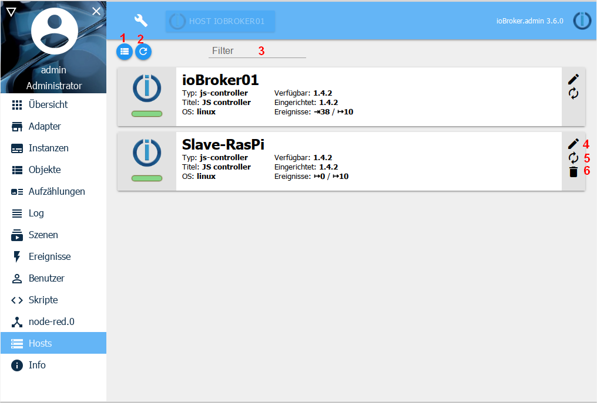
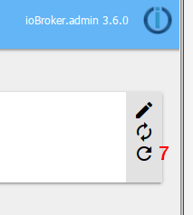

可用的主机显示在此处。

在标准系统中，只有一个主机。在多主机系统中，有几个。

##标题行
标题行中有最重要过程的图标。每个图标都有上下文帮助。为此，只需将鼠标放在图标上一会儿即可。

详细的图标：

### 1-切换视图
使用此按钮，您可以在图块和列表视图之间切换（切换功能）

### 2-获取更新
要检查js-controller是否有更新，可以单击此按钮。如果有可用更新，则菜单栏上的***主机***项目中将显示与要更新的主机相对应的数字，并且新版本将显示在“可用”下的磁贴中。

### 3-过滤器
在此字段中，您可以根据自己的要求过滤主机列表

##页面内容
现有主机在页面上列出。

对于每个主机，都有一个图块（列表视图中的一行），其中显示了相应主机的数据。

以下图标用于管理主机：

### 4-编辑
主机名可以在这里更改。此名称必须是唯一的。

### 5-重新启动主机
可以使用此按钮重新启动相应的主机。单击它对应于重新启动命令。

### 6-删除主机
此按钮仅适用于从站。如果从属主机已从多主机环境中删除，则也可以与此主机一起删除属于该主机的所有对象。

### 7-控制器更新
如果设置的存储库的js控制器有更新，则会显示另一个图标：

当您单击该图标时，与适配器的图标相反，该更新未开始，因为为此必须关闭ioBroker。而是显示有关如何进行的说明。