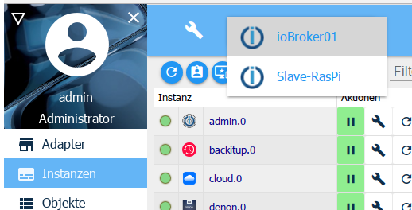
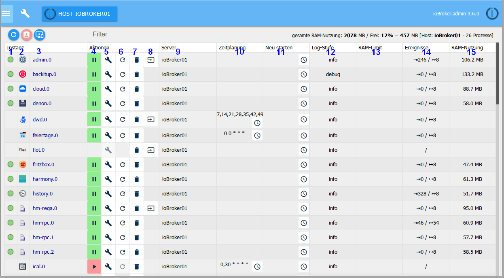

此处列出了已安装在“适配器”选项卡上的实例，可以对其进行相应配置。

##标题行
标题行中有最重要过程的图标。每个图标都有上下文帮助。为此，只需将鼠标放在图标上一会儿即可。也有关于服务器负载的信息。

详细的图标：

### 1-刷新视图
如果看不到刚刚创建的实例，则单击此图标有助于使页面状态保持最新。

### 2-开启管理员模式
选择此图标时，将显示用于配置实例的其他列（切换功能）。页面内容部分中的有关此信息。

### 3-仅显示所选主机的实例

在多主机系统中，所有主机的实例都由主管理员管理。该实例所在的主机的信息在***服务器***列中

如果在标题中选择了主机，则此按钮仅可用于显示在那里安装的实例。

### 4-过滤器
可以在此字段中输入用于过滤或搜索实例的术语

##实例窗口中的更多信息
第一个数字表示到目前为止实例所使用的内存，剩余的可用内存以MB为单位。后面的可用内存百分比。 ioBroker服务器的名称和正在运行的进程数在方括号中。

##页面内容

该页面上的表中显示了已安装的适配器实例。

该表包括以下列：

### 1-状态
实例的状态在此处通过交通信号灯显示。通过将鼠标放在信号上可以获得更多信息。

并非所有实例都具有此交通信号灯。但是不要惊慌。例如，这些是时间控制的实例，它们仅短暂连接到控制器，然后立即关闭或继续在后台运行。

### 2-图标
此处将在整个ioBroker中使用的适配器图标

### 3-实例
实例的名称在此列中。它由适配器的名称和按实例安装顺序连续编号的数字组成。第一个实例收到

0.该指定是ioBroker中指定数据点的基础。

### 4-已激活
实例在此处启动或停止。绿色的暂停符号表示适配器正在运行，可以通过单击它来暂停，红色的播放符号表示可以单击一下即可启动的已停止实例。

### 5-配置
单击此图标将打开适配器特定的配置菜单。描述了相关适配器的相应菜单。

### 6-重新启动
当您单击此图标时，相应的实例将重新启动

### 7-垃圾桶
带有该图标的对应实例将被删除。保留同一适配器的其他实例。适配器本身也保留下来。

### 8-网页链接
该图标后面有一个指向该实例网站的链接。因为此适配器具有自己的Web界面（具有不同的端口），或者只是具有不同的路径。在某些情况下，此链接还会显示帮助页面。

### 9-标题
在此指定实例的名称。您可以根据自己的意愿或需要更改此名称。如果有多个适配器实例（否则具有相同的名称），这将特别有用。例如，对于hm-rpc就是这种情况，如果RF，Wired和CuxD分别有一个实例。

### 10.）时间安排
如果适配器是按时间控制启动的，则在此输入该适配器应启动的时间。此调度采用cron作业的格式。要更改，请单击带有三个点的按钮。将打开一个输入窗口，其中包含许多其他信息和帮助。

### 11-重新启动
使用时钟图标，还可以在此处重新启动该实例时在此创建时间表。

该列仅在专家模式下可见！

### 12-日志级别
实例的相应日志级别可以在此列中进行调整。提供调试，信息，警告和错误。默认情况下，此值设置为info。如果您觉得某些程序运行不顺利，可以将其设置为调试。然后，还将在“日志”选项卡中为此实例输出调试信息，这有助于查找错误。相反，您可以将此值设置得更高一些，这样日志就不会那么广泛了。
该列仅在专家模式下可见！

### 13-RAM限制
在此处，您可以指定应为实例提供多少主内存，以防万一。这样，该内存量将不再可用于其他任务，并且不应选择过高的内存，尤其是在内存很少的系统中。如果实例暂时需要更多内存，则系统会为它分配内存，但随后会立即为系统释放该内存。在实例需要更多的内存而不是保留的时间内，所需的内存将显示为红色。

该列仅在专家模式下可见！

### 14-RAM使用率
实例使用的实际内存显示在此处。这些值会定期更新。更新后，这些值会短暂显示为绿色。