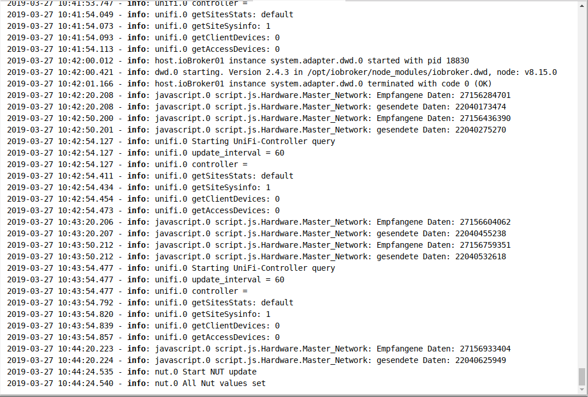

系统的消息在此处连续输出。最新消息位于顶部。

##标题行
标题行中有最重要过程的图标。每个图标都有上下文帮助。为此，只需将鼠标放在图标上一会儿即可。

### 1-更新日志
此按钮更新列表。

### 2-停止更新
如果单击此按钮，将停止列表的持续更新。
现在显示的是新的未显示消息的数量，而不是暂停图标。

### 3-删除列表
单击此图标只会删除屏幕上的列表

### 4-清除主机上的日志
通过单击此图标，主机上的整个日志将被永久删除。

### 5-下载日志
使用此按钮，您可以从目录/ opt / iobroker / logs下载最近几天的完整每日日志：

您将看到以下屏幕：

由于通常会在日志窗口的列表中截断行，因此在此处检查是否有更多信息非常重要。

### 6-主机列表
日志中仅显示来自此处设置的主机的消息。在多主机环境中，您可以将主机设置为此处记录。

##页面内容

现有对象显示在页面上的表格中。

列标题1和3包含用作过滤条件的下拉菜单，在第4列中可以自由输入过滤条件

### 1-来源
使用此下拉菜单，可以根据日志记录实例过滤消息。菜单中仅显示页面上有条目的那些实例。

### 2-时间
消息的时间戳在此处列出。该列无法过滤。

### 3-显示的日志级别
此菜单可用于设置要显示的消息的严重性。但是，这只是现有列表的过滤器。
为了将实例的日志记录设置为特定级别，必须在实例页面上进行设置。

错误显示为红色：

如果任何主机上有错误，则菜单栏中的标签*** Log ***也会显示为红色。

### 4-讯息
相应的消息将显示在此列中，前提是它适合该列。
其余的将被切断。使用鼠标悬停时，您仍然可以看到整个消息。
要在论坛中发帖，请下载日志并在其中复制消息。